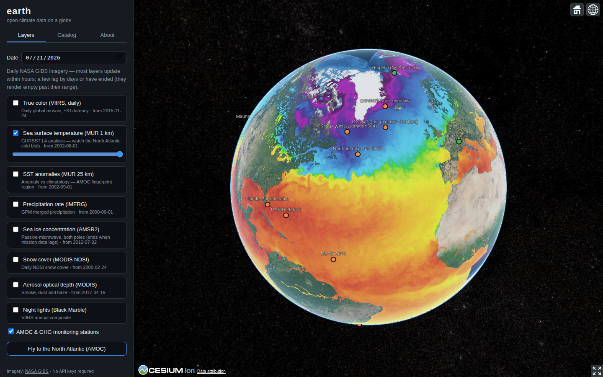

# earth 🌍

**Open climate data on a 3D globe — and, eventually, predictions from it.**

`earth` is a prototype for exploring the world's open climate data on an interactive CesiumJS globe, backed by a curated, machine-readable catalog of **241 open climate datasets** across atmosphere, ocean & AMOC, cryosphere, satellite platforms, model projections, greenhouse gases, and impacts.

The long-term goal: layer enough observational and model data onto the globe to drive real prediction pipelines — starting with the question *will the AMOC collapse, and when?*



## Features (prototype)

- **Zero API keys.** All imagery streams from [NASA GIBS](https://www.earthdata.nasa.gov/engage/open-data-services-software/earthdata-developer-portal/gibs-api) WMTS — no registration, no tokens, no build step.
- **Time-dynamic layers** with a date picker and per-layer opacity:
  sea surface temperature (MUR 1 km), SST anomalies, true-color VIIRS, IMERG precipitation, AMSR2 sea ice, MODIS snow cover, aerosol optical depth, Black Marble night lights.
- **AMOC monitoring network** — the RAPID, OSNAP, MOVE, SAMBA arrays, the Florida Current cable, the subpolar "cold blob" fingerprint region, plus reference GHG stations (Mauna Loa, Jungfraujoch, …) as clickable markers with data links.
- **Dataset catalog browser** — search and filter all 241 cataloged datasets by domain, AMOC relevance, and globe-readiness, straight from [`data/catalog.json`](data/catalog.json).

## Run it

No build step. Serve the directory with any static server:

```bash
git clone https://github.com/chfrank-cgn/earth
cd earth
python3 -m http.server 8080
# open http://localhost:8080
```

Or just open the GitHub Pages deployment (enabled via the included workflow).

## Repository layout

```
index.html              the app shell
src/app.js              CesiumJS globe, GIBS layers, stations, catalog UI
src/style.css           dark UI theme
data/catalog.json       241-dataset open climate data catalog (machine-readable)
data/stations.geojson   AMOC arrays + GHG reference stations
docs/CATALOG.md         the catalog as a readable reference document
.github/workflows/      GitHub Pages deployment
```

## The data catalog

The catalog ([readable](docs/CATALOG.md) · [JSON](data/catalog.json)) records for each dataset: provider, canonical URL, access method (API endpoints where they exist), formats, variables, spatial/temporal coverage, update cadence, license, and two flags:

- `globe` — easy to render on a WebGL globe (tiles / Zarr / COG / gridded), 103 datasets
- `amoc` — directly relevant to AMOC state estimation or tipping-point prediction, 58 datasets

## Roadmap

1. **More layers** — Zarr-streamed gridded fields (ARCO-ERA5, CMIP6 projections) rendered client-side; Copernicus Marine WMTS (currents, sea level).
2. **Live point data** — Climate TRACE facility emissions, Argo float positions, OpenAQ air quality, NASA FIRMS fires.
3. **AMOC dashboard** — RAPID/OSNAP/MOVE/SAMBA transport time series (via [AMOCatlas](https://github.com/AMOCcommunity/amocatlas)), SST-fingerprint indices, early-warning statistics (variance, lag-1 autocorrelation).
4. **Prediction pipeline** — statistical tipping-time estimation (Ditlevsen & Ditlevsen 2023), physics-based FovS indicator across the CMIP6 ensemble (van Westen et al. 2024), presented as a distribution with honest uncertainty.

## Data credits

Imagery courtesy of NASA GIBS / Worldview and NASA Blue Marble. Station metadata from the respective observing programs (RAPID, OSNAP, MOVE, SAMBA, NOAA AOML, NOAA GML, AGAGE, ICOS, WMO GAW). See [docs/CATALOG.md](docs/CATALOG.md) for the full source list.

## License

[MIT](LICENSE) — catalog data compiled from public sources; each dataset carries its own license (recorded per entry in the catalog).
