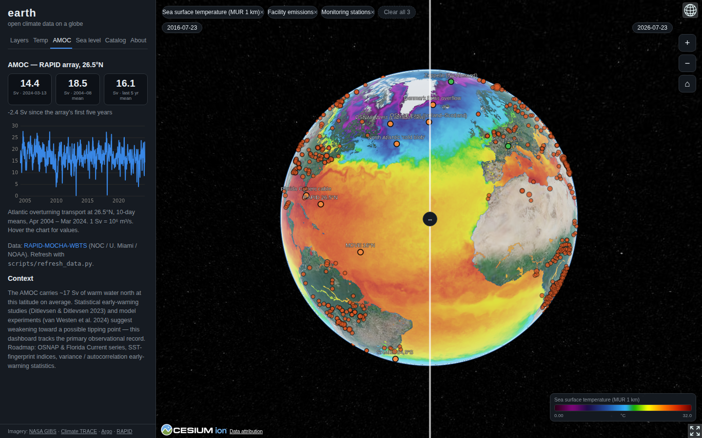

# earth 🌍

### ▶ **[Open the live globe →](https://blauewelt.github.io/earth/)**

**Open climate data on a 3D globe — and, eventually, predictions from it.**

`earth` is a prototype for exploring the world's open climate data on an interactive CesiumJS globe, backed by a curated, machine-readable catalog of **244 open climate datasets** across atmosphere, ocean & AMOC, cryosphere, satellite platforms, model projections, greenhouse gases, and impacts.

The long-term goal: layer enough observational and model data onto the globe to drive real prediction pipelines — starting with the question *will the AMOC collapse, and when?*

[](https://blauewelt.github.io/earth/)

## Features (prototype)

- **Zero API keys, no build step.** All imagery streams from [NASA GIBS](https://www.earthdata.nasa.gov/engage/open-data-services-software/earthdata-developer-portal/gibs-api) WMTS and [GBIF](https://www.gbif.org/) — no registration, no tokens. Everything else is baked into small static JSON snapshots, so the page has no server of its own.
- **Time-dynamic raster layers** with a date picker and per-layer opacity: true colour (VIIRS), sea surface temperature (MUR 1 km), SST anomalies (MUR25), precipitation (GPM IMERG V07, daily and 30-min), sea ice concentration (AMSR2), snow cover (MODIS NDSI), aerosol optical depth (MODIS), land surface temperature (MODIS), chlorophyll-*a* (PACE), sea surface salinity (SMAP, monthly), night lights (Black Marble).
- **Climatology grid layers** rendered client-side from baked JSON: GPCP v2.3 global precipitation (2.5°), OISST v2.1 SST 1991–2020 (1°), E-OBS v31 European precipitation (0.25°), and the MeteoSwiss 1991–2020 Swiss precipitation normal (~2 km).
- **Comparison** — any dated layer vs 1/2/5/10/20 years ago: side-by-side swipe with a draggable divider, or a **computed per-pixel difference** (the GIBS colormap is inverted client-side back to physical units, then re-ramped diverging warmer/cooler). Layers where differencing would be unsound say so instead of pretending.
- **Rolling aggregation** — an *Aggregate* slider (1–730 days) averages over the past N days ending on the chosen date, for every continuous layer, and orthogonally to the comparison mode. The mean is per pixel with missing samples excluded, so clear-sky-only products fill their gaps instead of darkening. "Past 365 days vs 10 years ago" reveals broad ocean warming and the subpolar cold blob cleanly, without daily weather noise.
- **SST ensemble** — combines independent GHRSST L4 analyses (MUR, OISST, GAMSSA) client-side into a **mean** or a **spread** map; the spread highlights where the analyses disagree (fronts, eddies, under-observed ocean).
- **Every layer explains itself** — the title is a link to the dataset's own documentation, and a hover card gives a plain-language gist plus what period is *recorded*, at what *interval*, and at what *spatial* granularity. Colormapped layers carry an interactive legend, and hovering the globe probes the actual value under the cursor.
- **Active-layer chips** on the globe list what is currently switched on, so any layer can be turned off in one click from any tab — including the dashboards, where the layer list isn't on screen at all.
- **Point and inventory layers** — Climate TRACE's top 1,000 facility emitters · the ~3,800-float active Argo fleet · the AMOC monitoring network (RAPID, OSNAP, MOVE, SAMBA, the Florida Current cable, the subpolar "cold blob" region) and reference GHG stations (Mauna Loa, Jungfraujoch, …) as clickable markers with data links · all 274,531 glaciers of the Randolph Glacier Inventory v7, colourable by extent or by their 2000–2020 melt rate from Hugonnet et al. 2021 (240,542 matched; ~78% thinning, and the Karakoram anomaly is visible).
- **Biodiversity layer** — GBIF occurrence-density tiles (3.9 B records, key-free) with a grouped picker: broad taxonomic categories (kingdoms, major animal and plant classes, humans) plus curated climate-indicator species (Atlantic mackerel, emperor penguin, staghorn coral …) whose shifting ranges are a visible fingerprint of warming. See [docs/SPECIES_AND_CLIMATE.md](docs/SPECIES_AND_CLIMATE.md).
- **Dashboards** — *Temp*: GISTEMP v4 land vs land+ocean warming, 1880–2025, with trends. *AMOC*: the RAPID 26.5°N overturning transport record (2004–2024) with stat tiles and a hoverable chart. *Sea level*: observed global mean sea level 1900–2018 decomposed into its causes (thermal expansion, glaciers, Greenland, Antarctica, land water), with the summed budget tracking the observed line to show *closure*, plus modern satellite altimetry (Frederikse et al. 2020 + NOAA).
- **Dataset catalog browser** — search and filter all 244 cataloged datasets by domain, AMOC relevance, and globe-readiness, straight from [`data/catalog.json`](data/catalog.json).
- **Honest about time.** Layers that ignore the date selector (climatologies, night lights, the point and inventory layers) announce it with a warning toast when switched on, rather than leaving the date picker silently inert.
- **Navigation** — scroll wheel, touch pinch, trackpad pinch (ctrl+wheel) and on-globe buttons; zoom is distance-proportional, and follows the standard convention where spreading fingers apart or scrolling up zooms in. An optional grayscale base keeps coloured overlays and blue-negative deltas readable.

## Run it

No build step. Serve the directory with any static server:

```bash
git clone https://github.com/blauewelt/earth
cd earth
python3 -m http.server 8080
# open http://localhost:8080
```

Or just use the [live deployment](https://blauewelt.github.io/earth/), which GitHub Pages builds from `main` via the included workflow.

## Testing

The repo ships a Playwright regression suite (59 specs): data-snapshot integrity
(`tests/data.spec.js` — catalog, RAPID series, Argo fleet, Climate TRACE, stations,
sea-level budget, GISTEMP, glaciers, species, the four climatology grids) and full
browser tests (`tests/app.spec.js` — GIBS tiling-scheme math including the Pacific
partial-tile regression, layer and date handling, comparison split and computed-delta
mode, aggregation, hover cards, legends, the value probe, active-layer chips, zoom and
pinch gestures, point layers, dashboards, catalog browser).

```bash
npm ci
npx playwright install --with-deps chromium
npx playwright test
```

CI runs the full suite on every push and PR. Note that **Pages deploys in parallel
rather than behind the tests** — this is a prototype, so a red run signals a
fix-forward, not a blocked release.

In CI the suite reaches the real CDN, NASA GIBS and GBIF. In a network-restricted
sandbox, `MIRROR=1` reroutes cdnjs to the vendored Cesium under `_vendor/cesium` and
GIBS/GBIF to local forwarding proxies; `scripts/run_tests.sh` starts everything and
runs the suite in one shot.

## Repository layout

```
CLAUDE.md               standing instructions + holistic project documentation
index.html              the app shell
src/app.js              CesiumJS globe, GIBS layers, grids, points, dashboards, catalog UI
src/style.css           dark UI theme
data/catalog.json       244-dataset open climate data catalog (machine-readable)
data/stations.geojson   AMOC arrays + GHG reference stations
data/rapid_moc.json     RAPID 26.5N AMOC transport series
data/sealevel.json      sea-level budget (Frederikse 2020) + NOAA altimetry
data/gistemp.json       GISTEMP v4 land vs land+ocean anomalies
data/glaciers.json      RGI v7 glaciers + Hugonnet 2000-2020 melt rates
data/species.json       GBIF taxon keys and record counts for the biodiversity picker
data/climatetrace.json  top-1000 facility emitters · data/argo.json  active float fleet
data/{gpcp,oisst,eobs,meteoswiss}.json   gridded climatologies (shared grid format)
scripts/refresh_data.py regenerates every snapshot above (one function per dataset)
scripts/build_primer.py rebuilds docs/PRIMER.pdf (background-knowledge primer)
scripts/run_tests.sh    sandbox test runner · scripts/test_proxy.py  GIBS/GBIF proxies
scripts/screenshot.js   regenerates docs/screenshot.png (the image above)
tests/                  Playwright suite (app behaviour + data integrity)
docs/CATALOG.md         the catalog as a readable reference document
.github/workflows/      test + GitHub Pages deployment
```

Conventions and the full record of what has been built live in
[CLAUDE.md](CLAUDE.md) — read it before contributing.

## Documentation

| Document | What it covers |
|---|---|
| [docs/PRIMER.pdf](docs/PRIMER.pdf) | Background knowledge: GIBS and WMTS, tiling schemes, colormaps, satellite product levels, what a climatology is |
| [docs/COMBINING_DATASETS.md](docs/COMBINING_DATASETS.md) | Which catalog datasets measure the same quantity, which combinations are scientifically sound (SST ensembles, the sea-level budget, the AMOC state vector, land+ocean blends), and why per-pixel differencing works for SST but not precipitation |
| [docs/SPECIES_AND_CLIMATE.md](docs/SPECIES_AND_CLIMATE.md) | Why biodiversity occurrence data belongs in a climate app |
| [docs/CATALOG.md](docs/CATALOG.md) | The full catalog as a readable reference |

## The data catalog

The catalog ([readable](docs/CATALOG.md) · [JSON](data/catalog.json)) records for each dataset: provider, canonical URL, access method (API endpoints where they exist), formats, variables, spatial/temporal coverage, update cadence, license, and two flags:

- `globe` — easy to render on a WebGL globe (tiles / Zarr / COG / gridded), 108 datasets
- `amoc` — directly relevant to AMOC state estimation or tipping-point prediction, 58 datasets

## Roadmap

1. **More layers** — Zarr-streamed gridded fields (ARCO-ERA5, CMIP6 projections) rendered client-side; Copernicus Marine WMTS (currents, sea level); OpenAQ air quality and NASA FIRMS fires as point layers.
2. **The two catalogued-but-unwired datasets** — OC-CCI and SMOS have no clean unauthenticated endpoint; they are represented on-globe today by NASA Ocean Color and SMAP respectively, and wiring the originals is an open follow-up.
3. **Early-warning statistics** — SST-fingerprint indices and tipping indicators (variance, lag-1 autocorrelation) computed over the AMOC record, alongside the transport series already shown.
4. **Prediction pipeline** — statistical tipping-time estimation (Ditlevsen & Ditlevsen 2023), physics-based FovS indicator across the CMIP6 ensemble (van Westen et al. 2024), presented as a distribution with honest uncertainty.

## Data credits

Imagery courtesy of NASA GIBS / Worldview and NASA Blue Marble. Occurrence data from GBIF. Station metadata from the respective observing programs (RAPID, OSNAP, MOVE, SAMBA, NOAA AOML, NOAA GML, AGAGE, ICOS, WMO GAW). Glacier outlines from the Randolph Glacier Inventory v7 with melt rates from Hugonnet et al. 2021. See [docs/CATALOG.md](docs/CATALOG.md) for the full source list.

## License

[MIT](LICENSE) — catalog data compiled from public sources; each dataset carries its own license (recorded per entry in the catalog).
