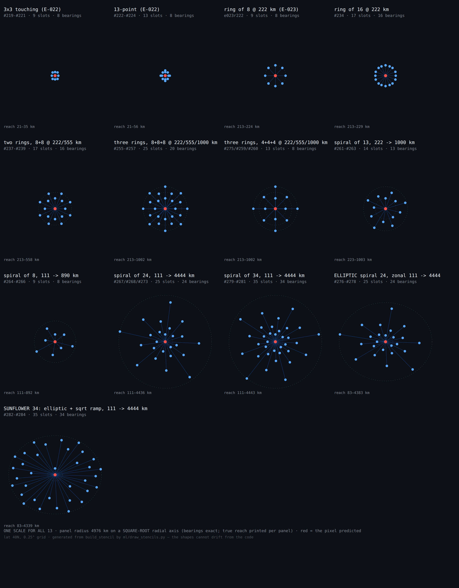

# Experiment log

Every experiment, what it tested, what it returned, and what we concluded —
newest first. Chris asked for this on 2026-08-09: *"please keep a log of all
experiments and their results."*

**Rules for this file.**

1. One entry per experiment, written **when it is dispatched** (hypothesis
   first, so the log cannot be rewritten to fit the answer) and completed when
   it lands.
2. Every entry names the **code it ran**: run number → `head_sha`. The status
   page links it. A result whose code cannot be recovered is an anecdote.
3. State the **control** explicitly. A number without the baseline it must beat
   is not a result.
4. Record **negative and null results with the same care as positive ones**.
   Most of the entries below are null, and they are the reason the programme
   knows where its bottleneck is.
5. Numbers here are the **year-blocked k-fold** figures — but *which* k-fold
   depends on what you varied, and conflating the two cost a four-arm
   experiment on 2026-08-10. `probe_kfold.py` scores the **CODEC**: it pools
   the frozen embeddings and never sees the temporal head, so every run
   freezing the same codec returns the same number (#116 and #125, a 60k and
   a 200k head, both read 0.631 [0.513, 0.732]). Stage-2 questions —
   schedule, budget, unroll — are answered by `rapid_probe_kfold` in
   `temporal.json`, the same protocol over the head's own features.
   In-training light-probe values, and `rapid_probe`'s 36-month single split,
   are noted as such wherever quoted. See `docs/ML_BASICS.md` §5b.
6. **Every entry states the four scale numbers** (Chris, 2026-08-11):
   **parameters · batch size · steps · data points** (for stage 2: train
   windows in the pool; for a codec: pixels × months sampled). Since
   2026-08-11 the trainer writes them itself as `temporal.json:scale` —
   quote that block, never a hand-carried number. Reference values:
   stage-2 192/4 = 1,822,144 params (+37,056 with three direct heads);
   384/6 = 10,732,096; the quarter-degree U=1 pool ≈ 26.1–28.1 M windows at
   batch 256 (temporal.py's default — the workflow's --batch 512 goes to
   the CODEC trainer; measured by the source-written scale block on #202,
   which caught this very file hand-carrying 512).

Baselines, for reference. Wind-stress-only ridge in our own protocol:
**0.531** on the 1° tensors, **0.568** on the quarter-degree tensor. RAPID
monthly σ = 2.79 Sv, n = 240, ~68 effective DOF (~9 after an 18-month
low-pass).

---

<a id="seed-rule-2026-08-19"></a>
## OPERATIONS · The two-seed requirement is now conditional, 2026-08-19 ~11:40Z

Not an experiment. Recorded here because it changes how entries BELOW this line
may be written, and because future readers of a single-seed entry are owed the
reason it was allowed to be one.

Chris, 2026-08-19: *"I don't think we need to runs for every experiment. At
least when two experiments seem to agree a lot during our experience and the
confidence intervals seem small (let's quantify them using past data given exp
scale)."*

The quantification was done from this log, `ml/LEADERBOARD.md` and every
`probes-*.json` on `ml-metrics`, and the resulting standing rule is
[`ml/CLAUDE.md` §3b](https://blauewelt.github.io/earth/docs.html?f=ml/CLAUDE.md)
— "Replication is bought where variance lives, not everywhere". The table lives
there and **must be extended whenever a new replicate lands**; the rule has no
authority apart from it.

**The headline numbers.** Seed spread is a property of METRIC × SCALE, and this
programme spans two orders of magnitude of it:

| metric · scale | replicates | measured spread |
|---|---|---|
| rolled corridor AUC, xl tier (205–217M, 60k–200k) | 5 pairs + 1 triple | pair \|Δ\| 0.0020–0.0051; pooled sd **0.0021** (7 dof), 95% upper bound 0.0037 |
| rolled corridor AUC, 88M tier | 4 triples + 2 pairs | ranges 0.0011–0.0150; pooled sd **0.0056** |
| rolled corridor AUC, 34M tier | 14 configurations | ranges to 0.0224; pooled sd **0.0070** |
| transport band r, the SAME xl checkpoints | 2 pairs | **0.05–0.07** |
| RAPID head k-fold, 1.8M · 6k (E-010) | 2 triples | range **0.245**, sd 0.123 |
| RAPID head k-fold, 1.8–10.7M · 60k | 5 triples | pooled sd **0.095** |
| codec head probe, 0.92M · 40k · 1° | 1 codec-seed pair | head **0.036**, ridge 0.012 |
| anything at pentad or daily cadence | **none** | **UNMEASURED** |

Corridor AUCs are recomputed to five decimals from each head's twelve archived
per-horizon `msss_clim` values, since the stored `horizon_auc` is rounded to
three.

**What it permits.** A result scored by rolled corridor AUC, at ≥205M / ≥60k
steps on the frozen f3 anchor codec and the monthly `family3_na025` tensor, may
stand on **one seed** if its claimed effect is **≥ 0.025** — five times the
largest pair delta ever measured at that tier (0.0051, E-032 xl144), and also
five times the sd of a single-seed difference at the 95% upper bound of the
tier sd. Two seeds remain mandatory for any probe-scored claim, any new metric
/ cadence / tensor / codec / scale tier with no measured pair, any paper
headline, and any claim that an effect is zero or that an axis is closed.

**Two things that are not replication and must not be logged as spread.**
`e017_u1_s0` has reproduced gate AUC 0.643 / corridor 0.589 / window 0.622 in
**eighteen** eval runs (#228 … #413), and `probe_kfold` on the f3_anchor41M
codec over the pentad tensor returned rapid r 0.660 identically in #390, #392,
#397 and #406 — that is PROTOCOL determinism, the certificate that makes an
eval wave readable, not a seed measurement. Separately, the 0.041 head-k-fold
box effect (E-008) is an environment term, not a seed term.

**Why the rule is worth having.** A second seed at the xl tier is ~15.6 h and
~$4.6 of training (#396) plus ~3–5 h and ~$1.0–1.5 of eval (#413) — about $6
and a day of a rented box — against a metric that reproduces to 0.002–0.005.
At probe scale the same replicate is not optional: the 0.245 measured in E-010
is what killed E-005's +0.28 unroll result, which had stood on two n = 1 runs
from different dispatches scored on a 36-month single split.

`ml/plans/E033_scale_program.md` §7b carries the consequence for the planned
waves; `docs/ML_BASICS.md` §4 points at the rule from the protocol section.

---

<a id="credit-triage-2026-08-19"></a>
## OPERATIONS · Credit triage, 2026-08-19 01:35Z — two runs cancelled so three could finish

Not an experiment. Recorded here because it changes what several entries below
are waiting for, and because the arithmetic is the whole argument.

**The arithmetic, read at 01:25Z.** Credit **$6.21**, burn **$1.784/h** (five
boxes plus storage), exhaustion **~04:53Z**. That deadline lands mid-flight for
EVERY run in the fleet — including **#396** (the E-035 seed-0 re-run), which by then would be at ~97% of
its 200,000 stage-2 steps. An exhaustion that stops five boxes at once does not
produce five partial results; it produces five zero results, and the largest of
them would be a 200k run lost in its final hour.

**Two runs could not finish on any remaining credit, under any allocation.**
**#400** (E-038c, the daily codec) had **~28 h** to go — its probe cadence alone
is **65% of wall clock** at daily scale. **#408** (the E-042 SST arm) had
**~14 h** to go. No triage makes either fit inside $6.21.

**DECISION (main session): cancel #400 and #408, and stop their boxes** (Vast
**47913006** and **47724565**). They are the right two to cut precisely because
both are cheap to RESUME: #400's box keeps the **165.6 GB daily tensor** plus a
**~22k-step orphan checkpoint** that the rescue step will pick up, and #408's
box keeps whatever of the r2 build it completed. Neither cancellation destroys
work that would have to be re-earned from nothing.

**After triage:** burn **$1.184/h**, credit **$5.86**, runway **~4.9 h**. Inside
that runway, **#401** (the E-036 eval, ETA 03:12Z), **#409** (E-038a's own
codec through the head probe, ~03:30Z) and **#396** (~06:06Z) all finish — and the hourly fleet-health check stops each box as it goes idle,
so the runway lengthens as the runs land rather than being spent on idle GPUs.

**Re-dispatch #400 and #408 VERBATIM the moment credit is topped up.** Their
inputs survive in provenance — the same mechanism that recovered the inputs of
#389 (E-038c, the first daily codec) verbatim for #400 — so neither needs reconstructing, which is the expensive
failure mode (#393, the E-036 eval, §"#393 died with nothing archived").

**Also DEFERRED by this: the stage-2 comparison matrix** — arm A `!run-386`
against arm B `!f3_anchor41M`, temporal 384×6 @ 24k steps, `head_probe` on
both. It waits on **(i)** credit and **(ii)** #409's head-vs-raw verdict. (ii)
is the real gate, not the money: if #409's head does not beat its own raw
control, the fresh-codec arm is not obviously the right next spend and the
matrix would be measuring the wrong axis.

### UPDATE, 2026-08-19 ~04:00Z — credit restored, and the triage's three runs all landed

**Balance back to $53.40** on a top-up. The runway argument above is spent and
the decisions it forced are being unwound in order: **#400** (E-038c, the daily
codec) and **#408** (the E-042 SST arm) are being **re-dispatched VERBATIM** from
their archived provenance — a separate step, not this one — and both boxes still
hold what makes a re-dispatch cheap (#400's 165.6 GB daily tensor and its ~22k
orphan checkpoint, #408's partial r2 build).

All three runs the triage was built to protect finished inside it: **#401**
(E-036 eval, gate passed, §"E-036 RESOLVED" below), **#409** (E-038a verdict,
§"VERDICT, 2026-08-19 ~03:30Z" below), and **#396** (the E-035 seed-0 re-run), which is **on pace at
170,000 / 200,000 steps, ETA ~06:10Z**. The triage cost two runs and saved
three, which is the trade it was written to make.

**One decision does NOT unwind with the money.** The stage-2 comparison matrix
above was deferred on two gates, credit and #409's verdict. Credit is no longer
a gate; **#409's verdict is now a reason of its own** — its head did not beat its
own raw control, so both arms of that matrix are representations just measured
as equivalent to raw pixels. It stays down-prioritised on evidence and should be
re-scoped around a raw arm before it is re-dispatched (E-038a VERDICT §(d)).

**AMENDED 2026-08-19 ~11:00Z — this de-prioritisation is REVERSED.** The matrix
is re-prioritised: probe parity on the CURRENT state is not evidence about
forecast-substrate quality, and "which embedding rolls forward better" is the
programme's actual question. See E-038a VERDICT §(e).

**What #400 bought before it was cancelled**, recorded so that 22k steps are not
a total loss — these are the first daily-scale numbers this programme has:
**22,000 / 200,000 steps**, **216.6 ms/step** pure training, **probes 65% of
wall clock** at **~2,300 s per full eval** (which is why the daily arm costs 28 h
and not 12), and a light-probe `linear_r_deseas` of **0.626 @ 7.5k → 0.554 @
15k → 0.581 @ 20k** (the last of those a light rung). Against the pentad
wind-only bar of **0.670** this is **not yet a comparison**: the **daily wind bar
is unknown** — the probe ladder never reached it — and these are single-split
light probes (rule 5), not `probe_kfold`. The non-monotonicity across
7.5k/15k/20k is what a light probe does at this noise level and is not a trend.

### RESURRECTED, 2026-08-19 04:04Z — #400 → **#410** (E-038c daily codec), #408 → **#411** (E-042 SST arm)

Both boxes came up on the first `gpu_box.mjs start` — no `resources_unavailable`,
and neither sits on the two hosts that refused yesterday (these are machines
**137260** and **137510**, not 145738/70981). Both runners were `online` and
**idle** before either dispatch, and `47718230` (#396, the E-035 seed-0 re-run, ETA ~06:10Z) was not
touched. Exactly two dispatches.

| | #410 (was #400) | #411 (was #408) |
|---|---|---|
| box | `gpu-box-46996216` · Vast **47913006** · 700 GB | `gpu-box-39184683` · Vast **47724565** · 504 GiB RAM |
| `head_sha` | `cac9a017` | `6bc9ef7b` |
| rescue step | **85 s** (was 1 s in #400) | **1,400 s** (was 1,490 s in #408) |
| build step | **1 s** — tensor warm | **0 s** — the r2 build is warm |
| provenance | 351 s (re-hashing 165.6 GB) | 244 s |
| `Seed resume checkpoint` | **skipped** | **skipped** |

The two runs took **different shas** because `main` moved between the
dispatches (`6bc9ef7` landed 40 s after #410 went out). The delta is
`EXPERIMENTS.md` and the paper only — no code, no workflow — so the two runs
are code-identical; both are current `main` as of their own dispatch instant.

**#410 is #400 verbatim.** All 24 non-`doc` fields were copied from
`probes-389.json`'s `provenance.json.inputs` — the archived artefact, not the
plan — and the list in the hand-off matches it field for field: 200,000 × 512,
codec 512×12, 4 heads, `d_dec` 256, `d_z` 32, `patch` 1, `anomaly`,
`family5_na025_daily`, `eval_every` 7500, `light_probe_every` 10,000,
`temporal_steps` 0 (`temporal_d_model` 96, `temporal_layers` 3),
`head_probe` false, `window` global, `sst_channel` false, `resume` empty,
`max_minutes` 2200, `job_timeout` 2600, `lr_floor` 0, `lr_decay_steps` 0.

**The warm boxes did what they were kept for, and the STEP DURATIONS say so
rather than the step names.** `Build dataset` **1 s** on #410 and **0 s** on
#411 — against the **1,921 s** #408 paid to build the r2 tensor cold. Both
short-circuited; nothing was rebuilt.

**The orphan rescue RAN — and a rescue is not a resume.** Step 2 took **85 s**
on #410 (against **1 s** in #400 itself, which had no orphan to find) and
**1,400 s** on #411, and the effect is checkable OFF the box rather than from
the step's own colour: `rescued-orphan-latest-410.pt` (456 MB, 04:05:31Z) and
`rescued-orphan-latest-411.pt` (456 MB, 04:13:16Z) are now assets on the
`model-checkpoints-v1` release, each with its `rescued-orphan-metrics-latest-*`
sidecar. Both cancelled runs' weights are durable off-box for the first time.

But the step **preserves** an orphan; it does not seed one. `--resume
orphan-latest` is what reads it (`ml-train.yml:133`), the `Seed resume
checkpoint from the release` step is `if: always() && inputs.resume != ''`
(`:763`), and the trainer is invoked `--resume "${RECIPE_RESUME:-inputs.resume}"`
(`:868`) — so with the verbatim empty `resume`, that step **skipped on both
runs** and **both codecs train from step 0**. That is the documented behaviour,
not a regression, and it was not fought: #400's 22,000 daily steps are now
durable, they are simply not continued. Continuing them would need
`resume: "orphan-latest"` — a different dispatch, and one whose architecture
match nothing has checked.

**#411 is #408 verbatim plus `head_probe: "true"`** — eval-side only, so the
arm stays weight-comparable with #386 (E-038a, the f4-40M control on r1) — on
`window: recipe:f4r2-40M`, which PINS `family4_na025_pentad_r2` and beats
`inputs.tensor` (the lesson of #405, this arm's first, cancelled dispatch).
**One field could not be recovered verbatim and is stated as such:** #408's
`job_timeout`. Its logs are gone (GitHub returns 404 for a cancelled run's log
blob) and no `provenance.json` was ever archived for it, so the two surviving
records disagree — the prepared 25-field block above says **1500**, while the
2026-08-18c hand-off and #408's own run name both quote **1000** for its
predecessor #405. **1500 was used**, because `job_timeout` is a timeout and
touches no number the run produces, while 1000 min = 16.7 h against a warm run
of ~16 h would put an artificial death inside the error bar of the estimate.
`max_minutes` stays **0**, as recorded.

**Both verified IN Train, from the artefact rather than the step colour** (§2).
Each run's own `config` line on `ml-live-<n>` reproduces its predecessor's field
for field — #410: `family5_na025_daily.npz`, C **39**, T **15,706**, 37.976 M
params, `resume` **null**, `recipe` null; #411: `family4_na025_pentad_r2.npz`,
C **40** (the SST channel is present; r1 is C=39), T **3,142**, 37.976 M params,
`recipe` **f4r2-40M**. First numbers, against the runs they resurrect:

| | #410 step-0 | #400 step-0 | #411 step-0 | #408 step-0 |
|---|---|---|---|---|
| `linear_r_deseas` | 0.556 | 0.526 | 0.518 | 0.588 |
| `linear_r_raw` | 0.582 | 0.548 | 0.533 | 0.576 |
| `probe_seconds` | 2,281.8 | 2,310.0 | 870.5 | 1,282.9 |

Those are RANDOM-INIT probes and differ only by initialisation and batch draw;
they are a liveness check, not a result. The line that does carry information is
`chan_mse_persistence` = **0.44384765625** on #410, **bit-identical** to #400's —
a data-only quantity no model can move, i.e. the same tensor, on the same box,
to the last float32 digit. First loss lines are on trajectory (#410 step 2,000
`loss_rec` 0.26655 / `loss_nei` 0.20238 against #400's 0.28569 / 0.20491 at step
1,000; #411 step 11,000 `loss_rec` 0.23396 at ~155–198 ms/step, #386's measured
pentad pace being 190). Both on GPU — 93% at 72 °C and 100% at 71 °C — which is
the one check that catches the wrong-device failure. **And #410's step counter
starts at 0 with `resume: null`: the rescue preserved the 22k checkpoint and did
not continue it, exactly as the code above says.**

---

<a id="e-042"></a>
## E-042 · SST as channel 40 — DISPATCHED 2026-08-18 21:55Z as #405

Chris, 2026-08-18, reading the channel table: the embedding *"should
represent a holistic view on any point of the world"*. The 39 channels are
almost entirely AMOC plumbing, and the tensor's only temperature is Argo
`rg_t`.

Full reasoning: [the E-042 plan](https://blauewelt.github.io/earth/docs.html?f=ml/plans/E042_sst_channel.md).

**A numbering note.** Four commit messages from 2026-08-18 (`bcacf89`,
`e2438c7` and the two follow-ups) and the code comments they landed label this
work **E-041**, which was already spent on the globe playback feature that
shipped the same day. The work is **E-042**; the code and this log are
corrected, the commit messages are not — rewriting published history for a
label is the worse trade. Anyone grepping `E-041` in the SST code is in the
right place.

### The gap, in coverage percentages

`build_family4.fill_rg_pentad` walks the RG cubes from
`y, m = 2004 + k // 12, k % 12 + 1` — **Argo starts in 2004**. So 1982–2003,
**22 of the 43 years on the axis, carry no temperature at all**, and inside
the Argo era E-034 §4's one-live-bin-per-month policy leaves `rg_t` a missing
token in **83.6%** of pentad bins and **96.7%** of daily bins (**92%** and
**98%** over the whole axis). OISST v2.1 is daily, native $0.25^\circ$ — the
tensor's own grid, not an upsample — and live in ~100% of bins across the
whole 1982–2024 axis.

### Hypothesis, control, and what would falsify it

**Hypothesis.** A codec of the same capacity trained on the 40-channel r2
pentad tensor reads the RAPID transport better than the same codec trained on
r1, because 22 of 43 years gain their first temperature field and the added
channel is the only one native to the tensor's grid.

**Control: run #386** (E-038a, f4-40M on r1) — a matched A/B in which
`tensor: family4_na025_pentad_r2` is the ONLY difference from a dispatch
otherwise copied verbatim from #386's own `INPUTS_JSON`. **The frozen anchor
is NOT available as a control here**: `f3_anchor41M` has a 39-row `chan_emb`
and cannot encode a 40-channel tensor at all, so E-038's frozen-codec baseline
retires on r2 and the only surviving external baseline is the wind-only ridge,
**0.670** at pentad.

**Falsified** if the r2 arm's `probe_kfold` rapid r does not exceed #386's, or
exceeds it by less than the seed band (sd 0.123, E-010), at matched steps. The
discriminating follow-up is the **1982–92 block**, where GLORYS is absent: if
r2 wins only there, SST is a coverage fix rather than an information gain.
**A result that would retire the channel**: r2 measurably worse than r1 beyond
the seed band — the fortieth channel costing capacity it does not repay.

### The four scale numbers (rule 6)

| | #386 (control, r1) | E-042 arm (r2) |
|---|---|---|
| codec params | 37,975,889 | **37,976,465** (+576: one row each in `chan_emb` and `q_chan`, measured by instantiating the real class at `n_chan=40`) |
| batch | 512 | 512 |
| steps | 200,000 | 200,000 |
| data points | train pool 191,520,806 pixel-pentads | the same pool; the OBSERVED-value count rises by the sst channel and must be **read from the build's own Chinchilla inventory**, not scaled by hand |

Everything else is held: `d_z` 32, `patch` 1, 512 × 12 × 4 heads, `d_dec` 256,
`anomaly` true, `eval_every` 7,500, `light_probe_every` 10,000, `resume` null.
`head_probe: "true"`, because at pentad cadence the unpooled head is the
primary read-out (§3).

### What exists, verified

- `ml/fetch_sst_na.py` — OISST v2.1 streamed one year at a time from PSL,
  cropped to the E-034 window and **bilinearly** interpolated onto the
  tensor's axes. Bilinear is load-bearing: OISST's lat/lon are cell CENTRES at
  $0.125 + k\cdot0.25$ while the window samples ON multiples of $0.25$, so
  every target falls exactly halfway between two source centres in each axis
  and nearest-indexing would displace the whole field by half a cell,
  invisibly. Test 2 measures an analytic ramp's reproduction at
  **7.6e-07 °C**. Measured on 1993: 365 rows in **14.5 s**, 0.26 GB peak RSS.
- `.github/workflows/sst-na-bake.yml` — **run #1 completed**, and the bytes
  are verified on the Hub (`chfrank/earth-tensors`): `sst_na025/index.npz`
  **146,802 B**, `sst_na025/sst_daily_na.npy` **4,245,677,460 B**. That second
  number is the artefact checking itself — $15{,}706\times281\times481\times2
  = 4{,}245{,}677{,}332$ plus numpy's 128-byte header — so the file is the
  whole axis, not a run that stopped early.
- Recipes **f4r2 / f5r2**: `CHANS_R2 = list(f3.CHANS) + ["sst"]`, appended so
  channels 1–39 keep the indices every published result was measured at (a
  test pins r2's channels 0–38 bit-identical to r1 from the same fixtures),
  each `(cadence, rev)` with its own output name so an r1 build in flight is
  never overwritten. Two new VALUES on the `tensor` input, never a 26th input.
  `tests/test_e034_family4.py` 14/14 and `tests/test_e034_family5.py` 8/8.
- The climatology is deliberately **not** shared with the app's SST bake: this
  emits the FIELD; the pipeline's baseline is train-years-only, the app's is
  the WMO 1991–2020 normal which includes the holdout years (E-040 §5).

**Blocked on disk, not on a decision.** The r2 pentad tensor is
$[3142,281,481,40]$ float16 = **34.0 GB** and the build wants ~42 GB free
while the memmap and the archive coexist; no box has that headroom while
#386/#387 (the E-038a/b pentad codecs) hold the 126 GB boxes on r1.

### Dispatch attempted 2026-08-18 ~20:20–21:00Z — NOT DISPATCHED, and the blocker MOVED

The disk arithmetic now clears, and it was checked against the artefacts rather
than re-derived. `gpu-box-47566395` (Vast **47718224**, 100 GB) reports 46 GB
used → **54 GB free**, against a peak of:

| item | bytes | source of the number |
|---|---|---|
| pentad025 base fields | 5.058 GB | `Content-Length` of the four `pentad_mean_*.npy` on the Hub, 1,264,566,444 B each |
| SST artifact | 4.246 GB | `sst_na025/sst_daily_na.npy` 4,245,677,460 B + its index |
| dense `_build.npy` memmap | 33.974 GB | $3142\times281\times481\times40\times2$ exactly |
| compressed archive, coexisting with the memmap | ~4.2–8 GB | estimated, **not measured** — §7 above guessed the pair at ~42 GB |
| **peak** | **47.4–51.3 GB** | **~2.7–6.6 GB of margin** |

The builder's guard is `need > free * 0.95` on the memmap's own directory, i.e.
it demands **≥ 35.76 GB free** at the moment it runs — comfortably met — and
since `d3ea240` it sits AFTER the recipe short-circuit, so it can no longer
refuse a build that was about to be skipped.

**What stopped it was the box, not the bytes.** `47718224` would not start:
sixteen start calls spread over forty minutes, 20:20Z to 21:00Z, every one of
them `resources_unavailable` ("state change queued"), and the instance's own
`intended_status` / `next_state` never left `stopped` — so the queued change is
not pending, it was refused. Its host (machine 145738) is full, which also rules
out its sibling `gpu-box-47566393` (47720655, same host, and 46 GB free anyway).
No other box in the fleet clears the precondition: `gpu-box-39184683` (47724565,
57 GB free, 515 GB RAM) is the one that would, and it refused to start the same
way; `gpu-box-47529389` has 30 GB free, `gpu-box-47094145` 37 GB,
`gpu-box-30257785` 45 GB, `gpu-box-42005419` 25 GB. The four boxes that were
busy stayed untouched, and no box was rented — a precondition is not something
to lower until a dispatch fits through it.

**The dispatch is prepared, and its 25 fields are recorded here so the next
session copies rather than reconstructs.** Every training-relevant field was
cross-checked against **#386's own `config` line on `ml-live-386`** — the
E-038a control arm's artefact, not the plan — and matches exactly:

```json
{"doc": "E-042 SST A/B: the FIRST r2 codec …",
 "steps": "200000", "batch": "512", "d_z": "32", "anomaly": "true",
 "temporal_steps": "0", "temporal_d_model": "96", "temporal_layers": "3",
 "eval_every": "7500", "resume": "", "head_probe": "true",
 "light_probe_every": "10000", "window": "global",
 "tensor": "family4_na025_pentad_r2", "sst_channel": "false", "patch": "1",
 "max_minutes": "0", "runner": "gpu-box-47566395", "job_timeout": "1500",
 "lr_floor": "0", "lr_decay_steps": "0", "codec_d_model": "512",
 "codec_layers": "12", "codec_heads": "4", "codec_d_dec": "256"}
```

`resume` is empty **by construction, not by omission**: the 39-row `chan_emb`
of `f3_anchor41M` cannot encode 40 channels, so there is nothing to seed from
(ml/CLAUDE.md §1 — an omitted input is the DEFAULT, never an inheritance).
`head_probe` is the one field that is NOT copied from #386, and it is eval-side
only: probes do not touch trained weights, so the arm stays weight-comparable
while gaining the unpooled read-out §3 makes primary at this cadence.

**One confound to state now rather than discover later.** #386 built its own r1
tensor on `gpu-box-47094143`, and that box is occupied until #386 finishes, so
the r2 arm will build its own tensor on a DIFFERENT box whichever box it lands
on. Family 4 has no pinned pull from `data-cache-v1` the way family 3 does, so
the A/B is cross-box either way and the box-effect measured at family 3
(0.041 on the head k-fold) is not excluded by construction. That is a property
of the design, not of which box tonight's dispatch would have landed on — but
it is worth pinning the r2 tensor to `data-cache-v1` the way family 3 is
pinned, before the comparison is quoted.

**Cost so far:** one `ubuntu-latest` bake run, no GPU. Tonight added no GPU
cost — the box never started, so nothing was billed beyond storage.

### Dispatched — #405 (the E-042 SST arm, first attempt), 2026-08-18 21:55Z, `head_sha` 78d66a6

**The blocker above cleared within the hour, and it cleared on a box nobody
had costed.** The earlier survey read Vast's `disk_usage` as a percentage; it
is in GB, and `cpu_ram` is in MiB. Re-read in absolute units, one box in the
fleet cleared both bars at once.

Box **gpu-box-39184683** (Vast 47724565): 57 GB free of 100 against the ~42 GB
the r2 build needs, and 504 GiB RAM against the 126 GB class family-4 requires
(#368 host-OOMed on a 63 GB box). It was also the fleet's one idle-burning box,
so the arm and the waste cancelled. Inputs are the E-038a control #386's 24-field `INPUTS_JSON`
verbatim, plus `resume: ""`, with `head_probe` `false → true` and `window`
`global → recipe:f4r2-40M`.

**The plan's own dispatch instruction was wrong, and would have produced a
green run reporting SST numbers for an experiment with no SST in it.** §5 said
to dispatch `window: recipe:f4-40M` with the tensor overridden.
`ml/recipes/f4-40M.json` PINS `"tensor": "family4_na025_pentad"`, and every
consumption site — `ml-train.yml:762`, `:881`, `scripts/probes_run.sh:43`, and
the build branches at 378–412 and 518–591 — reads `${RECIPE_TENSOR:-$IN_TENSOR}`.
The `:-` fallback fires only when `RECIPE_TENSOR` is UNSET, so the recipe wins
and `inputs.tensor` is discarded entirely, while `provenance.json` (raw
`toJSON(inputs)`) would have faithfully recorded `family4_na025_pentad_r2`.
Intent and reality disagreeing in exactly the way the manifest exists to catch.
A recipe's tensor is **not overridable from a dispatch**, so the r2 arm got its
own recipe, `ml/recipes/f4r2-40M.json`, and the plan is corrected. Note the
`resolve_recipe.sh` header comment claiming "a recipe cannot silently override
something a dispatch stated on purpose" is false for any key the recipe names.

**Result: PARKED, not pending.** The arm's live run at the time of writing was
**#408** (this arm's second dispatch) on Vast **47724565**, and it was **cancelled 2026-08-19 01:35Z with
~14 h still to go** in the credit triage at the top of this file — a money
decision, not a scientific one. Its box keeps whatever of the r2 build it
completed, so the arm resumes warm: **re-dispatch #408's inputs verbatim once
credit is topped up.** — **DONE 2026-08-19 04:04Z as #411** (this arm, resurrected), on the same box,
inputs verbatim plus `head_probe: "true"`; its `Build dataset` step took **0 s**,
so the warm r2 build was real (§"RESURRECTED" above). When it does land it must
be read on the #406 protocol (E-038's read-out ladder, attempt 3)
— head against its own matched raw control, not head against wind (see the
E-038 read-out resolution below).

---

<a id="e-038"></a>
## E-038a/b · The first codecs trained ON the pentad tensor — DISPATCHED 2026-08-17 ~18:20Z

Chris, 2026-08-17: *"let's change the plan to retrain the codec (40m and 200m?)
on the new data (1 day, 5 days) … the reason is that we have a new kind of
data that is out of domain for the existing codec"*, and then *"Please start
(also the 200M rung) both on pentad and daily."* These two arms are the pentad
half. The daily half (E-038c/d) needs a tensor that does not exist yet.

Full reasoning: [the E-038 plan](https://blauewelt.github.io/earth/docs.html?f=ml/plans/E038_codec_matrix.md).

### STATUS 2026-08-18 22:30Z — the codec trained cleanly; NEITHER number exists

Both headline numbers this arm and its read-out ladder were dispatched to
produce were lost to instrumentation, not to science. Recorded here at the
same weight as a result, per rule 4, because the pattern is the finding.

**#386 (E-038a f4-40M, `head_sha` c7ba151) — trained clean, probe ladder
annihilated.** Stage 1 ran 06:47:53 → 20:58:34Z and finished at step
**166,752**: `fit_schedule` correctly re-fit 200,000 down to fit the 850-minute
budget, so the cosine annealed to zero rather than being cut off (this is the
mechanism that was broken on the VOID #366; it worked). Loss finite throughout,
`loss_rec` 0.297 → 0.220, **190 ms/step steady** — matching the recorded rate
for this configuration exactly, i.e. no lemon-box signature. The in-training
light probe (single 36-month split, noisy — rule 5) rose `linear_r_deseas`
0.564 → **0.624** and `temporal_r_deseas` 0.531 → 0.604, with
`chan_vs_persistence_pct` 4.0 → 31.8.

Then **all three probes were SIGKILLed by the host OOM killer**, at 21:10:29
(`probe_sequence`), 21:38:23 (`probe_kfold`) and 22:03:56 (`dip_check`) — each
~28 min in, immediately after the anomaly transform, on the full-size
`np.isfinite(Xa)` bool: **16.56 GB** of bool live alongside the 33.1 GB float16
tensor. Each rung was individually `|| echo "::warning::…"`, so all three
warnings fired and the run reported **success** with an archive containing only
`provenance.json`. This is NOT the #131 `bash -e` shape — nothing aborted the
step; every rung ran and every rung died.

**The fix was already on `main` while the run was still training.** `70ffe2d`
("The probes get the LazyPixels treatment") landed 08:39:15Z — 2 h 33 m after
#386 checked out c7ba151, and **12 h 21 m before** #386 reached its probes. A
long run's code is frozen at checkout, so a fix that lands mid-run does not
reach that run's probe phase. #388 (the frozen control) hit this identical defect
and was re-dispatched as #390, which succeeded; #386 was left to walk into it.
**A 14-hour run and a 30-minute eval should not share a checkout.**

What survives: `eval.json` is NOT empty — per-channel reconstruction skill
(best `rg_t400` 0.941, `rg_t500` 0.929, `rg_t300` 0.896; worst `cur_speed`
0.022, `ssh` 0.052) and a `t+1` result that **beats persistence** (mse 0.958 vs
1.317). Only `rapid_probe` is NaN — and note it was WRITTEN as NaN, which
`docs/INFRASTRUCTURE.md` §4 invariant 12 forbids ("a result file is never
written containing NaN — the job stops instead"). That guard did not fire.

The trained codec is now durable: verified as the real artefact (`tag`
`run-386`, `step` 166752, 37,975,889 params, `args` matching the dispatch —
NOT the `rescued-orphan-latest-386.pt` on the release, which is an earlier
job's leftover carrying #386's run number) and uploaded as
**`run-386__pixelmae.pt`** (455,908,861 B) and `run-386__metrics.jsonl` to
`model-checkpoints-v1`, re-downloaded and hashed to confirm. Before that it
existed only in an Actions artifact expiring 2026-09-17 and on one rented
disk — invariant 7 ("recoverable from the release without a GPU") was violated
for a 14-hour result. **The re-score is the next action**: eval-only at current
`main`, warm tensor, ~30 min.

**#392 / #397 (the read-out ladder) — the unpooled head still does not exist.**
The question is whether E-038's headline is read-out-limited or
representation-limited: `probe_kfold`'s ridge reads `Z.mean(1)` over the 26.5°N
section, and geostrophic transport IS the east-minus-west contrast across that
line, which a mean annihilates by construction. Two attempts, two different
deaths, both green:

- **#392** — pooled ridge landed (rapid **0.660** [0.593, 0.722], n 1459, RMSE
  2.97 Sv, against a wind-only bar of **0.670** [0.601, 0.733]: two raw wind
  features still beat 64 mean-pooled learned ones). Both `probe_head.py` calls
  OOM-killed by an 82.8 GB transient inside `np.nan_to_num(Xa, copy=False)` —
  `copy=False` never copies the values, but the masked-copyto form builds
  `isnan` + `isposinf` + `isneginf`, and the latter two each build `isinf` and
  `signbit` underneath: five full-size bools live at once, 132.5 GB peak on a
  126 GB box. Fixed in `f2ee8b8` (LazyPixels).
- **#397** — the fix WORKED. Both invocations cleared the full anomaly
  transform and the entire 3,142-month embedding pass with no OOM marker
  anywhere. They then died on the **first `loss.backward()`** in `fold_fit`
  with `RuntimeError: Failed to find C compiler. Please specify via CC
  environment variable or set triton.knobs.build.impl` — `SectionHead`'s
  cross-attention backward dispatches to a Triton-JIT kernel, Triton builds its
  CUDA-utils C extension on first use, and the box has no compiler and no `CC`.
  Cost: 24.5 min of GPU, the anomaly transform run twice, for an error
  decidable in the first second.

  And behind it a second bug that had never fired because the first masked it:
  `fold_fit` ended `net(Xte).numpy()` with no `.cpu()`, which raises on CUDA.
  **The GPU read-out path had never once executed end to end**, though the
  comment above it asserted the move was deliberate and done — §0.1, verify the
  artefact, not the intention.

  Both fixed in **78d66a6**: `.cpu().numpy()`, plus `_usable_device()`, which
  runs one real `SectionHead` forward+backward+`opt.step` on the preferred
  device **before** the checkpoint, the anomaly transform and the embedding,
  and falls back to CPU on any exception with the reason printed. §0.3/§5.16 —
  a precondition that depends only on the inputs must be checked while the
  inputs are all it has cost you. `torch.cuda.is_available()` was TRUE on the
  box that failed, so the self-test exercises the same forward and backward
  that died. The global RNG is saved and restored around it, so the fold
  numbers stay a function of the data and the seed and never of the device.
  `--head-device auto|cpu|cuda` makes it reversible from a dispatch.
  `tests/test_head_device.py` pins all of it.

**Standing lesson from the three runs together.** Every one of them was GREEN.
The archive's file list was the truth each time and the run's colour was not —
exactly the failure signature §7 already names. Three consecutive experiments
lost their headline number to a best-effort guard reporting success, and in
each case the run cost hours and the diagnosis cost minutes. Best-effort is a
promise about *delivery*, never about *reporting*.

### Hypothesis, and what would falsify it

Every run for six weeks froze the codec (`resume: "!run-62,run-63"`). Applied
to pentad fields that would embed **out-of-domain data with an in-domain
codec**. The shift is not a vibe — on 32 of 39 channels the RG `missing`-token
share goes from ~0% at monthly to **~83% at pentad**, because E-034 §4 puts one
live RG timestep per month at every cadence. A codec that has essentially never
seen the `missing` token is being asked to spend most of its capacity on it.

**Hypothesis.** A codec of the SAME capacity retrained on the pentad tensor
beats the frozen monthly codec applied to that tensor.

**Control**, and it is the point of the design: `f3_anchor41M` (run #62,
40.7 M) evaluated on the family-4 tensor by `probe_kfold.py`. Capacity is held
fixed at ~40 M and only the data changes, so the difference IS the domain
shift. **Falsified** if the fresh 38 M codec does not beat that baseline — in
which case the reordering was unnecessary and the cadence work should go back
to reusing the codec. That control is an evaluation pass with no training loop;
it is the cheapest number in the plan and the only one that can falsify the
premise, so it is not optional.

The 200 M rung asks the independent question — does the answer depend on
capacity? — and wave 6A says it might: znoise-big55 at 88 M beat xl55 at 205 M
on the rolled corridor AUC, so "scale pays most" is already false on one axis.

### The four scale numbers (rule 6), MEASURED at build time on #365

| | f4-40M (E-038a) | f4-200M (E-038b) |
|---|---|---|
| codec params | **37,975,889** (512 × 12, d_dec 256) | **201,962,577** (1024 × 16, d_dec 512) |
| batch | 512 | 512 |
| steps | 200,000 (cosine, re-fit by `max_minutes`) | 200,000 |
| data points | train pool **191,520,806** pixel-pentads of 272.4 M (holdouts removed: 219/3142 months, 80/481 lon cols); 86,698 ocean cells of 135,161 | same tensor |

`build_family4.py` measured the Chinchilla inventory itself:
**2,252,509,289 observed values → a 112.6 M anchor**, against E-038 §2b's
prediction of 2,204.0 M → 110.2 M. **2.2% out**, fully explained by 86,698
ocean cells where the prediction assumed family 3's 84,405. The rungs bracket
it at 0.34× and 1.79× and stand as chosen.

**Why 200,000 steps for both, and what that costs the 200 M rung.** At batch
512 the train pool carries ~8.27 observed values per pixel, so 200 k steps is
**~848 M observed values** — 1.1× the Chinchilla optimum for 38 M params, and
within 3% of the 829 M that run #62 itself saw at monthly cadence. So E-038a
is matched to its control in capacity *and* in values seen, which is as clean
as this comparison gets. The same budget is **0.21× the optimum for 202 M
params**, deliberately: budget-matched is the comparison that isolates
capacity. One epoch of the pentad pool is 374 k steps and a compute-optimal
200 M run wants ~4.0 G values, i.e. 2.5 epochs — that is the natural follow-up
if the 200 M rung looks starved rather than saturated.

### Three defects sat between run #365 and a trained codec

#365 (04:07Z) was killed by the **host** OOM killer, not the GPU, and it died
early enough that everything downstream stayed unexercised. Fixed and pinned
before this dispatch, each by a test that fails on a laptop in seconds rather
than on a rented 4090 in hours:

1. **Host residency.** `LazyPixels` removed 49.7 GB of resident copies;
   `obs_any_chunked` + `pool_idx` remove the actual PEAK — a full `[T,H,W,C]`
   bool plus a `[T,H,W]` int64, live together, 18.8 GiB here and 94 GiB at
   daily. Measured 3.7× lower VmHWM, values and ORDER pinned against the
   originals (`tests/test_train_pool_memory.py`).
2. **float16 into float32 weights.** Family 4 is the project's first float16
   tensor: `mat1 and mat2 must have the same dtype, but got Half and Float`, on
   the first forward pass.
3. **float16 as the loss TARGET.** With (2) fixed, the backward pass fails
   instead: `Found dtype Half but expected Float`.

Nothing else in the chain is unexercised now: `tests/test_float16_training.py`
runs the real trainer end to end on a float16 toy at both patch settings.

### Also fixed before this dispatch

`truth_pentad.npz` existed only in a previous session's sandbox, so #365 built
its tensor with **no transport labels at all** and the probe died on
`KeyError: 'rapid'`. It is now published on the Hub and the workflow's fetch is
**fatal** — a tensor with no labels is worse than a failed build. The labels
themselves are the cadence dividend, measured: **RAPID 1,459 pentad labels
against 240 monthly (6.1×)** and **Florida Current 2,553 against 433 (5.9×)**,
means physically right at 17.0 Sv and 31.8 Sv.

### Attempt 1 (2026-08-17 ~18:20Z): both arms dead, one of them GREEN

- **#366 (f4-40M, `gpu-box-47094145`) — VOID, and it reported SUCCESS.** Its
  first training step carried ~537 s of one-time cost (first CUDA kernels,
  first touch of the 33 GB tensor). The `--max-minutes` calibration fired at
  `elapsed > 60 s` — i.e. at step 1 — read 537.54 s/step against a true steady
  rate of **0.19 s/step**, and re-fit the cosine schedule from 200,000 steps to
  **66**. The run trained 66 steps, annealed the LR to zero, saved, passed
  every probe and went green with 691 of its 700 budgeted minutes unspent.
  **Do not quote any number from #366's probe archive** — its codec is
  effectively untrained. Fix: `fit_schedule` (rate excludes step 1, minimum
  3-step sample, periodically re-checked and allowed to grow back), pinned by
  `tests/test_max_minutes_refit.py`, which replays #366's exact numbers.
- **#367 (f4-200M, `gpu-box-46996216`) — CANCELLED at 4 min**, deliberately:
  the box still held #365's tensor, built before the labels were published —
  same recipe string, no labels — so the recipe guard skipped the rebuild and
  the run would have died 20 h later in `probe_kfold` on `KeyError: 'rapid'`.
  The guard now verifies the labels themselves (`missing_truth_keys`).
- **#368 (f4-200M re-dispatch, same box) — exit 137 at 26 min.** Host OOM:
  `gpu-box-46996216` has **63 GB** RAM against X's 33 GB decompressed plus the
  anomaly transform's float64 temporaries. #366's preamble survived only
  because its box has 126 GB. Interim rule until the memmap reader lands:
  **family-4 jobs go on 126 GB boxes only.**

One incidental positive: #368's build step is direct evidence the truth guard
works — it found the label-less cached tensor and rebuilt with labels in
12 min.

### Attempt 2 (2026-08-18 ~06:15Z): re-dispatch on 126 GB boxes, plus the control

- **f4-40M** → **#386** on `gpu-box-47094143` (126 GB)
- **f4-200M** → **#387** on `gpu-box-47094145` (126 GB, warm labeled tensor)
- **FROZEN CONTROL** → **#388** on `gpu-box-47529389` (126 GB), then
  **#390** (attempt 2, same box, warm tensor) after #388's probes all died —
  see below:
  `resume: !f3_anchor41M` at `--steps 60000` = the checkpoint's own recorded
  step, so the loop never runs — a cross-tensor EVAL, newly allowed by the
  resume guard exactly when nothing will train
  (`tests/test_frozen_control_resume.py` pins that the "frozen" control's
  saved weights are bit-identical to the loaded anchor). The released
  `f3_anchor41M__pixelmae.pt` was **opened and read** (ml/CLAUDE.md §0.1):
  step 60000, tag run-80, d_z **64**, **patch 3**, 576/10/8/768 = 40,692,849
  params, `data=family3_na025.npz`, same holdouts as family 4's defaults.
  Its `probe_kfold` on the family-4 tensor is the baseline both trained arms
  are reported against, and the number that can falsify E-038's premise.

### #388 (frozen control, attempt 1): the eval mechanism worked; the probes died where #365 did

**The cross-tensor eval path ran exactly as designed** — `CROSS-TENSOR EVAL:
codec trained on family3_na025.npz, evaluated on family4_na025_pentad.npz. No
training will occur (checkpoint step 60000 >= --steps 60000)`, then
`checkpoint is already at/past --steps; nothing to do`. Zero steps trained.
**And then all three probes were OOM-killed**, each ~30 min in — immediately
after the anomaly transform, on the same full-size `isfinite` bool that
killed #365's trainer (16.6 GB at pentad; 83 GB at daily, i.e. impossible for
#389, the daily arm). The run went green; the only trace was the workflow's own warning
`no probe_kfold.json — this bundle has no CODEC control`. Fixed by giving
probe_kfold / probe_sequence / dip_check the LazyPixels treatment
(embeddings pinned bit-identical, `tests/test_probe_lazy_pixels.py`);
re-dispatched as **#390** (the frozen control, attempt 2).

### E-038c (2026-08-18 ~07:00Z): the daily arm's first run

**#389 (f5-40M, `gpu-box-46996216`, the 700 GB box)** — the first run of the
whole daily pipeline: `family5_na025_daily` built on the box in 52 min
(sidecar layout, 165.6 GB memmappable `_X.npy`), memmapped training with the
scratch-copy anomaly transform, centred 5-day rolling wind σ. Budget-matched
to the pentad arms at 200k × 512; 37,975,889 params against a ~441 M daily
Chinchilla anchor — deliberately far under; the capacity rung (E-038d, 200M)
waits for a second 600 GB+ box and for this run to validate the pipeline.
Labels: `truth_daily.npz` — **RAPID 7,290 daily labels = 30.4× monthly, FC
13,931 = 29.2×** (the ~30× prediction, confirmed).

### THE FROZEN-CONTROL BASELINE (#390, completed 2026-08-18 10:10Z)

The number E-038 is measured against, from `probe_kfold` on run-80's monthly
anchor evaluated frozen on the pentad tensor — log verbatim:

> `rapid  k-fold r +0.660 [+0.593, +0.722]  (n=1459) · RMSE 2.97 Sv (sigma
> 3.95) · 18mo-lowpass r +0.582 · wind-only +0.670 [+0.601, +0.733] (RMSE
> 2.93)`

Dip check: 2009–10 event 45% captured, out-of-fold r +0.660, sign agreement
71%.

**Reading, in three parts:**

1. **At pentad, the frozen monthly codec does NOT clear the wind bar.** The
   codec reads 0.660 against wind-only 0.670 — indistinguishable (shared
   folds; a paired test would be needed for the sign, per §3), and clearly
   not ABOVE it. At monthly the same codec cleared the same bar by +0.063
   (0.631 vs 0.568). Whatever the anchor's embeddings add beyond wind at
   monthly, they add nothing at pentad — the direct, quantitative form of
   the out-of-domain premise. **The bar for E-038a/b is therefore 0.670**,
   the pentad wind baseline, not 0.660.
2. **The wind floor itself rose from 0.568 (monthly) to 0.670 (pentad).**
   Physically sensible: at 5-day resolution RAPID transport variability is
   increasingly Ekman/wind-driven, so raw wind stress explains more of it.
   Finer cadence raises the floor the codec must beat — more labels, but a
   harder null.
3. The trainer's crude in-train `rapid_probe` returned NaN on the resumed
   codec (both #388 and #390, the two frozen-control attempts) while the k-fold ran cleanly — an instrument
   nit to chase, not a result.

**Two defects #390 exposed:** `probe_sequence` was STILL OOM-killed (its
`d["X"].copy()` holds the decompressed tensor twice — residual, recorded, off
the critical path); and the k-fold silently carried **no FC entry**:
`target_series` decoded family-4 truth arrays as (YYYYMM, value) monthly
pairs, matched 0 of 2,553 row-indexed FC labels, and returned None with
nothing in the log. Fixed (row-decode when the tensor carries `bin_index`);
the FC baseline needs one cheap re-probe, which can ride any later eval
dispatch.

**In-flight at 11:15Z:** #386 (E-038a, 40M) step 42,000, light probe 0.617 and
climbing, ~0.23 s/step, no refit. #387 (E-038b, 200M) step 15,000 — early z-space
EXPANSION (step-7500 full probe: z_mse_persistence overflowed to Infinity,
linear probe dipped 0.54 → 0.32 → 0.39 recovering; losses and temporal_r
healthy) — the §4.10 two-sided-guard story, watched, not yet acted on.
#389 (daily) ~4 h into its preamble with no metrics yet — expected: the
per-channel anomaly transform over a 166 GB memmap pages in the whole file
per channel, ~13 TB of I/O; silence until ~12:30Z is consistent with health.

**That last sentence was wrong, and the correction is the reason for the two
entries below.** #389 was CANCELLED at ~7 h, still in the same function: the
per-channel loop charges **249.8 full-extent traversals**, so 165.6 GB on a
64 GB box is ~41 TB of physical read, not 13. `anomaly_transform` is now
time-chunked at 6.0 traversals (commit `fba358c`; 40.4 TB → 994 GB, measured
end to end 1.95 h → 352.8 s on a 7.46 GiB float16 memmap, bit-identical output
over 3,182,755 entries). "Consistent with health" was a model of the code
standing in for a measurement — ml/CLAUDE.md §4.12.

### AUDIT (2026-08-18): two more copies of the anomaly transform, and what they touched

`ml/temporal.py` and `ml/probe_sequence.py` each carried a hand-inlined THIRD
and FOURTH copy of the transform, both frozen at the **pre-2026-08-17**
arithmetic — `v.std()` with no `dtype=np.float64`. On a float16 tensor that
sums ~204M squared residuals past 65504, returns `inf`, and
`(X - mu) / (inf + 1e-6)` is **exactly 0.0**: every dynamic channel becomes
zeros while every loss, `gpu_util` and probe still reads healthy. Families 4
(pentad) and 5 (daily) are float16. Measured on a shared fixture: the inlined
copy returns sd 0.000000 with 100.0% of entries exactly zero at float16, and
sd 1.012848 with 0.0% at float32. Both copies also carried the 249-traversal
shape, so stage 2 on the daily tensor would have reproduced the daily arm #389's hang.

**Which results on record came through those two copies on a float16 tensor:
NONE.** The audit, over every `ml-train.yml` run #1–#396 (workflow logs plus
the `ml-metrics` archive's `probes-<n>.json` / `provenance.json`):

| run | tensor | dtype | `temporal_steps` | what the two scripts produced |
|---|---|---|---|---|
| #365 f4-40M | family4_na025_pentad | f16 | 0 | `probe_sequence` died at `torch.load` (no checkpoint — the run OOMed first); no `temporal.json` |
| #366 f4-40M (VOID) | family4_na025_pentad | f16 | 0 | `probe_sequence` **OOM-killed** in the transform; no `temporal.json` |
| #367 f4-200M | family4_na025_pentad | f16 | 0 | cancelled at 4 min; `probe_sequence` died at `torch.load` |
| #368 f4-200M | family4_na025_pentad | f16 | 0 | exit 137; `probe_sequence` died at `torch.load` |
| #388 frozen control | family4_na025_pentad | f16 | 0 | `probe_sequence` **OOM-killed**; no `temporal.json` |
| #389 f5-40M (daily) | family5_na025_daily | f16 | 0 | cancelled; `probe_sequence` died at `torch.load` |
| #390 frozen control | family4_na025_pentad | f16 | 0 | `probe_sequence` **OOM-killed**. Its `probe_kfold` **0.660** and `dip_check` came through `trainprobe.anomaly_transform`, which had the float64 fix at that sha (`70ffe2d` contains `2752b8b`) — **the E-038 baseline stands** |
| #391 read-out ladder | family4_na025_pentad | f16 | — | failed at the tensor step (exit 1); no probes |

Not one of them archived a `probe_sequence.json` or a `temporal.json`. Every
family-4/5 dispatch to date carries **`temporal_steps: 0`**, so
`ml/temporal.py` has never executed against a float16 tensor at all.

Everything that DID run stage 2 — the wave-8 heads and the E-035/E-036/E-037
arms — ran on **`family3_na025`, which is float32** and never reaches the
limit: #350, #351, #357, #358, #359, #360, #363, #364, #395, and the eval
runs #352–#356, #369, #380–#382. Provenance read from
`probes-<n>.json:provenance.json` for each; #357/#363/#364 from their live
`metrics.jsonl` and job logs (#357's log has expired). **No published number
in this file is affected.**

**NOT DETERMINABLE at the time of the audit**, because GitHub does not serve
logs for a run in progress and neither had archived provenance yet:

- **#392** (E-038 read-out ladder on the frozen anchor, `family4_na025_pentad`,
  phase "probes and stage 2" at 13:32Z) — **RESOLVED at 15:40Z**, when
  `probes-392.json` landed on `ml-metrics`: `temporal_steps: 0`,
  `head_probe: true`, `resume: !f3_anchor41M`, and the bundle carries
  `probe_kfold.json` + `dip_check.json` and neither a `temporal.json` nor a
  `probe_sequence.json`. **Unaffected**, on the same reasoning as #390.
- **#386** (E-038a f4-40M, `family4_na025_pentad`) — STILL OPEN at 15:40Z:
  124 metric lines, no stage-2 line, no archived provenance, so its
  `temporal_steps` is unread. It is stage-1 training and has not reached its
  probe ladder. It will run the code it CHECKED OUT AT JOB START — sha
  `c7ba151`, 06:02Z — which still carries both broken copies; this commit
  cannot reach it. **Read `probes-386.json` when it lands and confirm
  `temporal_steps`. If it is non-zero, that run's stage-2 number came through
  the broken copy on a float16 tensor and must be discarded, and the run will
  also have spent hours in the 249-traversal transform.**
- **#393 / #394 / #396** (the E-036, E-037 and E-035 evals) are `sroll:`/family-3 and unaffected.

Both copies are now calls to `trainprobe.anomaly_transform`, and the class of
defect is pinned rather than fixed one file at a time:
`tests/test_one_anomaly_transform.py` fails if ANY file under `ml/`
re-implements the transform, and `tests/test_stage2_float16_anomaly.py` runs
both scripts' real transform path on a float16 fixture in the overflow regime
(train pool 746,712; the old arithmetic reads `inf`) and asserts the dynamic
channels are not zero — verified to FAIL on the pre-fix code at 100.0%
exactly-zero for both scripts.

One more copy exists and is deliberately left: `ml/recon_eval.py` carries a
STREAMING replica (its docstring says so; the in-RAM recipe needs >11 GB) with
its own `verify_streaming` cross-check. It cannot hit this bug — every
reduction in it is float64 or preceded by `.astype(np.float32)` — and it has
never run in any workflow run. It is named in the test's exemption list with
that reason. **Separate task:** its climatology counter is
`n = np.zeros(..., np.uint8)`, sized for "≤43 train months per moy"; that
wraps silently at family 4's ~262 and family 5's ~1309 timesteps per
month-of-year, so it must not be pointed at a pentad/daily tensor as it
stands.

**Also separate:** `ml/probe_head.py` and `ml/dip_check.py` still open the
tensor with plain `np.load`, so they cannot read a family-5 sidecar tensor at
all. That failure is a `KeyError`, i.e. loud, and both already call the
canonical transform — so it produces no wrong number, only a missing one. Left
untouched here deliberately: neither can be exercised end to end in the
sandbox, and an unverified change to two more probe scripts on the eve of an
eval wave is the wrong trade. **RESOLVED the same evening** by #392's OOM (below):
both now open the tensor through `tensor_io.load_tensor` + a scratch
`writable_copy`, taken after the channel guard and removed at exit, so the
canonical map never takes the transform's writes.

### Run ledger, 2026-08-18 evening — two runs that produced no number

- **#389 (f5-40M, daily) — CANCELLED at ~7 h**, having never left
  `anomaly_transform`. The per-channel loop charged **249.8 full-extent
  traversals** of a 165.6 GB memmap on a 64 GB box: ~41 TB of physical read,
  not the 13 TB the in-flight note guessed. The transform is now time-chunked
  at **6.0 traversals** (40.4 TB → 994 GB; measured end to end 1.95 h →
  352.8 s on a 7.46 GiB float16 memmap, output bit-identical over 3,182,755
  entries). Nothing was trained; the daily arm is unmeasured.
- **#392 (read-out ladder on the frozen anchor, pentad) — its `probe_kfold`
  landed, both `probe_head.py` invocations were OOM-KILLED**, and the job
  still reported SUCCESS because both steps are best-effort. So the one
  number Chris says he trusts at this cadence — the unpooled head and its
  matched raw-3×3 control — does not exist for #392. The peak was **132.5 GB**:
  the 33.1 GB tensor, a 16.6 GB `isfinite`, and an **82.8 GB transient inside
  `np.nan_to_num(..., copy=False)`**, which allocates five full-size bools at
  once (`isnan`, `isposinf`, `isneginf`, and the `isinf`/`signbit` underneath
  the last two) — `copy=False` promises no copy of the VALUES, not no
  allocation. `probe_head` and `dip_check` got the LazyPixels treatment they
  were missed by in the #388 (frozen control) round (measured on a 0.523 GiB fixture: VmHWM
  2.132 → 0.642 GiB, 3.3×, with the eager path pinned as a tripwire).
  **Re-dispatched as #397** (read-out ladder, attempt 3) to produce the head number.

### #397 (E-038 read-out ladder, attempt 3) — the head probe died a THIRD time, and the cause was neither memory nor code: THE BOX HAS NO C COMPILER

**The memory fix held.** `f2ee8b8`'s LazyPixels treatment worked exactly as
measured: #397's embedding completed in **~2.5 minutes at low RAM**, where
#392 (the ladder's previous attempt) had been OOM-killed in `np.nan_to_num`. Nothing about the 132.5 GB
transient recurred.

**Then the FIRST `loss.backward()` in `fold_fit` (`ml/probe_head.py:102`)
raised**, verbatim from the job log of run #397 (id 32174255568):

```
File ".../torch/_native/ops/bmm_outer_product/triton_impl.py", line 28,
  in _bmm_outer_product_impl
File ".../triton/runtime/build.py", line 32, in _build
RuntimeError: Failed to find C compiler. Please specify via CC environment
  variable or set triton.knobs.build.impl.
```

Both invocations died identically — the head at **20:14:54** and its matched
raw-3×3 control at **20:26:23**. So for the third time in one day, and for
the third distinct reason, the run that exists to produce the unpooled head
number produced provenance and a `probe_kfold` and nothing else. (#397's
`probe_kfold` did land, and reproduces #392 exactly: rapid
**0.660** [0.593, 0.722] against the wind-only ridge bar of **0.670**
[0.601, 0.733].)

**Mechanism.** torch 2.13's `_native` eager router dispatches this backward
through a **triton** kernel, and triton **JIT-compiles C at first use**. The
Vast box image ships no `cc`. It is a dispatch-table property of the op, not
of our code — which is why it bites `probe_head` and has never bitten
anything else here: an eval-only run does no codec backward at all, and
`probe_sequence`'s temporal-transformer backward does not route through this
op. Whether the codec-TRAINING runs (e.g. #386, the E-038a codec) miss the op or merely happen
to sit on boxes that carry a compiler is **not established and does not
matter for the fix**.

**Fix (this commit).** The `Install deps` step of `.github/workflows/ml-train.yml`
now ensures a C compiler exists before anything that can backprop:
install-if-missing (`command -v cc || command -v gcc` → `apt-get install -y -qq
gcc`; the boxes run as root, same as `gpu_box.mjs`'s onstart), then resolve the
binary and export **`CC` through `$GITHUB_ENV`**, so the **Train** step and the
**probe ladder** both inherit it — a future codec architecture that happens to
route through triton must not die at step 1 of a fourteen-hour run. A warm box
skips the apt entirely in well under a second; `ubuntu-latest` never enters the
branch. It is deliberately **not fatal** (§5.17 — most runs never touch a
triton path, and killing them for a transient apt mirror costs more than it
protects), but it **asserts the effect** (§0.2): it re-checks for the binary
after the install and prints its version, so "installing gcc" can never be a
log line about nothing. Both branches were exercised locally under `bash -e`
before the push — compiler-present (exits 0, writes `CC=/usr/bin/cc`) and
compiler-absent with a stub `apt-get` (warns, exits 0, writes nothing).

### #386 (E-038a, the f4-40M pentad codec) — the run COMPLETED and all three of its probes OOM-died on code that predated the day's fixes

**#386 (E-038a, f4-40M, the first codec trained from scratch on the r1 pentad
tensor) finished successfully at 22:04Z.** It was dispatched at **06:02Z**
pinned to sha `c7ba151` — before **every one** of 2026-08-18's probe fixes —
so `probe_sequence` (21:10), `probe_kfold` (21:38) and `dip_check` (22:03)
were **all OOM-killed**, and `probes-386.json` carries **provenance only**.
This is the outcome the audit above predicted in writing while the run was
still open ("it will run the code it CHECKED OUT AT JOB START — sha
`c7ba151`, 06:02Z — which still carries both broken copies; this commit
cannot reach it").

**The trained checkpoint is safe.** `Upload checkpoint + eval` was green
(artifact `pixelmae-386`, 323 MB, ID 9342241162, 21:00Z). Its training ran
under `max_minutes: 850`, and `fit_schedule` re-fitted the cosine repeatedly —
the last re-fit line reads *"re-fitting … from 158766 to 166752 steps"* — and
the run trained that annealed schedule **to completion**:
`run-386.jsonl` on `ml-metrics` ends at **step 166,752** (`loss_rec` 0.22035,
`loss_nei` 0.19750, `wall_s` 48,849.1), and the log's final progress line is
`step 166750/166752`, followed by `saved ml/runs/actions/pixelmae.pt`.
`train.py:897` assigns the re-fit total back into `a.steps`, and the final
save is `save_ckpt(a.steps)` (line 1030), so the checkpoint's **recorded step
is 166,752**, not the dispatched 200,000.

**Where the checkpoint is.** There is **no** `run-386` asset on the
`model-checkpoints-v1` release — codec checkpoints reach that release only via
the rescue path, and `rescued-orphan-latest-386.pt` (06:05:55Z) is the file
#386 *rescued from the previous job on its box*, not its own. #386's own
checkpoint lives in two places: the Actions artifact `pixelmae-386`, and the
box-persistent mirror `/opt/earth-cache/ckpt/run-386.pt` written by
`save_ckpt` under `CKPT_TAG=run-386`. That mirror is intact on
**gpu-box-47094143**: the mirror never reported a skip, `disk_hygiene.sh`
exited at its first check on that job (`disk hygiene: 44 GB free, want 16 GB`)
so it pruned no `run-*.pt`, its prune rule keeps the two highest run numbers
in any case, and **no job has run on that box since**. Hence the eval below
resumes `!run-386`.

**In-training numbers #386 did produce** (light probe at its final step, NOT
`probe_kfold` and not comparable to the headline bar): `linear_r_deseas`
**0.624**, `linear_r_raw` 0.646, `temporal_r_deseas` 0.604,
`chan_vs_persistence` +31.8%, `z_vs_persistence` +43.3%.

### Two EVAL-ONLY dispatches, 2026-08-18 ~22:20Z — #406 and #407, both QUEUED AGAINST A STOPPED BOX

Both carry the `cc` guard above and both are dispatched on `ref: main` at
`c215ba7`, the commit that introduced it — verified on the runs themselves,
`head_sha == c215ba7d0244a14b7f89b340fbca1f6591137e12` for each.

**They are queued and will not start.** Both were dispatched on the premise
that their target boxes were RUNNING and idle-burning, so that the evals were
free in the marginal sense. **That premise was false at dispatch time**, and
it was measured after: `/api/v1/instances/` reports vast **47720664**
(`gpu-box-47529389`) and **47720660** (`gpu-box-47094143`) both
`actual_status: exited`, `cur_state: stopped`, and GitHub independently
reports both runners **offline** — two independent sources agreeing.
`scripts/fleet_health.mjs` reads **"0 runner(s) online+idle"** across a fleet
of six boxes, all of them busy with other work. Neither box was stopped by
this task; the hourly fleet-health check had already stopped them after #397
(the ladder's third attempt, 20:26Z) and #386 (E-038a, 22:04Z) finished. **No box was started or stopped here**,
so the two runs sit queued until one is, at which point the pinned `runner`
input routes each to the box that holds its warm tensor and checkpoint.
Queued jobs cost nothing. Costs so far: **zero GPU-seconds**.

**Eval A is #406** ([run 32192203050](https://github.com/blauewelt/earth/actions/runs/32192203050)),
**Eval B is #407** ([run 32192246793](https://github.com/blauewelt/earth/actions/runs/32192246793)).

**Eval A — the anchor head number, ATTEMPT 3.** On `gpu-box-47529389` (vast
47720664; warm: r1 pentad tensor + `f3_anchor41M`). #397's verbatim inputs,
all 25, `doc` alone changed: `steps` 60000 (= the checkpoint's own step, so
nothing trains), `resume` `!f3_anchor41M`, `head_probe` true, `tensor`
`family4_na025_pentad`, `patch` 3, codec 576/10/8/768, `d_z` 64,
`temporal_steps` 0, `light_probe_every` 0, `eval_every` 7500, `window` global,
`anomaly` true, `max_minutes` 0, `job_timeout` 350, `lr_floor` 0,
`lr_decay_steps` 0, `batch` 512, `sst_channel` false, `runner`
gpu-box-47529389.

*What it must produce:* the **unpooled head number** — cross-attention over
the ~67 raw 26.5°N section pixel embeddings — and its **matched raw-3×3
end-to-end control**. *Falsifier, unchanged since #392, the ladder's second attempt:* if the head does not
clear the wind-only ridge bar of **0.670**, E-038's pentad headline is
**representation-limited** (the pentad codec has not learned transport); if it
does clear it, the pooled decline is a **read-out artefact** of
`probe_kfold`'s `Z.mean(1)`, which annihilates the east-minus-west contrast
across 26.5°N that geostrophic transport *is*. Three attempts, three distinct
deaths: **#392** the 82.8 GB `nan_to_num` transient, **#397** the missing C
compiler, and before them #391 the tensor step.

**Eval B — #386's own codec, full probe ladder + head.** On
`gpu-box-47094143` (vast 47720660; warm: r1 pentad tensor + `run-386.pt`).
Eval-only by the same mechanism: `steps` **166752** = the checkpoint's recorded
step, so `train.py`'s `while s < a.steps` never turns over. Codec geometry
**matches #386 exactly** — 512/12/4/256, `d_z` 32, `patch` 1 — because
`--resume` derives architecture from the checkpoint's own `args` and a
contradicting dispatch is refused (this is the #395 failure — E-035 seed 0, attempt 1 — sixty
`size mismatch` lines in 90 s). Inputs: `resume` `!run-386`, `head_probe`
true, `anomaly` true, `temporal_steps` 0, `light_probe_every` 0, `eval_every`
7500, `tensor` `family4_na025_pentad`, `window` global, `sst_channel` false,
`max_minutes` 0, `job_timeout` 350, `lr_floor` 0, `lr_decay_steps` 0, `batch`
512, `runner` gpu-box-47094143.

*What it must produce:* #386's **`probe_kfold`** — the number the whole E-038a
arm was trained to generate and which has never existed — against the
wind-only ridge bar of **0.670** and the frozen-anchor bar of **0.660**, AND
its **unpooled head number** on the fixed code. *Falsified* if the
from-scratch pentad codec does not beat the frozen monthly anchor: that is
E-038a's original out-of-domain hypothesis, and 21 hours of training have so
far bought no measurement of it at all.

**Eval B update, 2026-08-19 01:22Z (hourly fleet-health check): #407 CANCELLED, re-dispatched as #409 on `gpu-box-47529389`.** #406 finished green at ~01:0xZ and left its box online+idle (the check's IDLE BURN flag); #407's pinned box `gpu-box-47094143` (vast 47720660) was still `exited` with `start` returning `resources_unavailable` — three hours after the first attempt, so the handoff's fallback applied. #409 carries #407's inputs verbatim except `runner: gpu-box-47529389` and the doc line; `resume` stays `!run-386`, satisfied on the new box by the "Seed resume checkpoint from the release" step pulling `run-386__pixelmae.pt` (455.9 MB, verified on `model-checkpoints-v1`) — the r1 pentad tensor is already warm there from #390/#392/#397/#406. Dispatched on current `main` (`c4c900c`, carries the `cc` guard and the bounded-rescue fix). Picked up in under 90 s. A `stop` was issued to vast 47720660 to cancel its queued start intent, so it does not come up idle later; nothing unique remains on that disk (`run-386.pt` is on the release).

**CORRECTION, 2026-08-19 ~01:45Z — "they are queued and will not start" was
wrong within three minutes of being committed.** The section above is left
standing rather than rewritten, because the fleet reading it was written from
was honest and correctly sourced; but the world moved under it. The main session
started Vast **47720664** at **~22:22Z** — two minutes BEFORE the commit
(`409b2c0`, 22:24:37Z) — and **#406 was picked up at 22:27:25Z**, three minutes
after it. #406 then ran to **success at 00:24:48Z**. So **"zero GPU-seconds" was
true for about seven minutes** and is false as a record of what this pair cost:
#406 spent ~2 h of a $0.29/h box and produced the first `probe_head.json` in
four attempts — the best money in the wave. Only the #407 half of the claim
held: its box's host stayed full, it never started, and it was cancelled at
01:22Z and re-dispatched as #409. The lesson is not that the measurement was
bad but that **a cost claim written in the present tense expires** — state it
as "as of HH:MMZ", or state it after the run ends.

### RESOLVED, 2026-08-19 00:24:48Z — #406 (the read-out ladder, attempt 3) landed, and E-038's pentad headline was a READ-OUT ARTEFACT

**Run #406** (`head_sha` `c215ba7`, archived as `probes-406.json`): the frozen
`f3_anchor41M` monthly anchor, scored on the r1 pentad tensor, **n = 1459**, the
same year-blocked k-fold protocol on every row.

| read-out | rapid r (k-fold, deseasonalised) | 95% CI | RMSE (Sv) |
|---|---|---|---|
| pooled ridge on `Z.mean(1)` | **0.660** | [0.593, 0.722] | 2.97 |
| **attention head over the ~67 UNPOOLED section tokens** | **0.691** | [0.631, 0.746] | 2.87 |
| matched raw-3×3 end-to-end control (same head architecture, raw pixels, no codec) | **0.683** | [0.620, 0.742] | 2.89 |
| wind-only ridge bar | 0.670 | [0.601, 0.733] | — |

`fc`, the same protocol: pooled **0.395** [0.300, 0.487] against a wind-only
**0.199** [0.129, 0.271].

**(a) The pooled read-out was destroying real signal.** Unpooling alone is worth
**+0.031**, and the head is the ONLY read-out here that clears the wind-only bar
— **0.691 against 0.670**, where the pooled ridge sat *below* it at 0.660.
Chris's standing directive — distrust pooled read-outs, geostrophic transport is
the east−west contrast ACROSS the section and a mean annihilates it — has been
an argument since E-034; it is now a measurement. Every "does not clear wind"
headline this programme has written off a `probe_kfold` number over a section
tensor is suspect for exactly this reason.

**(b) But the anchor's EMBEDDING adds ≈ nothing over raw pixels through the same
head.** 0.691 against the raw control's 0.683: **Δ = +0.008**, with CIs that
nearly coincide ([0.631, 0.746] against [0.620, 0.742]) — far inside noise at
n = 1459. Read plainly: at pentad cadence, what the head reads out is already
present in the raw fields, and the frozen monthly representation contributes no
measurable additional transport information. The gain that looked like the
codec's turns out to be the read-out's.

**(c) E-038's pentad question therefore decomposes, and only half of it is still
open.** The earlier headline — "the pentad arm does not clear wind" — was a
READ-OUT artefact and is withdrawn as a statement about representation. What
remains open is the sharper question the raw control makes askable at all: **does
any TRAINED pentad codec's embedding beat its OWN raw control through the same
head?** That is precisely what **#409** measures (#386's from-scratch pentad
codec — **LANDED, and the answer is no: 0.680 vs 0.683, see the VERDICT section
immediately below**). #409's head ≈ its raw control too, so **stage-1
pretraining is not paying at pentad in the read-out we now trust** —
and **E-042** (SST) and **E-038c** (daily) must be judged on this same protocol:
head against matched raw control, not head against wind.

**(d) Provenance — the `cc` guard did real work.** The box had **no C compiler at
all**; the guard installed gcc in **~9.5 s** (the entire "Install deps" step took
15 s). `probe_head.json` exists for the **first time in four attempts**: **#388**
OOM, **#392** the 82.8 GB `nan_to_num` OOM, **#397** triton-no-cc, **#406**
success. Three of those four deaths were instrumentation and none were science,
and each was diagnosed only after it had already spent the GPU — the argument
for §0 rule 3 (guard at dispatch, where the inputs are all it has cost you).

### VERDICT, 2026-08-19 ~03:30Z — #409 (E-038a's own codec through the full probe ladder): the trained pentad codec does not beat its own raw pixels

The other half of the question the section above left open. **Run #409**
(`head_sha` `c4c900c`, archived as `probes-409.json`) reads #386's OWN codec —
**37,975,889 params**, trained from scratch on the r1 pentad tensor at **batch
512** for **166,752 steps** over ~14 h, on the **191,520,806-pixel-pentad**
train pool (E-038a's four scale numbers, above) — through the identical #406 (read-out ladder)
protocol: eval-only, **n = 1459**, year-blocked k-fold on every row.

| read-out | rapid r (k-fold, deseasonalised) | 95% CI | RMSE (Sv) |
|---|---|---|---|
| pooled ridge on `Z.mean(1)` | **0.652** | [0.582, 0.719] | 3.00 |
| **attention head over the UNPOOLED section tokens** | **0.680** | [0.617, 0.740] | 2.91 |
| **matched raw-3×3 end-to-end control** (same head architecture, raw pixels, no codec) | **0.683** | [0.620, 0.742] | 2.89 |
| wind-only ridge bar | 0.670 | [0.601, 0.733] | 2.93 |

`fc`, same protocol: pooled **0.390** [0.316, 0.465] against a wind-only
**0.199** [0.129, 0.271]. `dip_check` captures **40.6%** of the 2009/10 dip
(−2.82 Sv predicted of −6.95 observed), sign agreement 72.4%.

**(a) The trained codec's head does not beat its own raw control.** **0.680
against 0.683 — Δ = −0.003**, the wrong sign, and far inside a CI ~0.12 wide.
Fourteen hours of from-scratch pentad pretraining produced an embedding that is
**indistinguishable from raw pixels** through the read-out this programme now
trusts. This is the cleanest form the comparison can take: same tensor, same
head architecture, same folds, same n, differing only in whether a codec sits
between the pixels and the query.

**(b) It does not beat the frozen monthly anchor either.** Head **0.680** vs the
anchor's **0.691**; pooled **0.652** vs **0.660**; dip capture **40.6%** vs
**45.2%**. E-038's central hypothesis — *pentad fields are out of domain for the
frozen monthly codec, so a codec trained ON pentad beats it* — is **FALSIFIED in
the head read-out**. The out-of-domain anchor is, if anything, slightly better,
and it is better on all three rungs at once, which is harder to dismiss as one
noisy number than any single row would be.

**(c) The consolidated picture at pentad cadence.** All three read-outs that see
UNPOOLED section pixels — frozen-anchor head 0.691, trained-codec head 0.680,
raw-pixel control 0.683 — land in a **0.680–0.691** band with CIs that overlap
almost completely, barely clearing the wind-only bar of **0.670**. **No
embedding, frozen or trained, adds measurable transport information beyond the
raw fields.** What the head reads is in the PIXELS, not in the representation;
the only thing that moved the number in this whole ladder was unpooling, i.e.
read-out design.

**(d) Consequences for the programme, stated explicitly so they bind future
dispatches.**

1. **Any future stage-2 comparison must carry a RAW-INPUT control arm**, not
   just embedding arms. On the numbers above the honest prior is that raw
   would MATCH — an embedding-vs-embedding matrix cannot distinguish "this
   representation is good" from "both representations are the pixels".
2. **E-042 (SST) remains worth running**, because a new channel changes what
   the pixels contain rather than how they are encoded. But its decisive
   read-out is the **head + raw-3×3 pair on the r2 tensor** — *does SST move
   the RAW ceiling?* — not the codec probe alone. An r2 codec probe that beats
   r1's tells us nothing we could act on if the raw control moves with it.
3. **The deferred embedding-vs-embedding stage-2 matrix** (arm A `!run-386`
   against arm B `!f3_anchor41M`, held at the top of this file on credit) is
   now **DOWN-PRIORITISED ON EVIDENCE, not merely on credit.** Its two arms are
   the two representations just measured as equivalent-to-raw and to each
   other. Re-scope it around a raw arm before it is re-dispatched.

**(e) ADDENDUM, 2026-08-19 ~11:00Z — the measurement stands; consequence (d.3)
was drawn too narrowly and is REVERSED.** Chris, on the programme's object:
*"What we're building is a predictor for everything, so it doesn't matter
whether the embedding will contain more or less information than the raw pixels.
The embedding makes large chunks of data 'attendable' by a transformer. And we
can predict everything from predicting embeddings (not just AMOC). That's the
overall plan."*

Nothing in (a)–(c) changes. The numbers are what they are: head **0.680** vs raw
**0.683** vs frozen anchor **0.691**, three read-outs inside a 0.011 band, and
E-038's domain-shift hypothesis is still falsified in the head read-out. What
changes is what those numbers are evidence ABOUT.

1. **(d.1) and (d.2) STAND, as READ-OUT controls.** A raw-input arm remains
   mandatory wherever a current-state probe is being quoted, and E-042's
   decisive read-out is still the head + raw-3×3 pair on the r2 tensor. That is
   exactly the job E-038a's raw control did correctly — it exposed the pooling
   artefact and it keeps "the codec knows this" separable from "any read-out
   with spatial structure knows this". Keep it.
2. **(d.3) is REVERSED. The embedding-vs-embedding stage-2 matrix is
   RE-PRIORITISED** (arm A `!run-386` against arm B `!f3_anchor41M`, temporal
   384×6 @ 24k steps, `head_probe` on both). *Which embedding rolls forward
   better* is the programme's actual question, and it is the one question the
   #409 ladder does not touch. A current-state probe asks what today's
   embedding says about today's transport; the forecaster never has to answer
   that. Probe parity between two representations is therefore **not** evidence
   that they are equivalent as forecast substrates, and (d.3) treated it as if
   it were.
3. **The primary embedding metric is corridor AUC from ROLLED-FORWARD
   embeddings**, plus rollout skill and band correlations — the instruments
   E-022, E-035, E-036 and E-037 already score. Judge a representation by what
   stage 2 can predict from it, not by a probe on the un-rolled state.
4. **A raw-pixel head is a control, not a rival architecture.** There is no
   raw-pixel forecaster to re-scope the matrix around: 165.6 GB of daily pixels
   is not attendable at any batch size on any box in the fleet, which is the
   tractability problem the codec exists to solve. "Re-scope it around a raw
   arm before it is re-dispatched" in (d.3) asked for an arm that cannot be
   built at this cadence and resolution; the raw arm belongs in the read-out
   ladder, where it already is.

Standing form of this in `ml/CLAUDE.md` § "What this programme is building" and
`docs/ML_BASICS.md` §1b.

### E-038c ATTEMPT 2 (2026-08-18 20:35Z): #400, the daily arm re-dispatched

**Hypothesis, unchanged from #389, this arm's first run.** A 38 M codec trained from scratch on the
DAILY family-5 tensor beats the frozen monthly `f3_anchor41M` applied to that
same tensor — E-038a/b's domain-shift claim one cadence finer, where E-034 §4's
one-live-RG-bin-per-month policy pushes the `missing`-token share to **96.7%**
of daily bins against ~83.6% at pentad.

**Control.** `f3_anchor41M` (run #62, 40.7 M) scored by `probe_kfold.py` on the
family-5 tensor, plus the pentad row from E-038a. **Falsified** if the fresh
daily codec does not beat that baseline — in which case retraining per cadence
buys nothing and the daily arm should go back to reusing the codec.

**What this dispatch actually risks is the PREAMBLE, not the science.** #389
was cancelled at ~7 h having never written a metric line, so #400 re-runs its
EXACT inputs — recovered verbatim from `probes-389.json`'s provenance block on
`ml-metrics`, which archived provenance only and is the sole surviving record
of them, since a cancelled run's log blobs expire. Only `doc` differs. `resume`
was ABSENT from #389's provenance and is passed here as `""`; that is the
workflow's own default, so it is not a change. The fixes it is testing are
`aea7d63` (anomaly_transform time-chunked, 249.8 → 6.0 full-extent traversals,
bit-identical, peak RAM ~4.5 GB at chunk 64), `22a5b27` (the third and fourth
inlined copies of the same transform) and the probe memory work in `70ffe2d` /
`f2ee8b8`.

**A falsifier for the FIX, stated at dispatch and cheap to check.** The
`metrics.jsonl` config line must appear on `ml-live-400` within ~45 min of the
Train step starting. **If it is absent at 90 minutes — 22:11:47Z — the fix did
not take and the run must be KILLED rather than left to burn.** #389's failure
mode was a job that looked healthy for seven hours, so "still running" is not
evidence here and a deadline stated in advance is the only instrument that
works.

| | |
|---|---|
| run | [#400](https://github.com/blauewelt/earth/actions/runs/32183046877) |
| box | `gpu-box-46996216` (Vast 47913006, 700 GB disk, 64,164 MB RAM, $0.333/h) |
| code | dispatch ref `main` = `a1c7411` |
| params · batch · steps · data | 37,975,889 · 512 · 200,000 · `[15706, 281, 481, 39]` float16, 165.6 GB |
| build step | **0 seconds** (20:35:15Z → 20:35:15Z) |
| provenance step | 6 min 30 s (sha256 over the 165.6 GB sidecar) |
| Train step began | 20:41:47Z |

The 0-second build is the #391 (read-out ladder, attempt 1) guard ordering working as intended: the recipe
short-circuit sees #389's cached `f5r1` tensor and returns before the free-space
check, and `load_pentad_base` opens the daily base fields with `mmap_mode="r"`,
so confirming "already built" costs no read at all.

**THE FIX TOOK — measured, 21:52:53Z.** The `metrics.jsonl` config line appeared
on `ml-live-400` at **21:52:53Z**, i.e. **~71 minutes** after the Train step
began, inside the 90-minute deadline and later than the 20–40 min the fix's own
arithmetic suggested. It reads `d_model 512, n_layers 12, n_heads 4, d_dec 256,
d_z 32, patch 1, batch 512, steps 200000, params_M 37.976, data
family5_na025_daily.npz, C 39, T 15706, resume null` — #389's intended
configuration, on the daily tensor. `gpu_util` went to **98%** at the same
moment. **The daily arm exists**: #389 spent seven hours in
`anomaly_transform` and never reached this line.

The config line is written at `train.py:502`, *after* `anomaly_transform` at
`train.py:274`, which is exactly why its appearance is the proof and not merely
a sign of life — and why the deadline was set on it rather than on CPU or GPU
utilisation, both of which looked identical during #389's seven-hour hang (0%
GPU, ~1 core busy) and during this run's healthy 71-minute preamble.
The preamble decomposes as the ~3 min `writable_copy` #389 measured, the
time-chunked transform, and the `obs_any_chunked` / `pool_idx` pool build — the
last two not separable from outside the box, since a running job's step log is
not served.

**Disk, verified before dispatch rather than assumed.** The tensor is on the
box already, but `train.py` still takes a writable `_scratch.npy` copy of the
WHOLE thing for the anomaly transform (`tensor_io.writable_copy`, chunk 64,
peak RSS one chunk — #389 measured that copy at 2 min 45 s), so the run needs a
second 165.6 GB. 364/700 GB used → **336 GB free, ~170 GB margin**.
`disk_hygiene.sh` runs at a 16 GB floor and therefore does nothing on this box,
which is what keeps the cached tensor safe.

**Result: CANCELLED 2026-08-19 01:35Z at 22,000 / 200,000 steps** — in the
credit triage at the top of this file, not on any scientific ground. The daily
arm's economics that the 22k steps did measure (216.6 ms/step, probes 65% of
wall, the light-probe trace) are recorded there. Re-dispatch verbatim when
credit allows; the box keeps the tensor and a ~22k orphan checkpoint.

**Result (pentad trained arms): BOTH read-out ladders are now RESOLVED.** #406
(the frozen anchor's ladder, above): the frozen anchor at pooled **0.660**, unpooled head **0.691**, matched
raw-3×3 control **0.683**, wind bar **0.670** — the head clears wind, and the
anchor's embedding beats raw by +0.008, i.e. by nothing. #409 (the VERDICT
section above): #386's OWN codec through the identical head, pooled **0.652**,
head **0.680**, its own raw control **0.683** — the trained embedding beats raw
by **−0.003**, i.e. by nothing, in the other direction. No embedding at pentad
adds transport information beyond the raw fields.

---

## E-037 · xl233 × znoise: the corner that completes the factorial — QUEUED 2026-08-16 ~22:00Z

Chris, reading the wave-8 dispatch: *"I thought you proposed xl233 + znoise
above. Why xl144? Let's queue xl233 + noise after."* He is right that the
proposal was ambiguous — the message said "the 233-point stencil, plus the
noise × 205M composition", and E-036 resolved "205M" to xl144 without saying
so. **The reason for that choice was interpretability, not interest**: xl144
is the only width with a paired clean control already measured at 205M
(#346/#347 → 0.68067 / 0.67558), so the noise delta lands on one flag. xl233
clean did not exist when E-036 was written; it was starting in the same wave.
That argument is about which cell is cleanest to READ, and it is not a reason
to leave the most interesting cell unrun.

### What this arm actually buys

With it, the 205M tier becomes a complete **2×2 factorial**, which no part of
this programme has had on the rolled scoreboard:

| | clean | znoise σ=0.7 |
|---|---|---|
| **sunflower-144** | 0.6781 (#346/#347, eval #356) | #359/#360 — in flight |
| **sunflower-233** | #357/#358 — in flight | **#361/#362 — this entry** |

The three cells already running give two main effects. Only the fourth gives
the **interaction**, and the interaction is the question §8.7 of the paper
actually poses: width adds live input, noise adds robustness to corrupted
input, and §8.6 measured that ~50% of a 4444 km stencil's slots are *already*
dead zeros. If those two mechanisms are the same mechanism — if wide-and-far
inputs help precisely because they teach a model to work with a half-empty
context — the corner cell comes in BELOW the sum of its main effects. If they
are independent, it lands at the sum. Neither is predictable from the other
three cells, which is exactly what makes it worth the box.

**Hypothesis.** Sub-additive: corridor AUC above both single-intervention
cells but below (xl233 gain) + (znoise gain) added onto xl144-clean's 0.6781.

**Falsifier.** At or above the additive prediction = width and noise are
independent axes and the "dead-slot robustness" reading of §8.6 is wrong.
A cell BELOW both single interventions would say they actively conflict —
the only outcome that would make the composition a mistake rather than a
measurement.

**Honest note on sequencing.** §4.4 calls sequenced experiments a smell, and
if E-036 falsifies — noise dead at 205M — this arm was ~$10 spent on a corner
of a factorial whose interesting axis collapsed. Running it concurrently
rather than after E-036's verdict is a deliberate trade: $10 against a day of
wall-clock, on a fleet that is otherwise idle the moment wave 8 lands.

### Dispatch — QUEUED, then MOVED ONTO RESTARTED BOXES

First dispatched as **#361/#362**, deliberately queued behind E-036 on its own
two boxes. Chris then said *"let's run those now"*, so two stopped boxes were
restarted and the arms re-dispatched onto them as **#363/#364**; #361/#362
were cancelled once #363/#364 were confirmed picked up (dispatch first, verify,
then cancel — the reverse order leaves a window with no arm at all).

| run | arm | seed | runner | Vast |
|---|---|---|---|---|
| **#363** | xl233 + znoise 0.7 | 0 | gpu-box-45731106 | 47718230 |
| **#364** | xl233 + znoise 0.7 | 1 | gpu-box-30257785 | 47726876 |
| ~~#361/#362~~ | superseded, cancelled while still queued | | | |

**Vast `start` is not reliable, and the API says so quietly.** Four of five
stopped boxes answered `resources_unavailable` with *"state change queued"* —
and that queue did not hold: `intended_status` read back as `stopped` minutes
later, so the box was never coming. Only two of five actually started. Read
`actual_status` AND `intended_status` after any start; the success message is
not evidence (ml/CLAUDE.md §0.2). A fifth box (47724565) accepted the start
late and was stopped again rather than left to drift into an unplanned $0.31/h.

Restarting a stopped box was preferred over renting new ones: it keeps the
disk, the runner registration, the data cache and the checkpoint mirror, so it
is both cheaper and warmer. The standing rule that NEW boxes must be
large-disk 600 GB+ is about renting, not about restarting what we already own.

This also means the fleet is now **six arms on six boxes** — the two xl233
boxes are no longer reserved for tomorrow's eval wave, which will need a box
freed by whichever arm lands first.

```
stencil:234,ring:spiral:111-4444-0.71-0.5,seed:0,sched:expdecay --lr-cooldown-frac 0 --milestone-steps 600,60000,120000 --input-znoise 0.7
```

That also fixes the fleet allocation for tomorrow: the two xl233 boxes
(gpu-box-42005419, gpu-box-46045353) stay free for the wave-8 **eval** wave,
which needs only two `sroll:` runs — one per arm, both seeds plus the gate in
a single dispatch, the way #352 rolled six heads at once.

### HARVEST — #394 (the E-037 eval) landed 2026-08-18 ~23:00Z: noise × width is the one interaction that COMPOUNDS

**Gate PASSED:** `e017_u1_s0` reproduced `horizon_auc` **0.643 exactly** (tol
0.0101), so the wave is valid and the numbers below are readable.

| arm | corridor AUC | gate-scope AUC |
|---|---|---|
| xl233 + znoise 0.7, **seed 0** | **0.725** | **0.780** |
| xl233 + znoise 0.7, **seed 1** | **0.723** | **0.778** |
| **noised pair, mean** | **0.7240** | 0.779 |
| E-035b xl233 **clean** control | 0.673 | 0.720 |

**Noise × width compounds: +0.050 on the corridor** at the 205M / xl233 rung,
and **+0.058** in gate scope, so the effect is not an artefact of one scoring
region. The noised pair's seed spread is **0.002** — tighter than the clean
tier's own — so the delta is many times the noise it must clear. Read this
alongside E-035's finding that clean width SATURATES at 233 points: the
composition gains its 0.050 on **exactly the rung where width alone gained
nothing**, which is what makes it an interaction rather than two main effects
added together.

The mechanism (the exposure-bias horizon signature: worse at h=1, better at
every horizon after, gap widening monotonically to +0.076 at twelve months), the
width-saturation reading, and the transport caveat that survives all of it are
written up in the paper — `ml/paper/paper.tex`, new Table 6, committed
`c4c900c` — rather than duplicated here.

---

## E-035 / E-036 · The two compositions nobody has run — DISPATCHED 2026-08-16 ~18:40Z

Wave 8. Four training arms across the four warm boxes, ~200k steps each at
the 205M tier. Chris approved the spend after the #354–#356 harvest: *"sounds
great, let's start it."* Both arms exist because that harvest **reversed a
conclusion this log had already recorded**, and the reversal has a second
prediction each.

### The reversal being acted on

E-032 measured 89 vs 144 points at 205M/200k on the FORECAST ratio and closed
the width axis: paired −0.00004 / −0.00012, ~17× inside seed spread, and this
log said *"the width axis CLOSES at 89"* and *do not build 233*. #355/#356
then rolled the same two checkpoints twelve months:

| arm | s0 | s1 | mean | vs previous rung |
|---|---|---|---|---|
| xl55 (60k) | 0.664 | 0.663 | 0.6637 | — |
| xl89 (200k) | 0.67433 | 0.67058 | 0.6725 | +0.0088 |
| xl144 (200k) | 0.68067 | 0.67558 | **0.6781** | +0.0056 |

Paired by seed xl144 − xl89 = **+0.0063 / +0.0050**, same sign at both seeds,
monotone ladder, no flattening. **Saturation on a one-step metric is not
saturation under iteration.** The programme has now made that error in both
directions — E-010 closed the capacity axis in a regime that could not
exercise it, E-032 closed the width axis on a scoreboard that could not see
it. A settled negative is settled only on the scoreboard that settled it.

### E-035 · sunflower-233 × 1024×16 × 200k, seeds 0 and 1

**Hypothesis.** Corridor AUC ≈ **0.683 ± 0.005** if the +0.005/rung trend
continues — above xl144 and at or above znoise-big55's 0.6785. The forecast
ratio stays ≈0.1225, indistinguishable from xl89 and xl144: width is
genuinely finished on that axis and nothing here should move it.

**Falsifier.** xl233 within seed noise of xl144's 0.6781 = width finally
saturates on the roll too, and the ladder has a top.

**The confound, pre-registered because it is the whole risk.**
§8.6's cone measurement says ~50% of a 4444 km stencil's slots already
resolve to land or off-window. If 233 returns a null, *"width saturated"* and
*"the window ran out"* look identical from the AUC alone. So occupancy was
measured BEFORE dispatch (`ml/measure_slot_occupancy.py`, row added):

| design | slots | rolled live | corridor live |
|---|---|---|---|
| sunflower 34 | 35 | 50.2% | 47.6% |
| sunflower 55 | 56 | 50.2% | 47.4% |
| sunflower 89 | 90 | 50.0% | 47.1% |
| sunflower 144 | 145 | 49.9% | 47.0% |
| **sunflower 233** | **234** | **49.9%** | **46.9% (109.4/233)** |

Scale-invariant to a tenth of a point across a 7× range of counts. **A null at
233 therefore cannot be blamed on occupancy** — more points buy proportionally
more live input, exactly as at every rung below. If it IS a null, width and
window have become the same axis and only the global tensor (E-033/E-034) can
separate them.

**Artefact checks done at dispatch, not at use.** `build_stencil` builds the
234-slot table (the occupancy run above IS that check). A CPU toy instantiated
both heads and ran forward+backward: xl144 **211.4M** params, xl233
**217.3M** — the width axis costs only the input projection, +5.9M — all
gradients finite, `pred` shape `[B,K,64]`. Input gather at B=512 goes
0.42 → 0.69 GiB per copy, +0.27 GiB on a card that already ran 145 slots.

### E-036 · znoise σ=0.7 × sunflower-144 × 1024×16 × 200k, seeds 0 and 1

The other half of the #352 result. At 88M, σ=0.7 input noise bought **+0.057**
corridor AUC and produced a model (0.6785) that beat the clean 205M one
(0.6637). Nobody has composed it with capacity.

**Hypothesis.** Noise and scale compound: corridor AUC **> 0.6781** (xl144
clean, the paired control at identical width and capacity), plausibly ~0.72 if
the 88M delta survives intact. The forecast ratio gets WORSE, as it did at 88M
(0.1548/0.1539 vs 0.1476) — that cost is the mechanism, not a defect.

**Falsifier.** ≤ 0.6781 = input noise was a small-model regulariser whose
benefit capacity already supplies, and the +0.057 does not generalise up the
ladder. That would close the arm and leave exposure bias to E-030's mechanism.

**Control.** xl144 clean, 0.68067 / 0.67558 (#356) — same width, same
capacity, same steps, same seeds, differing in one flag.

### Why these two and not a σ sweep

σ=0.7 was set from the model's own measured one-step error and never tuned, so
a sweep is real work — but it is only worth doing if noise still pays at 205M,
which is exactly what E-036 asks. Sequenced experiments are a smell
(§4.4), and this is the rare case where the sequence is genuine: the sweep's
existence is conditional on this run's sign.

### Dispatch record

Four warm boxes, all four having just finished #354–#356, so each holds the
sha-pinned tensor, the `run-62/63` codec and a warm Z cache.

| arm | seed | runner | Vast |
|---|---|---|---|
| E-035 xl233 | 0 | gpu-box-42005419 | 47487801 |
| E-035 xl233 | 1 | gpu-box-46045353 | 47717160 |
| E-036 znoise×xl144 | 0 | gpu-box-47094143 | 47720660 |
| E-036 znoise×xl144 | 1 | gpu-box-47529389 | 47720664 |

`--milestone-steps 600,60000,120000` on every arm: the 600 rung is the
early-save proof (Chris, 08-15: *"execute the checkpoint save also early on —
otherwise we risk a crash after 60k steps"*), and the 60k/120k rungs make each
run its own step-budget ladder instead of a single terminal number.
`job_timeout 1800`, because 200k steps at this tier is ~15–18 h and
`job_timeout` is an input, not a cap.

**Cost, recorded at dispatch per §3:** 4 boxes × ~18 h × ~$0.28/h ≈ **$20**,
plus the eval wave that must follow (a `sroll:` run per arm, ~6 h each) before
any of it is a result.

### E-035 seed 0 · #396 completes the pair — 2026-08-19 06:10Z

**#396** (dispatched 2026-08-18 14:34Z on `gpu-box-45731106` / Vast 47718230,
run id 32149161274) is the second attempt at the E-035 seed-0 arm, after #395 (attempt 1)
died in 90 s carrying no codec architecture and after the ORIGINAL seed-0 head
was lost as a 604 MB fragment of a 2.6 GB checkpoint. It ran the full **200,000
stage-2 steps** on the frozen `run-62,run-63` f3 anchor codec, and its own
`stage2_config` on `ml-metrics/run-396.jsonl` records the arm exactly:
`d_model` **1024**, `layers` **16**, `K` **24**, `stencil` **234**, `ring_km`
`spiral:111,4444,0.71,0.5`, `seed` **0**, `unroll` 1, `params_M` **217.276**,
batch 256, 28,857,960 train windows. Terminal step 200,000:
`stage2_val_zmse` **0.36782**, `stage2_zmse` 0.02937, `stage2_amp` 0.9734,
`stage2_lr` 3.235e-05, wall **55,178 s** (15.3 h). The light in-training probe
(NOISY, trend only — rule 5) read `rapid_r_deseas` 0.425 → 0.401 → 0.421 →
0.415 → **0.429** across 120k–200k.

**#396 is a GREEN run with no `temporal.json`, and for once that is not the
usual story.** §7's signature says the trainer died and nothing noticed. Here
the trainer **finished**: the log prints `step 200000/200000 z-mse 0.0294
(55265s)` at 06:08:11Z and the process was **OOM-killed 31 s later** — `Killed
… exit code 137` at 06:08:42Z — inside `temporal.py`'s POST-LOOP evaluation,
before it could write its results file. So `probes-396.json` carries
`probe_sequence.json` and `provenance.json` and nothing else: there is **no
`rapid_probe_kfold` for this arm and there will not be one**, and the run went
green only because `Probes` is `continue-on-error`. Two consequences worth
naming. The head itself is INTACT, because `temporal.py` mirrors it inside the
loop on `s % log_every == 0 or s == a.steps` — i.e. the 200,000-step mirror was
written before the print that preceded the kill. And the arm's number must now
come from the ROLL (`rollout_spatial.py`), which is the primary instrument
anyway; nothing is lost that this programme quotes.

**The head existed on exactly one rented disk.** `snapshot_head.sh` warned every
~30 minutes for fifteen hours — `upload of run-396-temporal-latest.pt FAILED` —
because a 217M head with Adam moments is 2.6 GB and a release asset caps near
2 GiB. That is the wave-8 defect `publish_head_weights.sh` was written for, and
it is why the publication below had to happen on the box itself.

**Publication — #412 (headpub of `e035a-xl233-s0`), 2026-08-19 06:21Z** ([run](https://github.com/blauewelt/earth/actions/runs/32223060484)),
`window: headpub:e035a-xl233-s0@temporal`, inputs otherwise #379's verbatim
25-field block with the runner pinned to `gpu-box-45731106` (started for this
purpose from `exited`; 43 GB free, well above `disk_hygiene`'s 16 GB trigger, so
the box's warm Z cache was never at risk). Published
**`head-weights-e035a-xl233-s0.pt`**, 869,180,725 bytes, HTTP **201**.

Three details of the mechanism that cost a day on 2026-08-17 and should not be
rediscovered:

- **`@temporal` is mandatory on a box whose run COMPLETED.** The stage-2 head
  mirror lands at `/opt/earth-cache/ckpt/temporal.pt` — bare, with no run tag —
  because the `Probes` step does not set `CKPT_TAG` (only `Train` does), so
  `temporal.py`'s `tag = os.environ.get("CKPT_TAG", "")` resolves empty. The
  default `headpub:` source is `orphan-temporal-latest.pt`, which on this box was
  a **stale 1.07 GB Aug-15 leftover**. Publishing that leftover is exactly what
  #377/#378/#381/#382 did.
- **#383/#384/#385 did NOT fail at publication.** All three printed HTTP 201 and
  put correct heads on the release; `head-weights-e035b-xl233-s1.pt` is #383's.
  They went red in an EARLIER step: their dispatches left `tensor` at the
  workflow default **`family2`**, which routes the build step past the family3/4/5
  branches into `python ml/build_dataset.py --window "${WINDOW}"` — and
  `build_dataset.py --window` takes only `global|na`, so `headpub:…@temporal` is
  an `invalid choice` and the step exits 2. #379 never hit it because
  `family3_na025` takes the first branch and `build_dataset.py` is never invoked.
  The red is a `tensor`-input bug, not a publication bug; #412 carries
  `family3_na025` and went green end to end.
- **The `step` key does not survive.** `publish_head_weights.sh` keeps only
  `{args, model}`, so a weights-only asset has no `step` and no `run_number`.
  The 200,000 is corroborated twice instead: the publisher printed
  `step=200000 d_model=1024 layers=16 stencil=234 seed=0 znoise=0.0`,
  `params=217.3M` from the SOURCE, and the asset's own `args.steps` is 200000.

**Verified on the PUBLISHED BYTES, not on the publisher's log** (§0.1 — and
#382's stale-leftover is why this check is not optional). The asset was
downloaded and `torch.load`ed in the sandbox: `d_model` 1024, `layers` 16,
`K` 24, `stencil` 234, `ring_km` `spiral:111,4444,0.71,0.5`, `seed` **0**,
`input_znoise` 0.0, `steps` 200000, `lr_schedule` expdecay,
`data` `family3_na025.npz`, **217,276,480 parameters** across 199 tensors —
matching `stage2_config`'s `params_M` 217.276 to the digit. The load-bearing
shape is `inp.weight` **(1024, 14978)**: 234 slots × `d_z` 64 = 14,976, +2. An
xl144 head — the thing #382 published by mistake — would read 9,282 there.
Downloading the sibling and diffing the two `args` dicts leaves **exactly one
differing field, `seed` 0 vs 1**: a genuine seed pair, not two configurations.

**Eval dispatched as #413** (sroll of that freshly published seed-0 head), 2026-08-19 06:30Z
([run](https://github.com/blauewelt/earth/actions/runs/32223688147)), on the same
warm `gpu-box-45731106` (its `Z_actions_6c52f0687b_adcbe700fb.npy` and the
sha-pinned tensor are both resident, so the eval pays neither the 5.2 GiB pull
nor a rebuild). `window: sroll:e017_u1_s0,head-weights-e035a-xl233-s0`,
`job_timeout` 700, every other field copied verbatim from the E-036 eval **#401**'s
working block; plan published as `plan-413.json`. Two heads only.

**Harvest criteria, written at dispatch.** The `e017_u1_s0` gate must reproduce
`horizon_auc` **0.643** within `GATE_TOL` **0.0101** or the run is void;
`len(rollout_spatial.json['heads'])` must be **2** (#353 went green holding 2 of
6 after a CUDA OOM); the seed-0 corridor AUC is read against seed 1's **0.673**
(#394, the E-037 eval) and the PAIR MEAN against xl144 clean **0.6781**. **Falsifier unchanged
from E-035's dispatch:** a seed mean within seed noise of 0.6781 = clean width
SATURATES at 233 points and the ladder has a top. That reading is currently
carried by an n = 1 number, which ml/CLAUDE.md §3 says means nothing — and
E-037's "noise × width compounds" conclusion leans on it as its control, so the
pair is not bookkeeping.

**First minutes verified, 06:44Z** (§2 — measurements, not intentions).
`ml-live-413` is emitting on the 2.5-minute publisher cadence; head **1 of 2**
is `s1_s0` — the gate — so it LOADED, and it is stepping at a flat
**2.94 s/window** (20 / 40 / 60 / 80 of 714 at 59 / 118 / 176 / 235 s), i.e.
~35 min for the gate. `gpu_util` on Vast 47718230 reads **64%**, so this is on
the card and not on the CPU (§2, the four eval scripts that silently embedded on
CPU). `eta_all_s` ~4,000 s is a KNOWN UNDER-ESTIMATE and should not be quoted:
the reporter assumes "heads run at the same cost", and a 234-slot head is several
times a 1-slot gate — expect ~3.5–5.5 h total, against `job_timeout` 700 min.

**Cost:** #396 ~15.6 h × $0.2944/h ≈ **$4.6**; #412 ~5 min ≈ **$0.03**; #413
~3.5–5.5 h × $0.2944/h ≈ **$1.0–1.6**. Fleet at 06:41Z: credit **$49.85**,
3 boxes running, burn **$0.9352/h** — the status page's budget block was
projecting **$0.00 / runway 0.0 h** from a snapshot taken before the top-up, so
`scripts/publish_fleet_status.mjs` was re-run and `ml-metrics/fleet.json` now
carries the real numbers.

### E-036 eval · #393 died with nothing archived — re-dispatched as #401

**#393** (2026-08-18 13:29Z, `gpu-box-42005419` / Vast 47487801,
`sroll:e017_u1_s0,head-weights-e036a-zn-xl144-s0,head-weights-e036b-zn-xl144-s1`)
ran 4 h 42 m and returned **no number**. At **18:11:25Z the self-hosted runner
lost communication with GitHub**: the job closed as `failure`, its log blobs
were deleted, and **no `probes-393.json` exists on `ml-metrics`**. The last
`ml-live-393` push (17:59:59Z) shows head 1 (the gate, `s1_s0`) and head 2
(`s145rspiral:111-4444-0.71-0.5_s0`) through all three sroll phases and head 3
(`…_s1`) at 28% of `skill` — but `ml/rollout_spatial.py` writes
`rollout_spatial.json` only at the END, so **two completed rolls died with the
runner**. §5.20 (publish a shared artefact when it EXISTS, not when the job
ends) is the rule this evaluator does not follow; that is an open lever, not
something changed here. The box is UA-hosted, is left STOPPED, and is treated
as suspect.

**Re-dispatched 20:37Z as [#401](https://github.com/blauewelt/earth/actions/runs/32183242672)
on `gpu-box-31479844`** (Vast 47724559, reliability 0.994, 58 GB free,
$0.2944/h). The inputs had to be RECONSTRUCTED — #393's provenance was never
archived and its log is gone — and every field is corroborated by at least two
sources: `ml-live-393`'s head labels, which `rollout_spatial.py:795` derives
from each head file's own `args` and which therefore identify the ARTEFACTS
rather than the tags; the release asset names those labels can only match; the
headpub provenance that produced them (**#379** → `head-weights-e036a-zn-xl144-s0`
from #359, **#380** → `head-weights-e036b-zn-xl144-s1` from #360, each run on
the very box that trained its arm); and the 25-field `sroll:` dispatch that is
identical across #355, #356 and #382. Sibling **#394** (E-037 eval, same wave,
still healthy past 7 h) puts `job_timeout` above the 350-minute default,
confirming the 700 the two earlier sroll runs used. `ml/rollout_spatial.py`,
`scripts/sroll_run.sh` and every module they import are **byte-identical**
between #393's sha (`bfd2248`) and #401's (`9dcbd65`), so the two runs measure
the same thing and both are comparable to #356's 0.6781.

Harvest criteria unchanged: the `e017_u1_s0` gate must reproduce **0.643**
within `GATE_TOL` = 0.0101, `len(rollout_spatial.json['heads'])` must be **3**
(#353 went green holding 2 of 6 after a CUDA OOM), and the two znoise xl144
corridor AUCs are read against xl144 clean **0.6781**. Falsifier unchanged:
**≤ 0.6781** = input noise was a small-model regulariser whose benefit capacity
already supplies.

**Cost:** #393 burned ~4.7 h × ~$0.26/h ≈ **$1.2** for nothing; #401 is
~6.5 h × $0.2944/h ≈ **$1.9**.

**One signature worth not misreading.** #393 and #394 both had their `Train`
step FAIL at exactly 2 m 30 s and continued into a healthy sroll regardless —
`Probes (K-sweep + stage 2)` carries `if: always()` and `continue-on-error:
true`, so the eval never depended on it. That failure was a real regression at
`bfd2248` and is now GONE: at `9dcbd65` #401's `Train` succeeded in 90 s,
because 86c012b resolves `--resume` and adopts the checkpoint's architecture
before the model is built. On an `sroll:` run a failed `Train` is not the eval
dying; read the Probes step.

### E-036 RESOLVED, 2026-08-19 ~03:12Z — #401: input noise still pays at 205M

**Run #401** (`head_sha` `9dcbd65`, archived as `probes-401.json`,
`gpu-box-31479844`). **Both harvest criteria met:** the `e017_u1_s0` gate
reproduced `horizon_auc` **0.643 exactly** (`pass: true`, tol 0.0101, bands
0.470 / 0.375 / 0.492 identical to the reference), and
`len(rollout_spatial.json['heads'])` is **3**. The wave is valid and the numbers
below are readable.

| arm | corridor AUC | gate-scope AUC |
|---|---|---|
| znoise σ=0.7 × xl144 @ 205M, **seed 0** | **0.722** | **0.780** |
| znoise σ=0.7 × xl144 @ 205M, **seed 1** | **0.725** | **0.777** |
| **xl144 clean control** (#346/#347, eval #356) | **0.6781** | — |

**The falsifier did NOT trigger.** It required **≤ 0.6781** — "input noise was a
small-model regulariser whose benefit capacity already supplies". Both seeds
land **+0.045** above it on the corridor, with a seed spread of 0.003, so the
delta is more than an order of magnitude larger than the noise it must clear.
Input noise still pays at 205 M on the 144-point stencil; the +0.057 measured at
88 M generalises up the capacity ladder rather than being absorbed by it.

**It agrees with E-037's independent pair.** The 233-stencil noised arms
(#363/#364, eval #394 — the E-037 eval) read **0.725 / 0.723** corridor and **0.780 / 0.778**
gate-scope — the same numbers to within seed spread on a different stencil and a
different eval run. Two widths, four seeds, two evaluators: the noise effect at
205 M is the best-replicated result on the rolled scoreboard. It also closes the
2×2 factorial's last unread cell, and the conditional σ sweep §"Why these two
and not a σ sweep" made contingent on this sign is now UNBLOCKED.

**Operational note — this one result cost FOUR dispatches**, and none of the
three failures were scientific:

| run (all four are E-036 eval attempts) | what killed it |
|---|---|
| **#393** | box died at 4 h 42 m with heads 1–2 rolled but UNARCHIVED — `rollout_spatial.py` writes its JSON only at the END (§5.20) |
| **#402** | no PyYAML on the box in the Resolve recipe step |
| **#403** | `TENSOR` assigned but never exported, so the step below it never saw it |
| **#401** | clean |

Two of the three are the same shape as every other loss this week: a
precondition that is free to check at dispatch and expensive to discover at use
(§0 rule 3). The third (#393) is an artefact-publication gap, not a guard gap —
an evaluator that writes only at the end converts any box failure into total
loss of everything it computed, which is the open lever §5.20 names.

---

## E-032 · sunflower-144: the width ladder's next rung — DISPATCHED 2026-08-15 ~18:05Z

**Chris (18:00Z): "Can we also add more input points? That is: the next
Fibonacci number after 89? … in a separate experiment."** Separate from
E-031 by design: the width ladder stays at the 768×12 tier where its three
existing rungs live, so the paired comparison is clean (34→55→89 each paid
−0.002..−0.003; sun89's fresh 60k baseline is 0.14556/0.14420).

**Pre-registered occupancy** (measure_slot_occupancy, row added):
sunflower-144 at r_max 4444 = **47.0% corridor live (67.7/144)** — the
same scale-invariant fraction as 34 (47.6%), 55 (47.4%), 89 (47.1%). More
points = proportionally more live input; nothing about the geometry
degrades at this count.

**REVISED 18:15Z (Chris): "the 144 points XL experiments should also run
for 200k steps (please cancel the 60k ones) … let's setup 200k and make
sure to retain some checkpoints 60k, 120k."** The big-tier 60k arms
(#338/#339) were cancelled unstarted; E-032 is now **xl144 × 200k ×2**
(1024×16, stencil:145, ~215M with the 145-slot proj). The 60k/120k rungs
are retained by the new `--milestone-steps 60000,120000` (weights-only
in-run saves riding the probes artifact, commit 7dc6fca) — the confident
single-run design, chosen over legs because an xl-tier full head cannot
cross a leg boundary (>2 GiB, no release seed; today's green-dead lesson).
#336/#337 (xl89, 20 min in) were also cancelled and re-dispatched with
milestones so both flagship cells retain their rungs. Two more parked
boxes started for xl144; all four XL runs land ~12:00–13:00Z 08-16.

**Hypothesis**: another paired ~−0.002 vs sun89 (at xl: vs xl89's own
milestones, paired at every rung). **Falsifier**: within seed noise of xl89's milestone at the matched step
= width saturates under the large head.

## E-031/E-032 HARVEST (#344–#347, 2026-08-16 ~10:30Z) — the stack lands, and the WIDTH AXIS CLOSES at 89

All four 200k XL arms green with temporal.json. **New project bests on the
forecast axis, and the first clean saturation anywhere in the scale
programme.**

| arm | stencil | params | s0 | s1 | mean |
|---|---|---|---|---|---|
| **xl89** (E-031) | 90 | 207.7M | 0.12362 | **0.12158** | **0.12260** |
| xl144 (E-032) | 145 | 211.4M | 0.12358 | 0.12146 | 0.12252 |

**(1) The three axes DO stack.** xl89-200k at 0.1226 vs xl55-60k's 0.1313
(−0.0087) and sun89-big-200k's 0.1361 (−0.0135): capacity + width + steps
compose, and the combination is the best forecaster the project has ever
had — 0.1226 against a persistence baseline of 3.126 z-units², i.e. the
one-step error is 12.3% of no-change.

**(2) The width axis is CLOSED at 89 points.** xl144 − xl89 paired:
**−0.00004 / −0.00012** — two seeds, same sign, and ~17× SMALLER than the
seed spread (0.0020–0.0021). The Fibonacci ladder paid −0.002 per rung at
34→55→89 (768×12); at 205M the 89→144 rung pays essentially exactly zero.
Falsifier for E-032's hypothesis ("ratio < xl89's") is met in sign but the
effect is inside noise by any reading, so the honest statement is
**saturation, not a win**: 144 points costs 3.7M extra parameters and ~8%
more wall-clock for nothing measurable. Do not commission a 233-point rung.
Note this is width saturating at FIXED capacity — the corridor AUC could
still separate them, and both arms' heads are published for that eval.

**(3) Chris's milestone requirement is VERIFIED END-TO-END.** Every one of
the four artifacts contains all three rungs — `temporal_ms600.pt`,
`temporal_ms60000.pt`, `temporal_ms120000.pt` — written at the named steps
with the correct step/seed/stencil in their own args, and the step-600 proof
rung fired 25 minutes into a 15-hour run, exactly as designed. A crash after
60k would have cost nothing. All twelve milestone heads published
weights-only as `e031xlx{600,60000,120000}_u1_s{0,1}` and
`e032xlx{...}`; the four finals published per INFRASTRUCTURE §2b (weights-only
asset + `.full.part00/01` + `.sha256` manifest, since a 205M head with
optimiser state is ~2.5 GB and the release cap is 2 GiB).

**Head-probe k-folds** (secondary, ~9 effective DOF — quoted as alive, not
argued from): xl89 s0 0.467 [0.367, 0.552], s1 0.470 [0.370, 0.558];
xl144 s1 0.429 [0.294, 0.544].

**Cost**: 4 arms × ~15 h × $0.26 ≈ **$15.6**. Wall 14.7–14.9 h for 200k
steps at 205M — ~265 ms/step, in family with the xl55 pace.

**Sandbox lore added (disk):** an XL probes artifact is now ~4.6 GB of zip
holding four ~830 MB checkpoints; extracting it whole needs ~9 GB and blew
the sandbox disk on the first attempt. `/tmp/harvest_xl.mjs` extracts ONE
member at a time and deletes the zip before splitting the final head (split
writes a second full copy) — peak usage is then zip + one member, or head +
its parts, never both.

## E-031 · xl89: widest input × largest transformer × 200k — DISPATCHED 2026-08-15 ~17:55Z

**Chris (17:50Z): "so the sun89 experiments are not xl? Then let's combine
89 + xl and train for 200k steps overnight?"** Correct observation — every
sun89 arm so far is 768×12. This is the flagship cell: 1024×16 (≈206M with
the 90-slot input proj) × sunflower-89 × 200k expdecay, seeds 0–1, from
scratch.

**Hypothesis.** The two axes have been additive everywhere measured
(E-027: no width×capacity interaction; #304: both transfer to the roll).
Stacking the measured effects: xl55 0.1295–0.1331 plus the big-tier width
gain (−0.0027 at 55→89) predicts ~0.127–0.130 at 60k-equivalent, and the
xl val slope (−0.008/10k at 60k, unconverged) suggests meaningfully lower
by 200k. **Falsifier**: ratio ≥ xl55's own (width stops paying under the
larger head — the interaction that was dead at 768×12 reappearing at
1024×16). The decisive number remains the corridor AUC eval.

**Mechanics.** ~260–290 ms/step expected (xl55 ran 242; the 90-slot input
proj adds a little) → 200k ≈ 15–16 h + probe ladder, so `job_timeout`
raised to 1600 min (the 350-min default and the 700-min template would
both kill it — sized against its own timeout, §1). Mid-run release
snapshots WILL silently fail (head ~2.6 GB > 2 GiB, known gap until the
snapshot-split lands with the workflow refactor): overnight insurance is
the box mirror; the completed artifact gets the split-backup treatment on
landing. Boxes: parked instances restarted if available, else queued
behind the sun89-big leg-2 runs (~20:30Z start, landing midday).

## E-030 · One-hop unroll for wide stencils (--unroll-wide 2) — DISPATCHED 2026-08-15 ~12:10Z

**Why, from Chris** (2026-08-15): *"For U equals two or three or four:
don't we need to just predict the inputs to a given pixel? So not all
pixels, and not all pixels that are four thousand kilometers away — just
the ones that are the input to the next stage."* That dependency-cone
observation makes unrolled training implementable at stencil>1, where
E-029c found plain --unroll architecturally impossible: the centre
pixel's t+1 input window needs its NEIGHBOURS' t+1 embeddings, and each
of those is exactly a depth-1 prediction from that neighbour's own
observed window — no feedback, reach-independent, S no-grad forwards per
unrolled window whatever the ring radius. Implemented as
`--unroll-wide 2` (commit 8854056: detached depth-1 pass over the S slot
pixels, dead slots zeroed — zero IS the dead-slot encoding — assembled
t+1 window, differentiable second step scored against Z[t+2] at weight
1/2, on a --uw-batch 64 sub-batch of each 512-window step; alignment
pinned by tests/test_e030_unroll_wide.py).

**Hypothesis.** Training through one hop of self-generated wide context
closes part of the train/roll input gap and improves rolled corridor AUC
over clean big55; the forecast ratio reads slightly worse (the objective
now spends gradient on a harder task). **Falsifier**: corridor AUC ≤
clean big55's (0.6213 mean, #304). Discriminates against E-029b (znoise)
— same target, different mechanism (noise is isotropic; one-hop context
carries the model's actual error structure).

**Arms**: 2 seeds on the big55 config (768×12, sunflower-55), 60k
expdecay, dispatched to the two drained boxes (gpu-box-47094145,
gpu-box-31479844). Wall estimate 5–7h/arm (the uw term costs ~55/512·S
extra forward per step ≈ 2–3× step time). Verdict comes from the E-029/
E-030 AUC eval wave.

**In-flight correction (13:50Z): the wall estimate was wrong — measured
pace is ~1.2 s/step (#322/#323), 8.5× the clean big55 step, not 2–3×.**
The dominant cost is the depth-1 GATHER, not the forward: 64 windows × 55
slot pixels × 24 months × 3,520 floats ≈ 1.2 GB re-gathered from the Z
memmap every step. 60k steps ≈ 20 h ≈ $6/arm. Left running — the term is
healthy (stage2_loss_unroll_wide ≈ 0.73–0.76 and falling, val decreasing)
and the question merits two seeds — but the next uw iteration should cut
gather cost (cache slot windows across steps, or sample S) before any
scale-up.

## THE DEPENDENCY CONE — measured 2026-08-16, and it leaves the window

**Chris:** *"are we certain we are rolling forward all the necessary pixels?
each point points towards 144 other points. Which means we need to roll
forward the whole world?"*

Measured with `ml/measure_cone_escape.py` (pure geometry over the real
`build_stencil` table, no GPU), seeding from the RAPID section:

| h | cone size | % of window | of THIS step's requested neighbours, % land/off-window |
|---|---|---|---|
| 1 | 22,738 px | 26.9% | 29.8% |
| 2 | 83,961 px | 99.5% | 38.8% |
| **3** | **84,405 px** | **100.0%** | 49.6% |
| 4–12 | 84,405 px | 100.0% | 49.8% |

*(sunflower-144, `spiral:111,4444,0.71,0.5`. For contrast the base-scale
champion ring-8@222 reaches only 30.7% of the window by h=12 with 4.8%
unmet — reach, not slot count, is what escapes.)*

**Three findings, in order of how much they matter.**

**(1) The eval already rolls everything it can.** `rollout_spatial.py`
advances all 84,405 window ocean pixels every step — that is the maximum
available, and it is why this evaluator exists. So the answer to "are we
rolling the necessary pixels" is yes *within the window*.

**(2) But the window is not big enough, and Chris's intuition is right.**
The cone saturates the entire window at **h=3**, and a 4444 km stencil in a
basin-sized window has **~50% of its slots resolving to land-or-outside at
every step** — half the input of our best model is the dead-slot encoding.
Since the corridor AUC averages h=1..12, ten of its twelve horizons are
scored on a state whose dependency cone has already left the domain. The
strict reading of the geometry is that a 4444 km reach rolled 12 months
needs 53,000 km of halo, against Earth's 40,075 km circumference: the
honest cone is the whole planet, several times over.

**(3) It is not a BUG, and the distinction is the important part.** Dead
slots are encoded as zero in TRAINING exactly as in evaluation, so there is
no train/eval mismatch and nothing here invalidates a published number. What
it means is that every rolled number in this programme is measured under a
specific, previously unstated boundary condition: **the world outside the
window is held at its climatological mean.** The corridor AUC is a
well-defined quantity; it is just not the quantity a global model would
produce, and the difference grows with reach — which is exactly the axis
E-026 was comparing when it found its inversion. (E-026b's dead-slot
measurement argues the boundary is not that inversion's mechanism —
fully-LIVE pixels carried the larger penalty, corr +0.176 — so this does not
overturn it. But it does mean reach and boundary-dependence were confounded
in that comparison, and nobody had noticed.)

**Consequences, now recorded rather than deferred:**

- The paper must state the boundary condition wherever a rolled number
  appears. Added to the limitations.
- **This promotes the global tensor from "more independent samples" to a
  CORRECTNESS requirement** for wide-stencil long rolls — E-033's Phase 4
  argument is now much stronger than when it was written this morning.
- A cheap interim experiment falls out: at fixed slot count, a *narrower
  reach* is far more self-contained (ring-8@222 leaves 95% of its demand
  met at h=12). Since the width axis just saturated at 89 points, the open
  question is whether reach can be cut without losing the capacity-era gains
  — which would buy correctness and speed at once.
- The measurement is cheap and should be run for any future stencil before
  it is trained, alongside `measure_slot_occupancy.py`.

## EVAL wave 6 · E-029 heads on the roll — DISPATCHED 2026-08-16 ~05:45Z

### WAVE 6A RESULT (#352, landed ~13:00Z) — BOTH HYPOTHESES RESOLVED, AND THE PROGRAMME'S DIRECTION CHANGES

Gate PASSED (e017 → 0.643 exactly; corridor 0.589 as always). Rolled
corridor AUC:

| arm | s0 | s1 | s2 | mean | vs clean big55 (0.6213) |
|---|---|---|---|---|---|
| **znoise-big55** (σ=0.7 input noise) | 0.683 | 0.674 | — | **0.6785** | **+0.057** |
| **ring222-big** (8 pts @222 km) | 0.646 | 0.661 | 0.661 | **0.6560** | **+0.035** |

**(1) The znoise hypothesis is CONFIRMED, and it is the largest single
effect in the roll programme.** Input noise at the model's own one-step
error scale buys **+0.057** corridor AUC while *costing* one-step forecast
(0.1548/0.1539 vs clean 0.1476). That is exposure-bias mitigation behaving
exactly as the theory says it should: trade the metric you are not scored on
for the one you are.

**THE HEADLINE, and it reorders everything: znoise at 88M (0.6785) BEATS
xl55 at 205M (0.6637) by +0.015.** A 2.3× parameter increase bought +0.042
on the roll; adding noise to the inputs of the *smaller* model bought
+0.057. **The cheapest thing we have ever done outperforms the most
expensive.** Every scale conclusion in the paper stands — capacity does pay
— but "scale is what pays most" is no longer true on the rolled axis, and
the next scale push must carry znoise rather than race it.

**(2) The ring222 hypothesis is FALSIFIED, cleanly.** I predicted the
base-scale champion's geometry would collapse into big55's band once
capacity was adequate ("geometry stops mattering"). It does the opposite:
+0.035 over big55 at the same 88M, and +0.052 over its own base-scale self
(0.6043). **Geometry SURVIVES capacity.** Eight points at 222 km beat 55
sunflower points reaching 4444 km on the roll, at equal parameters — while
losing on one-step forecast (0.152 vs 0.148). The forecast and roll axes
disagree again, in the same direction E-022 first found, and this time at
adequate capacity where the starvation explanation is unavailable.

**(3) Both winners are near-field or noise-regularised, and that is
probably one finding rather than two.** The dependency-cone measurement
earlier today showed a 4444 km stencil has ~50% dead slots and a cone
covering the whole window by h=3, where ring-8@222 stays at 4.8% unmet and
30.7% of the window at h=12. Wide-and-far models therefore roll on a state
that is half boundary assumption; znoise makes a model robust to its own
error; ring222 avoids depending on the far field at all. Both may be
attacking the same weakness from opposite ends.

**Updated corridor-AUC standings (all gate-passed):**

| rank | arm | params | AUC |
|---|---|---|---|
| 1 | **znoise-big55** | 88M | **0.6785** |
| 2 | xl55 | 205M | 0.6637 |
| 3 | ring222-big | 88M | 0.6560 |
| 4 | big34 | 87M | 0.6237 |
| 5 | big55 | 88M | 0.6213 |
| 6 | ring-8@222 (base) | 34M | 0.6043 |
| 7 | e017 gate | 34M | 0.5890 |
| 8 | base55 | 34M | 0.5710 |

**What this makes obvious as the next experiments** (none dispatched):
znoise × xl (205M) — does the largest model plus noise compound to ~0.72?
znoise × ring222 — do the two winners compose? And a σ sweep, since 0.7 was
picked from the model's own error and never tuned.

## EVAL wave 6 dispatch record

**WAVE 6B PARTIAL RESULT + AN OOM (#353, 07:45Z): WIDTH TRANSFERS TO THE
ROLL, and the evaluator has a width-scaled memory bug.** Gate PASSED
(e017 → 0.643 exactly, corridor 0.589 as always). Then:

| head | corridor AUC | vs big55 (0.6213) |
|---|---|---|
| **sun89-big 60k s0** | **0.636** | **+0.015** |

That is hypothesis 6B(a) confirmed at n=1: 89 sunflower points beat 55 on
the ROLL as well as on the forecast, and sun89-60k also beats big34's
0.6237. Width is not a one-step-only axis. (Its window AUC 0.664, gate-scope
0.689, amp h12 0.751; long-block r_heldout 0.401, lp18 0.842.)

**Then head 3 of 6 died: `torch.OutOfMemoryError: Tried to allocate
4.22 GiB` in `roll_step`'s stencil gather** — after two heads of the SAME
90-slot width had rolled fine, which is the signature of a marginal
allocation failing on fragmentation rather than a hard limit. Root cause,
and it is the third instance of one family: **`--chunk` counts PIXELS, but
the gather it bounds is [n, S, K, dz], so its true size scales with STENCIL
WIDTH.** At the 8192 default a 90-slot head requests
8192·90·24·64·4 B = 4.5 GB in a single allocation. E-027's incidents 1 and 2
taught exactly this for the TRAINER's eval batch (fixed by
`_chunked_forward`); the rollout evaluator never learned it because no
90-slot head had been rolled before.

**Fixed properly rather than by lowering a number:** `roll_step` now derives
its row count from a ~1 GiB BYTE budget and treats `--chunk` as an upper
bound — so any future width is bounded automatically (S=90 → 1941 rows,
S=145 → 1205, S=233 → 806) while narrow stencils keep the full 8192 and lose
no speed. Pinned by `tests/test_roll_chunk_budget.py`, which asserts the
budget holds at S=56/90/145/233, that the cap is never RAISED, that every
pixel is still visited exactly once, and that the stencil-1 path is
unchanged. Note the run still went GREEN with a partial
`rollout_spatial.json` — the archive's contents are the truth, not the
run's colour (§ failure signatures), which is how a 2-of-6 wave could have
been read as complete.

**Re-dispatch**: the four unscored 6B heads (sun89 s1/s2 60k, sun89x200
s1/s2) plus wave 6A's remainder if #352 hits the same wall at 56 slots.

Question on record before the numbers. #333 settled the capacity axis on
the roll (xl55 corridor 0.664, +0.042 over big). Wave 6 asks whether the
OTHER two forecast-axis results transfer, and whether the exposure-bias
mitigation does anything for the thing it exists for. Two boxes, six heads
each, gate first on both (must reproduce 0.643 or the wave is void).

**Wave 6A (mechanism at 768×12)** — ring222-big s0/s1/s2 + znoise-big55
s0/s1. Hypotheses: (a) ring-222's geometry, the BASE-scale champion, sits
WITHIN seed noise of big55's 0.6213 at adequate capacity — E-026's
inversion was starvation, so geometry should stop mattering once width is
adequate; (b) input-znoise (0.7), which COSTS one-step forecast
(0.1548/0.1539 vs big55's 0.1476), BUYS rolled corridor AUC > 0.6213 —
robustness under self-rolled inputs is its entire purpose. Falsifier for
(b): znoise ≤ big55 on the roll = input noise buys nothing anywhere, close
the arm and leave exposure bias to the E-030 mechanism. Falsifier for (a):
ring222 > big55 by more than pooled seed sd = geometry survives capacity,
E-026's ranking was real after all.

**Wave 6B (width and steps on the roll, 88M)** — sun89-big 60k s0/s1/s2 +
sun89-big 200k s1/s2. Hypotheses: (a) width transfers: sun89-60k corridor
> big55's 0.6213, as capacity did; (b) steps transfer: sun89x200 >
sun89-60k paired by seed. Falsifiers: (a) sun89 ≤ big55 = the 89-point
forecast win is one-step-only; (b) x200 ≤ 60k = the −0.009 forecast gain
from 200k never reaches the roll. Either falsification would put the
forecast ratio and the corridor AUC in open disagreement at 88M — which
E-022 proved possible and #304 made the central question of the programme.

Heads verified on the release before dispatch (all 11 assets present,
sun89x200 published full 00:50Z). Boxes: wave A on gpu-box-47094143
(Vast 47720660), wave B on gpu-box-47529389 (47720664) — both restarted
from stop with warm tensor+Z caches, both freshly drained of their sun89
legs. Est. ~6–8 h each (gate ~12 min + 5 big heads; #333's 8.7 h was
three 205M heads chunked).

## E-029d-ext · sunflower-89 → 200k steps — DISPATCHED 2026-08-15 ~14:45Z

**200k HARVEST (#350/#351, 2026-08-16 ~00:50Z) — the curve is complete and
it is bending hard.** Ratios s1 **0.13663** / s2 **0.13550** (mean 0.13607).
The full trajectory per seed: s1 0.14556 → 0.13842 → 0.13663, s2 0.14420 →
0.13689 → 0.13550. The first extension (60k steps) bought a paired −0.0072;
the second (80k steps) bought −0.0016 — per-step value down ~6×, so the
88M/89-point configuration is close to its asymptote somewhere near ~0.135.
The decisive comparison: sun89-big at 200k still does NOT reach xl55 at
60k (0.1295–0.1331) — 2.3× parameters at 1/3.3 the steps beats 1× parameters
at full budget, i.e. **at this scale parameters buy more than steps**, which
is the same verdict the forecast leaderboard has given at every rung. Both
finals verified (step 200000, expdecay, stencil 90 / spiral ring, opt
present, 89.7M params) and published FULL as
e029dsun89x200_u1_s1/s2__temporal.pt (backup + any future resume in one).
Cost of the two 120k→200k legs ≈ $7 combined. Remaining open arm: seed 0
(60k head published; continuation never commissioned — decide at the eval
wave whether n=2 on the trajectory suffices, it almost certainly does).

**UPDATE 16:10Z — first attempt GREEN-DEAD ×3, root-caused, re-dispatched.**
#332 (sun89 s1 cont) and #326/#327 (xl conts) all completed "success" in
minutes with NO temporal.json: `--resume-temporal: no checkpoint at
/opt/earth-cache/ckpt/run-<n>-temporal.pt` — refused correctly, loudly,
inside a backgrounded step, so the runs went green (the §2f/#196 signature,
now produced by design rather than a sick GPU). ROOT CAUSE: `CKPT_TAG` is
set only on the codec/joint steps, so the stage-2 mirror is the UNTAGGED
`temporal.pt`, overwritten by every subsequent job on the box and rescued
under rotating orphan names — my `run-<n>-temporal.pt` paths never existed.
Resume-by-box-path is fragile by design; **resume-by-published-name is the
fix**: the 60k heads are published FULL (opt+sched+rng, 1.076 GB, verified)
as `e029dsun89_u1_s1/s2__temporal.pt` — Chris's 60k backups and the resume
sources in one — and the continuations re-dispatched as #334/#335 via the
composable `resume2:` (workflow fix 8d5e711 doing exactly what it was built
for). The xl continuations need their 2.5 GB heads REASSEMBLED from the
split backups (the boxes no longer hold them — mirror overwritten, orphans
rotated; the split backup is now the ONLY copy besides 30-day artifacts) —
deferred to the workflow-refactor pass, which gives the seed step a script
body with room for multi-part assembly.

**E-030 arms CANCELLED BY OPERATOR 22:22:40/47Z (#322/#323, ~10h into
~21h)** — 8 s apart, deliberate; not the monitor, not any watch, no
accompanying commit. #323 had reached ~step 27k+ with in-training
rapid_r_deseas 0.509@24k and both were pacing healthily (1.19–1.29
s/step). State is PRESERVED: the box mirrors (untagged temporal.pt on the
now-parked 47717171/47724559, opt+sched+rng at ~step 27–35k) survive the
stop, so E-030 is resumable same-box for ~$3/arm (~10h) whenever wanted —
or stays closed as "gather cost made it uneconomical at this
implementation," with the code and alignment tests still landed for a
cheaper rewrite (cache slot windows across steps). DECISION PENDING
CHRIS. Cost so far ~$7.3 for zero completed arms — recorded per §3.

**sun89 s0 60k HARVEST (#325, HK box, ~7h): ratio 0.14624** — third seed
lands right in the s1/s2 band (0.14556/0.14420, mean now 0.1453); the
sun89>big55 width result holds at n=3. rapid_r_kfold 0.543 [0.422,
0.649]. Full head published (e029dsun89_u1_s0__temporal.pt).

**120k HARVEST (#334/#335, 2026-08-15 ~19:40Z): the second 60k steps buy
a paired −0.007 — step budget is a REAL third axis.** Ratios s1 0.13842 /
s2 0.13689 (from 0.14556/0.14420 at 60k), continuations verified (resumed
at exactly 60000, lr 3.58e-4, seams clean on the status page). sun89-big
at 120k now sits between xl55-60k (0.1295–0.1331) and big55-60k (0.1476):
doubling steps at 88M bought about half of what 2.3× parameters bought.
120k full heads published as e029dsun89x120_u1_s1/s2__temporal.pt (the
retained rung + leg-2 resume source). Leg 2 (120k→200k) dispatched from
them.

**60k HARVEST (with #318/#319/#321/#324 landing): sunflower-89 BEATS big55
— width still pays at 89 points.** sun89 s1 0.14556 / s2 0.14420 (mean
0.1449) vs big55's 0.1476: paired −0.0027, same size as the 34→55 width
effect (−0.0021). The width axis has NOT saturated. Also completed:
ring222-big s0 (#324) 0.15571 → trio 0.15571/0.15278/0.15088 (mean 0.1531,
sd 0.0024); znoise s1 (#321) 0.15387 → pair 0.15480/0.15387. Forecast
leaderboard: xl55 0.1295–0.1331 > sun89 0.1449 > big55 0.1476 > big34
0.1498 > ring222-big 0.1531 > znoise-big55 0.1543.


**Chris (14:35Z): "Let's make sure to immediately continue the large input
(89 points sunflower) run to 200k steps. Let's backup the intermediate 60k
and 120k checkpoints as well."** Live curves motivated it: at step ~50k the
sun89 arms read val 0.458/0.463 — under big55's FINAL 0.4615 — so width may
not saturate at 55, and the widest input deserves the longest budget.

**Structure: two legs per seed, 60k→120k (this dispatch) then 120k→200k**,
because expdecay is horizon-free (a leg boundary changes nothing about the
trajectory) and each leg's end gives a durable full checkpoint (88M+opt ≈
1.07 GB — fits the 2 GiB release cap whole) plus a probe-ladder reading, so
the ratio-vs-steps curve gets points at 60k/120k/200k for free. Backups per
Chris: the 60k heads publish as e029dsun89_u1_s1/s2__temporal.pt (full,
resumable — backup AND resume source in one), 120k as e029dsun89x120_*.

**Mechanics.** The resume2: window token now composes with stencil fields
(workflow fix 8d5e711 — tag ends at first comma; the PAT turned out to
carry the Workflows permission). But the ~30-min release snapshots have
been SILENT since ~10:59Z (run-318/319-temporal-latest.pt never appeared —
run-313/320's stopped mid-run too; watch item, cause unknown), so leg 1
seed 1 rides the sched: tail against the home-box mirror
(/opt/earth-cache/ckpt/run-318-temporal.pt, exact 60k) on gpu-box-45731106
— #328 (xl eval) cancelled and re-queued BEHIND it there, xl verdict slips
~4h — and seed 2 dispatches at ~15:45Z as resume2:e029dsun89_u1_s2 from
the published 60k head, pinned behind #324 on gpu-box-47529389. Seed 0
(#325, HK box) continuation decided when it lands.

**Hypothesis**: the 60k→120k leg buys ≥ the xl continuation's expected
gain (the sun89 val slope at 60k mirrors xl's — neither is converged);
falsifier: 120k ratio within seed noise of 60k = step-budget saturated at
this width, don't run leg 2.

## E-028 EVAL wave 5 · xl corridor AUC — DISPATCHED 2026-08-15 ~14:15Z

**RESULT (#333, landed 2026-08-15 23:53Z, ~8.7 h of chunked eval):
CONFIRMED — capacity keeps transferring to the roll at 205M. The xl tier
is the new roll champion by a wide margin.** Rolled corridor AUC: xl55 s0
**+0.664** / s1 **+0.663** / s2 **+0.664** (window +0.692/+0.690/+0.692;
gate scope 0.714/0.716/0.719). Gate e017_u1_s0 reproduced its pinned
+0.643 exactly — VALIDATION GATE PASSED — and read corridor +0.589, its
usual value, so the instrument is the same one that scored every previous
wave. Standings: xl55 0.6637 mean > big34 0.6237 > big55 0.6213 >
ring-8@222 champion 0.6043 > e017 0.589. That is **+0.042 over the big
tier** — the 576→768 capacity step bought +0.050 (#304), and 768→1024
bought +0.040 more: no saturation visible on the roll axis through 205M,
mirroring the forecast axis. The seed spread is astonishing: 0.001 across
three seeds (the forecast ratios spread 0.004), so at this capacity the
rolled skill is essentially deterministic given the data. The two E-026
stencil arms' inversion is now fully explained as capacity starvation:
with enough width, more input points help BOTH axes. Next questions this
number opens: (a) does the xl 60k→120k continuation move it further
(E-028b, waiting on the workflow refactor); (b) does xl89/xl144 at 200k
(#344–#347) beat 0.664 — landing today.

Question on record before the numbers: #304 showed capacity transfers to
the roll at 768×12 (+0.05 AUC paired vs 576×8, breaking the E-026
inversion). Does the trend continue at 205M, where the forecast ratios
(0.1295/0.1331) are the project's best? **Hypothesis**: xl corridor AUC >
the big tier's 0.621–0.628. **Falsifier**: xl ≤ big = the roll axis
saturates at ~88M even though the forecast axis doesn't, and the 120k
continuations (#326/#327) answer only forecast. Heads are the
weights-only e028xl55 publishes (opt state stripped for the 2 GiB cap —
evals need model+args only); gate e017_u1_s0 must reproduce 0.643.
Pinned behind #318 on gpu-box-45731106 (~17:30Z start, xl chunked eval is
the slowest yet — est. 8–12 h). Landed heads e029ar222_u1_s1/s2 and
e029bznoise_u1_s0 published this pass (znoise checkpoint's own args
confirm input_znoise=0.7); the E-029/E-030 eval wave dispatches when
their remaining arms land.

## E-028b · xl continuation 60k→120k — DISPATCHED 2026-08-15 ~12:10Z

**Why.** The xl arms (#308–#310, 205.4M) finished 60k NOT converged: val
z-MSE still falling at −0.007..−0.009 per 10k steps with lr at 3.7e-4,
and the final ratios (s1 0.13308, s2 0.12947 — new project bests, −0.016
vs big55) say the capacity curve hasn't bent at 205M. expdecay is
horizon-free (lr = peak·2^(−s/40000)), so an extension IS the
uninterrupted trajectory — commit 022f468 fixed the resume path, which
silently swapped expdecay for a fresh cosine on extension. #304's result
(capacity transfers to the roll, +0.05 AUC) makes the xl roll the most
promising open axis in the programme.

**Mechanics, for the record.** The mid-run head snapshots
(`run-<n>-temporal-latest.pt`) never reached the release for xl: a 205M
head with optimiser moments is ~2.5 GB, over GitHub's 2 GiB asset limit —
so the continuations resume the BOX-LOCAL mirrors
(`/opt/earth-cache/ckpt/run-{309,310}-temporal.pt`, written every metrics
point with opt/sched/RNG), each pinned to the box that trained that seed;
the `--resume-temporal <path>` rides the sched: tail because the
workflow's `resume2:` token cannot compose with stencil windows (its tag
parse takes everything after the colon — one-line fix deferred, needs the
PAT Workflows permission). Same-box pinning means they queue behind
#319/#321 (~2–4h) and start from files already on disk.

**Hypothesis**: another −0.005..−0.010 on the forecast ratio by 120k
(tail-slope extrapolation), and — the real question — a corridor AUC at
or above big-tier's 0.621–0.628 when the eval wave rolls the 120k heads.
**Falsifier**: 120k ratio within noise of 60k = converged, the extension
money buys nothing, don't extend again. Seeds 1–2 only (seed 0's box went
to E-029 work; two paired deltas answer the question).

**Also this pass**: #312 (E-029a s0) and #317 (E-029d s0) re-pinned off
their never-materialised Vast hosts (cancel + re-dispatch onto
gpu-box-47529389 / gpu-box-39184683 queues) — no new rentals; the two
hosts stay parked.

---

<a id="e-026"></a>
## E-027 · Scale analysis: transformer size × input width — DISPATCHED overnight 2026-08-14

**Why, from Chris.** *"Once you found the optimal arrangement (i'm rooting for
the sunflower, if confidence intervals overlap, please pick it), it's time to
do another scale analysis over night: 1) does a larger transformer help? 2) do
more input points (even further away, but sunflower style) help with the
larger transformer?"*

**The 2×2, three seeds per cell:**

| | sunflower-34 (35 slots) | sunflower-55 (56 slots) |
|---|---|---|
| **576×8 (standard)** | #282/#283/#284 (E-026) | **base55** #301/#302 (rerun, see incident 2) + #290 (s2, queued on fixed code) |
| **768×12 (2.7× params)** | **big34** #295/#296/#297 (rerun, see incident) | **big55** #298/#299/#300 (rerun) |

All four cells share the identical recipe otherwise: 60k steps, expdecay,
K=24, U=1, frozen run-62 codec, `spiral:111-4444-0.71-0.5`. The larger
transformer is d_model 768 × 12 layers vs 576 × 8 — ~2.7× stage-2
parameters, n_heads at the CLI default 4 either way (768 divides).

**"Even further away" was measured and REFUSED.** The occupancy sweep over
candidate 55-point sunflowers found that reach beyond 4444 km *deletes* live
input: 26.1 live corridor slots at r_max 4444, 22.7 at 5555, 19.7 at 6666 —
the extra reach lands off-window or on land and drags interior points outward
too. An 89-point sunflower at 5555 km holds 36.5 live slots but at 90 slots of
width (41 % occupancy). So more points: yes, 55 (next Fibonacci); further
away: no, the window is the binding constraint at 4444 km. If a future tensor
widens the window (global 0.25°), this decision should be remeasured.

**Hypotheses.** (1) The larger transformer does NOT help at 34 points — E-010
found stage-2 skill insensitive to capacity at these widths, and the codec is
frozen — but (2) it DOES unlock the 55-point width: E-022's width penalty was
sample efficiency, which capacity can buy back. Concretely: big55 > base55 and
big55 > big34, while big34 ≈ #282-284.

**Falsifiers.** big34 beating #282-284 by > 3 pooled seed sd falsifies (1) —
capacity was binding even at 34 points. base55 ≥ big55 falsifies (2) — width
is free or worthless regardless of capacity, and the interaction story dies.

**Shape choice is Chris's pre-commitment, recorded before the eval.** The
corridor-AUC eval of E-026 runs tonight in parallel; Chris pre-committed to
the sunflower if its CI overlaps the leader's. If the eval instead shows the
sunflower decisively BELOW the best arrangement, E-027 still answers its two
scale questions on a near-optimal shape, and the width/size winner gets
re-run on the winning arrangement — that cost is ~9 arms and is accepted in
exchange for the overnight not idling.

**Cost.** 3 base-sized arms ≈ 5 GPU-h + 6 large arms ≈ 15 GPU-h ⇒ ~20 GPU-h
≈ **$5.5**, queued one arm per box behind the draining E-026 queues.

**INCIDENT, ~22:00Z — the 768×12 arms died silently at the finish line, and
are re-dispatched fixed.** #285/#286 trained their full 60k steps cleanly
(~2 h each, the expected big-model pace) and then hit CUDA OOM the moment
eval 1 pushed its 20,000 held-out windows through the model in a single
forward — "tried to allocate 5.9 GB, 1.1 GB free", on two *different* boxes,
so config, not lemon. Both runs went green with no `temporal.json`: the
backgrounded-trainer silent-death signature, reproduced by a size change.
The one-shot eval batch was never a decision — it fit every 576×8 head ever
trained, so it never surfaced. `_chunked_forward` (4096-row slices,
numerically exact) now covers both 20k-window call sites; #287/#291–#293
were cancelled before wasting their own two hours; the six big arms rerun as
**#295–#297 (big34)** and **#298–#300 (big55)** on the fixed code. Cost of
the incident: ~4.5 GPU-h ≈ $1.2. The base55 arms (#288–#290, 576×8) were
never at risk and continue.

**INCIDENT 2, ~23:00Z — base55 was at risk after all, by a different route.**
"Never at risk" above was written about *activations* — 576×8 fits the 20k
one-shot on every head ever trained. What it missed is the *input* tensor:
20,000 windows × K=24 steps × **56 slots** × 64-d z is ~6.9 GB on device
before the model computes anything, and the 56-slot column is exactly what
this cell varies. #288/#289 trained their 60k steps cleanly and died at
eval 1 with the same green-run/no-temporal.json signature. `_chunked_forward`
(already merged for incident 1) covers this identically — the 4096-row slice
bounds input and activations together — so the fix needed no new code, only
re-dispatch: base55 s0/s1 rerun as **#301/#302**; #290 (s2) had not started
and picks up the fixed code at checkout. Incident cost: ~4 GPU-h ≈ $1.
Lesson appended to the OOM class: an eval batch scales with *stencil width*
as well as model size — any future input-shape change re-raises it, and
chunking is now unconditional so it cannot.

**FIRST RESULT, 00:17Z — the larger transformer helps, dramatically.**
#296 (big34 s1) landed green WITH temporal.json: d_model 768 / 12 layers
confirmed in the archive, wall 136 min (in family with #285/#286's healthy
60k-step pace — not a lemon), kfold 0.553, forecast ratio **0.14911**.
Paired at seed 1 the base cell (#283) is 0.17910 → **Δ = −0.0300**, ten times
the ~3-seed-sd falsifier bar (~0.009). One seed, but hypothesis (1) — "capacity
is not binding at 34 points" — is already dead unless #295/#297 reverse it,
and the best forecast ratio ever recorded anywhere in the project (previous:
0.17430) just fell by 0.025. E-010's "capacity doesn't matter" was measured
at K=6 with 1 slot; it does not survive K=24 × 35 slots. Await #295/#297
(same 2 h pace ⇒ ~00:20–00:45Z dispatch cohort lands through the night) and
the big55 cell before calling the interaction.

**RESULT (forecast axis), 01:40Z — all six arms landed green with
temporal.json; seeds and stencils verified from each archive's own
`stage2_result` (params_M disambiguates the stencil: 86.923M = 35 slots,
87.971M = 56 slots at 768×12; 34.098M = 56 slots at 576×8).** The 2×2 in
forecast ratio (lower = better), per seed and mean:

| cell | s0 | s1 | s2 | mean |
|---|---|---|---|---|
| base34 · 576×8 × 35 slots (#282–284) | 0.18093 | 0.17910 | 0.17692 | 0.17898 |
| base55 · 576×8 × 56 slots (#301/#302/#307) | 0.17860 | 0.17692 | 0.17380 | 0.17644 |
| big34 · 768×12 × 35 slots (#295–297) | 0.15186 | 0.14911 | 0.14827 | 0.14975 |
| **big55 · 768×12 × 56 slots (#298–300)** | 0.14997 | 0.14728 | **0.14562** | **0.14762** |

*(2×2 COMPLETED 09:20Z: #307 — the incident-3 re-run on fixed code —
delivered base55 s2 = 0.17380, seed/stencil verified in the archive
(34.098M, seed 2), head `e027base55_u1_s2` published. The width effect is
now confirmed paired at all three seeds at base scale too: −0.0023 /
−0.0022 / −0.0031, same sign every time, mean −0.0025 — slightly larger
than at 768×12 (−0.0021). Both main effects stand; still no interaction.)*

**Q1 — does a larger transformer help? YES, dramatically.** Paired at every
seed, big34 − base34 = −0.02907 / −0.02999 / −0.02865 (mean **−0.0292**, ~30×
the ~3-seed-sd bar). Hypothesis (1) is falsified three times over. The whole
E-026 shape table spans 0.010 from best arm to worst; capacity is worth three
times the entire geometry axis.

**Q2 — do more input points help with the larger transformer? YES,
consistently.** big55 − big34 paired: −0.00189 / −0.00183 / −0.00265 (mean
**−0.0021**, same sign at all three seeds). 55 sunflower points beat 34 under
768×12.

**But the INTERACTION story is dead: width is additive, not unlocked.**
base55 − base34 paired at the two finished seeds: −0.00233 / −0.00218 —
width helps by the SAME ~0.002 at 576×8 as at 768×12. Capacity did not "buy
back" a width penalty, because at this geometry there is no width penalty to
buy back: E-022's penalty was measured on TOUCHING 3×3 neighbours
(redundant, interpolable inputs), and a sunflower's 55 points at 111–4444 km
are not redundant. Two clean main effects — capacity ~−0.029, width ~−0.002
— and no detectable interaction. Hypothesis (2)'s prediction (big55 best)
was RIGHT, its mechanism (capacity unlocks width) was WRONG.

**Best model in the project as of 01:40Z: big55 s2 (#300), forecast ratio
0.14562** — 16% better than the pre-E-027 best (0.17412). Both scale axes
are OPEN at the top end: 768×12 is not a measured ceiling (E-028 candidate:
960×16), and neither is 55 points. Corridor AUC for all eight big/base55
heads pends the wave-4 eval; the E-026 shape decision is unaffected (it
compares base-scale arms under the pre-committed rule).

**Wall-times, all sane for their size** (fast=lemon check): big arms 136–200
min for 60k steps + chunked eval; base55 107–136 min; #281's 456 min is the
slow-box tax (same box that took 262 min for #284), not a config signal.

**EVAL wave 4 dispatched 02:04Z as #304** (box 47094145): rolled corridor
AUC for all eight landed scale heads — e027big34 s0–s2, e027big55 s0–s2,
e027base55 s0–s1 — against the e017 gate, heads published and
checkpoint-verified (`--expect-ring "spiral:111,4444,0.71,0.5"`,
`--expect-stencil 35/56`) at 01:50Z. Question on record before the numbers:
does the corridor AUC reproduce the forecast axis's two clean main effects
(capacity ~−0.029, width ~−0.002, additive)? E-022 is the standing warning
that a forecast gain can roll into an AUC loss; a big-arm AUC at or below
the base band would mean the capacity gain is one-step-ahead overfitting,
and the E-028 scale push dies before it is born. base55 s2 (#290, still
training) joins a later eval or is noted as the one silent cap.

**HARVESTED 2026-08-15 11:35Z — capacity transfers to the roll, and it
BREAKS THE INVERSION.** Gate: e017_u1_s0 reproduces 0.643 exactly, pass.
Rolled corridor AUC (flat mean msss_clim h1–12, 29,627 px):

| arm | s0 | s1 | s2 | mean |
|---|---|---|---|---|
| big34 (768×12, sun-34) | 0.6280 | 0.6180 | 0.6250 | **0.6237** |
| big55 (768×12, sun-55) | 0.6210 | 0.6210 | 0.6220 | **0.6213** |
| base55 (576×8, sun-55) | 0.5690 | 0.5730 | — | 0.5710 |
| e017 gate (576×8, stencil 1) | 0.5890 | | | 0.5890 |

Three findings. (1) **Capacity is worth +0.050 AUC paired by seed**
(big55−base55: +0.052 / +0.048) — the forecast gain is NOT one-step
overfitting; it rolls. The E-028 scale push lives. (2) **The E-026
anti-correlation was a CAPACITY-STARVATION artifact, not a property of
stencil geometry.** At 576×8 the sunflower arms rolled at 0.553–0.571,
WORSE than stencil-1's 0.589, while their one-step forecasts were the best
in the project — that was the inversion. Under 768×12 the same geometry
rolls at 0.621–0.628, BEATING everything: a small head fed 55×64-dim
inputs learns a one-step mapping whose errors compound under iteration; a
big head learns one whose errors don't. The channel/spatial structure
E-026b measured (slow subsurface pays, wind inverts) is the fingerprint of
that starved mapping, localized as the audit said in the
model-under-iteration. (3) **New AUC champions, +0.02 over ring-8@222's
0.6043**: big34 0.6237 > big55 0.6213 ≫ champion 0.6043 > e017 0.589.
big34 vs big55 is inside seed noise (ranges overlap); width beyond 34
points buys the roll nothing measurable, consistent with its tiny −0.002
forecast effect. Implication for the ON-HOLD E-026 pick: the pick was
scoped to base-scale arms and is now MOOT as a production decision —
production geometry should be re-decided at big scale, where #313/#314
(big-ring222) will say whether 8 points at 222 km still beat 34 spread to
4444 km once capacity is adequate. The eval wave for E-028 xl / E-029 /
E-030 heads is now the decisive experiment of the programme.

---

## E-026 · Ring of 8 vs ring of 16, in the TRANSFORMER — DISPATCHED 2026-08-14

**Why, from Chris.** *"I am not sure I trust the ridges. Linear is not enough.
Let's try our stage 2 transformer on the ring of 8 (already trained?) and
compare it with the ring of 16."*

Correct instinct, and the ridge has earned the suspicion. It has been wrong
about magnitude every time it has been checked against real training: it
predicted +0.63 % at one cell where E-022's 3×3 delivered ~0 %, and +1.6 % at
222 km where E-023's ring delivered ~3.9 %. It has only ever been reliable for
ORDERING, and the width question is precisely where its two predictions
disagree with each other:

- the **ridge** (400 centres) says 16 points ≈ 8 points, +0.0134 vs +0.0140 —
  a wider ring is redundant but harmless;
- **E-022** says the real model pays for width — 9 and 13 touching neighbours
  came out 6.3 and 8.1 seed sd WORSE than none, with
  `test_zero_weight_equivalence` proving it could have ignored them.

Both are predictions about the transformer and neither is the transformer.

**Hypothesis.** Doubling the ring to 16 points at the same 222 km radius does
not improve rolled corridor AUC, and may degrade it, because the extra eight
points are interpolations of the first eight (the ridge measures their joint
information as flat) while the input width doubles.

**Falsifier.** Three seeds of ring-16 whose corridor AUC exceeds ring-8's
0.6043 by more than 3 × the pooled seed sd (~0.005 → bar ≈ 0.619). That would
say width is cheap for this model after all and E-022's penalty came from
something specific to touching neighbours, not from width as such.

**Design.** `stencil:17,ring:222` — centre + 16 equidistant points on the same
222 km circle. Everything else is the e017/e023 recipe verbatim: 576/8 trunk,
60 k steps, U=1, K=24, expdecay. **Controls, both already trained and already
rolled by the same evaluator behind the same gate:** e023r222 (8 points, same
radius — the paired comparison, differing ONLY in point count) and e017 (no
neighbours). No new baseline runs are needed, which is what makes this cheap.

**Cost.** 3 arms × ~75–120 min ≈ 4.5 GPU-h, plus one 4-head evaluation
≈ 2.4 GPU-h ⇒ **~7 GPU-h, ~$1.9.**

**What it settles beyond itself.** If width is free in the real model, the
per-point framing still says to spend it well but removes the penalty term,
and E-024's whole line of reasoning weakens. If width costs, then the greedy
4-point stencil (more measured information at half the width) becomes the
clear next arm rather than one option among several.

### CORRECTION before any of it finished — "two rings, eight points each"

Chris, minutes after the first dispatch: *"to be clear, I meant two rings,
eight points each."* I had read "the ring of 16" as sixteen points on ONE
circle and dispatched `stencil:17,ring:222`, which is a different experiment:
**density at one radius**, not **reach across two**. #235 and #236 were
cancelled within minutes. **#234 is kept deliberately**, relabelled as a
single-seed DENSITY control — the forecast ratio reproduces to sd ≈ 0.002, so
one seed is readable on that metric, and having 8-at-222 vs 16-at-222 vs
8-at-222+8-at-555 separates "more points" from "more scales" for ~$0.40.

**The arms that answer the question as asked: #237 / #238 / #239**,
`stencil:17,ring:222-555` — centre + 8 points at 222 km + 8 at 555 km, the
outer ring **rotated half a sector** off the inner one so the shape samples
sixteen bearings instead of eight bearings twice. (Without that rotation the
far points sit directly behind the near ones, which is the one arrangement
guaranteed to buy less than it could.)

**This is the shape the ridge rated worst per point** (+0.0087 for sixteen
points against the single ring's +0.0123 for eight), so it is the sharpest
available test of Chris's objection to the ridge. Three outcomes, all
informative: the two-ring shape wins → the ridge's width penalty is an
artefact of the estimator and E-024's reasoning collapses; it ties → width is
free and the per-point framing is about efficiency, not skill; it loses →
the ridge and E-022 agree, and the narrow greedy stencil becomes the next arm.

**Status: DISPATCHED** — runs recorded below at dispatch time.

### EXTENDED — a factorial over scales and width (Chris: *"try a few different designs. Eg 3 rings, last ring at 1000"*)

Six more arms, chosen so the table separates the two things that have been
confounded all along — **how many scales** the input reaches across, and
**how wide** the input is:

| arm | runs | shape | slots |
|---|---|---|---|
| no neighbours | e017 (trained) | — | 1 |
| **one ring** | e023r222 (trained) | 8 @ 222 km | 9 |
| density control (n=1) | #234 | 16 @ 222 km | 17 |
| **two rings** | #237 / #238 / #239 | 8 @ 222 + 8 @ 555 | 17 |
| **three rings, wide** | #255 / #256 / #257 | 8 @ 222 + 8 @ 555 + 8 @ 1000 | 25 |
| **three rings, narrow** | #275 / #259 / #260 | 4 @ 222 + 4 @ 555 + 4 @ 1000 | 13 |
| **spiral of 13** | #261 / #262 / #263 | golden angle, 222 → 1000 km | 14 |
| **spiral of 8** | #264 / #265 / #266 | golden angle, 111 → 890 km | 9 |

The last two are the pair that matters most. They have **identical geometry —
same three scales, same maximum reach of 1000 km — and differ only in width**,
13 slots against 25. That is the per-point question asked in the transformer
instead of in the ridge:

- narrow ≈ wide → **width is what costs**, and every future design should
  spend its slots on distinct scales rather than on filling circles;
- wide > narrow → the extra bearings carry real information and the ridge's
  per-point framing (and my E-024 reasoning) is too pessimistic;
- both < the single ring → reach past ~222 km does not help this model at
  monthly cadence, whatever the width, and E-023's radius was the whole story.

Note the density control (#234, 16 points on ONE circle) sits at the same
slot count as the two-ring arm, so "more points" and "more scales" can be
read apart at fixed width.

**Cost of the extension:** 6 arms × ~1.5 GPU-h ≈ 9 GPU-h ≈ $2.5.

**RENUMBERED TWICE, 2026-08-14 — the live numbers are in the table below;
#240–#254 are dead.** Chris: *"Make sure to restart the second box or
decommission it, whatever is needed. More parallel boxes are fine, too."* The
stuck box was destroyed and four more rented, and the arms — all originally
pinned to `gpu-box-42005419`, which would have run the lot single-file for
~15 h while four boxes sat idle — were cancelled while still queued (they had
spent nothing) and re-dispatched one arm per box.

The second renumbering is worth recording, because it was **a real bug wearing
the costume of a known one**. The re-dispatch queued and stayed queued while
the API reported every new runner `online` and `idle` — which `ml/CLAUDE.md`
§2 tells you to read as a wedged runner and cure by cancel-and-re-dispatch.
It was not that. `runs-on:` matches **labels, never names**, and
`scripts/gpu_box.mjs` had never put the box's own name in `--labels`; the two
older boxes carry it only because someone added it by hand. So
`runner: gpu-box-46045353` matched nothing at all, and the documented cure
would have re-queued the arms into the same hole indefinitely, each cycle
looking like more evidence for the wrong diagnosis. Labels added to the live
runners, `gpu_box.mjs` fixed at registration, arms re-dispatched. Adding a
label does NOT rescue an already-queued job — measured; the match is decided
when the job is queued — which is why the numbers moved a second time.

**The fleet now runs five boxes, one arm each, three deep:** two rings on
`gpu-box-42005419`, wide on `-46045353`, narrow on `-47094145`, spiral-13 on
`-45731106`, spiral-8 on `-47566395`. ~4.5 h wall for fifteen arms instead of
~22 h, at ~$1.35/h across the fleet.

---

### SPIRAL — every point on its own bearing (Chris, 2026-08-14)

> *"One additional thing to try: angular coordinates should be different for
> each point, think of a spiral going outward. this may be the best design, as
> streams often flow straight, so it's important to catch 1-2 points for many
> incoming angles."*

This is a **physical** argument, and it names a defect every shape tried so
far shares. Rings reuse bearings: the three-ring wide arm spends 24 points on
16 directions, because rings 1 and 3 sit on the same eight. If what carries
the signal is *which direction the water is arriving from*, those duplicate
bearings bought nothing — they resolve a radius that is already resolved.

`--ring-km spiral:222-1000` puts point *k* at bearing *k* × **137.50776°**
(the golden angle, 360·(1−1/φ)) and at a radius growing geometrically from
r_min to r_max. The golden angle is not decoration: it is the unique rotation
for which **no prefix of the sequence ever clusters** — the phyllotaxis
arrangement — so the points are as evenly spread in bearing as that many
points can be, and stay so if the shape is later truncated.

**The point count is chosen, not rounded.** By the three-distance theorem a
golden-angle sequence leaves at most three distinct gaps, and the ratio of
largest to smallest collapses to **φ = 1.618 exactly at Fibonacci n** and is
**φ² = 2.618 for every other n** (measured over n = 4…29, exact to 1e-6;
pinned in `test_fibonacci_point_counts_are_the_uniform_ones`). A 12-point
spiral therefore has a blind sector 2.6× its own smallest gap — the one
defect the design exists to remove. So the arms carry **8 and 13** points,
even though 12 would have matched the three-rings-narrow slot count exactly.

**Arms.**

| arm | runs | shape | slots | bearings |
|---|---|---|---|---|
| **spiral of 13** | #261 / #262 / #263 | golden angle, 222 → 1000 km | 14 | 13 |
| **spiral of 8** | #264 / #265 / #266 | golden angle, 111 → 890 km | 9 | 8 |

The 13-point spiral is the matched twin of **three rings of four** (#275/#259/#260,
13 slots, same 222–1000 km reach): one extra slot, and 13 distinct bearings
against 8. The 8-point spiral is matched to the **champion** e023r222 (9
slots, 8 bearings, corridor AUC 0.6043) and differs from it in one thing only
— the ring puts all eight points at 222 km, the spiral spreads them 111 →
890 km. So the pair separates the two halves of Chris's idea: *more distinct
bearings* (spiral-13 vs narrow) and *more distinct radii at the same bearing
count* (spiral-8 vs the champion).

**Falsifier.** Three seeds of spiral-13 that fail to beat three-rings-narrow,
AND three seeds of spiral-8 that fail to beat the 0.6043 champion, would say
angular diversity is not what this model is short of, and send the next arm
back to radius rather than geometry.

**One infrastructure trap, caught before it cost anything.** `ml-train.yml`
parses the `ring:` field and then runs `RING="${RING//-/,}"` — dashes are how
a multi-radius list survives an input whose own fields are comma-separated —
so `ring:spiral:222-1000` arrives at `temporal.py` as `spiral:222,1000`, and
a `split("-")` parser would have raised **after the embedding**, six GPU-hours
in. Fixed on the parser side (both separators accepted) rather than in the
workflow, because `ml-train.yml` sits exactly at the 25-input
`workflow_dispatch` ceiling and a 26th makes every dispatch in the repo 422.

---

### DEEP SPIRALS — 24 and 36 points reaching 4444 km (Chris, 2026-08-14) · **PRIORITY**

> *"Please add and prioritize a 24 and a 36 point spiral experiment as well
> (each point at a different angle, and farthest point up to 4444km away)."*

**Why 4444 km is a bigger change than the point count.** E-022's standing
physical caveat is that one roll step is ONE MONTH, so a stencil that reaches
1–2 cells reaches 1–2 cells *per month* — while the Gulf Stream advects
**100–200 cells per month**, which at 0.25° is **2800–5600 km**. Every shape
tried so far, up to and including the 1000 km three-ring arm, is therefore
*structurally* unable to see where this month's water came from; the coupling
they buy is slow interior dynamics, not advection. **A 4444 km reach is the
first geometry in this programme that can hold a month of Gulf Stream inside
itself.** That is a different hypothesis from "more bearings help", and these
two arms test it.

| arm | runs | shape | slots | points | bearings (≥10° / distinct) |
|---|---|---|---|---|---|
| **spiral of 24** | #267 / #268 / #269 | golden angle, 111 → 4444 km | 25 | 24 | 21 / 24 |
| **spiral of 36** | #270 / #271 / #272 | golden angle, 111 → 4444 km | 37 | 36 | 21 / 36 |

Both start at 111 km and end at 4444, so **24 vs 36 is purely density at fixed
reach**, and each is comparable to the shallower spirals through its shared
r_min. The 24-point arm also sits at **exactly the slot count of the
three-rings-wide arm** (#255–#257, 25 slots, 1000 km, 16 bearings) — same
width, 4.4× the reach, 24 bearings instead of 16.

**Hypothesis.** Reach, not width and not bearing count, is the binding
constraint: a stencil that spans a month of advection beats the 222 km
champion's 0.6043 corridor AUC by more than the pooled seed sd, and the
36-point arm adds little over the 24-point one because the extra twelve points
resolve angle the model was not short of.

**Falsifier.** Three seeds of spiral-24 at or below 0.6043. That would say the
monthly-cadence model cannot use distant information *at all* — which, given
that E-023 found information peaking at 222 km and decaying outward, is the
live alternative and would close the whole "reach" line rather than just this
arm.

**Precondition, checked before any GPU was spent** (`ml/CLAUDE.md` §0.3).
4444 km is ~40° of latitude or ~52° of longitude and the family3 window is
only 70°×120°, so the far slots could have been mostly off-window or on land —
where `build_stencil` writes −1 and `gather_stencil` substitutes exact zeros.
That design would be a *narrow* shape paying a wide shape's parameter count,
and it would have trained perfectly happily while being that.
`ml/measure_slot_occupancy.py` measures it against the evaluator's own mask:

| design | slots live, all rolled px | slots live, corridor px |
|---|---|---|
| ring of 8 @ 222 km (champion) | 88.2 % (7.1/8) | 88.2 % (7.1/8) |
| three rings 8+8+8 @ 1000 km | 79.0 % (19.0/24) | 77.0 % (18.5/24) |
| **spiral of 24 @ 4444 km** | **70.4 % (16.9/24)** | **68.1 % (16.4/24)** |
| **spiral of 36 @ 4444 km** | **70.6 % (25.4/36)** | **68.6 % (24.7/36)** |

Thinner than the champion, but real and usable — the check clears, and the
number is on the record so a weak result can be read against it rather than
explained by it afterwards.

**One deliberate deviation from the shape's own optimum, recorded not
silently fixed.** 24 and 36 are not Fibonacci numbers, so their bearing gaps
have ratio φ² = 2.618 rather than φ (21 and 34 would be the φ-uniform counts).
At 36 points that puts some bearings 4.8° apart. It is recorded rather than
substituted because at *these* radii a 4.8° gap is still 335 km of separation
at the outer edge — the near-clustering that makes 12 a bad count for a
1000 km spiral is not the same defect at 4444 km.

**Cost.** 6 arms × ~1.5 GPU-h ≈ 9 GPU-h ≈ $2.6, on two boxes rented for them
so they run *beside* the factorial rather than behind it.

---

### EARLY READS — full standings at 22:35Z, forecast ratio (corridor AUC pends the evals)

Every E-026 arm complete except spiral-34 s2 (#281, in flight). Ranked by
mean; per-seed columns are directly comparable DOWN the table (the seed-index
effect makes rows comparable only within a column):

| rank | arm | reach km | pts | s0 | s1 | s2 | mean | vs champion |
|---|---|---|---|---|---|---|---|---|
| 1 | **spiral-34, geometric** | 4444 | 34 | 0.17702 | 0.17501 | **0.17209** | **0.17471** | **−0.0101** |
| 2 | **elliptic-24 ×0.71** | 4444 | 24 | 0.17853 | 0.17563 | 0.17471 | 0.17629 | −0.0085 |
| 3 | three rings wide 8+8+8 | 1000 | 24 | 0.17928 | 0.17592 | 0.17412 | 0.17644 | −0.0083 |
| 4 | spiral-24, geometric | 4444 | 24 | 0.17943 | 0.17742 | 0.17430 | 0.17705 | −0.0077 |
| 5 | **sunflower-34 (far-heavy)** | 4444 | 34 | 0.18093 | 0.17910 | 0.17692 | 0.17898 | −0.0058 |
| 6 | two rings 8+8 | 555 | 16 | 0.18353 | 0.17931 | 0.17784 | 0.18023 | −0.0045 |
| 7 | spiral-13 | 1000 | 13 | 0.18260 | 0.18140 | 0.17686 | 0.18029 | −0.0045 |
| 8 | three rings narrow 4+4+4 | 1000 | 12 | 0.18296 | 0.18162 | 0.17817 | 0.18092 | −0.0038 |
| 9 | spiral-8 | 890 | 8 | 0.18465 | 0.18216 | 0.17906 | 0.18196 | −0.0028 |
| 10 | ring 16 @ 222 (density, n=1) | 222 | 16 | 0.18545 | — | — | 0.18545 | +0.0007 |
| — | champion 8 @ 222 (e023r222) | 222 | 8 | | | | 0.18476 | 0 |
| — | no neighbours (e017) | 0 | 0 | | | | 0.19216 | +0.0074 |

*(Table completed 01:40Z: #281 landed spiral-34 s2 = 0.17209 — the best
576×8 forecast number ever recorded, beating the previous best single ratio
0.17412 by 0.002 and pulling spiral-34's mean to 0.17471. The paired order
below is unchanged; spiral-34 is now best at all three seeds.)*

The paired-by-seed ordering inside the 4444 km family is CONSISTENT at every
seed: **spiral-34 ≤ elliptic-24 ≤ spiral-24 < sunflower** — so on one-step
forecast the ramp verdict reads "keep the near field", the aspect is worth a
small positive nudge (elliptic beats circular spiral-24 at s0 and s1, ties at
s2), and 34 points beat 24 at the same reach. The sunflower's s2 (0.17692)
closed much of its gap; its penalty is real but shrinking with seed,
consistent with the dead slots costing sample efficiency. Reach remains the
dominant axis: every 4444 arm beats every ≤1000 arm except wide, which holds
rank 3 — 1000 km with a dense outer ring remains remarkable value per slot.

**Decision rule AMENDED by Chris, 2026-08-14 ~23:30Z** — *"I am happy with
your pick of stencil shape. Let's use whatever comes out best on AUC, or
rather, you can judge and decide yourself while I am sleeping."* The
sunflower tiebreak is withdrawn; the pick is the best rolled corridor AUC by
paired-by-seed comparison, with judgment applied if the top arms are
statistically indistinguishable — in that case secondary evidence (forecast
metric, live-slot efficiency, the CFL/physics argument) decides, and the
reasoning is written into the RESULT rather than exercised silently.

Heads on the release: tworing, wide, narrow, sp13, sp8, sp24, esp24, sun34
(×3 each), sp34 s0+s1, ring16. Eval wave 1 (#294: gate +
sp24 + wide + champion) lands ~02:00Z; wave 2 (sunflower + elliptic +
spiral-34) follows on the second eval box. Earlier per-seed detail and the
seed-mislabel correction are preserved in git history (commits 324c796,
e3bcb0e).

**Waves 3a/3b dispatched 02:04–02:08Z as #306/#305** (boxes 45731106
(revived from self-exit) and 47529389), splitting the remaining arms across
two freed boxes so the WHOLE table lands by morning instead of noon: 3a =
gate + tworing ×3 + narrow ×3; 3b = gate + sp13 ×3 + sp8 ×3 + ring16 (n=1) +
**sp34 s2** — #281 landed at 01:00Z with forecast ratio **0.17209**, the
best 576×8 number ever recorded, completing the forecast leader's third
seed (head `e026sp34_u1_s2` published 01:47Z, checkpoint-verified seed 2 /
stencil 35 / `spiral:111,4444`). With waves 1+2 this is every E-026 arm,
every seed, no silent caps: 33 head-evals across five boxes.

### CORRIDOR AUC, wave 1 (#294, landed 02:13Z) — the reach arms roll WORSE than no neighbours

Gate PASSED: e017_u1_s0 reproduces horizon_auc 0.643 exactly (tol 0.0101),
and #294's corridor read for the champion s0 (0.608) matches #233's to the
third decimal — the evaluator is stable across boxes and days. Metric =
`horizon_auc` on the corridor subset (mean MSSS-vs-climatology over h=1–12;
`auc_damped` in parentheses as the secondary):

| head | s0 | s1 | s2 | mean |
|---|---|---|---|---|
| champion 8@222 (e023r222, #233) | 0.608 (0.596) | 0.599 (0.587) | 0.606 (0.594) | **0.6043** |
| e017 no-neighbours s0 | 0.589 (0.577) | | | 0.589 |
| three rings wide 8+8+8 @1000 | 0.571 (0.559) | 0.584 (0.573) | 0.589 (0.578) | 0.5813 |
| spiral-24 @4444 | 0.572 (0.561) | 0.584 (0.573) | 0.578 (0.567) | 0.578 |

**E-022's warning fires again, at full scale.** Spiral-24 was 0.0077 better
than the champion on one-step forecast; rolled twelve months over the
corridor it is 0.026 WORSE, and even sits below the no-neighbour baseline at
every seed but s1-vs-e017-s0. Same for wide. The one-step forecast axis and
the rolled-AUC axis are ANTI-correlated across these arms — reach helps the
model predict next month and hurts what compounds. A plausible mechanism:
far-field inputs let the head fit advective detail that is right at h=1 and
wrong by h=6, where a 222 km ring can only smooth. The decision rule reads
corridor AUC, so as of wave 1 the standing champion (ring-8 @ 222 km) is
still the best stencil measured. Waves 2/3 (sunflower, elliptic, spiral-34,
and the 1000-km-and-under family) decide whether ANY E-026 arm beats it —
the near-field arms (tworing, sp13, sp8, ring16) are now the live
candidates, exactly the opposite of what the forecast table suggested.

### CORRIDOR AUC, wave 2 (#303, landed 05:39Z) — the deciding arms confirm it: rolled skill falls monotonically with reach

Gate PASSED again (e017 → 0.643 exactly, third eval in a row). The wave-2
arms — the three forecast leaders Chris and I spent the day designing — all
roll WORSE than wave 1's:

| head | s0 | s1 | s2 | mean |
|---|---|---|---|---|
| elliptic-24 ×0.71 @4444 | 0.569 (0.557) | 0.563 (0.551) | 0.572 (0.560) | 0.568 |
| spiral-34 @4444 | 0.551 (0.540) | 0.573 (0.562) | *(wave 3b)* | 0.562² |
| sunflower-34 @4444 | 0.557 (0.545) | 0.559 (0.548) | 0.543 (0.531) | 0.553 |

²two seeds until #305 lands.

**The full ordering as of wave 2, by corridor AUC mean:** champion 8@222
**0.6043** > e017 no-neighbours 0.589 > wide@1000 0.5813 > sp24@4444 0.578 >
esp24@4444 0.568 > sp34@4444 0.562² > sun34@4444 0.553. Rolled corridor
skill is **monotone decreasing in reach** (222 → 0 → 1000 → 4444) and,
within 4444 km, decreasing in point count and far-weighting — the exact
inverse of the forecast-ratio table, where sp34 leads and the champion
trails by 0.010. The two objectives are not merely uncorrelated across
stencil geometry; they are anti-correlated, and the effect (−0.05 AUC from
best to worst) is ten times the seed noise (~0.005). The forecast axis
optimises next-month fidelity; the roll rewards whatever stays stable when
its own output is its input. A wide stencil gives the head detail it trusts
at h=1 and compounds at h=6; e017's stencil-of-one cannot even see the
neighbouring pixels' drift, and the 222 km ring adds just enough context to
correct locally without importing far-field noise. Waves 3a/3b (tworing 555,
narrow/sp13/sp8 ≤1000, ring16 222) fill in the near-field candidates — on
this curve the interesting question is whether ring16@222 (denser at the
champion's own radius) can move 0.6043.

### CORRIDOR AUC, wave 3a (#306, landed 06:44Z) — first arms to MATCH the baseline; none beat the champion

Gate PASSED (fourth eval, e017 → 0.643 again). The near-field factorial
arms are the first E-026 geometry to climb back to the no-neighbour line:

| head | s0 | s1 | s2 | mean |
|---|---|---|---|---|
| three rings narrow 4+4+4 @222–1000 | 0.583 (0.571) | 0.591 (0.580) | 0.593 (0.582) | **0.589** |
| two rings 8+8 @222–555 | 0.590 (0.578) | 0.588 (0.577) | 0.579 (0.568) | 0.5857 |

narrow exactly MATCHES e017's 0.589 on the mean and beats it at two of
three seeds — the first stencil since the champion to not pay for its
neighbours on the roll. But paired against the champion (0.608/0.599/0.606)
both arms lose at every seed: tworing by −0.018/−0.011/−0.027, narrow by
−0.025/−0.008/−0.013. The reach curve now reads: 222 km ring (0.6043) >
{narrow ≤1000 sparse, e017 nothing} (0.589) > tworing ≤555 (0.586) >
wide@1000 dense (0.581) > everything @4444 (0.578→0.553). Remaining
candidates in #305: sp13/sp8 (≤1000 spirals), ring16@222 (the density arm
at the champion's own radius, n=1) and sp34 s2 (completes the forecast
leader's AUC row).

### CORRIDOR AUC, wave 3b (#305, landed 07:29Z) — the base-scale table is COMPLETE; two clean isolations for the audit

Gate PASSED (fifth eval, e017 → 0.643). New rows: sp13 0.585/0.595/0.579
(mean 0.5863) · sp8 0.591/0.589/0.585 (**0.5883**, the best new arm —
statistically at the baseline) · ring16@222 s0 **0.564** (n=1) · sp34 s2
0.574 (completing sp34 at 0.566). The full E-026 table by corridor-AUC
mean, all gates passed, all seeds paired-comparable:

| rank | stencil | pts | reach km | AUC mean | vs champion |
|---|---|---|---|---|---|
| — | **champion ring-8 @222 (E-023)** | 8 | 222 | **0.6043** | 0 |
| 1 | spiral-8 | 8 | 890 | 0.5883 | −0.016 |
| 1 | e017 no neighbours | 0 | 0 | 0.589 | −0.015 |
| 1 | three rings narrow | 12 | 1000 | 0.589 | −0.015 |
| 4 | spiral-13 | 13 | 1000 | 0.5863 | −0.018 |
| 5 | two rings 8+8 | 16 | 555 | 0.5857 | −0.019 |
| 6 | three rings wide | 24 | 1000 | 0.5813 | −0.023 |
| 7 | spiral-24 | 24 | 4444 | 0.578 | −0.026 |
| 8 | elliptic-24 | 24 | 4444 | 0.568 | −0.036 |
| 9 | spiral-34 | 34 | 4444 | 0.566 | −0.038 |
| 10 | ring-16 @222 (n=1) | 16 | 222 | 0.564 | −0.040 |
| 11 | sunflower-34 | 34 | 4444 | 0.553 | −0.051 |

The champion beats every arm paired at every seed. **Two isolations the
audit can use, measured not hypothesized:** (1) point count at FIXED
radius — ring16@222 vs ring8@222, same 222 km, doubled points, −0.044 at
s0; (2) reach at FIXED count — sp8@890 vs ring8@222, same 8 points, wider
reach, −0.016. Within the spiral family the AUC is monotone in count
(8→13→24→34 = 0.588→0.586→0.578→0.566). Whatever the roll penalizes, it
scales with BOTH slot count and reach, and count at least as strongly —
the ring16 datum kills any story that is purely about physical distance.
Per Chris's directive the PICK remains ON HOLD pending E-026b (a)+(b) and
the #304 capacity AUCs; no RESULT is written yet.

### E-026b · AUDIT of the anti-correlation (Chris, 08-15 morning: "investigate thoroughly and not hypothesize — there could still be an issue in how we compute AUC")

**The pick is ON HOLD pending this audit and #304.** The two mechanism
paragraphs written overnight (waves 1–2 above) are hereby demoted to
conjecture; below is what has been MEASURED, all from the four archived
rollout JSONs (#233/#294/#303/#306, 27 head-evals) — zero GPU spent.

**Artifact classes eliminated:**

1. **Different scored sets per stencil — NO.** Every one of the 27 heads has
   IDENTICAL sample counts at every horizon (h1 n = 37,528,668 …
   h12 n = 3,127,389, corridor). The evaluator scores the same pixels,
   months and channels for a 1-slot head and a 56-slot head.
2. **Broken input construction in the roll (dead slots, boundary handling)
   — NO.** At h=1 the rolled context IS observed truth, so the roll's input
   path is exercised with training-equivalent inputs — and the h=1 corridor
   msss reproduces the training forecast ordering exactly: sp34 0.737 >
   sp24 0.736 > wide 0.735 > … > champion 0.727 > e017 0.713. If slot
   handling differed from training, the far-reach heads would already
   suffer at h=1. They lead at h=1.
3. **Baseline choice — NO.** The ordering is identical against climatology
   and against persistence, and under the damped variant.
4. **Amplitude collapse masquerading as skill loss — NO.** amp_ratio does
   not track the inversion: sp34 holds amplitude best-in-class at h=1
   (0.888) AND near-best at h=12 (0.766) while showing the fastest msss
   decay. The decay is in ACC (pattern correlation): sp34 0.858→0.683
   vs champion 0.852→0.730. The far-reach heads predict confident,
   full-amplitude, increasingly WRONG patterns.
5. **Horizon weighting of the AUC — TOP IS INVARIANT.** Flat mean vs
   n-weighted mean (which favours early horizons and thus the far-reach
   heads): the champion's three seeds are ranks 1–3 under both. The
   mid-table (arms within ~0.01 of the baseline) DOES shuffle under
   re-weighting — differences at that scale should not be read.

**What the data says without hypothesis:** the inversion is not present at
entry (h=1 matches training) and develops smoothly with horizon; crossover
at h≈3–4; by h7–12 the spread is 0.564 (champion) vs 0.478 (sp34 s0). It
is a pattern-error phenomenon under iteration, not an accounting artifact
in the metric, in the masks, or in the input plumbing.

**Remaining checks (next, in order of cost):** (a) per-CHANNEL horizon
curves — the aggregate could hide a channel subset driving the divergence
(late-starting channels, wind stress); needs a lightly instrumented eval
re-run on 3 heads (champion / sp34 / e017). (b) SPATIAL skill maps at h=6 —
where in the corridor the far-reach decay lives (boundary-adjacent pixels
whose stencils reach off-window vs interior); same instrumented run.
(c) the `long` (240-month) and `future` blocks of the existing archives —
consistency of the same ordering on an independent protocol. (d) exact
month-set assertion per head (implied by n-equality; cheap to assert
exactly). No further conclusions until (a)+(b) are measured.

**PHASE 2 (#311, landed 10:10Z) — (a) and (b) measured.** The instrumented
eval re-rolled e017 / champion / sp34-s1 with per-channel corridor curves
and the h=6 per-pixel window map. Trust checks first: gate PASSED (sixth
eval), the recomposition identity holds on all three heads
(identity_max_dev ≤ 0.0005 vs the 0.002 bar), and all three corridor AUCs
reproduce their earlier evals to the third decimal.

**(a) The divergence is CHANNEL-STRUCTURED, not broad-spectrum.** At h=6,
sp34 loses to the champion by ~0.10 msss on the slow subsurface fields —
rg_t400/500/700 and rg_s300–500, the 300–700 m heat/salt reservoir — with
29 of 39 channels negative. But SIX channels run the OTHER way: sp34 BEATS
the champion at h=6 on the wind-stress channels (tau_x +0.099, tau_y_std
+0.075, tau_y +0.043) and rg_t100 (+0.059). The far-reach stencil keeps
its advantage on fast atmospheric forcing under iteration and pays on the
slow ocean-memory fields — which are precisely the AMOC-relevant ones, and
precisely the fields where climatology is hardest to beat at depth.

**(b) The decay does NOT live at the boundary — it lives where the far
stencil is FULLY LIVE.** Per-pixel dead-slot fraction of the sp34 stencil
vs its h=6 penalty: corr = **+0.176**, monotone in quintiles — pixels
whose stencils are 0–12% dead (mid-Atlantic interior) carry the largest
penalty (mean Δ −0.061), pixels whose stencils are ≥47% dead roll at
PARITY (+0.003). The boundary/dead-slot artifact hypothesis predicted the
opposite sign; it is dead (sixth artifact class eliminated). The map
(figure with #311) shows the effect as a mottled band through the open
Atlantic interior, near-white along coasts and marginal seas.

**What the audit now supports saying, as measurement:** the rolled-skill
penalty of wide/far stencils (i) is absent at h=1, (ii) grows with
horizon, (iii) scales with slot count and reach, (iv) scales with the
amount of LIVE far-field input actually consumed, (v) lands on the slow
subsurface channels while sparing — even favouring — the fast wind
channels, and (vi) is robust to every metric-accounting alternative
tested (masks, baselines, amplitude, weighting, identity). This localises
the phenomenon in the model-under-iteration, not the evaluator. The
E-029 arms are the discrimination experiments for the remaining candidate
mechanisms: if input-noise training (b) or U=2 (c) closes the gap, the
train/roll input mismatch was the cause; if neither moves it, the
explanation must live elsewhere (e.g. in what the objective optimises at
depth), and that is a finding too.

### E-029 · Reuniting the two axes — DISPATCHED 08-15 ~09:45Z

Chris approved the full proposal slate ("All sounds good. Also curious
about U=2, as well as all your proposals. Consider adding more points
(sunflower style), too."). Four arms families, all at the 768×12
transformer that E-027 showed is worth 3× the whole geometry axis:

**(a) big-ring222 ×3 — the production candidate.** 768×12 on the champion
ring-8@222 (stencil 9), seeds 0–2. The AUC champion has only ever been
trained at 576×8; the capacity gain has only ever been measured on
sunflowers. Hypothesis: the capacity effect transfers (forecast ratio well
below e023r222's 0.18476, plausibly ~0.155 if the −0.029 is
geometry-independent). Falsifier: ratio ≳ 0.18 = capacity needs width to
pay, and the interaction that was dead on the width axis lives on the
reach axis. The rolled corridor AUC — the number that decides whether this
IS the production model — comes from a later eval wave.

**Harvested (#313 s1, #314 s2, 2026-08-15): ratio 0.15278 / 0.15088.**
Capacity transfers to the champion geometry too: −0.033 vs base ring222's
0.18476, right on the ≈−0.030 prediction. Note big-ring222 (~0.152) reads
WORSE on forecast than big55 (0.1476) — same direction and size as the
width effect at base scale — so the forecast axis now says wide-and-far
beats narrow-and-near at BIG scale as well; the rolled AUC (eval wave,
with #324's s0) decides whether ring222's roll advantage survives adequate
capacity, which #304 predicts it will not.

**(b) znoise ×2 — attack the train/roll gap directly** (code pending, dispatched
after it lands): Gaussian noise on the input z during training, σ set from
the model's own measured one-step error (√val_zmse ≈ 0.7 z-units), so
training-time context statistically resembles roll-time context.
Hypothesis: forecast ratio worsens slightly, rolled AUC improves.
**Harvested (#320 s0, 2026-08-15): ratio 0.15480** vs clean big55's
0.14762 — worse by 0.007, as predicted (noise makes the one-step task
harder). The AUC eval decides whether the robustness pays where it
matters. rapid_r_kfold 0.553 [0.429, 0.651], the best single-head kfold
seen on a big-tier arm.

**(c) U=2 × wide ×2 — the interaction E-010 could not test.** E-010's
"unroll buys nothing" (settled negative, §8) was measured at STENCIL 1,
before stencils existed; unroll's mechanism is feedback through the
inputs, which a 1-slot model barely has. U=2 on big55, seeds 0–1, paired
against #298/#299. The forecast ratio will read WORSE (E-010's 29.7%
at U=4 says so); the question is the later AUC. Falsifier for "unroll
fixes wide stencils": corridor AUC ≤ big55's own.

**(d) sunflower-89 ×3 — the width axis continues.** Next Fibonacci; r_max
stays 4444 (E-027 occupancy refusal). Pre-registered occupancy: **47.1%
corridor (41.9/89 live)** — the same live fraction as sunflower-34 (47.6%)
and 55 (46.6%), so more points = proportionally more live input.
Hypothesis: another paired ~−0.002 vs big55 (width effect was −0.0025/
−0.0021 at 34→55); falsifier: within seed noise (~0.0015) = width
saturates at 55.

Windows note for the record: `unroll:` is a PREFIX match in the workflow
while `stencil:/ring:/seed:` match anywhere, so the U=2 windows begin
`unroll:2,stencil:56,…`. Cost: 10 arms ≈ 32 GPU-h ≈ $9.5, plus the later
AUC eval wave that arms (b) and (c) exist for.

**CORRECTION, 10:40Z — arms (c) RETRACTED: U>1 × stencil>1 is
architecturally impossible as dispatched, and I dispatched it anyway.**
temporal.py guards exactly this (line ~1210): the training-time unroll
feeds back only the CENTRE pixel's predicted z, and at u≥1 the neighbour
slots would need the NEIGHBOURS' own predictions, which a random-pixel
batch does not contain — the shapes do not even align (pred is [B,K,d_z],
the wide input needs [B,K,S·d_z]). E-010 never met the guard because it
ran at stencil 1. #315 refused at startup and went GREEN anyway (the
backgrounded-trainer signature, ~40 min of box setup wasted); #316
cancelled before starting. This is a §1 violation on my part — "check the
configuration can produce it" — caught by Chris asking how missing slots
are encoded, which put my eyes on the neighbouring code block. A TRUE
wide-stencil unroll requires predicting the neighbours too, i.e.
field-level training (rollout-with-gradients over tiles or the window) —
recorded below as the E-030 candidate; feasible cheaply only for
short-reach stencils (ring-8@222 = ±2 cells → tile batches). Until then
the exposure-bias discrimination rests entirely on arms (b), which are
architecturally fine precisely because znoise SIMULATES predicted-input
degradation statistically instead of needing actual neighbour predictions.

**Missing-slot encoding, documented while answering Chris's question
("does a missing pixel need a special symbolic token?").** A dead slot
(off-window or land) is zero-filled in z-space by `gather_stencil` — no
in-band token — but the model is TOLD the deadness explicitly and
out-of-band: `static_ctx` = [Zstat · coords · obs_flags], where obs_flags
is one binary per slot (1=live, 0=dead) and coords is the pixel's own
position. So "the model knows west/east/middle" is true BY DESIGN, through
flags and coordinates, not inferred from the zeros; the zero-vs-real-value
collision is disambiguated by the flags; and the encoding is identical at
train and roll time (geometry is static), so it opens no train/roll gap.
The audit's phase-2 finding cross-checks it from the other side: the
inversion is WORST where nothing is missing, so missing-slot handling is
measurably not the driver. A learned missing-embedding (the true "token"
analogue — slots are concatenated features per timestep, not transformer
tokens) remains a cheap testable variant if the flags ever prove
insufficient.

### E-028 · Even bigger transformers — DISPATCHED 08-15 ~07:15Z

Chris: *"let's try even bigger transformers."* **xl55 = 1024×16 (~207M
stage-2 params, 2.4× big55's compute)** on the same sunflower-55 stencil so
the capacity axis stays controlled: 576×8 → 0.17776 (2 seeds) → 768×12 →
0.14762 → 1024×16 → ? Three seeds: **#308/#309/#310** (boxes 45731106,
47094143, 47566395 — two revived from self-exit). Hypothesis: the forecast
ratio improves again — the 768×12 step showed no saturation. Falsifier:
mean within ~3 seed sd (0.005) of big55's 0.14762 = the curve is
flattening. The corridor-AUC standing of ALL capacity cells pends #304 and
E-026b; which stencil the big models should live on is decided after both.
~5–6 h/arm ≈ 16 GPU-h ≈ $4.5.

### INCIDENT 3 (#290): a queued run executes the sha of main AT DISPATCH, not at start

#290 (base55 s2) went green with **no temporal.json**: 60k clean training
steps, final in-training probe written (rapid 0.529), then death at the
one-shot 20k-window eval — the same 56-slot input-tensor OOM as #288/#289.
It was dispatched at 18:59Z, six hours before it started running: the
`_chunked_forward` fix was on main by 22:30Z and #290 began at ~01:00Z, but
a workflow run pins the commit **at dispatch time** (provenance sha 69ea03a,
18:22Z — pre-fix). Pass 6's note "picks up the fixed code at checkout" was
wrong, and is exactly the kind of assumption §0.1 exists for: the artefact
(provenance.json's sha) says what ran; the intention does not. **Lore: a fix
merged while a run sits queued does NOT reach that run — cancel and
re-dispatch anything queued at a bad sha.** Re-dispatched on fixed code as
**#307** (box 30257785, warm from the wave-2 eval). Incident cost: ~3.5
GPU-h ≈ $1 and the base55 cell waiting on its third seed until ~08:30Z.

### HOW A STENCIL ROLLS FORWARD — the design theory behind the deep and elliptic arms (2026-08-14)

Chris: *"think through the rolling forward predictions with the model. How
should points be arranged best to roll forward over multiple months?"*

**The governing constraint is the CFL condition, imported from numerical
PDEs.** The evaluator advances the whole window one month per step, and each
pixel's next state is computed from its stencil. Information therefore
propagates through the rolled field at **at most one stencil-reach per
month** — the numerical domain of dependence. For the roll to even in
principle track moving water, that speed must cover the flow's own:

| dynamics | speed | km/month | months for a 222 km stencil to keep up | for 4444 km |
|---|---|---|---|---|
| Gulf Stream core | 1–2 m/s | 2600–5200 | never (12–23× too slow) | ~1 step |
| North Atlantic Current | 0.2–0.5 m/s | 520–1300 | 2.3–5.9× too slow | ~1 step |
| interior / recirculation | 2–5 cm/s | 52–130 | keeps up | keeps up |
| Rossby waves (westward) | ~2–5 cm/s | 52–130 | keeps up | keeps up |

This reframes the whole shape programme: E-023's 222 km champion wins by
coupling the *slow* rows of that table, and is structurally blind to the fast
ones. The 4444 km spirals are the first shapes whose numerical domain of
dependence contains the jet — which is why the reach arms are the priority,
before density, before bearing count.

**Two routes for multi-month information, and the ramp serves both.** A
horizon-h prediction can get its far-field information (a) *compositionally* —
h roll steps × reach, but every step after the first reads *predicted* states,
so error compounds along the path — or (b) *directly* — the first step reads
the observed state at distance ≈ flow × h, no compounding, but the model must
internalise the whole transport path in one map. The geometric radius ramp is
what lets one shape serve route (b) for every horizon at once: log-spaced
radii are log-spaced horizons at fixed flow speed, and at fixed radius they
are log-spaced horizons across the speed spectrum — 4444 km is ~1 month of
jet, ~4 months of NAC, and ~3–7 *years* of interior drift. The same ramp that
E-024 justified by information-per-point is also the horizon ladder.

**Why an ellipse, and why 0.71 exactly.** Both zonal directions carry future
information — mean advection in the jet arrives from the west, Rossby-wave
anomalies propagate in from the east — while coherent meridional transport at
these scales is weaker. So the window should be wide rather than tall, but
*how much* wider is an empirical question, and `ml/measure_flow_anisotropy.py`
answers it from the tensor's own SSH channel (geostrophic u,v; the per-channel
global z-score makes the ratio exact):

| population | flow | mean\|u\|/mean\|v\| | rms ratio |
|---|---|---|---|
| corridor | **MEAN (multi-month carrier)** | **1.41** | 1.16 |
| corridor | monthly (incl. eddies) | 1.09 | 1.08 |
| window | mean | 1.21 | 1.14 |

The eddy field is nearly round; the **standing jet/gyre system — the thing
that carries water coherently over multiple months — moves corridor water
1.41× farther east-west than north-south**. The elliptic arm's aspect is
1/1.41 = **0.71**, measured, not styled. (Chris's instinct pointed the right
direction; the measurement sets the magnitude.) A side benefit, pre-measured:
compression pulls slots back inside the window — corridor occupancy 71.6% vs
68.1% circular.

**36 → 34, what 36 was costing.** A golden-angle sequence's bearing gaps come
in at most three sizes (three-distance theorem), and max/min = φ = 1.618
exactly at Fibonacci counts, φ² = 2.618 at every other count. 36 points
therefore carried a blind sector 2.6× its own smallest gap — the exact defect
the spiral exists to remove — where 34 carries none, at two fewer points.
The 36-point arms (#270/#271/#274, ~1 GPU-h sunk) were cancelled for
34-point replacements. 24 stays 24 despite the same φ² gaps: its slot count
(25) is the matched control for both three-rings-wide *and* the elliptic arm,
and that pairing is worth more than gap uniformity.

**Wind and CO₂ — where the other drivers stand.**

- **Wind is already in, direction included.** family3 channels 35–38 are NCEP
  wind stress **τx and τy** (signed components = direction) plus their
  within-month stds, at every pixel. The stencil multiplies this: the model
  now reads the wind field over the whole ellipse, i.e. the *upstream* wind
  that drives the convergence arriving months later. No new plumbing needed —
  every spiral arm already carries it.
- **CO₂ is scoped, deliberately not dispatched** (E-025,
  `ml/plans/E025_forcing.md`). Measured: CO₂ correlates +0.99 with bare time,
  and beyond a smooth clock adds **+0.00043** one-step — for *monthly* rolls
  it is a trend proxy, not a lever, and OHC/EEI is an *output* of the system
  (using it as input is leakage). Where CO₂ genuinely matters is
  multi-decade scenario projection, which is §8 of that plan and worth
  running *after* the geometry question settles, on whatever shape wins here.

**Priority order, by expected information about the programme** (most
promising first, per Chris): **1. elliptic 24@4444×0.71** (#276/#277/#278) —
flow-shaped reach, the design the CFL argument and the anisotropy measurement
jointly pick; **2. circular 24@4444** (#267/#268/#273) — its exact control,
already running; **3. spiral-34@4444** (#279/#280/#281) — density at fixed
reach; **4.** the 222–1000 km factorial (two-rings / wide / narrow /
spiral-13 / spiral-8) — settles bearing-vs-radius at the scales already
known to carry signal.

| arm | runs | shape | slots |
|---|---|---|---|
| **elliptic spiral 24** | #276 / #277 / #278 | golden angle, zonal 111→4444 km, aspect 0.71 | 25 |
| **spiral of 34** | #279 / #280 / #281 | golden angle, 111→4444 km, circular | 35 |
| ~~spiral of 36~~ | ~~#270/#271/#274~~ | cancelled for 34 (φ² blind sector), ~1 GPU-h sunk | — |

---

### SUNFLOWER — elliptic + far-heavy √-ramp, 34 points (Chris, 2026-08-14 evening) · **PRIORITY**

> *"Let's run (and prioritize) an additional experiment ... an eliptic spiral
> but with heavier weight on the outer points. And let's use 34 points in
> total."*

**The principled far-heavy ramp is the literal sunflower.** Vogel's model of
the sunflower head — r ∝ √k at the golden angle — is the unique arrangement
with uniform density per unit *area*, and because area grows quadratically,
uniformity in area IS far-weighting in radius. Encoded as the spiral's 4th
field (ramp exponent on the linear span): `spiral:111-4444-0.71-0.5`. Of 34
points: **26 beyond 2222 km** (geometric ramp: 7), **32 beyond 1000 km**
(geometric: 14). 34 is Fibonacci, so bearings are φ-even.

**Why now.** The early reads attribute the wide arm's −0.0043 to its eight
OUTER points at 1000 km, while density at 222 km bought nothing (#234). The
geometric ramp concentrates points exactly where density was shown not to
pay. This arm moves the weight to where the early evidence says the value is.

**Arms.** #282 (s0, behind the elliptic on `gpu-box-47566393`) · #283 (s1,
running on a box rented for it) · #284 (s2, queued behind s1; the second
rented box, Vast 47726881, stalled provisioning and was not waited for).

**Pre-registered cost, measured before dispatch: corridor occupancy 47.6 %**
(16.2 of 34 slots live) — the steepest structural-zero fraction of any
design, because past 2222 km much of the ellipse is off-window or land. The
arm pays 35 slots of width for ~17 live inputs: E-022's sample-efficiency
risk in its purest form, on the record so the result reads against it either
way. It is still the most *live far-field* coverage of any shape (~16 points
beyond 1000 km).

**Controls.** spiral-34 geometric (#279–#281): same 34 points, same reach,
near-heavy — the ramp is the only difference bar the ellipse. espiral-24
(#276–#278): same ellipse, geometric ramp — the ramp at fixed aspect.
e023r222 and e017 as always.

**Falsifier.** Three sunflower seeds at or below the geometric spiral-34
would say the far field does NOT reward extra weight once reach exists, and
the geometric ramp's near-field coverage was doing real work — sending the
next design back toward a hybrid (near ring + far spiral).

**One near-miss recorded.** The commit carrying this geometry was destroyed
minutes after being written — a `git reset --hard origin/main` chained after
a push that was REFUSED (remote had moved) wiped it, the exact failure root
`CLAUDE.md` §1 documents from 2026-08-07. Recovered from the reflog,
rebased, pushed bare. The rule stands: push bare, read the output, sync in a
separate command — never chain the sync.

---

### THE DESIGNS, DRAWN (Chris: *"Please draw all your designs in the experiment log."*)

**These pictures are generated, not drawn.** `ml/draw_stencils.py` lays a
synthetic all-ocean grid, calls the real `build_stencil` with the real
latitude row, and decodes each neighbour's (dy, dx) back out of the indices
the model would actually gather. So they show the integer rounding onto the
0.25° grid, the 1/cos(φ) zonal stretch, and the half-sector rotation of every
second ring — three things a freehand circle gets wrong — and no shape can
change in `temporal.py` without its drawing changing too. (Same argument as
`rollout_spatial.py --export-mask` writing the globe's AMOC mask rather than
`app.js` tracing a corridor by hand: the second definition is the one that
silently goes stale.) Regenerate with `python3 ml/draw_stencils.py --md`.



*The same fourteen as one sheet, **all at a single scale** — which the ASCII
below cannot do (the radial axis is √r, so a 222 km ring and a 4444 km spiral
fit one sheet; bearings are exact and each panel prints its true reach). The
span is the finding: 3×3 reaches 35 km, the champion 222, and the deep
spirals 4436 — a factor of 127 between the first shape tried and the newest. Regenerate with
`python3 ml/draw_stencils.py --svg ml/figs/stencil_designs.svg`.*

Two things to read on each ASCII drawing. The **scale bar**, because at their own
scales the 3×3 that lost by 6.3 seed sd and the 222 km ring that won by 4.4
are the same picture — eight points around a centre, sixty times apart in
width (the figure above is the other half of that: one scale, fourteen panels).
And the **bearing rose** under it (72 characters, 5° each), which is
the quantity the spiral is an argument about: it shows at a glance that three
rings of eight put `||` doubles on eight of their sixteen directions, while a
spiral puts one mark on each of its own.

**3x3 touching (E-022)   [#219-#221]**

```
  9 slots = centre + 8 neighbours  ·  21-35 km (adjacent cells)  ·  8 bearings >=10 deg apart
  the first shape tried: eight cells that TOUCH. LOST by 6.3 seed sd.


           o                   o                   o


           o                   @                   o


           o                   o                   o


  |-----------------| 20 km
  N|......|..........E|.........|.......S|......|..........W|.........|.......N   <- bearings watched, 5 deg/char
  @ = the pixel predicted  ·  lat 40 N, 0.25 deg grid  ·  THE NINE VIEWS ARE NOT TO A COMMON SCALE
```

**13-point (E-022)   [#222-#224]**

```
  13 slots = centre + 12 neighbours  ·  21-56 km (adjacent cells)  ·  8 bearings >=10 deg apart
  5x5 with the outer diagonals trimmed. LOST by 8.1 seed sd.


                               o


                     o         o         o


           o         o         @         o         o


                     o         o         o


                               o


  |----------------------| 50 km
  N|......|..........E|.........|.......S|......|..........W|.........|.......N   <- bearings watched, 5 deg/char
  @ = the pixel predicted  ·  lat 40 N, 0.25 deg grid  ·  THE NINE VIEWS ARE NOT TO A COMMON SCALE
```

**ring of 8 @ 222 km (E-023)   [e023r222]**

```
  9 slots = centre + 8 neighbours  ·  222 km  ·  8 bearings >=10 deg apart
  WON: corridor AUC 0.6043, +4.4 seed sd. The reigning champion.


                              .1.
                      ........   .........
                 .....                    ...
               ...                           ...
            .1.                                 .1
           ..                                     ..
         ...                                        ..
        ..                                           ..
       ..                                             ..
       .                                               ..
      .                                                 .
     ..                                                 ..
     .                                                   .
     .                                                   .
     .1                        @                        1.
     .                                                   .
     .                                                   .
     ..                                                 ..
      .                                                 .
       .                                               ..
       ..                                             ..
        ..                                           ..
          .                                         ..
           ..                                     ..
             1.                                 .1
               ...                           ...
                  ....                   .....
                      ........   .........
                              .1.


  |----------------------| 200 km
  N|.......|.........E|........|........S|.......|.........W|........|........N   <- bearings watched, 5 deg/char
  @ = the pixel predicted  ·  lat 40 N, 0.25 deg grid  ·  THE NINE VIEWS ARE NOT TO A COMMON SCALE
```

**ring of 16 @ 222 km   [#234]**

```
  17 slots = centre + 16 neighbours  ·  222 km  ·  16 bearings >=10 deg apart
  density at ONE radius. n=1, kept as a control, not an arm.


                              .1.
                      ........   .........
                 ....1                   1...
               ...                           ...
            .1.                                 .1
           ..                                     ..
         ...                                        ..
        ..                                           ..
       ..                                             ..
      1.                                               .1
      .                                                 .
     ..                                                 ..
     .                                                   .
     .                                                   .
     .1                        @                        1.
     .                                                   .
     .                                                   .
     ..                                                 ..
      .                                                 .
      1.                                               .1
       ..                                             ..
        ..                                           ..
          .                                         ..
           ..                                     ..
             1.                                 .1
               ...                           ...
                  ...1                   1....
                      ........   .........
                              .1.


  |----------------------| 200 km
  N|...|...|....|....E|...|....|...|....S|...|...|....|....W|...|....|...|....N   <- bearings watched, 5 deg/char
  @ = the pixel predicted  ·  lat 40 N, 0.25 deg grid  ·  THE NINE VIEWS ARE NOT TO A COMMON SCALE
```

**two rings, 8+8 @ 222/555 km   [#237-#239]**

```
  17 slots = centre + 16 neighbours  ·  222/555 km  ·  16 bearings >=10 deg apart
  outer ring rotated half a sector: 16 bearings, not 8 bearings twice.


                           .........
                    .......         .......
                ....2                     2...
              ..                              ....
            ..                                   ...
         ...                                        .
        ..                                           ..
       ..                                              .
      .                                                 .
     2                     ....1....                     2
    .                   ....       ....                  ..
   ..                 .1              .1.                 ..
   .                 ..                 ..                 .
   .                ..                   ..                .
   .                .                     .                .
   .                1          @          1                .
   .                .                     .                .
   .                ..                   ..                .
   .                 ..                 ..                 .
    .                 .1.              1.                 ..
    .                   ....       ....                   .
     2                     ....1....                     2
      .                                                 ..
       .                                               .
        ..                                           ..
          ..                                       ...
            ..                                   ...
              ...                              ..
                 ...2                     2....
                    .......          .....
                           ..........

  |------------------------| 500 km
  N|...|...|....|....E|...|....|...|....S|...|...|....|....W|...|....|...|....N   <- bearings watched, 5 deg/char
  @ = the pixel predicted  ·  lat 40 N, 0.25 deg grid  ·  THE NINE VIEWS ARE NOT TO A COMMON SCALE
```

**three rings, 8+8+8 @ 222/555/1000 km   [#255-#257]**

```
  25 slots = centre + 24 neighbours  ·  222/555/1000 km  ·  16 bearings >=10 deg apart (20 distinct to 1 deg)
  the widest shape yet: 24 points, but only 16 distinct bearings.


                              .3.
                      ........   .........
                 .....                    ...
               ...                           ...
            ...                                 ..
           ..3                                   3..
         ...                   ..                   ..
        ..              .2..... .....2.              ..
       ..            ...              ....            ..
      ..           ...                   ..            ..
      .           ..                       ..           .
     ..          .2         ...1...         2.          ..
     .           .        .1.     .1.        .           .
     .          ..       ..         ..       .           .
     3          .        1     @     1        .          3
     .           .       ..         ..       ..          .
     .           .        .1.     .1.        .           .
     .           .2         ...1...         2.          ..
      .           ..                       ..           .
       .           ...                   ..            ..
       ..            ....              ...            ..
        ..              .2..... .....2.              ..
          .                   ..                    ..
           ..3                                   3..
             ..                                 ..
               ...                            ..
                  ....                   .....
                      ........    ........
                              .3..


  |------------------------| 1000 km
  N|...|...||...|....E|...|...||...|....S|...|...||...|....W|...|...||...|....N   <- bearings watched, 5 deg/char
  @ = the pixel predicted  ·  lat 40 N, 0.25 deg grid  ·  THE NINE VIEWS ARE NOT TO A COMMON SCALE
```

**three rings, 4+4+4 @ 222/555/1000 km   [#275/#259/#260]**

```
  13 slots = centre + 12 neighbours  ·  222/555/1000 km  ·  8 bearings >=10 deg apart
  same reach at half the width. 12 points on 8 bearings, 4 of them twice.


                              .3.
                      ........   .........
                 .....                    ...
               ...                           ...
            ...                                 ..
           ..                                     ..
         ...                   ..                   ..
        ..              ....... .......              ..
       ..            ...              ....            ..
      ..           ..2                   2.            ..
      .           ..                       ..           .
     ..          ..         ...1...         ..          ..
     .           .        ...     ...        .           .
     .          ..       ..         ..       .           .
     3          .        1     @     1        .          3
     .           .       ..         ..       ..          .
     .           .        ...     ...        .           .
     .           ..         ...1...         ..          ..
      .           ..                       ..           .
       .           ..2                   2.            ..
       ..            ....              ...            ..
        ..              ....... .......              ..
          .                   ..                    ..
           ..                                     ..
             ..                                 ..
               ...                            ..
                  ....                   .....
                      ........    ........
                              .3..


  |------------------------| 1000 km
  N|.......|.........E|........|........S|.......|.........W|........|........N   <- bearings watched, 5 deg/char
  @ = the pixel predicted  ·  lat 40 N, 0.25 deg grid  ·  THE NINE VIEWS ARE NOT TO A COMMON SCALE
```

**spiral of 13, 222 -> 1000 km   [#261-#263]**

```
  14 slots = centre + 13 neighbours  ·  222/1000 km (geometric ramp)  ·  13 bearings >=10 deg apart
  the twin of the row above +1 slot: same reach, 13 bearings not 8.

                          ..........
                    ......          .......
                ....                       ....
             ...                               ...
           ..                                     ..
         ..                                         ..
       ..                                             ..
     ...                             9                  .
    ..                                                   .
   ..                                                     .
   .                     6                                 .
  .       b                                                 .
  .                                                     c   ..
 .                             1       4                     .
 .                                                           .
 .                                                           .
 .                     3       @                             .
 .                                                           .
 .                                           7               .
 .                                  2                        .
 ..              8                                          ..
  .                                                         .
   .                         5                             .
   ..                                                     .
    ..                                                   .
      .                                                 .
       ..                              a              ..
         ..                                         ...
          ...                                     ..
             ...                               ...
               d...                        ....
                   .......          .......
                          . ........
  |----------------------------| 1000 km
  N|...|.....|...|...E..|......|...|....S..|...|.....|.....W.|...|.....|......N   <- bearings watched, 5 deg/char
  @ = the pixel predicted  ·  lat 40 N, 0.25 deg grid  ·  THE NINE VIEWS ARE NOT TO A COMMON SCALE
```

**spiral of 8, 111 -> 890 km   [#264-#266]**

```
  9 slots = centre + 8 neighbours  ·  111/890 km (geometric ramp)  ·  8 bearings >=10 deg apart
  the champion's exact width, spent on eight radii instead of one.


                      ...................
                 .....                   ....
              ....                           ....
           ...                                  ...
          ..                                       ..
        ..                                           ..
       .                                              ...
      .                                                 ..
     .                6                                  ..
    .                                                     ..
   .                                                       .
  ..                                                        .
  .                                   4                     .
  .                            1                            .
 .                                                           .
 .                       3     @                             .
 .                                                           .
  .                                2                        .
  .                                                 7       .
  .                                                        ..
   .                                                       .
   ..                        5                            .
    .8                                                   ..
     ..                                                 ..
       .                                              ..
        ..                                           ..
         ...                                       ..
            ..                                  ...
              ....                            ..
                  ....                   .....
                      ...................

  |-------------------------------| 1000 km
  N|.........|.......E..|......|........S..|.........|.....W.|.........|......N   <- bearings watched, 5 deg/char
  @ = the pixel predicted  ·  lat 40 N, 0.25 deg grid  ·  THE NINE VIEWS ARE NOT TO A COMMON SCALE
```

**spiral of 24, 111 -> 4444 km   [#267/#268/#273]**

```
  25 slots = centre + 24 neighbours  ·  111/4444 km (geometric ramp)  ·  21 bearings >=10 deg apart (24 distinct to 1 deg)
  24 bearings AND 4444 km: the first shape that can hold a month of Gulf Stream.


                         ..............
                    .....             ......
                ....                        ...
              ..                               ..
            ..                    m              ..
          ..                                       ..
        ..                                           .
       ..                                             ..
       .                                               ..
      .                                                 .
     .                j                                  .
    .o                        e      h                   .
    .                                                     .
    .                       b 6 9  c                      .
    .                         3@47           k            .
    .                   g    8 5a                         .
    .                        d      f                     .
     .                                                   .
     .                                                   .
      .           l            i                        .
      ..                                               ..
       ..                                             ..
        ...                                          .
          ..                                       ..
           ...                              n    ..
             ....                              ..
                ....                       ....
                    .....             ......
                         .............


  |----------------------------| 5000 km
  N||.|....|.|...|...E|..|...||..|.|...|S..|..|....|.|...|.W|.|.|....|..|..|..N   <- bearings watched, 5 deg/char
  @ = the pixel predicted  ·  lat 40 N, 0.25 deg grid  ·  THE NINE VIEWS ARE NOT TO A COMMON SCALE
```

**spiral of 34, 111 -> 4444 km   [#279-#281]**

```
  35 slots = centre + 34 neighbours  ·  111/4444 km (geometric ramp)  ·  21 bearings >=10 deg apart (34 distinct to 1 deg)
  34 is Fibonacci: phi-even bearings where 36 left a 2.6x blind sector.


                     ....................
                 ....                    .....
              ....                            ...
           ...                                   ..
          ..                                       ..
        ..                                           ..
       .                                u             ...
     ..                                                 ..
    ..     w                                             ..
    .                    r                                ..
   .                                                       .
  ..                            m                           .
  .                                     p                   .
 ..                        j  e   h                      x  ..
 .                    o       6 9                            .
 .                         g b8@7c   k                       .
 .                            d5a f                          .
 ..                       l                                 ..
  .            t               i             s              .
  .                                 n                       .
   .                                                       .
   ..                      q                              ..
    ..                                                   ..
     ..                                                 ..
       .                                               ..
        ..                                           ..
         ...                        v              ..
            .y                                  ...
              ....                            ..
                  ....                   .....
                      ...................

  |-------------------------------| 5000 km
  N||.|.|..|..||.|.|.E|.|.|..||.|..|.|.|S.|.|..||.|..|.|.|.W|.|.|.|..|.|.|.|..N   <- bearings watched, 5 deg/char
  @ = the pixel predicted  ·  lat 40 N, 0.25 deg grid  ·  THE NINE VIEWS ARE NOT TO A COMMON SCALE
```

**ELLIPTIC spiral 24, zonal 111 -> 4444 km, aspect 0.71   [#276-#278]**

```
  25 slots = centre + 24 neighbours  ·  111/4444 km (geometric ramp)  ·  20 bearings >=10 deg apart (24 distinct to 1 deg)
  the flow-shaped arm: corridor mean flow moves 1.41x farther E-W than N-S (measured), so the window has the same proportions.


                        ...............
                  ......               .......
              ....                           ....
           ...                    m              ...
         ...                                        ..
       ..                                             ..
      ..                                               ..
     .                j                                 ..
    .o                        e      h                   ..
    .                       b   9                         .
    .                   g    86@47 c         k            .
    .                        d  a   f                     .
    ..                                                   ..
     ..                                                 ..
      ..          l            i                       ..
       ..                                             ..
         ..                                         ..
           ...                              n    ...
             ....                            ....
                 .......               ......
                        ...............


  |----------------------------| 5000 km
  N|.|.|.....|.|..|..E|.|..||..|..|....|S...|...|...|.|..|.W||.|...|.|....|...N   <- bearings watched, 5 deg/char
  @ = the pixel predicted  ·  lat 40 N, 0.25 deg grid  ·  THE NINE VIEWS ARE NOT TO A COMMON SCALE
```

**SUNFLOWER 34: elliptic + sqrt ramp, 111 -> 4444 km   [#282-#284]**

```
  35 slots = centre + 34 neighbours  ·  111/4444 km (geometric ramp)  ·  22 bearings >=10 deg apart (34 distinct to 1 deg)
  Vogel's sunflower: uniform AREA density puts 26 of 34 points past 2222 km — the far-heavy arm the early reads argue for.


                        ...............
                 .......               .......
              ...    r            m        u ....
           ...                                   ...
         ..                e                        ...
       ..w       j                  9      h          ..
      ..                                           p   ..
     .                   6                               .
    ..   o       b                    4       c          x.
    .                                                     .
    .                   3      @                    k     .
    .        g                     2       7              .
    ..              8                                    ..
     . t                                                ..
      .                      5                f       s..
       ..      l       d            a                 ..
         ..                                         ..
           ...                  i           n    ...
             .y..       q                    ....
                 ......               v......
                       ................


  |-----------------------------| 5000 km
  N|.|..|.|..|.||.||.E|.||.|.|.|..||...|S..|.|..|.|.|.|.||.W||.||..|.|.|..|...N   <- bearings watched, 5 deg/char
  @ = the pixel predicted  ·  lat 40 N, 0.25 deg grid  ·  THE NINE VIEWS ARE NOT TO A COMMON SCALE
```

| shape                                                 | runs           | slots | pts | reach km | bear>=10 | bear~1 | b/pt | gap max/min |
|-------------------------------------------------------|----------------|-------|-----|----------|----------|--------|------|-------------|
| 3x3 touching (E-022)                                  | #219-#221      | 9     | 8   | 21-35    | 8        | 8      | 1.00 | -           |
| 13-point (E-022)                                      | #222-#224      | 13    | 12  | 21-56    | 8        | 8      | 0.67 | -           |
| ring of 8 @ 222 km (E-023)                            | e023r222       | 9     | 8   | 213-224  | 8        | 8      | 1.00 | -           |
| ring of 16 @ 222 km                                   | #234           | 17    | 16  | 213-229  | 16       | 16     | 1.00 | -           |
| two rings, 8+8 @ 222/555 km                           | #237-#239      | 17    | 16  | 213-558  | 16       | 16     | 1.00 | -           |
| three rings, 8+8+8 @ 222/555/1000 km                  | #255-#257      | 25    | 24  | 213-1002 | 16       | 20     | 0.67 | -           |
| three rings, 4+4+4 @ 222/555/1000 km                  | #275/#259/#260 | 13    | 12  | 213-1002 | 8        | 8      | 0.67 | -           |
| spiral of 13, 222 -> 1000 km                          | #261-#263      | 14    | 13  | 223-1003 | 13       | 13     | 1.00 | 1.62        |
| spiral of 8, 111 -> 890 km                            | #264-#266      | 9     | 8   | 111-892  | 8        | 8      | 1.00 | 1.62        |
| spiral of 24, 111 -> 4444 km                          | #267/#268/#273 | 25    | 24  | 111-4436 | 21       | 24     | 0.88 | 2.62        |
| spiral of 34, 111 -> 4444 km                          | #279-#281      | 35    | 34  | 111-4443 | 21       | 34     | 0.62 | 1.62        |
| ELLIPTIC spiral 24, zonal 111 -> 4444 km, aspect 0.71 | #276-#278      | 25    | 24  | 83-4383  | 20       | 24     | 0.83 | 2.62        |
| SUNFLOWER 34: elliptic + sqrt ramp, 111 -> 4444 km    | #282-#284      | 35    | 34  | 83-4339  | 22       | 34     | 0.65 | 1.62        |

---

---

<a id="e-025"></a>
## E-025 · Forcing (CO₂ / energy balance) — SCOPED 2026-08-14, plan written, not dispatched

**Why, from Chris.** *"How should the co2 / the energy balance be modeled as
part of the prediction? Can you thoroughly investigate and make a proposal
that can be implemented by a less capable model?"*

**Full proposal: `ml/plans/E025_forcing.md`.** The scoping measurements
(`ml/measure_forcing_info.py`, no GPU) that shape it:

**1. Over 1982–2024, CO₂ *is* the calendar.** r with a linear time index:
CO₂ **+0.9905**, CO₂ deseasonalised **+0.9946**, AR6 anthropogenic ERF
**+0.9921**. Independent of time: ONI −0.0901, sunspots −0.2519, natural ERF
+0.3851. A model handed CO₂ over this window has been handed `t`, and would
fit the trend, score well on held-out years *inside* the span, and be
indistinguishable from the memorisation E-021 caught — while looking like
physics.

**2. At one step, forcing is worth almost nothing, because the state already
contains it.** Incremental held-out variance over the centre's own 3-month
history: linear time +0.00165, CO₂ +0.00196, **CO₂ beyond a clock +0.00043**,
ONI +0.00005, sunspots +0.00044, everything together +0.00243 — against
E-023's ring at +0.0112. The shuffled-CO₂ control goes negative (−0.00034),
so the instrument is working and the small gain is real temporal alignment.

*Caveat recorded rather than buried:* a pooled linear probe gives a global
scalar one shared coefficient, so it is structurally blind to ENSO's
patterned response. The ONI row means "not measurable this way", not zero,
and the plan's R1 closes it with a per-pixel regression before spending GPU.

**3. The energy balance is an OUTPUT and must not be an input.** Ocean heat
content is a vertical integral of the same temperature field the codec embeds
and the model predicts; feeding it in is feeding a smoothed copy of the
target. Radiative forcing (CO₂, ERF) pushes the ocean and is a legitimate
input; OHC/EEI is the ocean's response and belongs on the validation side.
This distinction is the main structural claim of the proposal.

**Consequence for the design.** The proposal splits forcing into a SLOW
channel (CO₂/ERF, ~0.99 collinear with time, testable **only** on an era
split: train 1982–2010, hold out 2011–2024 entirely) and a FAST channel
(ENSO/volcanic/solar, independent of time, testable on the standard split);
ships a bare linear-time control arm with every slow-channel arm, so that
"we added a clock" is a reportable outcome; and makes the 20-year projection
scenario-conditional (`flat` vs `ssp245`), with the *difference* between
scenarios as the output rather than either trajectory.

**Not dispatched.** ~20 GPU-h, ~$5.4, and it needs its own era-split baseline
arm (nine runs at R3, not six) — worth doing deliberately rather than at the
end of a long night.

---

<a id="e-024"></a>
## E-024 · Is a LARGER array of input pixels better? — MEASURED 2026-08-14, no GPU spent

**Why, from Chris.** *"Can you experiment with more input pixels, adding some
further away? or is there a larger array of pixels that would be particularly
useful?"* — asked after E-023's 8-point ring at 222 km cut one-step error 3.9%.

**Answer: no. Eight points at ~222 km is at or past the optimum, and every
larger array measured is worse.** `ml/measure_shape_info.py`, same instrument
as E-023 (incremental held-out variance explained on top of the centre's own
three-month history), 120 centres, all shapes paired on one sample:

| shape | inputs | on ocean | gain |
|---|---|---|---|
| **ring 8 @ 222 km** | **8** | 0.95 | **+0.0112** |
| ring 4 @ 222 + 4 @ 445 | 8 | 0.94 | +0.0106 |
| ring 8 @ 111 + 8 @ 334 | 16 | 0.95 | +0.0056 |
| ring 16 @ 222 | 16 | 0.95 | +0.0051 |
| ring 8 @ 445 | 8 | 0.91 | +0.0021 |
| ring 8 @ 222 + 8 @ 445 | 16 | 0.93 | +0.0019 |
| ring 8 @ 222 + 8 @ 890 | 16 | 0.90 | −0.0000 |
| ring 8 @ 890 | 8 | 0.87 | −0.0032 |
| ring 8 @ 111 + 8 @ 222 + 8 @ 445 | 24 | 0.94 | −0.0033 |
| ring 16 @ 445 | 16 | 0.91 | −0.0062 |

Three readings, in order of how much they constrain the next experiment:

1. **Density does not help.** Doubling the points on the *same* circle
   (16 @ 222 vs 8 @ 222) *halves* the gain, +0.0051 against +0.0112. Eight
   samples already resolve whatever structure a 222 km circle carries; the
   ninth through sixteenth are interpolations of their neighbours.
2. **Adding a second, farther ring costs more than it brings.** 8 @ 222
   alone beats 8 @ 222 + 8 @ 445 by 6×, and the three-ring shape is
   *negative*. Distance past ~300 km is not a new information channel — the
   445 km ring alone is worth +0.0021 and the 890 km ring is worth less than
   nothing.
3. **Width is the binding constraint, not reach.** The one 16-point shape
   that nearly holds its own (8 @ 111 + 8 @ 334, +0.0056) still loses to half
   its width at one radius. And at FIXED width the split shape
   (4 @ 222 + 4 @ 445, +0.0106) ties 8 @ 222 — so how the budget is spread
   across scales barely matters, while how large the budget is matters a lot,
   in the wrong direction.

**Known bias of the instrument, stated because it cuts toward the answer —
and which turned out to be the whole story for the wide shapes; see the
CORRECTION below.** A pooled ridge pays for every extra column in estimation
variance, and the transformer trains on ~15 M windows rather than 61 k
samples, so the probe should overstate the penalty on wide shapes. Two things stop that from
rescuing a larger array. E-022 measured the same axis in the REAL model —
9 and 13 touching neighbours, both decisively worse than 1 — so the direction
is confirmed where we have both instruments. And the ordering *within* equal
widths (8 @ 222 ≫ 8 @ 445 ≫ 8 @ 890) is a pure information statement that no
dimension penalty explains, since all three have identical width.

### CORRECTION (2026-08-14, same day) — "larger is WORSE" was my estimator, not the ocean

Chris asked the question that caught this: *"I assume a far away point to be
less correlated than a closer one, how can it have lower information gain?"*
The premise was right, and checking it properly broke part of the table above.

**Re-measuring the same shapes with more centres moves every number up, and
moves the wide and far ones up most:**

| shape | 120 centres | 250 centres | 400 centres |
|---|---|---|---|
| ring 8 @ 222 | +0.0112 | +0.0152 | +0.0140 |
| ring 8 @ 445 | +0.0021 | +0.0105 | — |
| ring 8 @ 890 | **−0.0032** | **+0.0022** | — |
| ring 16 @ 222 | +0.0051 | — | **+0.0134** |
| ring 8 @ 222 + 8 @ 445 | +0.0019 | — | **+0.0128** |
| ring 8 @ 111 + 8 @ 222 + 8 @ 445 | −0.0033 | — | **+0.0127** |

At 120 centres doubling the width appeared to *halve* the gain (+0.0051 vs
+0.0112); at 400 centres the two are the same to within 0.0006. The 890 km
ring went from negative to positive. **A ridge pays for every column in
estimation variance, and at 120 centres that cost exceeded the signal in the
wide shapes.** The negative gains were an artefact of my sample size. They
were reported as though they were a property of the ocean, and they were not.

**Why the peak at 222 km is nonetheless real** — `ml/measure_partial_info.py`
decomposes what a neighbour brings into its two competing halves:

| radius | redundancy r(nb_t, ctr_t) | relevance r(nb_t, ctr_{t+1}) | **partial (new AND relevant)** |
|---|---|---|---|
| 28 km | 0.971 | 0.374 | 0.0151 |
| 56 km | 0.941 | 0.370 | 0.0217 |
| 111 km | 0.851 | 0.348 | 0.0271 |
| **222 km** | **0.724** | **0.311** | **0.0280** |
| 445 km | 0.588 | 0.273 | 0.0236 |
| 890 km | 0.398 | 0.216 | 0.0193 |

Chris's premise is confirmed in column one: redundancy falls steeply with
distance, 0.971 → 0.398. But **relevance falls too** — the far pixel knows
less about *this* pixel's next month, 0.374 → 0.216. Usable information is
what survives both, and it peaks in the middle at 222 km. This quantity is
free of any dimension penalty (it is a correlation, not a fit), so the
interior maximum is a property of the data. The RANKING in E-024 stands; the
SIGN and the magnitudes at wide shapes did not.

**What the corrected numbers actually say.** A wider array is not harmful —
it is *redundant*: sixteen points at 222 km buy +0.0134 where eight buy
+0.0140, and twenty-four across three radii buy +0.0127. Double or triple the
input width, no measurable gain. That is still a reason not to spend GPU on a
bigger array, but it is a weaker and different reason than the one first
written here, and the first one was wrong.

### ADDENDUM — information PER POINT, which is the right objective (Chris, 2026-08-14)

*"In theory it would be the more information the better (and redundant does
not hurt). Maybe the actual question is how much information per input point
— that's what we want to maximize."*

Both halves are right. In the infinite-data limit extra inputs cannot hurt,
and `test_zero_weight_equivalence` proves this architecture can represent
"ignore them" exactly. What makes width expensive is not theory but our
training budget: E-022 measured 9 and 13 touching neighbours coming out 6.3
and 8.1 seed sd WORSE than none in the real transformer, which could have
ignored them and did not. So gain per point is the quantity to maximise, and
neither earlier script measured it — they compared whole hand-picked shapes.

`ml/measure_marginal_info.py` does, by greedy forward selection over 6 radii
× 8 bearings, adding one position at a time. **Marginal gain of the k-th
point:**

| k | position chosen | total | **marginal** |
|---|---|---|---|
| 1 | 222 km @ 90° | +0.0065 | **+0.0065** |
| 2 | 333 km @ 225° | +0.0103 | +0.0038 |
| 3 | 222 km @ 0° | +0.0127 | +0.0024 |
| 4 | 890 km @ 180° | +0.0137 | +0.0010 |
| 5–6 | 111 km @ 90°, 270° | +0.0158 | ~+0.0010 |
| 7–8 | 333 km @ 135°, 445 km @ 180° | +0.0165 | +0.0005, +0.0003 |

**And the sets, all scored in one run against one baseline:**

| set | points | gain | **per point** |
|---|---|---|---|
| **greedy top-3** | **3** | +0.0127 | **+0.00423** |
| greedy top-4 | 4 | **+0.0137** | +0.00342 |
| greedy top-6 | 6 | +0.0158 | +0.00263 |
| greedy top-8 | 8 | +0.0165 | +0.00207 |
| uniform ring 8 @ 222 (= E-023's arm) | 8 | +0.0123 | +0.00154 |
| uniform ring 8 @ 333 | 8 | +0.0113 | +0.00141 |
| uniform ring 8 @ 555 | 8 | +0.0061 | +0.00077 |
| **two rings, 222 + 555** | 16 | +0.0087 | +0.00055 |
| all 48 candidates | 48 | −0.0033 | — |

**Three answers.**

1. **How many points?** Three to six. The marginal falls 6.5 → 3.8 → 2.4 →
   1.0 (×10⁻³) and is 0.3 by the eighth. E-023's uniform eight is already
   well past the knee.
2. **Two rings at 222 and 555?** Measured directly: **+0.0087 at sixteen
   points, worse than the single 222 ring's +0.0123 at eight**, and the worst
   per-point number in the table. But the greedy search *does* mix radii
   (222, 333, 222, 890, 111 …) and its eight mixed points beat either uniform
   ring. Mixing scales helps; paying for two full rings to do it does not.
3. **Per point**, the greedy top-3 carries **2.7× the uniform ring's
   information** and 7.7× the two-ring shape's — and **greedy top-4 beats the
   entire 8-point ring (+0.0137 vs +0.0123) with half the inputs.**

**The actionable consequence, and it reverses this entry's recommendation:**
a *narrower* stencil looks better than the one now in the model. A 5-slot
head (centre + 222 @ 90°, 333 @ 225°, 222 @ 0°, 890 @ 180°) has more measured
information than E-023's 9-slot ring at **half the input width**, and E-022
is direct evidence that this model pays for width. That is a training arm
worth dispatching — E-026 — and unlike the wide shapes it is cheap and the
prediction is falsifiable: it should beat e023r222's corridor AUC of 0.6043.

**Caveats on the method, since they bound how far this can be pushed.**
Greedy is not optimal and cannot revise an early pick. The marginals past
k≈6 are near this estimator's own noise. The bearings are absolute compass
directions pooled over every pixel, while the ocean is locally oriented — a
stencil aligned to each pixel's mean current would likely do better again,
and is the natural E-027. And the probe has now been calibrated against real
training twice: it ranks correctly and gets magnitudes wrong in both
directions, so treat +0.0137 vs +0.0123 as an ordering, not a forecast.

**Consequence.** No E-024 training arm is dispatched. The pre-registered
reason to spend GPU would be a shape the probe ranks above the 222 km ring,
and there isn't one; the honest next step for spatial inputs is not a bigger
array but a different KIND of input, and E-025 (forcing) is the untested axis
with an actual physical mechanism. Cost of answering this question: **0 GPU-h**
— roughly 20 minutes of sandbox CPU against the frozen cache.

---

<a id="e-023"></a>
## E-023 · The RING: neighbours far enough away to be new information — PREPARED 2026-08-14, dispatch queued behind R4

**Why, from Chris.** *"Try also a different stencil shape, which is less
correlated and therefore adds new information. For example pixels forming
equidistant points on a circle of radius r (for which r is large enough such
that correlation is lower than 0.99)."*

**The measurement that chose the radius** (`ml/measure_ring_info.py`, frozen
run-62 embeddings, 300 centre pixels, no GPU). For each radius: the mean
correlation between a centre's embedding and its 8 ring neighbours', and the
INCREMENTAL PREDICTIVE INFORMATION — how much held-out one-step residual
variance the ring removes on top of the centre's own last three months, ridge
with weights shared across pixels as stage 2 shares them.

| radius | cells @ eq | corr | ring on ocean | variance gain |
|---|---|---|---|---|
| 27.8 km | 1 | 0.968 | 0.99 | +0.0063 |
| 55.6 km | 2 | 0.936 | 0.97 | +0.0095 |
| 83.4 km | 3 | 0.889 | 0.96 | +0.0125 |
| 111 km | 4 | 0.845 | 0.96 | +0.0150 |
| **167 km** | **6** | **0.783** | **0.94** | **+0.0162** |
| **222 km** | **8** | **0.718** | **0.92** | **+0.0161** |
| 334 km | 12 | 0.642 | 0.90 | +0.0145 |

Truncated there, and said out loud rather than presented as a finished sweep:
445 km and beyond were requested and never returned. The cost per radius grows
with the radius — a far ring's pixels are scattered across the 5.6 GB embedding
memmap, so the gather degrades from page-cache hits to random reads — and the
445 km row ran an order of magnitude longer than the 27.8 km one before it was
killed. The curve already has its maximum and its decline on both sides, which
is what the radius choice needed; the far tail is unmeasured. (The script now
writes after every radius, because this first run kept its rows only in memory
and the numbers above had to be read back out of the log — the same defect,
found the same night, as the evaluator that wrote only at the end.)

Information peaks at **167–222 km** and is **~3× what the touching neighbours
carry**. That is the quantitative form of the mechanism guessed at in E-022:
at one cell the neighbour correlates 0.97 with the centre and is very nearly
a copy of it.

**A prediction of mine died here, and is recorded rather than dropped.** I
expected the 0.99 correlation to be seasonal-cycle inflation, so that
deseasonalising would collapse it and the redundancy would turn out to be an
artefact of the month features. It does not: 0.970 raw vs 0.968 deseasonalised
at one cell. The redundancy is genuine spatial structure.

**Instrument calibration, stated before the arms are dispatched.** At 1 cell
this probe predicts +0.63% and E-022's real 3×3 delivered ~0% on the forecast
ratio (0.19247 vs 0.19216 baseline, n=3 each). So the probe **overstates** what
the transformer realises — unsurprising, since its baseline is a 3-lag linear
AR and the real baseline is a 24-month transformer that has already extracted
much of what a neighbour offers linearly. Read the ring's +1.6% as an upper
bound against a weak baseline, and expect substantially less. Pre-registering
this is the point: if the ring also lands at zero, the honest conclusion is
that neighbours are redundant with the centre's own history at every radius
tested, not that the radius was wrong.

**Hypothesis.** A ring at 222 km carries information the 3×3 does not, and
enough of it survives the nonlinear baseline to move the forecast ratio and/or
the rolled corridor AUC.

**Falsifier.** Three seeds at ring 222 km whose forecast ratio and rolled
corridor AUC both sit inside the e017 stencil-1 seed band. That would close
LOCAL SPATIAL COUPLING for this architecture at monthly cadence at every
reach measured — 1 cell to 12 — and point the programme at what E-021
identified as the other missing ingredient: forcing.

**Design — capacity-matched, radius is the only difference.** `--stencil 9
--ring-km 222` has the same nine slots, the same input width and the same
parameter count (32,338,432) as E-022's `--stencil 9`. Set beside e022s9's
three seeds it is a controlled comparison of DISTANCE, with everything else
including the seeds held fixed. The ring is a circle on the ground (zonal step
× 1/cos φ, per row), because a fixed cell offset spans 27.8 km at the equator
and 9.5 km at 70 °N.

Why 222 km and not 167 km, given their measured gains are equal to 0.0001:
take the less redundant of two equally informative radii (corr 0.718 vs
0.783) — that is Chris's own criterion, and it is the tie-break that does not
depend on a difference smaller than the measurement.

**Arms.** `stencil:9,ring:222` × seeds 0/1/2, 60k steps, U=1, everything else
the e017 recipe. **Controls:** e022s9 (same shape at 1 cell, already run) and
e017 (no neighbours, already run) — no new baseline runs needed.

**INTERIM, two seeds home (2026-08-14 ~09:1xZ) — the ring moves the forecast
objective, which neither E-022 arm did.** Geometry verified in both archives
(`scale.ring_km` 222.0, `stencil` 9, params 32,338,432 — identical to its 3×3
control, so the only difference is distance).

| arm | forecast ratio, mean (sd) | seeds |
|---|---|---|
| e017 (no neighbours, n=3) | 0.19216 (0.00205) | 0.19366 / 0.19300 / 0.18982 |
| e022s9 (3×3 at 1 cell, n=3) | 0.19247 (0.00150) | 0.19290 / 0.19371 / 0.19081 |
| **e023r222 (ring at 222 km, n=3)** | **0.18476 (0.00311)** | **0.18782 / 0.18487 / 0.18160** |

**All three seeds in (#232 landed at 0.18160, the best of them):** −0.0074
against the baseline, i.e. **−3.6 baseline seed sd**, with **every ring seed
below the baseline's lowest** (0.18982) and below every 3×3 seed. A **3.9%
relative cut in one-step z-MSE** where nine touching neighbours bought
nothing. Geometry verified in all three archives (`ring_km` 222.0,
`stencil` 9, params 32,338,432 — identical to the 3×3 control).

The nowcast k-fold reads 0.449 against the baseline's 0.485, i.e. slightly
lower — but that probe's seed sd is ~0.12, so at three seeds it says nothing
in either direction and is quoted only to avoid the appearance of picking the
metric that agreed.

**Both of my calibration expectations were wrong, in opposite directions**,
and that is worth more than the number itself. I pre-registered that the
linear probe *overstates* what the transformer realises, because at 1 cell it
predicted +0.63% and the real 3×3 delivered ~0%. At 222 km it predicted +1.6%
and the real ring delivered ~3.0% — it *understated* by about a factor of two.
So the probe ranked the radii correctly (its central claim, and the one the
radius choice rested on) and was wrong about magnitude at both ends. A probe
that gets the ordering right and the size wrong is still the right instrument
for choosing a radius and the wrong one for predicting an effect.

**This does NOT decide E-023.** The pre-registered primary is the rolled
corridor AUC, and E-022 is the standing proof that the two can disagree: its
3×3 arm was flat on this exact forecast metric and 6.3 seed sd WORSE once
rolled. One-step error and twelve-step behaviour are different questions.
Seed 2 (#232) and the gated evaluation follow.

### RESULT (2026-08-14 ~12:0xZ) — the ring WINS, on the pre-registered primary metric

The gate passed **exactly** for the third independent time (AUC 0.643, bands
0.470/0.375/0.492 in #228, #229 and #233 alike), so the four arms below are
comparable across runs: the evaluator is deterministic given a head, and it
has now reproduced #217 on three separate boxes.

| arm (3 seeds) | **corridor AUC** | vs baseline | window AUC | amp h12 | AMOC h1-3/h4-6/h7-12 | long ho r |
|---|---|---|---|---|---|---|
| stencil 1 (e017) | 0.5837 [0.580–0.589] | — | 0.6193 | 0.742 | 0.458/0.354/0.464 | 0.401 |
| 3×3 at 1 cell (e022s9) | 0.5537 | −6.3 sd | 0.5987 | 0.731 | 0.466/0.369/0.451 | 0.373 |
| 13-point (e022s13) | 0.5453 | −8.1 sd | 0.5897 | 0.753 | 0.472/0.324/0.366 | 0.361 |
| **ring 222 km (e023r222)** | **0.6043 [0.599–0.608]** | **+4.4 sd** | **0.6257** | **0.765** | 0.460/**0.400**/**0.492** | 0.354 |

**The pre-registered falsifier is cleared.** The bar was 0.5837 + 3 × 0.0047
= **0.5978**, and all three ring seeds (0.599, 0.606, 0.608) sit above it.
This is the first arm in the programme to beat the no-neighbour baseline on
the primary metric — after unroll (E-010/E-020), local coupling (E-022) and
bigger arrays (E-024) each failed.

**It is the same intervention that failed at one cell.** Identical
architecture, identical parameter count (32,338,432), identical seeds; the
eight neighbours are simply 222 km away instead of 28. Moving them is worth
**+0.021 corridor AUC**, where leaving them adjacent cost −0.030.

**Two secondary readings support the mechanism rather than merely agreeing.**
Amplitude retention at h=12 rises 0.742 → 0.765: the rolled field damps less,
which is what a coupling term that carries real information should do, and
the opposite of what a smoothing input does. And the AMOC transport bands
improve exactly where a ~200 km/month coupling scale predicts — h4-6 0.354 →
0.400 and h7-12 0.464 → 0.492, while h1-3 is flat (0.458 → 0.460), because
at one to three months the centre's own history already carries the answer.

**Recorded against the result:** the long hindcast's held-out r is *lower*
(0.354 vs 0.401) and its three seeds span 0.281–0.393, which at that spread
says nothing either way. It is quoted because it is the one secondary metric
that does not agree.

**Physics.** 222 km per month is ~8.5 cm/s — the interior and deep-western-
boundary flow scale from the E-022 plan's own table, not the Gulf Stream's
100–200 cells/month. The experiment that worked is the one aimed at the
speed the model can actually resolve at monthly cadence.

**Cost.** Three training arms (75/118/74 min) + one 4-head evaluation
(144 min) = **6.9 GPU-h, ~$1.9**, plus ~40 min of sandbox CPU for the radius
measurement that chose 222 km before any GPU ran.

**DISPATCHED 2026-08-14 ~05:15Z: #230 / #231 / #232** (seeds 0/1/2,
`stencil:9,ring:222`, 60k steps, job_timeout 400) — seeds 0 and 2 pinned to
gpu-box-42005419, seed 1 to gpu-box-40623952. They QUEUE behind the R4
evaluation (#228, #229) already running on both boxes and start as those
finish. Implementation and tests landed first (13 green, commit 20c967c9c);
workflow token `ring:` wired with the block re-measured at 20,670 of 21,000
chars (commit 36318d756).

---

<a id="e-022"></a>
## E-022 · Spatial coupling: predict a pixel from its NEIGHBOURHOOD — R1 smoke DISPATCHED 2026-08-13

**Why, from Chris.** *"Implement predictions that depend on the neighboring
pixels … either 9 pixels (3×3) or a 5×5 … as an optimization leave out the
second diagonal, so you'd have something more circular: 2 in each direction
but only one on the diagonal. As a baseline, the eval needs to involve
rolling forward all pixels that contribute to the AMOC current (from the
Gulf of Mexico to northern Europe, and back)."* Follows directly from
E-021/E-021b's diagnosis: the per-pixel head has zero cross-pixel coupling,
so nothing can advect — rolls decay to a seasonal limit cycle.

**Full pre-registered design: `ml/plans/E022_spatial_coupling.md`** (commit
59175146a) — hypothesis, falsifiers, the physics table, settled decisions,
dispatch plan R0–R5. Summary of the wager:

**Hypothesis.** Feeding each pixel's stencil of embeddings (S ∈ {9, 13},
missing neighbours zero-filled and flagged in the static context) lets
stage 2 represent local transport/diffusion → higher rolled corridor skill,
slower amplitude decay, better held-out-year hindcast tracking.

**Primary metric & falsifier.** Rolled **AUC over the AMOC corridor**
(data-derived: train-month mean cur_speed ≥ p75 ∪ RAPID section), h=1..12,
3 seeds/arm, vs the e017 stencil-1 band. One correction to the plan's §1
made at implementation, before any spatial number existed: the quoted
0.643–0.645 band is rollout.py's `horizon_auc` = mean MSSS-vs-CLIMATOLOGY
(the damped mean is 0.619) — the plan wrote "AUC(msss_damped)"; the gate
targets what #217 actually measured. Falsifier: no spatial arm's 3-seed
mean beats 0.645 + 3×(pooled seed sd) on the corridor → local monthly
coupling closes. **Pre-registered physics caveat:** one roll step = one
month; the stencil reaches 1–2 cells/month, Gulf Stream advection moves
100–200 — a null closes LOCAL MONTHLY coupling only, not spatial coupling
at daily cadence or with a global operator.

**Controls.** The three published e017 heads re-rolled by the NEW evaluator
(`ml/rollout_spatial.py`, full-window roll of all 84,405 px), behind a
FATAL validation gate: e017_u1_s0 must reproduce #217's gate-subset AUC
0.643 and truefit bands 0.470/0.375/0.492 within ±0.01 or nothing spatial
gets scored. The zero-weight-equivalence test (tests/test_e022_stencil.py)
proves a stencil model can represent the stencil-1 model exactly, so a
REGRESSION would be evidence about training dynamics, not capacity.

**Scale (per R2 arm).** 576/8 trunk as e017 (~32M + the wider `inp`:
9×64+2 or 13×64+2 input columns), batch 256, 60,000 steps, U=1, K=24,
~26–28M train windows. Six arms: stencil {9,13} × seeds {0,1,2}.

**R0 (sandbox, 2026-08-13):** 8/8 stencil unit tests green (zero-weight
equivalence exact at 1e-6; planted-advection toy: stencil-9 MSE < 0.6× of
stencil-1; stencil-1 rebuilds legacy shapes strict=True). Evaluator toy
e2e green incl. the gate refusal (tests/test_rollout_spatial.py). Code:
bbf73c44e (temporal.py stencil), 841e74080 (rollout_spatial.py),
15743e4f9 (workflow wiring).

**R1 smoke (this dispatch):** `stencil:9,seed:0`, 6,000 steps, pinned
gpu-box-42005419 (47483091 start is resource-queued at its host). Measures
the real step time (expectation 180–400 ms/step from the S× gather; if
>400 the gather moves to a prefetch thread before R2), checks loss falls
and temporal.json lands in the archive. The head is thrown away — 6k steps
is not an arm. Also the first run of the re-sectioned FC probe
(probe_kfold `fc` now reads the Florida Straits lon (−80.5,−78.5), 7 cells
— the old basin-wide section diluted it 50:1 and read a false null).

**R1 smoke (#221, 2026-08-13 20:20Z → green in ~35 min).** Everything the
smoke was for, answered: stencil-9 model confirmed live from the record
(params 32,338,432 = 32.038M + exactly the 300,096 stencil input columns);
**~56 ms/step** — the plan's 180–400 ms estimate was pessimistic (the Z
tensor is RAM-resident; torch's advanced-index gather is cheap), so no
prefetch thread is needed and a 60k arm is ~1 h, not 3–4; loss fell
2.00→1.79 by step 1260 on the planned warmup; temporal.json in the
archive (trainer alive at the end); rapid_probe_kfold 0.579 at 6k steps —
a smoke number, quoted only as "alive". **Side result, FC probe
re-section:** first measurement of `fc` on the Florida Straits section
(lon −80.5..−78.5, 7 cells): **r_kfold 0.320 [0.213, 0.428]** (n=490,
lowpass18 0.337) vs wind-only **0.121 [0.013, 0.226]**. The old
basin-wide section's −0.014 "null" was measurement error (50:1 dilution),
as suspected — the codec does carry Florida Current signal.

**R2 DISPATCHED 2026-08-13 ~20:5xZ:** stencil:9 seeds 0/1/2 = **#222 /
#223 / #224**, queued on gpu-box-42005419 (60k steps, job_timeout 400,
plan-22N.json published by dispatch_run). gpu-box-40623952 (47483091) is
resource-unavailable at its Vast host — start queued; the stencil:13 trio
dispatched once it woke: **#225 / #226 / #227** on gpu-box-40623952
(same 60k/expdecay recipe, ~20 min behind the s9 trio).

### RESULT (2026-08-14 07:5xZ) — spatial coupling does not help, and at this cadence it HURTS

Both evaluations passed the fatal validation gate **exactly**: the new
full-window evaluator reproduced #217's stencil-1 numbers to three decimals in
each run (AUC 0.643, bands 0.470/0.375/0.492, `gate.pass: true`), independently
on two boxes with TF32 on. Every number below is therefore from a verified
instrument, not a new one that happens to agree with itself.

Three seeds per arm, all rolled by the same code over all 84,405 window pixels:

| metric | stencil 1 (e017) | 3×3 (e022s9) | 13-pt (e022s13) |
|---|---|---|---|
| **corridor AUC** (primary) | **0.5837** [0.580–0.589] | **0.5537** [0.551–0.558] | **0.5453** [0.539–0.555] |
| window AUC | 0.6193 [0.617–0.622] | 0.5987 [0.595–0.602] | 0.5897 [0.586–0.597] |
| gate-subset AUC | 0.6440 [0.643–0.645] | 0.6250 [0.619–0.629] | 0.6147 [0.603–0.625] |
| amp ratio at h=12 (corridor) | 0.742 | 0.731 | 0.753 |
| AMOC truefit h1-3 / h4-6 / h7-12 | 0.458 / 0.354 / 0.464 | 0.466 / 0.369 / 0.451 | 0.472 / 0.324 / 0.366 |
| long-hindcast r, held-out months | 0.401 | 0.373 | 0.361 |
| nowcast k-fold (temporal.json) | 0.485 | 0.500 | 0.510 |
| forecast ratio vs persistence | 0.19216 | 0.19247 | 0.19091 |

**The falsifier fired, in the direction nobody pre-registered.** The rule was
"no arm beating 0.5837 + 3 sd (= 0.5978) closes local monthly coupling". The
baseline's own seed sd on the corridor is 0.0047, and the spatial arms land
**−0.030 (−6.3 sd)** and **−0.038 (−8.1 sd)** BELOW it. Not a null: a
consistent, large regression, monotone in the amount of neighbourhood
supplied — more neighbours, less skill — on every rolled scope (corridor,
window, gate subset) and on the long hindcast.

**This is evidence about optimisation, not about capacity, and the experiment
was built so that claim is not a rationalisation.** `test_zero_weight_equivalence`
proves a stencil-9 or -13 model can represent the stencil-1 model exactly (a
zeroed neighbour block, `allclose` at 1e-6), so every one of these arms could
have matched the baseline by ignoring its extra inputs and did not. What the
extra inputs cost is sample efficiency: E-023's measurement puts the neighbour
correlation at **0.97 at one cell**, so a 3×3 adds ~9× the input columns and
almost no information — collinear predictors, diluted gradient signal, same
step budget.

**The one place the neighbourhood is not worse is the short AMOC band**: h1-3
truefit runs 0.458 → 0.466 → 0.472, ordered the *other* way. Three seeds on a
240-month probe with sd ≈ 0.12 cannot support that as a finding; it is noted
as the only counter-current in the table, not claimed.

**Pre-registered physics caveat, restated because the result needs it.** One
roll step is one month; a 3×3 reaches 1 cell/month and the 13-point 2, against
Gulf Stream advection of 100–200 cells/month. This experiment therefore closes
**LOCAL coupling at MONTHLY cadence** for this architecture. It says nothing
about daily cadence, nor about a global operator (attention over the whole
field), nor — the E-023 follow-up — about neighbours far enough away to carry
information the centre does not already have.

**Cost.** 9 dispatches, **15.5 GPU-hours, ~$4.19**: R1 smoke 30 min; six 60k
arms 73–105 min each (533 min); two evaluations 212 + 156 min. The evaluation
itself was 5.71 GPU-h across 10 head-evals, a flat **34.3 min per head** (714
roll steps × 84,405 pixels). Zero dead dispatches — the toy end-to-end test and
the fatal gate both did their jobs.

**What it changes.** The unroll axis closed at E-010/E-020; local spatial
coupling closes here. Of E-021's two named missing ingredients — spatial
coupling and forcing — one is now measured and rejected at this cadence and
reach. E-023 (already running) tests the remaining spatial hypothesis: that the
useful neighbour is not the adjacent one but the distant one.

**Interim, first arm home (#222, stencil:9 seed 0, 2026-08-13 ~22:40Z).**
Green, temporal.json archived, `scale.stencil` 9, 32,338,432 params, 60,000
steps, 28,857,960 train windows. Two numbers, and the quiet one is the
informative one:

| run | stencil | nowcast k-fold | z-MSE | forecast ratio vs persistence |
|---|---|---|---|---|
| e017 s0 (#208) | 1 | 0.497 [0.389, 0.599] | 0.6080 | 0.1937 |
| e017 s1 (#209) | 1 | 0.497 [0.387, 0.597] | 0.6034 | 0.1930 |
| e017 s2 (#210) | 1 | 0.462 [0.341, 0.568] | 0.5978 | 0.1898 |
| **e022s9 s0 (#222)** | **9** | **0.437 [0.336, 0.529]** | **0.6056** | **0.1929** |
| **e022s9 s1 (#223)** | **9** | **0.547 [0.426, 0.659]** | **0.6056** | **0.1937** |
| **e022s9 s2 (#224)** | **9** | **0.516 [0.411, 0.607]** | **0.6009** | **0.1908** |
| **e022s13 s0 (#225)** | **13** | **0.541 [0.397, 0.660]** | **0.6065** | **0.1932** |
| **e022s13 s1 (#226)** | **13** | **0.486 [0.372, 0.605]** | **0.6013** | **0.1923** |

The nowcast probe (0.437 vs 0.462–0.497) is BELOW the baseline seeds but at
n = 1 on an instrument with seed sd ≈ 0.12 (E-010) that means nothing yet —
do not quote it. The **forecast ratio is the one that can speak at n = 1**:
that objective reproduces to sd ≈ 0.0017 across seeds, and 0.1929 lands dead
centre of the stencil-1 spread 0.1898–0.1937. Nine times the input columns,
and the one-step prediction of z is unchanged to within a fifth of the
baseline's own seed range.

**The 3×3 trio is complete (01:55Z) and both training-time metrics are
null.**

| arm | nowcast k-fold, mean [range] | forecast ratio, mean (sd) |
|---|---|---|
| e017 (stencil 1, n=3) | 0.485 [0.462–0.497] | 0.19216 (0.00205) |
| e022s9 (3×3, n=3) | 0.500 [0.437–0.547] | 0.19247 (0.00150) |
| e022s13 (13-pt, n=2) | 0.514 [0.486–0.541] | 0.19276 (0.00061) |

Forecast: the 3×3 is +0.0003 on the baseline — **0.15 of the baseline's own
seed sd**, and again in the worse direction. Nowcast: +0.015 against a
per-seed sd of ~0.12 (sem ~0.07), a fifth of one standard error. Neither
training-time metric can see the neighbourhood, at either reach. Worth noting
for the earlier n=1 claim: the spatial arms' own ratio sd (0.0015 and 0.0006)
is no LARGER than the baseline's 0.0021, so reading one seed on that metric
was not resting on an unmeasured assumption about this architecture.

**Three arms in (00:25Z), and the forecast null is no longer n = 1.** Baseline
mean ratio **0.1922** (sd 0.0021, n = 3); spatial mean **0.1933** (sd 0.0004,
n = 3 across BOTH stencils). The gap is +0.0011 — half the baseline's own seed
sd, and in the direction of very slightly WORSE. Every spatial arm lands inside
the stencil-1 range [0.1898, 0.1937], and the 13-point (double the reach, 13×
the input columns) is indistinguishable from the 3×3. On the objective these
models actually optimise, neighbourhood inputs buy nothing at either reach.

The nowcast k-fold behaved exactly as its noise floor says it must: #222's
0.437 looked low, #223 came back 0.547 on the identical recipe — a 0.11 swing
between seeds of one arm, against a baseline mean of 0.485. Anyone quoting
either number alone would have "found" an effect in both directions. This is
E-010's lesson arriving on schedule; the probe is not usable at n < 3.

*Post-hoc interpretation, flagged as post-hoc — this was noticed AFTER the
number arrived, not predicted before it:* E-021b measured the spatial
correlation of z on this very cache at **r = 0.99 at one cell** and 0.88 at
five. If a neighbour's embedding is 0.99-correlated with the centre's, a 3×3
stencil is not new information, it is the same information nine times — the
per-pixel model was already, in effect, reading a locally smoothed field.
That would predict exactly this null on the forecast objective, and it is a
mechanism the plan's physics caveat (reach 1–2 cells/month vs advection
100–200) did not name.

**This does NOT decide E-022.** The pre-registered primary metric is the
ROLLED corridor AUC at h=1..12 (R4), and identical one-step error is
compatible with different rollout behaviour — error STRUCTURE, not error
size, is what governs amplitude decay over twelve steps. Seeds 1–2 (#223,
#224) and the 13-point trio (#225–#227) are still running; the verdict waits
for the gated eval.

---

<a id="e-020"></a>
## E-021 · The 20-year fan: long-horizon AMOC projection with ensembles — #219, 2026-08-13 08:02Z → RESULT same day

**Why, from Chris.** *"Could we try to now run repeated predictions on 20
years of AMOC and observe stats on the different possible outcomes?"* and
then *"plot the current for the next 20 years as well as predicted vs
measured for the past 20 years."*

**Process note, recorded against myself.** Rule 1 of this file says the
entry is written AT DISPATCH. This one was not — the design went straight
from chat into `ml/project_amoc.py` and a `project:` window token, and the
entry is being written after the numbers landed. The hypothesis below is
reconstructed from the script's docstring and the dispatch `doc` field,
both of which predate the result; but the rule exists precisely so that
claim doesn't have to be taken on trust, and it was broken.

**Design.** Six published 32M heads (`e017_u1_s0..2`, `e020_u4_s0..2`)
rolled autoregressively on frozen run-62 embeddings over the RAPID
section only — exact, not an approximation, because the head attends over
TIME per pixel with a static spatial identity and has no cross-pixel
coupling for a full-grid roll to add. Two ensemble families, 12 members
each: **ic** perturbs only the initial 24-month context, **sde** injects
noise at every rolled month; both scaled by each head's OWN measured
teacher-forced one-step residual, so the spread is a measurement rather
than a chosen number. Two starts: `future` (context ends 2024-12) and
`2004-12`, whose 240 rolled months land on 2005–2024 where RAPID exists.
Read-out is rollout.py's truefit ridge (val-tail r 0.606). Cost: ~45 min
on one 4090, one dispatch, no dead runs.

**Hypothesis.** The fan quantifies "possible outcomes"; the 2004 start
calibrates its width before the future fan is believed.

### RESULT — the fan is not a forecast, for two independent reasons

**1 · The hindcast tracking is largely MEMORISATION.** The 2004 roll
receives no data after 2004-12 and still follows RAPID at **r = +0.78**
(ic) / +0.55 (sde) across twenty years. That is impossible for a genuine
forecast, so it was treated as a bug and chased:

| test | result | verdict |
|---|---|---|
| lag-12 autocorrelation of the median | 0.26 | not a seasonal loop |
| r(median, its own first-12 loop) | −0.07 | not a seasonal loop |
| r detrended | 0.726 | not a trend artefact |
| r of first differences | 0.66 | month-specific, not low-frequency |
| year-block-shuffled null | mean 0.00, 95th 0.16 | not chance |
| **r(FUTURE roll 2025–44, truth 2005–24)** | **+0.05** | **specific to the initial condition** |
| agreement across 6 independent heads | ±0.01 | not one seed's quirk |

Split by what the codec actually trained on: **r = +0.78 on trained
months vs +0.42 on the three held-out years** (2009 +0.53, 2017 +0.09,
2023 +0.67). A model trained on 2005–2024 replays those years when handed
a matching starting state; the initial condition acts as a key.

**2 · The ensemble is UNDER-DISPERSED — but see E-021b, part of this was
my method, not the model.** As first measured: pooled 90% band ≈ **0.9 Sv**
against **10.3 Sv** of observed spread, containing **19%** of observations
where a calibrated band contains ~90%. I attributed all of it to the
rolled dynamics being **contractive** (it is — the future tail settles
onto a seasonal limit cycle near −0.8 Sv, lag-12 autocorrelation 0.99).
Chris then asked whether spatial correlation reaches the roll through the
embeddings, which exposed that the perturbations were white per-pixel
noise against a strongly correlated field. **E-021b corrects the number to
~5×, not ~10×.** Read that entry before quoting either.

**What it points at.** The model has **no forcing input** — no surface
heat flux, no freshwater, and no wind after the context ends. Unforced,
the only thing a dissipative learned dynamics can do is decay to
climatology, which is exactly what both panels show. This is the first
measurement that ranks the data backlog: surface fluxes ahead of further
capacity work.

### E-021b — the perturbations were white; the field is not. #220, same day

**Why, from Chris.** *"Two pixel embeddings depend on other pixels near
them. So maybe the spatial correlation comes via the embeddings. No?"*
Yes — and measuring it turned a reported model failure partly into a
method failure of mine.

**Measured on the run-62 cache, along the 26.5°N section:**

| separation | 1 cell | 5 | 20 | 80 | 150 |
|---|---|---|---|---|---|
| r of z | 0.986 | 0.875 | 0.680 | 0.345 | 0.247 |

e-folding near 18°. Pixels 20° apart share no input cells, so this is
inherited from the ocean, not manufactured by the 3×3 encoder patch. The
consequence for the read-out is the whole point: the section mean of 265
pixels has an **effective N of 2.5**, measured as var(section mean) /
mean(per-pixel var). White per-pixel noise therefore averages down by
√265 ≈ 16× where structured error averages down by √2.5 ≈ 1.6× — so
E-021's ensemble was narrowed ~10× by its own noise model.

**Design.** Identical to E-021 except the perturbation: instead of
synthesising white noise at the measured per-dimension scale, resample the
head's OWN one-step residual FIELDS ([S, dz] snapshots kept during the
residual pass). That carries the true spatial and cross-dimension
covariance exactly, with nothing fitted and no free parameter.
`--noise white` retains the original as the control, so exactly one thing
changes. Pre-registered falsifier: if coverage stayed near 19% the
under-dispersion was the model's and E-021 stood unchanged; if it rose
toward 90% the calibration claim was mine and had to be retracted.

**RESULT — neither pole; the honest answer is in between.**

| | white (E-021) | field (E-021b) |
|---|---|---|
| hindcast **sde** coverage of the 90% band | 19.5% | **42.4%** |
| hindcast **sde** mean band width | 1.11 Sv | **2.08 Sv** |
| future **sde** mean band width | 1.00 Sv | **2.12 Sv** (2.1×) |
| hindcast **ic** coverage | 13.9% | 14.7% |
| future **ic** band width | 1.15 Sv | 1.18 Sv (1.0×) |

**My ~10× estimate was itself an over-claim, and the reason is
instructive.** The √N argument governs the noise AT INJECTION; the
contraction then decides how much survives. For **sde**, which
re-injects every month, the fan reaches an injection-versus-decay balance
and correlated structure buys **2.1×** — real, and less than predicted.
For **ic**, which injects once, the structure of the kick is irrelevant by
month 12 because the dynamics has absorbed it either way: **1.0×**, no
change at all. That contrast is itself the cleanest evidence that the
contraction is real and dominant.

**So the corrected verdict.** The fan is still under-dispersed — 2.1 Sv
against 10.1 Sv observed, **~5× too narrow, not ~10×** — and roughly half
of what E-021 charged to the model was mine. The remaining factor is the
model's, and the diagnosis stands: a contractive per-pixel dynamics with
no forcing input cannot manufacture variance.

**Unchanged by this.** The memorisation finding concerns the MEDIAN, not
the spread, and both runs agree on it (field: r +0.72 trained / +0.34
held-out; white: +0.55 / +0.16 — the same story, and the corrected run
reads slightly *more* memorised, not less). Cost: ~20 min on one 4090.

**The lesson, general enough to keep.** A perturbation is a claim about
the error's *structure*, not only its size, and a spatially-averaged
read-out is exactly where an unstructured claim is punished by √N. Where
the real errors are available as fields, resample them; do not synthesise
noise and hope the covariance did not matter.

**Consequences.**
- **No hindcast over the training era may be quoted as skill** — here or
  in the paper. This entry is the reason why.
- The honest forecast evidence remains the h=1..12 rollout numbers
  against damped persistence (E-017 ROLLOUT / #211).
- The figure ships the negative result on its face:
  `ml/figs/amoc_projection.html` (built by `ml/plot_projection.py`), with
  the held-out years shaded and both r values in the subtitle.

**Falsifier for the memorisation claim, if anyone wants to retest it:** a
head trained with 2005–2024 fully excluded should hindcast those years at
the held-out r (~0.4) rather than the trained r (~0.78). We have not run
that; the future-roll control is what stands in for it.

---

## E-020 · U=4 at the 32M trunk: does unroll's probe gain survive capacity? — DISPATCHED 2026-08-12 ~18:10Z

**Why, from Chris.** *"It would be nice to have our current best: best
decoder, best large stage 2, with U=1 and U=4 done till the morning."*
U=1 at 576/8 exists (E-017, three seeds). U=4 has only ever been run at
the 1.8M trunk, where it is a genuine nowcast-probe specialist: **+0.09
k-fold at every seed (E-013b), +28% one-step forecast cost, no horizon
gain**. Nobody knows whether that composes with capacity — and the
stakes changed today: U=1's head probe SATURATED at ~0.49 across
10.7M→32M while the state/label ceiling sits at 0.63 (E-019's
decomposition). If unroll's compression mechanism still buys +0.09 at
32M, the head closes most of the remaining gap to the ceiling.

**Design.** Identical to E-017's arms except `unroll:4`: 576/8 =
**32,038,336 params · batch 256 · 60,000 steps · ~28M windows** (the
trainer's scale block is authoritative), expdecay no-taper, tensor
`adcbe700`, frozen run-62 codec, seeds {0, 1, 2}, pinned two-and-one
across the boxes, job_timeout 600 (U=4 ≈ 2.5–3× stage-2 wall time).

**Pre-registered questions.** (1) Does the nowcast probe move ABOVE
E-017's 0.462–0.497 band — toward the 0.63 ceiling — with U=4-typical
seed-tightness? (2) Is the forecast cost still ~+28% (predict z-ratio
≈ 0.24–0.25 vs U=1's 0.190–0.194)? (3) Held-out val curve and amp: does
full-depth BPTT at 32M stay stable? Rollout at horizon is a follow-up
eval (the #211 protocol, and through the retrained decoder), not part
of these runs.

**Falsifier.** Probe stays inside U=1's band → the U=4 gain is a
small-trunk phenomenon and the axis closes at scale; the morning
package is then U=1 + best decoder, and the remaining nowcast gap
belongs to the read-out/labels, not the trunk.

**Result** (2026-08-13, #212/#213/#214, one per seed). The falsifier
fired — but only the third seed said so, which is the E-010 lesson
enforcing itself:

| seed | run | k-fold (deseas) | 95% CI | z-ratio (t+1) |
|---|---|---|---|---|
| 0 | #212 | **0.556** | [0.463, 0.642] | 0.2602 |
| 1 | #213 | **0.521** | [0.414, 0.623] | 0.2542 |
| 2 | #214 | **0.443** | [0.327, 0.550] | 0.2531 |

After two seeds (0.556, 0.521 — both above E-017 U=1's 0.462–0.497
band) this read as "unroll composes with capacity." Seed 2 landed
BELOW the band. Spread 0.113 at n=3, means 0.507 (U=4) vs ~0.480
(U=1): a +0.027 difference under a ~0.12 seed sd is **no detectable
nowcast effect**, the same verdict E-010 returned at the 1.8M trunk
— where the +0.09 had at least been seed-consistent. At 32M it is not
even that. (2) answered as predicted: z-ratio 0.253–0.260 vs U=1's
0.190–0.194, ~+33% teacher-forced h=1 tax — the objective works as
designed. (3) training stable at full-depth BPTT, amp healthy, no
val divergence.

**So the morning package's nowcast column is settled** — U=1 and U=4
are interchangeable there, and the remaining gap to the 0.63 ceiling
belongs to the read-out/labels axis (E-019's decomposition), not the
trunk or the unroll objective. Cost: 3 runs × ~3.3–4 h ≈ 10.6 GPU·h
on two 4090s, zero dead dispatches.

### E-020 ROLLOUT (#217, 2026-08-13) — the horizon column closes too, and against U=4

The one place U=4 could still have earned its ~+33% teacher-forced tax
was the ROLLED regime the unroll objective actually optimises, which
teacher-forced z-ratio is structurally blind to. All six 32M heads
rolled on identical points, three seeds each:

| metric (h=1..12) | U=1 (E-017) | U=4 (E-020) |
|---|---|---|
| **AUC(msss_damped)** | 0.643 / 0.644 / 0.645 — **mean 0.644, sd 0.0008** | 0.556 / 0.568 / 0.563 — **mean 0.562, sd 0.005** |
| msss_damped at h=12 | +0.576 | +0.469 |
| amplitude retention at h=12 | 0.805 | 0.710 |
| AMOC truefit h1–3 | 0.458 [0.450–0.470] | 0.500 [0.463–0.529] |
| AMOC truefit h4–6 | 0.353 [0.339–0.375] | 0.377 [0.345–0.421] |
| AMOC truefit h7–12 | 0.463 [0.425–0.492] | 0.445 [0.387–0.526] |

**U=4 is decisively WORSE where it should have been better.** Field
skill against damped persistence falls 0.644 → 0.562 — a gap ~16 seed
standard deviations wide, i.e. the cleanest signal in the whole unroll
programme — and amplitude retention falls with it at every horizon
(0.883 → 0.795 at h=1, 0.805 → 0.710 at h=12): the unrolled objective
makes the model MORE smoothing, not less. The AMOC transport bands
differ by 0.02–0.04 with seed spreads of 0.02–0.07, i.e. nothing.

**The U axis is now closed at both trunk sizes and on every axis we
measure**: nowcast probe (null, E-020), teacher-forced forecast (−33%),
rolled field skill (−13%), amplitude (−12%), transport at horizon
(null). E-010 reached the same verdict at 1.8M; capacity does not
rescue it. `--unroll` should default to 1 and the knob is done.

Cost: #217 ran 4h51m of the documented CPU-bound `rollout.py` burn
(~$1.35) — the `model.to(_dev)` fix is still unlanded and is now the
single cheapest infrastructure win outstanding.

---

<a id="e-019"></a>
## E-019 · COPY RECONSTRUCTION: how much does the codec's round trip lose? — audit dispatched 2026-08-12 ~10:20Z, RESULT ~10:35Z

**Why, from Chris.** *"We take some input. We encode it. We decode it, and
then we look how far away it is, and it should be almost identical."* His
framing: the 0.631 read-out ceiling is encoder-derived — the bottleneck
throws information away before any predictor sees it — and a system aiming
at the best possible AMOC prediction should not be paying an avoidable
representation tax. The decoder programme starts by MEASURING that tax.

**What has never been measured.** The codec trains on MASKED reconstruction
(hidden channels weight 1.0, visible 0.1, Huber); its final train loss_rec
≈ 0.09 is a masked-dominated mix. Nobody has ever scored the
full-visibility round trip — encode exactly what stage 2 and the probes
consume (mask = none), decode all 39 channels at offset 0, compare — and
that is the identity Chris is asking about.

**Design (E-019a, the audit).** `ml/recon_eval.py`: the 26.5°N section
(265 px × 516 months), encode via `temporal.embed_everything` itself (the
production code path, on a 3-row latitude slab whose streaming
standardization is verified against the exact in-RAM recipe on two full
channels before scoring), decode all channels, per-channel r and RMSE in
standardized units (RMSE² ≈ fraction of channel variance lost). Split
three ways along the codec's own blocked holdout: train · held-out months
(2009/2017/2023) · held-out lon block (−45,−25). Pooled section-mean
scores reported separately (the transport ridge reads pooled features).
Runs on sandbox CPU — no GPU spend. **Scale: 40,693,xxx-param codec
(run-62 `f3_anchor41M`), eval-only, 136,740 encoder forwards, 0 training
steps.**

**Pre-registered questions.** (1) How far from identity is the round trip
— mean r, and which channels lose most? (2) Do the transport-carrying
channels (ssh, deep rg_t/rg_s) reconstruct better or worse than average?
(3) Does fidelity hold on held-out months and the held-out lon block
(compression that generalises), or collapse there (memorisation)?

**Falsifier.** If full-visibility reconstruction already reads r ≈ 0.99
everywhere, the bottleneck is NOT materially lossy at the section, the
0.631 ceiling is a read-out/label-noise story rather than an
encoder-lossiness story, and decoder-capacity work is the wrong lever —
E-006/E-018 remain the levers. Large per-channel losses instead name
exactly what d_z / decoder capacity / loss weighting should recover.

### RESULT (sandbox CPU, `ml/runs/recon_audit/recon_eval.json`) — the round trip is good, NOT identical, and the loss concentrates exactly where the transport lives

Mean r **0.975** per-pixel / **0.979** pooled over 39 channels (train
split). Both exactness checks passed on the real tensor (streaming vs
in-RAM recipe, max |Δ| 1.9e-06); section resolved to the production 265
pixels.

**(1) Distance from identity, by channel group** (per-pixel variance
lost = rmse², train split):

| group | variance lost | worst members |
|---|---|---|
| winds (tau_*) | 1.0–1.2% | — |
| ssh | 1.8% | — |
| upper-ocean rg_t/rg_s (10–700 dbar) | 2.1–2.3% | — |
| deep rg_s (900–1900) | 3.5% | rg_s1900 r=0.952 |
| **deep rg_t (900–1900)** | **6.9%** | **rg_t1900 r=0.938, rg_t1700 r=0.941** |

**(2) The transport carriers answer in two directions**: ssh
reconstructs best of the ocean channels (r 0.990), but the DEEP
TEMPERATURE channels reconstruct worst — 6.9% of variance lost,
3× the upper ocean — and deep salinity is second-worst. RAPID's
mid-ocean transport is thermal wind: the vertical integral of the
density gradient, i.e. precisely deep T and S. The bottleneck
preferentially discards the channels the transport integral weights.
Pooling does NOT cancel it (pooled deep-T r ≈ 0.95): the probe's
input genuinely lacks deep-density detail. This is Chris's
"encoder-derived prediction uncertainty", measured and localised.

**(3) It generalises**: held-out months and the held-out lon block read
within noise of train (e.g. rg_t1900: 0.938/0.940/0.936) — genuine
compression, not memorisation. The audit's falsifier did NOT fire: the
round trip is not ≈0.99, so decoder work has a real target.

**E-019b design (next), REVISED per Chris's co-training question into two
stages that separate the two possible culprits.** The audit is a LOWER
BOUND on what z contains — it can under-read z if the ~1.3M decoder is
too small to EXPRESS what the encoder kept. So:

- **E-019b1 — decoder-only, encoder FROZEN.** Retrain just a bigger
  decoder (4 hidden × d_dec 1536, ~7M params) against run-62's frozen
  embeddings. z does not change, so every probe and stage-2 head is
  untouched by construction; the question is purely *"was the deep-T
  variance in z all along, unexpressed?"* Recovers → the audit was
  decoder-limited, z is richer than measured, and rollout field skill
  improves for free (chan_skill decodes through query()). Does not
  recover → the information is genuinely absent from z, and only b2
  can put it there. Nearly free: trains from the published Z cache
  with zero encoder forwards.
- **E-019b2 — full co-trained retrain** (the codec has ALWAYS been
  co-trained end-to-end — one AdamW over encoder+decoder, loss
  l_rec + 0.5·l_nei — so this is a retrain with different weights, not
  a first co-training): d_z=64 held fixed, per-channel loss weights
  upweighting deep rg_t/rg_s, visible-channel weight raised from 0.1,
  the bigger decoder. Changes z; scored by this audit + `probe_kfold`
  vs 0.631. Falsifier: recon improves but the probe does not move →
  the lost variance was not transport-readable, and the ceiling is a
  label/read-out story after all. d_z=128 is the rung after, only if
  b2 moves the probe.

Normalization check (Chris asked whether channel amplitudes could be
driving the deficit): every dynamic channel is deseasonalised per-pixel
then standardised to UNIT VARIANCE per channel (train-years,
non-holdout-lon stats), so the loss and the audit see equalised
amplitudes, and r is scale-free besides. Verified at the section:
rmse ≈ √(1−r²) for the deep channels (rg_t1900: 0.332 vs 0.347), i.e.
section-local variance ≈ the global unit — the deep-T deficit is not an
amplitude artefact. Residual normalization-adjacent contributors worth
remembering: Huber's transition sits at 1.0 in these units (tail-heavy
channels get extremes down-weighted), and global-per-channel
standardisation leaves spatial variance structure inside a channel (the
optimizer samples basin-wide; a channel whose variance lives away from
26.5°N earns little gradient there).

### E-019b1 RESULT (sandbox CPU sweep, `ml/recon_decoder.py`, `ml/runs/recon_decoder/`) — the deep-ocean information was in z all along

Multi-output decoders (z → hidden^L → 39) trained on the published
f16 Z cache (verified against a local f32 re-encode before training),
6M identical pairs from train months × non-holdout lons, scored by the
E-019a audit. Deep-T variance lost (train / held-out months):

| decoder | params | deep-T lost | held-out months |
|---|---|---|---|
| production (E-019a) | 1.3M | 6.9% | 7.0% |
| retrained 768×2 | **0.67M** | 2.2% | 2.4% |
| retrained 1536×3 | 4.9M | 1.4% | 1.9% |
| retrained 3072×3 (⅓ the budget) | 19.2M | 1.6% | 2.2% |

A decoder HALF the production size recovers most of the "lost" deep-T
— so E-019a's deficit was TRAINING EMPHASIS (masked-dominated
objective, visible weight 0.1, equal channel weights, neighbour
duties), not encoder loss and not even decoder capacity. Held-out
months (excluded from codec training, decoder training, and the
stats) and the held-out lon block read within noise of train
throughout: real compression, not memorisation. On a samples-seen
axis the 19.2M curve dominates the 4.9M everywhere they overlap with
NO train-val gap anywhere — budget-limited, not data- or z-limited;
extended runs are in flight. b2 (encoder retrain) is NOT needed for
fidelity.

**Weights DURABLE (2026-08-13, #216/#218 — the `dectrain:` window
mode).** The retrained weights were lost to sandbox container
restarts three times (~2h restart cadence vs a ~65-min CPU train), so
decoder retraining moved to the boxes: `window:
dectrain:<h>x<l>@<steps>@<pairs>` (scripts/dectrain_run.sh; the run
extracts X from the box's sha-verified tensor, uses the box's own Z
cache — verified against a local f32 re-encode — and publishes
weights + audit JSON to model-checkpoints-v1 with an
assert-the-effect re-list). Two findings worth the log: (1) the 4090
does the whole 4000-step optimisation in **15 seconds** (the sandbox
CPU took ~43 min), and the box trajectory matched the sandbox
step-for-step to 4 decimals — same pairs, same optimum, CPU/CUDA
agreeing; (2) the extended budget (12k steps, 12M pairs) reproduced
the lost run exactly: best_val 0.00713, deep-T rmse² train 0.85% /
**held-out months 1.90%** / held-out lons 1.43%. That decoder is now
`dec1536x3s0__decoder.{pt,json}` on model-checkpoints-v1 —
replace-don't-accumulate, so the name always carries the current best
1536×3 seed-0. En route, the Probes `run:` block hit GitHub's
21,000-char dispatch-time expression ceiling (422s EVERY dispatch of
the workflow, the 26th-input failure shape; #215 is the phantom
parse-failure marker) — window-token bodies now live in scripts/.

### The ceiling decomposition (`ml/probe_state_ceiling.py`) — 0.631 is a STATE/LABEL ceiling, not a representation tax

Chris asked what the "decoder-induced ceiling" becomes. The decoder
was never in the 0.631 chain, so the answer is a decomposition: the
exact probe_kfold protocol over feature sets bracketing the pipeline
(protocol checks reproduced the published numbers: pooled z 0.627 vs
0.631 published; wind 0.568 exactly):

| features | ridge | MLP |
|---|---|---|
| pooled z (64f) | 0.627 [0.503, 0.735] | 0.611 |
| pooled TRUE fields (39f, decoder=identity) | 0.631 [0.496, 0.746] | 0.530 |
| 5-segment z (320f) | 0.646 [0.539, 0.741] | — |
| 5-segment TRUE (195f) | 0.653 [0.549, 0.741] | — |

**z matches the true uncompressed state at every read-out** (and beats
it under the MLP — compression aids small-sample learnability). So the
0.631 is what THIS monthly-mean section state yields to a 240-label
read-out — not an encoder tax, not a decoder tax. Nonlinearity does
not help at this n; zonal structure helps mildly (+0.02, inside the
CIs). Consequences: E-018 (layer sweep) is predicted null on the probe
and downgraded; E-019b2 unnecessary for the probe; the levers that
remain on the nowcast axis are LABELS (longer series — the Florida
Current cable reaches back to 1982) and read-out structure under
sample constraints; the levers on the FORECAST axis are unchanged
(capacity at horizon, E-006).

---

<a id="e-017"></a>
## E-017 · The second capacity rung: 768/8 — DISPATCHED 2026-08-11 ~22:45Z

**Why.** E-015's first seed cut the forecast error ratio 0.39 → **0.25**
and read k-fold 0.504 — the largest single-change improvement in the
programme's stage-2 history, on the axis E-008 predicted (parameters, not
compute). Chris: *"should we increase capacity further?"* First dispatch
was 768/8 = 56.9 M (5.3×, #205–#207, cancelled unstarted); **revised per
Chris to a 3× rung** — *"I would try params 3x instead of 5x, also to
avoid running out of memory"* — **d_model 576 / 8 layers = 32,038,336
parameters (2.99×)**, U=1, same schedule, same tensor, seeds {0, 1, 2}.
Tighter rungs also draw a better scaling curve.

**Risk, and why now is the right time to take it:** 26 M train windows
are far fewer effective samples (spatial correlation), so a 57 M-param
head can memorise — and tonight's runs are the FIRST to log the held-out
z-MSE curve, the amplitude ratio and the in-training probe trend every
~600 steps. Divergence between train and val curves will be visible live
on the status page, not discovered at eval.

**Pre-registered questions.** (1) Does the z-ratio keep falling (0.39 →
0.25 → ?), and does the val curve confirm it generalises? (2) Does the
probe follow (E-015 s0's 0.504 vs the 1.8 M band)? (3) Where does the
scaling bend — if 5.3× more parameters buys much less than the last
5.9× did, the data or the embeddings are the binding constraint and
E-006 (the objective) is the next lever, not another rung.

**Scale: 32,038,336 parameters · batch 256 · 60,000 steps · ≈26.1 M
windows.** Dispatch note: E-015's remaining seeds (#194/#195) had not
landed when this was queued — accepted risk (~$2 of GPU) to use the
overnight boxes; if they contradict seed 0, this entry records it.

### RESULT (#208–#210, landed overnight, closed 07:50Z 08-12) — the forecast keeps scaling; the transport probe has SATURATED

| seed | k-fold | z-ratio |
|---|---|---|
| 0 | 0.497 [0.389, 0.599] | 0.1937 |
| 1 | 0.497 [0.387, 0.597] | 0.1930 |
| 2 | 0.462 [0.341, 0.568] | 0.1898 |

**Q1 — yes, and cleanly**: z-ratio **0.190–0.194** (seed spread 0.004),
val curves healthy throughout (the first arms with live monitoring: val
tracked ≈0.24 of persistence from a quarter of the way in, amplitude
0.93, no divergence). The scaling ladder now reads **0.39 → 0.25 → 0.19**
(1.8 M → 10.7 M → 32 M).

**Q2 — no. The probe did NOT follow the second rung**: mean **0.485**
(sd 0.020) against the 10.7 M trio's **0.486** (sd 0.024) — identical.
Capacity lifted the transport nowcast exactly once (0.434 → 0.486, the
first rung) and then saturated, ~0.15 below the codec's own 0.631.

**Q3 — the bend, answered**: the second rung bought 24% relative forecast
improvement where the first bought 36% — bending but alive for the
FORECAST. For TRANSPORT, capacity is done: this is E-008's lesson at the
next level ("the thing more buys is not the thing we want"), and it moves
the AMOC bottleneck decisively to the OBJECTIVE and the EMBEDDINGS —
E-006's territory. A third rung is justified only for field-forecast
goals, not for the probe. *(Revised by the rollout below: the nowcast
probe saturated, but AMOC-at-HORIZON did not.)*

### ROLLOUT (#211, closed ~09:55Z 08-12) — at horizon, capacity has NOT saturated; the 32 M trunk is the programme's best AMOC forecaster

Instrument: `rollout.py` staggered starts into 3 holdout years, K=24,
h=1..12, MSSS per Goddard 2013 vs clim/persistence/damped-AR1; AMOC via
the truefit band ridge on rolled section states (the noisiest instrument
in the ladder — but read here at 3 seeds per rung). Baselines measured
on identical points in #200: 1.8 M trunk AUC(msss_damped) 0.27–0.29,
truefit ensemble bands 0.41/0.16/0.23.

| rung | AUC(msss_damped), 3 seeds | truefit h1-3 | h4-6 | h7-12 |
|---|---|---|---|---|
| 1.8 M (#200) | 0.27–0.29 | 0.41 | 0.16 | 0.23 (ens) |
| 10.7 M E-015 | 0.499 / 0.510 / 0.518 | 0.466 | 0.348 | 0.398 (seed means) |
| 32 M E-017 | **0.643 / 0.644 / 0.645** | 0.458 | 0.353 | **0.463** |

**Field skill at horizon scales without any visible bend** — 0.28 →
0.51 → 0.64, and the 32 M seeds agree to 0.002. The skill CURVE also
changes shape: seed-mean msss_clim runs 0.760 (h=1) → 0.586 (h=12),
nearly flat beyond h≈6, with amplitude held at 0.81–0.88 (the small
trunks smoothed toward climatology; 32 M keeps variance out to a year).
ACC 0.87 → 0.77 across the year.

**AMOC at 7–12 months lead roughly DOUBLES over the small trunk**
(0.23 → 0.46), and the E-017 triple is tight (0.492/0.425/0.473, sd
0.034) where E-015's spread is wide (0.314/0.568/0.313 — seed 1 a high
outlier throughout). So the Q2 "saturation" is a NOWCAST-only story:
what capacity stopped buying is current-month transport read-out; what
it kept buying is the dynamics that carry transport information months
ahead. For the main objective — predicting AMOC, not nowcasting it —
the capacity axis is still open, and a third rung is back on the table
alongside E-006/E-018. (rolledfit bands again read broken — 0.16–0.21
at h4+ — consistent with the established overfit; truefit remains the
instrument.)

---

<a id="e-016"></a>
## E-016 · SAMPLED unroll depth: P(U=1..4) = 0.5/0.25/0.125/0.125 — DISPATCHED 2026-08-11 ~21:30Z

**Why, from Chris.** *"Assuming U_max=4, probabilistically set U to 1 (50%
of the time), to 2 (25%), to 3 + 4 (12.5% of the time). Can you try
this?"* The measured trade it targets: fixed U=4 pays **+28% one-step
z-MSE at every seed** while buying the nowcast probe **+0.09 at every
seed** (E-013b). Sampling the depth per training step spends half the
steps on the pure one-step map and reaches full depth only 12.5% of the
time — E[extra forwards] = 0.875 vs 3.

**Design.** `unroll:4, uprobs:0.5-0.25-0.125-0.125`, otherwise pinned to
the E-012 arms (60k, expdecay no-taper, tensor `adcbe700`, frozen run-62
codec), seeds {0, 1, 2}. One depth draw per STEP (whole batch shares it);
empty probs reduce bit-identically to fixed depth (toy-asserted). Labels
`u4p_s<N>` — never ensembled with fixed-U arms. **Scale: 1,822,144
params · batch 256 · 60,000 steps · ≈26.0 M windows.**

**Pre-registered questions.** (1) Does the nowcast-probe gain survive
(k-fold near U=4's 0.502–0.551 band rather than U=1's 0.363–0.493)?
(2) Does the one-step cost shrink (z-ratio near 0.39 rather than 0.50)?
(3) Rollout field skill: does it keep U=1's AUC instead of U=4's deficit?

**The interesting outcome space:** all three yes = strictly dominates
both parents and becomes the default objective. Probe follows the
EXPECTED unroll (landing mid-band) = the compression is dose-dependent.
Probe stays at U=1 levels = the gain needs the full-depth gradient every
step, and the axis closes with fixed U=4 as a transport-nowcast
specialist.

### RESULT (#202/#203/#204, closed 23:30Z) — half the cost, none of the stability; the compression mechanism needs full depth

| seed | k-fold | z-ratio |
|---|---|---|
| 0 | 0.250 [0.085, 0.394] | 0.4396 |
| 1 | 0.527 [0.402, 0.628] | 0.4409 |
| 2 | 0.488 [0.366, 0.615] | 0.4333 |

**Q2 first, because it answered cleanly: the one-step cost is halved and
dose-proportional** — z-ratio 0.433–0.441 (E[U] = 1.875 lands almost
exactly midway between U=1's 0.39 and U=4's 0.50), seed-stable to 0.008.
**Q1: the probe gain does NOT survive as a reliable effect.** Mean 0.422
(below even U=1's 0.434), but the real finding is the SPREAD: sd 0.150
(range 0.277) against fixed U=4's 0.025 — sampling destroys precisely
the seed-stability that made fixed U=4's probe result credible. The
variance-compression mechanism evidently needs the full-depth gradient
at every step; applied stochastically it becomes a coin flip. Q3 (field
AUC) left unmeasured — with Q1 answered this way, a rolleval of these
heads buys nothing; skipped, recorded as such.

**E-016 CLOSED: half-measures pay half the cost deterministically for an
unreliable benefit.** The unroll menu is now fully mapped: U=1 = best
forecaster; fixed U=4 = nowcast-probe specialist (+0.09, tight seeds,
+28% forecast cost); sampled = neither. If the nowcast probe ever
matters enough to pay for, pay full price.

**First arm (#202, seed 0, 22:2xZ).** k-fold **0.250** [0.085, 0.394] —
NOT in U=4's 0.50–0.55 band; at/below the U=1 band. z-ratio **0.4396** —
roughly the dose-proportional midpoint (E[U]=1.875) between U=1's 0.39
and U=4's 0.50. One seed; if it holds, the probe gain needs the
full-depth gradient every step and half-measures pay half the cost for
none of the benefit. Its `scale` block also just earned its keep: it
reads **batch 256** — temporal.py's default; the workflow's `--batch
512` goes to the CODEC trainer — catching this very log's backfilled
"512" as the hand-carried error rule 6 exists to prevent. Corrected
throughout.

**Result.** *pending — seeds 1/2 (#203/#204).*

---

<a id="e-015"></a>
## E-015 · Stage-2 WIDTH: the parameter-bottleneck arm — PREPARED 2026-08-11, dispatch after E-013

**Why, from Chris.** *"In your next experiments, please consider trying out a
larger stage 2 model (u=1) as well."* This is the arm E-008 explicitly left
open: 33× compute moved the forecast objective steadily and the AMOC probe
not at all, which closed the compute bottleneck and said nothing about
CAPACITY. Nobody has ever trained stage 2 at more than d_model 192 / 4
layers.

**Design.** d_model 384 / 6 layers, from scratch, U=1, 60,000 steps,
`sched:expdecay --lr-cooldown-frac 0` (horizon-free, hot endpoint —
extendable without a warm restart), same codec, same tensor `adcbe700`,
seeds {0, 1, 2}. Everything else pinned to E-012's U=1 arms, which are
the direct comparison set. **Scale: 10,732,096 parameters (5.89× the
trunk's 1,822,144) · batch 256 · 60,000 steps · ~26.1 M train windows.**

**Pre-registered questions.** (1) Does width move `rapid_probe_kfold` above
the U=1 seed band at the same budget (E-012: 0.363/0.446/0.493, sd 0.066)?
(2) Does it move the rollout/AMOC-at-horizon metrics (seed-stable ±0.003,
so 3-vs-3 resolves small effects) once E-013's protocol reads it? (3) Does
the z-ratio drop below the ~0.39 plateau that has now reproduced across
schedule and tensor?

**Falsifier.** All three flat → capacity was not the binding constraint at
this data size either, and the bottleneck moves definitively to the
OBJECTIVE (E-006) and the embeddings themselves.

**Dispatched 16:00Z as #180–#182** (seeds 0/1/2) — cancelled unstarted in
the disk incident (see E-014's re-dispatch note), re-queued as #188–#190,
then re-pinned to the new box per Chris as **#193–#195** (final).

### RESULT (#193–#195, closed 07:50Z 08-12) — capacity was the forecast bottleneck, and it helps the probe once

| seed | k-fold | z-ratio |
|---|---|---|
| 0 | 0.504 [0.389, 0.611] | 0.2498 |
| 1 | 0.458 [0.363, 0.543] | 0.2500 |
| 2 | 0.495 [0.377, 0.596] | 0.2455 |

**All three pre-registered questions answer YES-with-shape.** (1) The
probe moves up: mean **0.486** vs the 1.8 M trio's 0.434, with U=4-like
tight seeds (sd 0.024 vs 0.066) — and WITHOUT unroll's +28% forecast
tax, which makes width strictly preferable to fixed U=4 as a probe
carrier (U=4's 0.524 edge costs a fifth of the forecast). (2) Answered
by #211: AUC(msss_damped) 0.499/0.510/0.518 vs the 1.8 M trunk's
0.27–0.29 on identical points, truefit bands 0.466/0.348/0.398 (seed
means; seed 1 a high outlier) vs 0.41/0.16/0.23 — width moves every
horizon metric; full table and the capacity-at-horizon verdict in
E-017's ROLLOUT section. (3) z-ratio **0.245–0.250**
(replicating to 4 decimals across seeds) against the 1.8 M plateau of
0.39 — the largest stage-2 improvement in the log, on the axis E-008
predicted. E-017 (one rung further) then showed the probe SATURATES here
while the forecast keeps scaling — see that entry.

---

<a id="e-014"></a>
## E-014 · DIRECT multi-horizon heads: predict t+h without iterating — PREPARED 2026-08-11, dispatch after E-013

**Why.** E-011 closed the unroll axis and measured WHERE the rollout loses:
amp_ratio < 1 at every horizon — the iterated path feeds its own smoothing
back in, and the AMOC probe reads exactly the amplitude that is lost. The
2026-08-11 code audit (E-011 scope note) identified the un-detached BPTT
gradient as the leading mechanism. The direct alternative never iterates:
one linear head per horizon predicts z_{t+h} from the hidden state at t in
a single forward. Nothing compounds because nothing is fed back.

**Design.** `--direct 3,6,12` on the E-012 U=1 trunk (d_model 192, 4
layers, 60k, expdecay no-taper, same codec, same tensor), seeds {0, 1, 2}.
**Scale: 1,859,200 parameters (trunk 1,822,144 + three 12,352-param
heads) · batch 256 · 60,000 steps · 26,073,420 train windows (measured,
#191 — the h=12 reach guard trims the plain pool slightly).**
Loss adds mean-over-horizons last-position MSE; `--direct` empty is
bit-identical to the old objective (tests/test_direct_heads.py asserts it).
The instrument is `rollout.py`'s PAIRED comparison, built and toy-tested
before dispatch: direct and iterated scored in the same loop iterations on
the same starts, target months and observed cells
(`delta_msss_clim_vs_iterated`), plus AMOC through the truefit probe and a
directfit probe fit on the direct heads' own train-year predictions.

**Hypothesis.** Direct wins at its trained horizons — most at h=12, least
at h=3 — with amp_ratio nearer 1, and the AMOC read at horizon improves
accordingly.

**Falsifier.** Paired deltas ≤ 0 with amp_ratio no better → the horizon
loss is not an artifact of iteration; it is in the embeddings or the
predictability itself, and no readout change will buy it back.

**First arm landed (#185, seed 0, 19:0xZ) — the direct heads WORK in
z-space, and the trunk pays at t+1.** `z_direct` beats frozen-z
persistence at every trained horizon: ratios **0.556 (h=3), 0.501 (h=6),
0.651 (h=12)** — and the direct MSE barely grows with horizon (2.47 →
2.61 → 2.66), the signature of a model relaxing toward the conditional
mean rather than compounding. The cost: the shared trunk's teacher-forced
z-ratio is **0.6705** against the plain trio's ~0.389 — the three-horizon
term pulls hard. Head k-fold 0.418 [0.328, 0.517] sits inside the U=1
band (nowcast unharmed), split 0.614, tensor `adcbe700` ✓. Whether the
direct predictions beat the PLAIN heads' iterated rollout in channel
space and on AMOC — the question that matters — is the rolleval after
all three seeds land.

### RESULT (#201, ~21:45Z) — FALSIFIED, by its own pre-registered falsifier

The paired rollout eval (three direct heads beside the three plain U=1
trunks), and the direct heads lose on every count that matters:

- **Direct beats its own iterated path by nothing**: paired
  `delta_msss_clim_vs_iterated` spans −0.014 to +0.028, mean ≈ +0.003 —
  zero, on identical cells.
- **The direct predictions are MORE smoothed, not less**: amp_ratio
  0.54–0.56 at every trained horizon and every seed. The near-flat
  z-MSE across horizons was the tell — the heads learned the
  conditional mean, which beats FROZEN persistence easily (the z_direct
  ratios 0.50–0.66 were real) and predicts no better than iterating.
- **The three-horizon term damaged the trunk**: the direct arms'
  iterated rollout collapses to AUC 0.094–0.109 against the plain
  trunks' 0.266–0.291 — the t+1 cost (z-ratio 0.65–0.67 vs 0.39)
  compounds exactly as E-011 taught.
- Direct-AMOC reads: tiny n, noise, nothing.

The falsifier written at dispatch — "paired deltas ≤ 0 with amp_ratio no
better → the horizon loss is not an artifact of iteration; it is in the
embeddings or the predictability itself, and no readout change will buy
it back" — fired almost verbatim. **The iterated rollout of a well-trained
one-step model remains the best forecaster at every horizon**, and the
h=3/6/12 skill it shows (E-011's positive finding) is not improved by
predicting those horizons directly. E-014 closed; `--direct` stays in the
tree as a documented dead end. The one caveat: this tested direct heads
SHARING a trunk with the t+1 objective at equal weight — a
separate-trunk or down-weighted variant is untested, and nothing above
motivates spending GPU on it.

**Dispatched 16:00Z as #177–#179** (seeds 0/1/2), plans published,
queued behind E-013 (#176). **Re-dispatched 17:45Z**: the box disk hit
50/50 GB mid-#177 (hygiene freed the published Z, the re-pull refused
for headroom, #177 fell back to an unpersistable in-RAM rebuild and went
metrics-blind — every write to disk fails silently while the compute is
fine). #178/#179 were cancelled unstarted; a SECOND box (Vast 47483091,
100 GB disk, per Chris) was rented, the workflow now seeds the PINNED
tensor `adcbe700…` from data-cache-v1 with sha verification (so
cross-box arms are identical by construction), and seeds 0/1/2 re-queued
as **#185–#187**. #177 itself runs to completion — if its API-side
uploads survive the full disk it is a valid (duplicate) seed-0 arm.
**Final run numbers (17:55Z, Chris: "all relevant experiments on the new
box; box 1 is for investigation")**: #186/#187 cancelled and re-dispatched
PINNED to `gpu-box-40623952` as **#191/#192** (seeds 1/2); #185 (seed 0)
was already running there. The old box runs only #177 and the #184
triage until its disk is understood.

**Result.** *pending.*

---

<a id="e-013"></a>
## E-013 · The rollout protocol over the CONVERGED heads, with the upgraded instrument — DISPATCHED 2026-08-11 16:00Z as #176

**What runs.** `rolleval:e012_u1_s0,e012_u1_s1,e012_u1_s2,e012_u4_s0` —
all four 60k heads (extracted from their run artifacts by
`scripts/publish_heads.mjs`, which verifies each checkpoint's own args
against the claim before naming the asset), through `rollout.py` as
upgraded today:

- **rolledfit probes**: AMOC ridge fit per horizon band on ROLLED
  train-year section states, read on holdout rolled states — removing the
  truefit probe's train/apply distribution shift (rolled states are
  smoother; E-011's amp_ratio < 1);
- **3-seed ensembles** of per-point probe predictions for the U=1 group,
  joined on (horizon, start) keys.

**Pre-registered questions.** (1) Does convergence change E-011's
every-horizon falsification of unroll? (single U=4 arm; the rollout
metrics' ±0.003 seed stability is what makes one arm readable.) (2) How
much of the nowcast-to-horizon drop (0.63 → 0.31 at h1–3) does the
rolledfit probe recover? (3) Does the 3-seed ensemble beat the best single
seed?

**Deviation, recorded**: an eval run trains nothing and has no LR schedule,
so no plan file — the E-011 precedent.

### RESULT (#176, 16:20Z) — field falsification holds; the deep-horizon AMOC read flips; rolledfit BACKFIRES

**Q1 — convergence does not rescue unroll on field skill, but the picture
is no longer uniform.** Horizon AUC: U=1 0.266/0.291/0.282 vs U=4
**0.236** — still last, though the gap has narrowed from 6k (0.165–0.168
vs 0.229–0.240). E-011's every-horizon field falsification stands at
convergence. The AMOC bands, however, no longer agree with it at depth
(truefit probe):

| head | h1–3 | h4–6 | h7–12 |
|---|---|---|---|
| u1_s0 | 0.414 | 0.182 | 0.177 |
| u1_s1 | 0.365 | 0.082 | 0.183 |
| u1_s2 | 0.437 | 0.201 | 0.300 |
| **u4_s0** | 0.394 | **0.278** | **0.335** |

The single U=4 arm reads best-in-set on both deep bands. One seed, a
probe whose seed noise is 0.066–0.123, and E-010's (unestablished)
observation that U=4 compresses probe variance — so this is a DIRECTION,
not a result. But it is the first time anything has moved the deep-horizon
transport read in unroll's favour, and it happened only at convergence.
Also: convergence helps everyone — U=1 seed-means improved from E-011's
0.31/0.11/0.21 to ~0.40/0.16/0.22.

**Q2 — the rolledfit probe does not recover the drop; it makes it worse.**
h1–3: 0.234–0.368 vs truefit's 0.365–0.437; h4–6 goes NEGATIVE for two of
three U=1 seeds (−0.286, −0.371). Post-hoc reading: the band fit pools
staggered starts whose contexts overlap heavily, so its 561 "points" are
far fewer effective samples than the lambda-selection tail assumes — an
under-regularised ridge on model-generated features that do not
generalise across the year-blocked split. The distribution-shift argument
was plausible and is now measured wrong: **the truefit probe remains the
instrument.** (Follow-up if ever needed: year-blocked lambda selection
inside the band fit. E-014's directfit probe shares this machinery — read
it with the same caution.)

**Q3 — ensembles track the seed mean, no magic.** u1 truefit ensemble
0.414/0.156/0.227 — above the seed mean, below the best seed everywhere.

**E-012 is hereby CLOSED**: seed noise at 60k = 0.066 (halved from 6k,
still probe-dominated); U effect on the probe unmeasurable as designed
(two arms cancelled, deviation recorded), directionally interesting at
depth via E-013; one-step cost persists in full (+27%). The unroll axis
stays closed for training the FORECAST — the open question it leaves is
narrower and new: does unroll's variance compression happen to help the
TRANSPORT probe at depth? Answerable by two more U=4 seeds (~70 min GPU)
if the direct heads (E-014) don't render the question moot first.

**E-013b — the two U=4 seeds, dispatched 18:40Z as #196/#197** (seeds
1/2, same recipe as #173, pinned to the new third box
`gpu-box-46045353`; plans published). When they land: rolleval all three
U=4 heads beside the U=1 trio for the 3-vs-3 deep-band answer.

**E-013b RESULT, probe level (#198/#199 landed 20:5xZ) — U=4 beats U=1
at EVERY seed on the transport probe at convergence:**

| seed | U=4 k-fold | U=1 k-fold | U=4 z-ratio |
|---|---|---|---|
| 0 | 0.519 [0.375, 0.636] | 0.363 | 0.4953 |
| 1 | 0.502 [0.387, 0.593] | 0.446 | 0.5095 |
| 2 | 0.551 [0.406, 0.677] | 0.493 | 0.5003 |

Means 0.524 vs 0.434; U=4's seed sd **0.025** against U=1's 0.066 —
E-010's variance-compression observation (F = 9.5, then "not
established") is replicating at convergence, and the one-step cost
(+28%) is invariant as ever. At 6k this comparison was a null; at 60k it
is a clean 3-vs-3 ordering. The unroll axis, closed for FORECASTING,
reopens as a candidate TRANSPORT-READING objective: the compressed
representations carry the probe better. #200 (rolleval over all six 60k
heads, dispatched 20:55Z on the idle third box) asks whether the
deep-band rollout advantage (E-013: 0.278/0.335 from one arm) holds
3-vs-3.

### E-013b CLOSED (#200, 21:15Z) — the nowcast advantage is real; the deep-band flip was seed-0 luck

The 3-vs-3 rollout (truefit probe on rolled states, per head):

| head | AUC | h1–3 | h4–6 | h7–12 |
|---|---|---|---|---|
| u1 s0/s1/s2 | .282/.291/.266 | .414/.365/.437 | .182/.082/.201 | .177/.183/.300 |
| u4 s0/s1/s2 | .236/.232/.254 | .394/.310/.277 | .278/.202/.083 | .335/.139/**−.029** |

3-seed ensembles: u1 0.414/0.156/0.227 vs u4 0.347/0.202/0.162. **The
E-013 deep-band flip does not replicate** — u4_s0's 0.335 at h7–12 sits
next to +0.139 and −0.029 from its sibling seeds; seed means put U=1
ahead at h1–3 and h7–12 and the field AUC stays U=1's at every seed.
E-013's "direction, not result" caveat did exactly its job.

**Final unroll verdict, in full, at convergence:** U=4 is (a) a better
NOWCAST-probe carrier at every seed (0.524 vs 0.434, sd 0.025 vs 0.066 —
the one finding that survived), (b) a worse forecaster at every horizon
and every seed, (c) not better at AMOC-at-horizon. The probe-at-horizon
instrument itself is the noisiest read in the suite (u4's h7–12 spans
0.364 across seeds on identical rollout points — the field metrics span
0.022) — treat single-seed band results as direction only, always.

**#196/#197 died on a lemon box (18:50Z).** #196's trainer hit
`torch.AcceleratorError: CUDA error: unspecified launch failure` six
minutes into stage 2 — a host/GPU fault, not code (#185, same commit,
trained happily on box 2 at that moment; its anomalously fast 19.7 ms/st
was likely the same sick GPU) — and #197's deps install then failed on
the same host. **A rigor tell worth keeping: #196 CONCLUDED "success"
with a dead trainer**, because temporal.py runs backgrounded behind
best-effort guards; the missing `temporal.json` in the probe archive is
the reliable signal, never the run's colour. Box 47486012 destroyed;
replacement 47487801 (`gpu-box-42005419`, Ukraine, 100 GB) rented,
labelled, and the seeds re-dispatched as **#198/#199** (final).

---

<a id="e-012"></a>
## E-012 · The unroll sweep at 60,000 steps — DISPATCHED 2026-08-11, queued behind E-011

**Why, from Chris.** E-010's arms ran 6,000 steps — where E-007 puts the
z-ratio at 0.494 against 0.391 at 60k, i.e. visibly undertrained — and four
of its six arms sat below the wind bar. *"Rerunning the U sweep with more
steps (60k) would make sense."* So: the same design at near-convergence.
U ∈ {1, 4} × seeds {0, 1, 2}, 60,000 steps, cosine to 1e-3, one box, one
tensor, scored on `rapid_probe_kfold`. Six runs, ~5 h of GPU.

**Pre-registered questions, in order of value.**

1. **Is the probe's seed noise training-dependent?** E-010 measured sd 0.123
   at 6k. If it stays ~0.12 at 60k, the instability is probe-intrinsic
   (240 months, ~9 effective DOF) and no amount of training buys resolution —
   which caps what ANY stage-2 sweep can ever show on this target. If it
   shrinks substantially, converged heads are comparable in a way 6k heads
   are not, and E-010's null gets a caveat.
2. **Does U matter at convergence?** E-010: +0.023 (t = 0.31) at 6k. Same
   test at 60k, three seeds a side.
3. **Does the one-step cost of unroll persist?** −29.7% at 6k; at 60k the
   U=1 z-ratio should land near E-007's 0.391, and the U=4 gap is measured
   against that.

**Falsifier for the unroll axis, final form:** U=4 within seed spread of U=1
on the probe AND still paying a large one-step cost at convergence — after
which E-013 (rollout eval of these heads, the E-011 protocol) either finds
the multi-step payoff or the axis is closed at every horizon *and* every
budget, and `--unroll` becomes a documented dead end rather than a default.

**REVISED before any arm started (Chris): expdecay, no terminal taper.**
**Scale (rule 6, backfilled): 1,822,144 parameters · batch 256 · 60,000
steps · ≈26.1 M train windows.**

*"Maybe it would make sense to do the sweep with an LR regime that doesn't go
to zero."* The six arms are **#164 and #171–#175**,
`sched:expdecay --lr-cooldown-frac 0`: cosine warmup then `2^(−s/40000)`,
ending at **3.66e-4 = 36.6% of peak**. (Originally dispatched as #164–#169;
after #164 completed, the five still-queued arms were cancelled unstarted at
10:13Z so #170 — the E-011 retry — could jump the FIFO queue and answer
first, then re-dispatched with identical inputs as #171–#175. Any rescue or
sweep-table read must use the new numbers; #165–#169 contain nothing.)

What this buys: the schedule is horizon-free AND the endpoint is live, so
every head is a true continuation candidate — snapshots carry optimiser and
schedule state, and the expdecay prefix is invariant to extension. Extending
any arm to 200k later is a genuine continuation, not an E-008-style warm
restart with a fresh schedule.

What it costs, stated now: the endpoint is hot (36.6% of peak, where cosine
would be near zero), so final z-MSE will read noisier than a cosine-60k
head's, and E-012's z-ratios are not directly comparable to E-007's cosine
points — which were on another tensor anyway. All comparisons that matter
(U=1 vs U=4, seed spread) are internal and share the schedule. The cosine
plans for the first dispatch (#151–#156, then #158–#163) were cancelled
before any arm started; nothing trained on them.

**Sequencing.** Behind #170 (E-011, which answered — see below) on
`gpu-box-35586926`; the other two runners are deregistered, so FIFO onto one
box — and one tensor — is guaranteed by construction. Tensor `adcbe700` is
durable on `data-cache-v1` as of #150.

**First arm landed (#164, U=1 seed 0, 11:0xZ).** Head k-fold **0.363**
[0.208, 0.543], 36-mo split 0.416, z-ratio **0.3908** — which matches
E-007's 60k *cosine* figure of 0.391 across both a schedule change and a
tensor change, a reassuring stability check on the forecast objective.
Persistence 3.139…, provenance `adcbe700` ✓.

**DEVIATION (14:40Z, Chris): #174 and #175 cancelled unstarted.** *"If the
U=4 models have no hope of succeeding, you can also abort them, up to
you."* They have no hope of answering anything the programme still asks:
E-011 falsified the unroll at every horizon, the code audit identified the
mechanism as structural to the objective (the un-detached BPTT gradient
rewards smoothing — more steps train the same wrong incentive), and E-014's
direct heads supersede the idea. #173 (U=4 seed 0) was already training and
runs to completion as the single convergence check — read primarily through
E-013's rollout metrics, which are seed-stable to ±0.003, so even one arm
answers "does convergence rescue unroll?" with useful confidence. The
probe-level U question (3-vs-3) is forfeited, knowingly; the ~100 minutes
reclaimed go to E-014/E-015.

**The U=1 trio (question 1 answered).** #164/#171/#172, seeds 0/1/2:

| seed | head k-fold | CI95 | 36-mo split | z-ratio |
|---|---|---|---|---|
| 0 | 0.363 | [0.208, 0.543] | 0.416 | 0.3908 |
| 1 | 0.446 | [0.363, 0.552] | 0.438 | 0.3894 |
| 2 | 0.493 | [0.365, 0.608] | 0.407 | 0.3877 |

Seed sd **0.066** (range 0.130) against 0.123 (range 0.245) at 6k: training
to convergence roughly HALVES the probe's seed noise but leaves it ~20× the
field-metric's ±0.003 — the instability is mostly probe-intrinsic, as
E-010 concluded, with a training-dependent component convergence buys back.
The z-ratio is seed-stable to 0.003 across the trio and sits on the ~0.39
plateau. All three on `adcbe700` ✓ (and seed-0's persistence baseline
reproduces #121's to sixteen digits — the (tensor, seed) fingerprint is
exact).

**#173 landed (U=4 seed 0, 15:5xZ) — question 3 answered: the one-step
cost of unroll persists at convergence.** z-ratio **0.4953** against the
U=1 trio's 0.3877–0.3908: +27% worse at 10× the training, matching the
−29.7% measured at 6k. The objective does not grow out of it, which is
what the code audit predicted (the smoothing incentive is structural).
Probe k-fold 0.519 [0.375, 0.636], split 0.585, `adcbe700` ✓ — a single
arm, quoted with the caveat that it sits within reach of the U=1 seed
band (sd 0.066) and that E-010 observed U=4 compressing probe variance
(F = 9.5, never established). The probe-level 3-vs-3 U comparison was
forfeited with #174/#175; the rollout answer comes from E-013 (#176).

**Result.** CLOSED by E-013 (#176) — see that entry: seed sd 0.066 at
60k, one-step cost +27% persists, field falsification of unroll holds,
deep-horizon AMOC direction flips toward U=4 (one arm, unestablished).

---

<a id="e-011"></a>
## E-011 · Unroll DURING evaluation: rollout skill and AMOC at horizon — DISPATCHED 2026-08-11

**The question, from Chris.** E-010's z-ratio was teacher-forced horizon-1 —
the regime an unroll objective de-emphasises by design. The unroll's stated
purpose is surviving its own errors, and no evaluation ever fed it its own
errors. This one does: all six E-010 heads, autoregressive rollout into the
three holdout years, 12 horizons.

**What is measured, per head.**

- Channel-space skill at each horizon h (decoded predictions, observed cells,
  anomaly space) against three baselines: persistence, damped persistence
  (AR1, the literature's fair cheap baseline), climatology. Plus centred ACC
  and an amplitude ratio, and "horizon AUC" — mean skill-vs-climatology over
  h=1..12.
- **AMOC at horizon**: a ridge fit on TRUE train-month section embeddings,
  applied to ROLLED section embeddings — "given data to t, predict transport
  at t+h". Reported in bands h1–3 / h4–6 / h7–12, because single-horizon n is
  tiny.

**Hypothesis, written before the result.** If exposure-bias training does
what it claims, the U=4 heads should lose less skill per horizon step than
the U=1 heads — worse at h=1 (E-010 measured exactly that, −29.7%), crossing
over somewhere in h∈[2..6], and better in the AMOC h4–6/h7–12 bands. The
replicate rule applies: the comparison is three seeds against three seeds,
not one arm against another.

**What would falsify it (and close the unroll axis at every horizon):** U=4
at or below U=1 at every h, with the seed spreads overlapping. Given E-010,
this is the likely outcome — a 29.7% deficit at h=1 is a deep hole for
compounding stability to climb out of.

**Instrument caveats, stated at dispatch.** The AMOC bands are a single
train/apply split (not the k-fold), with the probe fit once on true
embeddings — treat band differences as direction, not measurement. E-010
measured the probe's seed noise at 0.245; the bands will be at least that
noisy.

**Mechanics.** `window: rolleval:e010_u1_s0,…` — the six heads were pulled
from their run artifacts, **verified against their claimed (unroll, seed, K,
steps)**, and published to `model-checkpoints-v1`. One embedding pass serves
all six. The toy test of this path caught that `rollout.py` has been unable
to load any K=24 head since it was written (`k_max=K` vs training's
`max(K, 36)`) — tonight would have been its first run and its first failure.

**Deviation from the graph-before-queue rule, recorded.** This run trains
nothing — there is no LR schedule to draw, so no plan file is published. The
rule certifies training schedules; an eval run has none.

### RESULT (#170, 2026-08-11 11:55) — **falsified at every horizon. Unroll training makes rollout WORSE, including the thing it exists for.**

Two dead dispatches first, recorded per the cost rule: #149 (the static pass
fed a patch=1 shape to a patch=3 codec) and #157 (k_max guessed from the
wrong convention — there are two, and the fix is to read the checkpoint's own
table). ~20 min of GPU across both; the run that worked cost ~10.

**MSSS vs damped persistence** (the fair baseline; positive = beats it):

| head | h1 | h2 | h3 | h4 | h6 | h9 | h12 | AUC |
|---|---|---|---|---|---|---|---|---|
| U=1 (3 seeds) | .171–.173 | .190–.194 | .200–.210 | .202–.212 | .205–.218 | .173–.185 | .094–.117 | .229–.240 |
| U=4 (3 seeds) | .031–.038 | .083–.092 | .115–.122 | .135–.138 | .152–.156 | .121–.123 | .018–.020 | .165–.168 |

**U=1 beats U=4 at every horizon, in every seed, on MSSS and on ACC** (h1:
0.652 vs 0.577; h12: ~0.40 vs ~0.32). The gap narrows mid-horizon and never
closes, never inverts. There is no crossover for exposure-bias training to
claim. The hypothesis said U=4 should win somewhere past h≈2–6; it loses
everywhere, including at the deep horizons that are its entire purpose.

**AMOC from rolled states**, noisier as pre-registered, agrees in direction:
U=1 seed-means beat U=4 in all three bands (h1–3: 0.31 vs 0.20; h4–6: 0.11
vs 0.09; h7–12: 0.21 vs 0.02).

**The unroll axis is now closed in full.** E-010: no probe effect at 6k
(t = 0.31) and −29.7% at horizon 1. E-011: worse at horizons 1 through 12,
worse on AMOC-at-horizon. The mechanism the flag was built on — train on
your own error distribution and compound more gracefully — does not
materialise: the U=4 model's degraded one-step predictor is what compounds,
and it never catches the U=1 model whose "unanticipated" errors turn out to
compound just fine. `--unroll` stays default 1 as a documented dead end. The
one hypothesis left standing is the weak variance observation (U=4 probe sd
0.040 vs 0.123, F = 9.5, not established), and it is not worth a run.

**Two findings beyond the hypothesis, both worth keeping:**

1. **The rollout metrics are essentially seed-free.** Across three seeds,
   MSSS and ACC agree to ±0.003 at every horizon — while the SAME heads'
   RAPID k-fold spans 0.245. The instability of the transport probe is not
   in the models and not in the field-prediction skill; it is in the
   projection onto 240 months of RAPID. Field-space evaluation supports
   3-vs-3 comparisons the probe never could.
2. **The model sees months ahead.** Every head beats DAMPED persistence out
   to h=12, and U=1's ACC is still ≈0.40 at a full year. That is the
   programme's first multi-horizon skill statement against the fair
   baseline, and it belongs in the paper regardless of what U it came from.

**Scope note from a code audit (2026-08-11, prompted by Chris: "the U=4
line looks like a bug in training").** What `--unroll U` precisely is
(`temporal.py`, the training loop): after the teacher-forced pass over the
K-window, the window SLIDES — drop the oldest month, append `pred[:, -1:]`,
the model's own prediction of the next month, **with the autograd graph
intact** (no `.detach()`) — the appended token gets the TRUE observation
mask for its month, the next true month is the target, and the extra term
is weighted 1/(u+1). One `backward()` then runs through up to U chained
applications of the shared-weight model: full backpropagation through time.
The audit found **no mechanical bug**: targets align (`zfut[:,u] = Z[t+1+u]`
against a window whose last token represents month t+u), the fed-back-token
masks match what `rollout.py` feeds at eval exactly, the train pool excludes
any window whose unrolled targets would touch holdout months or run off the
array, and U=1 is bit-identical to the plain objective (the loop body never
executes). Two design facts the closure should be read against. First, the
gradient through the un-detached feedback contains an INPUT-SHAPING path —
"make ẑ(t+1) a thing the model maps closer to Z(t+2)" — which under MSE
rewards smoothed, conditional-mean-like predictions; this is the leading
mechanistic explanation for the entire U=4 signature (−29.7% one-step,
probe-SD collapse F = 9.5, lower amplitude ratio, uniformly worse rollout),
and it is exactly the path the PDE-surrogate literature's "pushforward
trick" (Brandstetter et al. 2022) severs by detaching the fed-back state.
Second, the 1/(u+1) weights de-emphasise teacher forcing more than the code
comment implies: at U=4 the self-fed terms sum to 1.083 against the whole
teacher-forced window's 1.0, i.e. ~52% of the objective. **So what E-010 +
E-011 close is the full-BPTT-from-scratch variant.** The detached
(pushforward) variant, and the literature's successful recipe — one-step
pretraining, then a short low-LR unroll FINE-TUNE (GraphCast-style
curriculum) — are untested and would be new experiments, not reruns.

E-013 (this protocol over the 60k E-012 heads) answers whether convergence
changes any of it — for this variant.

---

<a id="e-010"></a>
## E-010 · The unroll question, redesigned around REPLICATES — **COMPLETE: the unroll axis is CLOSED**

**Why this replaces E-009's remaining arms.** Chris, after seeing the
two-arm result: *"reshape toward seeds."*

E-009 asked four unroll values at one seed each. That design can resolve the
**0.28** effect the archive claimed and essentially nothing smaller — 95%
intervals on `rapid_probe_kfold` run about ±0.14. And the 0.28 is exactly
what stopped being believable: #131 (U=1) and #132 (U=2) **rank oppositely**
on the k-fold and on the 36-month split that produced it. So the design was
powered for an effect we no longer think exists, and blind to whatever is
actually there.

**The missing number is the noise floor, and it has never been measured.**
`rapid_probe_kfold` is a day old. The nearest evidence is E-001's two seeds
on the *unpooled head* at 1° (0.690 vs 0.654) and E-003b, where an attempted
second seed reproduced bit-for-bit and was not a seed at all. So when U=1
reads 0.555 and U=2 reads 0.377, **nobody can say whether 0.178 is large.**

**Design.** U ∈ {1, 4} — the two most distant values — at **seeds 0, 1, 2**.
Six runs, 6,000 steps each, everything else pinned to E-009's arms. The seed
travels in `window` as `unroll:4,seed:2`, because `workflow_dispatch` is at
its 25-input ceiling.

**What it answers, in order of importance.**

1. *What is the seed-to-seed spread of the head k-fold?* Three replicates at
   each U give it directly. Every stage-2 comparison in this log has been
   quoted without it.
2. *Do U=1 and U=4 separate above that spread?* If not, **the unroll axis is
   closed** and E-005's result is dead rather than merely withdrawn.
3. Only if they do separate is filling in U=2 and U=8 worth anything.

**What would falsify the unroll hypothesis.** Three seeds at U=1 and three at
U=4 whose ranges overlap. That is the likely outcome on current evidence, and
saying so at dispatch is the point of writing this now.

**Analysis is PAIRED, not two intervals.** `scripts/paired_probe.py` over
arms sharing folds; marginal CIs overlapping is not a test, and the house
rule has said so since E-001.

**Sequencing and a confound to avoid.** The arms must land on ONE box. Boxes
build and cache their own `family3_na025.npz` and two have diverged — #121's
persistence baseline reads 3.139 against 3.343 on the box #131/#132 used, so
a sweep spread across boxes is cross-tensor as well as cross-unroll. Runs go
out one at a time and the runner is checked on each; `sweep_table` reports the
persistence fingerprint and refuses to compare arms that disagree.

E-009's #131/#132 are on the retired box's tensor, so they are **not**
poolable with these six.

**Cost so far.** E-009 spent four dispatches that never started (#135–#138,
~10 s each, wedged runner) plus three arms lost to the disk incident. The
runner `gpu-box-45318655` was dropped from the pool at Chris's instruction to
unblock the queue.

### RESULT, U=1 arm complete (2026-08-11 05:25) — the seed noise is 0.245, and it swallows every unroll effect ever claimed

Three seeds at U=1, one box, one tensor (`adcbe700…`), one codec, 6,000
steps each:

| seed | head k-fold | 95% CI | 36-mo split | z-ratio |
|---|---|---|---|---|
| 0 (#140) | 0.514 | [0.409, 0.636] | 0.524 | 0.472 |
| 1 (#141) | **0.618** | [0.515, 0.709] | 0.476 | 0.472 |
| 2 (#142) | **0.373** | [0.277, 0.557] | 0.505 | 0.469 |
| | mean 0.502, **sd 0.123, range 0.245** | | sd 0.024 | sd 0.002 |

**Set that against the effects this programme has been chasing:**

| claim | size |
|---|---|
| #88 vs #93, the result that started it (36-mo split) | 0.276 |
| E-009's U=1 vs U=2 (head k-fold) | 0.178 |
| **seed range at FIXED U=1 (head k-fold)** | **0.245** |

The noise floor is larger than E-009's unroll gap and the same size as the
original claim. **Nothing about the unroll axis has ever been measured above
it.** E-005's +0.28 was one draw from this distribution against another.

**The instability is in the PROBE, not the model.** The z-ratio — what stage
2 actually optimises — is reproducible to **sd 0.002** across the same three
seeds. So training is stable and the RAPID read-out is not: the same head,
trained to the same forecast skill, projects onto the transport series
anywhere in a 0.245-wide band depending on initialisation. That is a fact
about a 240-month probe with ~9 effective DOF after autocorrelation, not
about the codec or the objective.

**An inversion worth recording, because it complicates the instrument
story.** Under a *tensor* change the split moved 2.7× more than the k-fold
(0.111 vs 0.041); under a *seed* change the k-fold moves 5× more than the
split (0.245 vs 0.048). Both read the same pooled hidden state. Neither is
simply "the noisier one" — they are sensitive to different perturbations, and
the k-fold's advantage is its sample size and its stated interval, not
lower variance under every change. The three k-fold CIs do all overlap, which
is the honest summary: three draws consistent with one distribution.

**What this settles.** Any future stage-2 comparison needs **replicates**, not
arms. A single run's RAPID k-fold carries ±0.12 of seed noise before anything
else is varied, so two configurations differing by less than ~0.25 are
indistinguishable at n=1 — which is every comparison this log has made.

### FINAL RESULT, all six arms (2026-08-11 07:30)

| arm | seed 0 | seed 1 | seed 2 | mean | sd |
|---|---|---|---|---|---|
| **U=1** k-fold | 0.514 | 0.618 | 0.373 | 0.502 | 0.123 |
| **U=4** k-fold | 0.503 | 0.571 | 0.501 | 0.525 | 0.040 |
| **U=1** z-ratio | 0.472 | 0.472 | 0.469 | **0.4710** | 0.0017 |
| **U=4** z-ratio | 0.610 | 0.613 | 0.610 | **0.6110** | 0.0017 |

One box, one tensor (`adcbe700…`), one codec, 6,000 steps, nothing varied but
`U` and the seed.

**1 · Unroll does NOTHING to the AMOC probe.** Difference in means
**+0.023**, SE 0.075, **t = 0.31**. That is one tenth of the U=1 seed range.
Whatever E-005 measured at +0.28, and E-009 at +0.178, it was not this.
**The unroll axis is closed.**

**2 · Unroll makes ONE-STEP forecasting 29.7% worse — and that is the only
horizon we measured.** z-ratio 0.4710 → 0.6110, SE 0.0014, **t = 99**, both
configurations reproducing to sd 0.0017 across seeds. Replicated everywhere
this comparison has ever run: #88 vs #93, E-009's #131/#132, and here at n=3.

**Narrowed 2026-08-11, after Chris asked what the evaluation actually does.**
`z_t+1` is *teacher-forced, horizon 1*: the true 24-month window in, month
t+1 out, for every arm regardless of its training U. That is exactly the
regime a U=4 objective de-emphasises — its loss diverts weight from the t+1
term to self-fed steps — so the direction of this result is close to
expected, and it is NOT a measurement of what unroll exists to buy.
**Multi-step rollout skill, where the model feeds on its own predictions, was
not evaluated in any arm** (`rollout.py` exists for it; no bundle carries a
`rollout.json`). The archive's #88/#93 z-ratios are the same one-step eval,
so this caveat applies to the whole history of the claim.

The honest summary of the axis: unroll costs 29.7% at horizon 1, does nothing
for the transport probe, and its intended benefit is untested. Closing it
fully needs one rollout evaluation over the six E-010 heads — no retraining,
they are all in the artifacts (`temporal.pt`). Until then `--unroll` stays
default-1 on the measured evidence, not on a completed case.

**3 · The probe, not the model, is what is unstable.** Both z-ratio groups
have sd 0.0017 while the k-fold's U=1 group has sd 0.123 — 70× larger, from
the same runs. Optimisation is reproducible; the projection onto 240 months
of RAPID with ~9 effective DOF is not.

**4 · Unroll may STABILISE the probe, and that is the one live hypothesis
left on this axis.** U=1 sd 0.123, U=4 sd 0.040 — a 3.1× reduction. But
F = 9.5 on (2,2) dof, and the 95% critical value is 19.0, so this sits just
past the 90% line and is **not established**. Three seeds give almost no
power to compare variances. It is worth testing properly (5+ seeds per arm)
precisely because it is a different claim from the one that just died: not
"unroll improves the probe" but "unroll makes the probe reproducible". If it
held, it would still have to be weighed against a 29.7% forecast cost.

**5 · Four of the six arms sit BELOW the 0.568 wind-only bar, and both means
do.** U=1 mean 0.502, U=4 mean 0.525, all six 0.513. Only #141 (0.618) clears
it decisively and #147 (0.571) marginally.

This comparison is **direct, not an orientation** — an earlier version of this
entry hedged that it was not, and the hedge was wrong. `probe_kfold` scores
the wind baseline with the same `kfold_r`, on the same deseasonalised RAPID
months, the same year blocks and the same n = 240; only the features differ
(raw τ channels against the head's pooled hidden state). That is exactly what
"does the model beat wind stress" means.

So: **a 6,000-step head does not beat wind stress on this tensor.** Given
E-008 showed 33× more compute does not move this probe either, that is the
uncomfortable pair of facts this programme now has to sit with.

**What this costs the programme.** E-005 is now **dead**, not withdrawn: its
+0.28 was one draw against another from a distribution 0.245 wide. E-009's
two-arm indication goes with it. The honest summary of the unroll line of
work is that it produced one real and reproducible finding — unroll degrades
forecasting — and one artefact that survived four months because nobody had
measured a noise floor.

**The rule that follows.** Stage-2 comparisons need **replicates, not arms**.
A single RAPID k-fold carries ±0.12 of seed noise before anything is varied,
so two configurations differing by less than ~0.25 are indistinguishable at
n=1 — which is every stage-2 comparison in this log before E-010.
## E-009 · The unroll sweep: is U the axis that moves the AMOC probe? — RE-DISPATCHED 2026-08-10 as #131–#134

> **Correction, 2026-08-10 20:1x UTC.** The first version of this entry said
> the sweep was "scored through `probe_kfold.py` … which is the instrument we
> argue from". **That was false, and it made the experiment unable to answer
> its own question.** `probe_kfold` pools the FROZEN EMBEDDINGS along the
> section and fits a ridge; the temporal head is not in it. All four arms
> freeze the same codec, so all four would have returned the same number.
>
> It is not an inference. #116 (frozen codec, 60k head) and #125 (same codec,
> 200k head, different schedule, different optimiser trajectory) return RAPID
> **0.631 [0.513, 0.732], rmse 2.16** — bit-identical, because the only thing
> that differs between them is invisible to that probe.
>
> The original four (#127–#130) were **cancelled while queued**, at no cost,
> and re-dispatched as **#131–#134** on `2b7c3fe`, which adds a year-blocked
> k-fold over the HEAD's own pooled hidden state: same features the 36-month
> split uses, ~240 out-of-fold months, block-bootstrap CI. This is the third
> time this programme has caught a run that was healthy and could not test its
> hypothesis, and the first time the catch came from *two runs agreeing too
> exactly*.
>
> **And it was not new knowledge — it was already in this file.** E-007, on
> #110: *"It must be unchanged, because the codec is byte-identical …
> training the forecaster longer improves forecasting; it does not improve
> what the embedding knows about the AMOC, and those are different columns of
> the master table. Any claim of a 'new best' has to say which."* Exactly
> right, written weeks ago, and then E-005's closing line asked for #88/#93 to
> be *"re-scored through `probe_kfold.py`"* — an impossible instruction that
> propagated into `ml/CLAUDE.md`'s follow-up list and out again into E-009's
> design. Both are struck now. The durable fix is `docs/ML_BASICS.md` §5b:
> the distinction belongs in the document that says what the numbers MEAN, not
> only in the entry of the one experiment that happened to notice it.

**Hypothesis.** At a fixed stage-2 budget, the number of autoregressive
unroll steps `U` in the temporal loss changes the RAPID k-fold correlation
more than the training budget does, and it does so *in the opposite
direction to forecast skill* — a head trained to survive its own errors for
several months learns a slower, more AMOC-like state than one trained to hit
the next month exactly.

**Why now.** The archive says so, from a pair that controls almost
everything. #88 (U=1) and #93 (U=4) share a codec — `z_mse_persistence` is
bit-identical at **3.76004**, which is the strongest evidence available that
the frozen weights are the same file — plus tensor, architecture, seed 0 and
a 6,000-step budget. They differ:

| run | U | z ratio (forecast) | RAPID (36-mo split) |
|---|---|---|---|
| #88 | 1 | **0.494** (better) | 0.173 |
| #93 | 4 | 0.641 (worse) | **0.449** |

Against that, E-007 moved the budget 6,000 → 60,000 and RAPID went
0.319 → 0.321. So on the evidence we have, one axis is worth ~0.28 and the
other ~0.002 — but the two U numbers come from **different dispatches months
apart, scored on the noisy 36-month single split**, and `rapid_r_raw` moves
the other way across the same pair (0.584 → 0.472). That is exactly the
shape of a result that is either the most important thing in the programme
or an artefact of the instrument, and there is no way to tell without
re-measuring all of it at once.

**Design.** U ∈ {1, 2, 4, 8}, everything else pinned: the same frozen codec
(`resume: !run-62,run-63`, 40.693M, verified identical `config` record to
#116/#121/#125), `family3_na025`, K=24, 192×4 head, 6,000 steps, cosine to
the same peak 1e-3, one code version, scored on **`rapid_probe_kfold`** —
the head's pooled hidden state through probe_kfold's year-blocked protocol,
~240 out-of-fold months with a block-bootstrap CI, rather than the 36-month
single split that produced the original pair. U=1 is simultaneously the
sweep's low arm and a re-score of #88 under the modern protocol.

Every arm still writes `probe_kfold.json` too, and every arm's copy will read
0.631. That is not redundancy — it is the control that says the codec was
genuinely held fixed across the sweep, and a divergence there would mean the
arms were not comparable at all.

**What would falsify it.** A flat or non-monotonic k-fold across U, with the
four values inside each other's confidence intervals — that would say the
#88/#93 gap was the 36-month split's noise, and that the +0.28 was never
real. Concretely: if U=1 comes back near 0.45 rather than near 0.17, the
original pair was measuring the split, not the unroll.

**Controls and caveats stated at dispatch.** *n* = 1 per arm, so the sweep
can establish a monotone trend or kill one, and cannot quote a margin: any
gap that survives needs `scripts/paired_probe.py` and a second seed before
it is quotable. The wind-only bar on this tensor is **0.568** and three of
the four archive numbers above sit below it — a sweep that lands entirely
under the bar is a null result about the head, however it orders U.

**Cost.** ~25 min of a 4090 per arm — 6,000 steps is ~3 min at the measured
25.8 ms/step; the rest is the probe ladder. The 95-minute embedding is
**not** in that figure: `Z` for this codec is already on both running boxes'
disks (#125 shows no `embedding` progress records at all, #121 built it with
`"where": "disk"`), so the arms re-use it.

**Sequencing.** All four are queued behind #126, U=1 first: **#131** (U=1),
**#132** (U=2), **#133** (U=4), **#134** (U=8), all on `2b7c3fe`.

The staging rule — Chris, 2026-08-10: *"hold off the second job until the
first job's embedding precomputation is complete"* — exists to stop two jobs
paying the same 95 minutes. Its precondition was checked rather than assumed,
and it is already satisfied: **both online runners hold `Z` for this codec on
disk.** #125's metrics contain no `embedding` progress records at all (it
found the cache), #121's first record reads `"where": "disk"` (it built one),
and the hygiene step is forbidden from pruning embeddings. A queued job can
only be scheduled to an online runner, and the third box is `exited` — so
there is no arrangement of these four runs in which the embedding is computed
twice. Holding them would have bought nothing and cost the fleet an idle GPU
between arms.

Queue order is FIFO, so U=1 still lands first and the remaining three can be
cancelled at zero cost if it turns out to rebuild `Z` after all. That is the
check the monitor is watching for.

Separately, #127 is the first run that can *publish* the cache:
`embed-cache-v1` has **zero assets** because every earlier run carried the
`embed_cache_sync.py` whose exit code was 0 whether or not the upload
happened — so the caller's marker fired and the retry never did. Once it
lands, a box that has never seen this codec pulls 5.2 GiB instead of spending
an hour and a half.

### PARTIAL RESULT — two arms of four, 2026-08-10 22:40 UTC

**Do not quote this as the experiment.** U=4 and U=8 have not run: #133 and
#134 died in `Set up job` when the box filled (see the cost note below), and
a two-point "trend" through overlapping intervals is not one.

| arm | head k-fold, 240 mo | 36-mo split | z-ratio |
|---|---|---|---|
| U=1 (#131) | **0.555** [0.408, 0.685] | 0.413 | 0.484 |
| U=2 (#132) | **0.377** [0.204, 0.528] | 0.465 | 0.569 |

Both completed their full 6,000 steps; #132's failure was in archiving, after
`temporal.json` was written. The control holds: `z_mse_persistence` reads
3.34340500831604 in both, so the codec and the data path were identical.

**The finding that does not need the other two arms: THE TWO INSTRUMENTS
ORDER THESE ARMS OPPOSITELY.** On the year-blocked k-fold U=1 beats U=2 by
0.178. On the 36-month single split — *the instrument #88 and #93 were
compared with* — U=2 beats U=1 by 0.052. Same two runs, same pooled hidden
state, same months; only the resampling differs.

That is the strongest evidence available that the archive's 0.173-vs-0.449
gap was the split rather than the unroll. It does **not** establish the
k-fold's ordering either — n = 1 per arm and the intervals overlap heavily —
but whichever way U=4 and U=8 land, **the original result cannot stand as
measured**, and the E-005 entry that reported it has been amended.

The one thing consistent with the archive: higher U forecasts **worse**
(z-ratio 0.484 → 0.569), as #88 vs #93 also showed.

**Cost, recorded per the house rule.** Three of four arms lost to one
unchecked write: #131's embed-cache push began chunking a 1.5 GiB temp file
onto a box with less free than that, hit ENOSPC, left the part behind, and
took the disk to 50/50. #132 then failed in its archive step and #133/#134 in
`Set up job` — before any step, so the hygiene step that would have cleaned
it could never run. Both halves are fixed (`embed_cache_sync` refuses a chunk
it cannot fit and cleans up in `finally`; `disk_hygiene` clears `Z_*.up`),
and the box needs a stop/start before the sweep can finish.

**Result.** *pending the other two arms.* Read it with

```
node scripts/sweep_table.mjs --runs 131:U=1,132:U=2,133:U=4,134:U=8
```

which tabulates the four arms out of their archived probe bundles beside the
wind bar carried in each bundle, and declines to call any gap significant —
the arms share folds, months and most of their error, so an ordering is all
this design can produce.

---

<a id="e-008"></a>
## E-008 · Is stage 2 COMPUTE-bottlenecked? 60k → 200k — **NO. The forecast keeps improving and the AMOC probe does not move.**

### Result, first arm landed (#125, 2026-08-10 20:02 UTC)

200,000 steps from scratch on the expdecay schedule, GPU, 26.1 ms/step,
1.45 h of training. Archived at
[`ml-metrics/probes-125.json`](https://raw.githubusercontent.com/blauewelt/earth/ml-metrics/probes-125.json).

| stage-2 budget | z-ratio (model/persistence) | RAPID, 36-mo split |
|---|---|---|
| 6,000 | 0.494 | 0.319 |
| 24,000 | 0.406 | — |
| 60,000 | 0.391 | 0.321 |
| **200,000** | **0.383** | **0.317** |

**The pre-registered prediction, checked against what arrived.** The
hypothesis below was written before the run and said two things. RAPID
"should not move": 0.321 → **0.317**, confirmed. And z-ratio "should land
near 0.36–0.37": it landed at **0.383**, *outside* the stated band. The
extrapolation was too optimistic — the curve is decelerating faster than its
own first two differences implied. Recording the miss rather than widening
the band retrospectively is the point of writing it down first.

**What this closes.** From 6,000 to 200,000 steps — 33× the compute — the
forecast objective improves steadily (0.494 → 0.383, and it has not stopped)
while the AMOC probe sits inside ±0.004 of where it started. The head gets
monotonically better at predicting **z** and no better at all at predicting
**transport**. Stage 2 is not compute-bottlenecked; more precisely, the thing
more compute buys is not the thing we want.

That leaves the parameter-bottleneck arm (b), which needs a from-scratch run
at larger width, and the objective — which is why E-006 exists.

**A caveat that is not small.** All four RAPID figures above are the
**36-month single split**, because until today that was the only instrument
that could see stage 2 at all (see the note in E-009: `probe_kfold` scores the
codec, and returns 0.631 for every one of these runs). Its standard error is
of order 0.15, so "flat to ±0.004" across three points is a good deal tidier
than the instrument can honestly resolve, and the agreement is partly luck.
The k-fold over head features — 240 out-of-fold months, block-bootstrap CI —
lands with #131–#134 and is what these numbers should be re-read against.

---

### #121 is NOT a third schedule arm — it is on a different tensor

Landed 02:24 on 2026-08-11: cosine, 200,000 steps, CPU, on
`gpu-box-35586926`. It was dispatched as the cosine comparison against #125's
expdecay, and it cannot serve as one.

Its persistence baseline reads **3.139432907104492** where #125, #126, #131
and #132 all read **3.34340500831604** — 6.1% apart in a quantity that is
data-only (`x_t` against `x_{t+1}` on held-out months) and therefore cannot
depend on the model. Its codec k-fold reads 0.627 against their 0.631.

Both numbers reproduce the confound recorded in E-007: **the baseline tracks
the BOX, not the run.** #121 ran on `gpu-box-35586926`, the others on
`gpu-box-45318655`, and the two boxes build and cache their own
`family3_na025.npz`, which have diverged. So #121's 36-month RAPID of 0.498
against #125/#126's 0.317/0.318 is a cross-tensor difference with a schedule
change inside it, and nothing can be attributed to the schedule.

What is unaffected: **#125 vs #126** share a box and agree to sixteen digits,
so the decay-to-zero result below stands.

This was caught by `scripts/sweep_table.mjs`'s control check on its first real
use — which is the argument for building the control before you need it. The
sha256 that exists to answer this question directly (E-007's provenance fix)
was shipping only in the checkpoint artifact, which the probe bundle never
reads; it now rides with the probe results.

**Consequence for E-009:** the remaining arms must run on the SAME box as
#131 and #132, or the sweep is cross-tensor as well as cross-unroll.

### The box effect, finally MEASURED — 0.041 on the head k-fold

Two things landed on 2026-08-11 that turn this from a warning into a number.

**The tensors differ, by hash.** `provenance.json` now ships with the probe
bundle, so:

| box | tensor sha256 | z-persistence |
|---|---|---|
| `gpu-box-47094145` | `b40f5b0b253005cb…` | — |
| `gpu-box-35586926` | `adcbe700fb6e160b…` | 3.139432907104492 |
| `gpu-box-45318655` (retired) | — | 3.34340500831604 |

No more inferring divergence from an anomaly in a baseline: the hashes simply
disagree.

**And #140 is a controlled replicate of #131.** Same U=1, same seed 0, same
codec (weight hash `6c52f0687b`, verified on both boxes), same everything —
differing only in which box, and therefore which tensor:

| | head k-fold | 36-mo split |
|---|---|---|
| #131, tensor 3.343 | 0.555 | 0.413 |
| #140, tensor `adcbe700` | **0.514** | **0.524** |

**The tensor alone moves the head k-fold by 0.041 and the single split by
0.111.** For scale, E-009's U=1-vs-U=2 gap was 0.178. So the box effect is
about a quarter of the effect that experiment was trying to measure — small
enough to have hidden, large enough to matter, and exactly the reason
cross-box arms cannot be pooled.

It also says something about the two instruments: the split moved 2.7× more
than the k-fold under the same perturbation, which is consistent with it
being the noisier read-out and is a second, independent reason to prefer the
k-fold.

**The root cause is fixable and now fixed.** Boxes built their own tensors
because there was no shared artefact to pull — the embed cache had never
published, and the reason was `curl --data-binary`, which buffers the whole
body and died on the first 1.5 GiB chunk every time. With `-T` streaming, a
published Z means every box trains stage 2 on identical embeddings and this
whole class of confound goes away.

---

### E-008e · Does decaying the LR to ZERO actually help? — YES, BY 0.16%

Chris, 2026-08-10: *"I'm not sure I agree with the literature that decaying to
0 is beneficial, is this double verified? maybe we can verify with an extra
run."* So: #126, identical to #125 in every input, differing only in whether
the schedule's tail reaches zero.

**It is very nearly a paired experiment, which is why n = 1 is worth
something here.** The two runs share seed 0, the same box, the same frozen
codec and the same tensor — the channel-space persistence baseline reads
**3.34340500831604 in both, to sixteen digits** — and the schedules are
*identical until step 180,000*:

| step | LR #125 | LR #126 | z-MSE #125 | z-MSE #126 |
|---|---|---|---|---|
| 2,000 | 1.000e-3 | 1.000e-3 | 1.98694 | 1.98694 |
| 100,000 | 1.830e-4 | 1.830e-4 | 0.83738 | 0.83738 |
| 180,000 | 4.575e-5 | 4.575e-5 | 0.81191 | 0.81191 |
| 190,000 | 3.847e-5 | 1.923e-5 | 0.78504 | **0.78369** |
| 196,000 | 3.467e-5 | 6.933e-6 | 0.78491 | **0.78255** |
| 198,000 | 3.349e-5 | 3.348e-6 | 0.75719 | **0.75494** |
| 200,000 | 3.235e-5 | **0.000e+0** | 0.79618 | **0.79379** |

Bit-identical for the first 90% of training, so there is no seed noise in the
comparison at all: the only difference is the last 10% of the schedule, and
**every one of the five logged points after the divergence favours the
to-zero run.**

**The result.** On the full evaluation, not a training batch:

| | z-ratio | channel ratio | RAPID (36-mo) |
|---|---|---|---|
| #125, LR floors at 3.2e-5 | 0.38251 | 0.40881 | 0.317 |
| #126, LR reaches 0 | **0.38190** | **0.40763** | 0.318 |
| gain | **0.159%** | **0.288%** | — |

**So the literature is right in direction and negligible in magnitude.**
Decaying to zero helps, reproducibly and consistently across every point
after the schedules part, by about two parts in a thousand on the objective
stage 2 actually optimises. The AMOC probe moved 0.001, which on a 36-month
split is nothing.

Note what #125 was, precisely: not "no decay" but a floor at 3.2e-5, i.e.
3.2% of peak. This measures the last 3% of the ramp, not decay versus
constant.

**What it settles for us.** Nothing about the schedule choice is worth
another run. `expdecay` with a terminal taper is horizon-free, which is the
property that actually mattered, and the taper's endpoint is worth 0.16% —
so pick it for the horizon-freedom and stop thinking about the tail. Chris's
scepticism was well placed: the effect is real, and it is not a reason to do
anything differently.

---

### The dispatch record

**Run** #120 · `head_sha` 502364279 · started 14:59 UTC ·
`window: warm2:f3_s2_60k__temporal@1e-4`, `temporal_steps: 140000` (the EXTRA,
not the total), `job_timeout: 1400`, `resume: !run-62,run-63`.

**Three dead dispatches before it.** #117 and #118 were infrastructure; #119
was the design being wrong, which is the more useful of the two. #117 (11:19) cleared
the disk guard with ~11 GB free and then spent an hour memmapping a **10.4 GiB**
embedding cache onto a disk with 5 GiB left; it was cancelled at 45/50 GB
rather than allowed to fill the disk, which would also have taken the runner
offline. #118 (12:40) sat queued against an idle runner — the documented queue
stall — and its re-dispatch as #119 needed a box stop/start before it was
picked up. #119 then embedded for 93 minutes and refused at the resume, for
the reason below. None of the three says anything about the hypothesis; all
three are recorded because the log is how the COST of an experiment is known
as well as its result, and E-008 has so far spent about five and a half hours
of wall clock and roughly two and a half hours of GPU without producing a
single training step.

**Note on the measurement chain.** #119 embedded in **float32, in RAM** (the
disk could not hold a 10.4 GiB cache, so `_cache_plan` chose memory and wrote
nothing). #120 caches in **float16** at 5.2 GiB, which fits, and publishes it
to the `embed-cache-v1` release so no later run repeats the 95 minutes. The
dtype shifts the model/persistence ratio by ~2e-7 — seven orders below the
effect — but it is a change to the chain, and the place for that is the log
rather than a diff someone finds later.

**The question.** Chris asked it precisely: stage 2 is either (a) compute
bottlenecked — 140k more steps help — or (b) parameter bottlenecked, which a
checkpoint cannot answer and which needs a from-scratch run at larger width.
This tests (a) only. (b) is deliberately deferred.

**Hypothesis, written before the result.** E-007's three converged points
(6k → 0.494, 24k → 0.406, 60k → 0.391 z-ratio) are still improving and
decelerating: −0.103 then −0.052 per stage. Extrapolating that deceleration,
200k should land near 0.36–0.37 in z-ratio, and — this is the part that
matters — the **RAPID probe should not move**, because it already plateaued
between 24k and 60k (0.319 → 0.321) while the forecast loss kept falling.
The falsifier is symmetric and worth stating: if RAPID rises past ~0.35, the
plateau was a compute artefact and E-007's conclusion is wrong; if z-ratio
also stops falling, stage 2 is converged and neither more compute nor this
architecture will help.

**This is a WARM RESTART, not a fourth point on E-007's curve.** Every E-007
point ran its own cosine from peak to zero over its own budget, so the three
are three converged models. This run instead takes the 60k head's **weights**
and trains 140,000 more steps on a fresh cosine at one tenth the original peak
(1e-3 → 1e-4). It is comparable to E-007 as an endpoint and **not** comparable
as a trajectory.

**Correction (2026-08-10, after #119).** The first version of this entry said
the run "reloads the 60k model, optimiser moments and RNG stream". That was
false, and #119 is how it was found out: `--resume-temporal` refused after
93 minutes of embedding, with

> `f3_s2_60k__temporal.pt` predates optimiser-state saving (missing
> `['opt', 'sched', 'step']`) … a warm restart wearing a continuation's name.
> Refusing.

Checked against the release afterwards: `f3_s2_60k__temporal.pt`,
`f3_s2_24k__temporal.pt` and every rescue mirror are `{args, model}` — **no
published head can be continued at all.** The optimiser-state mirror landed on
2026-08-10 and no stage-2 run has succeeded since, so the first continuable
head will be the one this experiment produces.

The guard did its job: it refused rather than silently reset Adam's moments and
report the result as a continuation. But note what it cost — the refusal fires
*after* the embedding, at the point of use, when it could have fired at the
point of dispatch. The checkpoint's contents are knowable in the first ten
seconds of the job.

So E-008 runs as an explicit warm restart: `--init-temporal
f3_s2_60k__temporal --steps 140000 --lr 1e-4`, where `--steps` is the EXTRA,
not the total. It logs `stage2_warm_restart` rather than `stage2_resumed`, and
names what was reset (moments, schedule, RNG), so no later reader has to take
this paragraph's word for it. `tests/test_resume_temporal.py` pins that a warm
restart both trains and lands somewhere other than a straight-through run —
which is the whole reason the two get different flags.

Planned LR, for checking against the live series — a FRESH cosine over
140,000 at peak 1e-4, so it starts at the peak rather than partway down one:
0 (total 60,000) → **1.000e-04**; 20,000 → 9.505e-05; 35,000 → 8.536e-05; 70,000 → 5.000e-05; 105,000 → 1.464e-05; 140,000 → 0.000e+00. (An earlier version of this paragraph listed 7.939e-05 at step 60,000,
which was the continuation schedule this run turned out not to be able to use.
It is replaced rather than annotated, because a stale reference table is worse
than none: it is checked, it matches nothing, and the reader blames the run.)

**The LR bug this design was originally built around, kept because it is
still live on the resume path.** `CosineAnnealingLR.load_state_dict` restores
`T_max` and `base_lrs` from the parent, so a reloaded schedule asked for a
larger total believes it already finished and returns **lr = 0.0**: hours of
"continuation" that change nothing while every status reads success. That was
live in `temporal.py` and was caught only because Chris asked for a lower LR.
`tests/test_resume_temporal.py::test_extend` pins it and the trainer refuses
to start at a non-positive LR — which will matter the moment there is a
checkpoint that CAN be continued, i.e. the one this run produces.

**Confound to carry forward.** The parent (#112) trained on run-62's tensor.
`resume: !run-62,run-63` requires the same one, and provenance now records a
sha256 of the tensor file, so a repeat of the #88-vs-#110 box divergence would
be visible rather than inferred.

**Status:** training. Nothing to conclude yet.

---

<a id="e-003b"></a>
## E-003b · The "second seed" that was not one — #116 reproduced the head probe bit-for-bit

**Run** #116 · `head_sha` 23b99002d91268e02c0ad601b74bb1218137e005 · frozen 40M
anchor, no training, every eval on the GPU.

**What it was for.** Two things: move `dip_check.py`, `rollout.py` and the
standalone `trainprobe.py` onto the GPU (they had all been embedding a 40.7M
codec on CPU, which is what made #112's tail burn hours at `gpu_util = 0`),
and draw a **second seed** for the unpooled attention head so that 0.662 would
stop being a single-seed number.

**The first half worked. The second half was impossible, and the run reported
success anyway.**

| probe | this run | previously reported |
|---|---|---|
| unpooled attention head | 0.662 · [0.557, 0.745] · 2.10 Sv | 0.662 · [0.557, 0.745] · 2.10 Sv |
| raw-3×3 control | 0.628 · [0.514, 0.729] · 2.17 Sv | 0.628 · [0.514, 0.729] · 2.17 Sv |
| pooled ridge (k-fold) | 0.631 · [0.513, 0.732] | 0.631 · [0.513, 0.732] |

Bit-identical, to every digit printed. The cause is that `probe_head.py` had
**no seed argument at all** — its three per-fold seeds were the literal tuple
`(0, 1, 2)`, averaged, and the file name carried no seed either. So the
dispatch labelled "seed B" recomputed a deterministic estimator and would have
overwritten seed A with itself. This is CLAUDE.md §6c rule 7 in its purest
form: the run asserted the invocation, and nothing asserted the effect.

**What it does establish**, and it is not nothing: the whole ladder reproduces
exactly across runs and boxes, which — after the #88-vs-#110 tensor divergence
— is worth having measured. The ridge reproducing 0.631 confirms #117's parent
tensor is the one we think it is.

**What it does not establish:** that 0.662 is robust to resampling. It remains
one estimator, and `head − raw3×3 = +0.034` remains unquotable.

**Fixes landed with this entry.** `probe_head.py --seed-base N` makes the
seeds `(N, N+1, N+2)` and puts `N` in the filename, so two draws cannot
overwrite each other. More usefully, the probe now dumps its **out-of-fold
predictions, target and year blocks**, and `scripts/paired_probe.py` scores
the two probes' difference by resampling YEARS and rescoring both on the same
resampled years. That is the right instrument and a second seed never was:
the head's CI [0.557, 0.745] and the control's [0.514, 0.729] overlap almost
entirely, but they share their folds, their months and most of their error,
and shared variation cancels in a paired difference. Whether +0.034 survives
that is now a question we can answer for the price of one CPU-minute instead
of a GPU-hour, and `tests/test_paired_probe.py` pins that the script refuses
an imaginary gap as readily as it resolves a real one.

**Second bug, found in the same artefacts and fixed.** `probe_sequence.json`
came back all-NaN across the whole K sweep — again, as it had on #101, where
it was logged as "the sequence probe has a bug of its own". It was not a probe
bug. `probe_sequence.py` selected the 26.5°N section with
`isfinite(d["X"][0, sec_y, :, 0])` — **month 0, channel 0**. Family-3's
channel 0 is `cur_speed` (GLORYS, from 1993-01) and the tensor starts 1982-01,
so channel 0 is NaN everywhere in month 0, the section came out **empty**, and
`z.mean(0)` over zero rows is NaN — for every month, for every K. The
seasonal-only floor stayed finite (−0.168 / 0.272) precisely because it never
touches the embedding, which is what made the failure read as a broken probe
rather than a broken mask. It now uses the same any-month mask `temporal.py`
and `probe_head.py` use, so the sequence probe scores the same 265 pixels as
the rest of the ladder, and it **exits** rather than writing NaN to a results
file. `tests/test_section_mask.py` pins all of it, including that the old rule
and the new one agree whenever no channel starts late — the old rule was not
wrong in general, it was wrong for this tensor.

**Cost of the misdiagnosis:** one dispatch, and #101's K-sweep, which has been
uninterpretable since 2026-08-09 for a reason that was in the channel list the
whole time.

---

<a id="e-007"></a>
## E-007 · How far past persistence can a FROZEN-codec forecaster go? — still improving at 60k, but the AMOC probe plateaus at 24k

**Question, from Chris:** before redesigning the loss, how much better than
persistence can the existing pipeline get simply by training the stage-2 head
longer? If it saturates early, the forecaster was never the bottleneck and the
whole joint-training premise is misdirected.

**Design.** Stage 2 only — the codec is frozen at the 40M anchor, so no
degeneracy is available and nothing about the embedding can move. U=1, K=24,
head 192x4. Each budget is its own *converged* endpoint, because
`temporal.py` anneals `CosineAnnealingLR` over `a.steps`; two budgets are two
converged runs, not an early and a late snapshot of one.

| run | steps | z-space ratio | **data-space ratio** | **vs persistence** | RAPID r (deseas.)* |
|---|---|---|---|---|---|
| #88 | 6,000 | 0.494 | 0.576 | +42.4% | 0.173 |
| #110 | 24,000 | 0.406 | 0.473 | +52.7% | 0.319 |
| **#112** | **60,000** | **0.391** | **0.420** | **+58.0%** | **0.321** |

\* single 36-month blocked split from the temporal hidden state, n_test = 36 —
noisy, and NOT the k-fold the programme argues from.

**Answer: still improving, but decelerating — and the two metrics part ways.**
6k → 24k bought −0.103 in the data-space ratio; 24k → 60k bought −0.052 for 2.5×
the steps. Forecast skill has not plateaued. The RAPID correlation HAS: 0.319 →
0.321 is nothing. So past 24,000 steps the model keeps becoming a better field
forecaster without becoming a better AMOC probe, which is the more interesting
half of the result — the two objectives stop moving together.

6,000 steps — the budget every previous stage-2 run in this programme used —
was leaving a great deal on the table, so some of what has been attributed to
codec quality may have been an undertrained forecaster.

**#112 was cancelled at 09:00 with its result already computed.** Its GPU had
been idle for 25+ minutes at 60% CPU — the 60,000 training steps finished
around 07:00 and only the CPU probe tail was left, against a 09:51 timeout.
`temporal.py` writes `stage2_result` at the END of its own run, so the number
existed on disk hours before anything would have published it. Weights and
metrics were both recovered by a rescue-only dispatch and are on the release as
`f3_s2_60k__temporal.pt`. See docs/INFRASTRUCTURE.md §2b.

**What did NOT change: the headline.** #110's pooled year-blocked k-fold RAPID
is **0.627 [0.503, 0.735]** against the anchor's 0.631 [0.513, 0.732]. It must
be unchanged, because the codec is byte-identical — and it is. Training the
forecaster longer improves *forecasting*; it does not improve what the
*embedding* knows about the AMOC, and those are different columns of the
master table. Any claim of a "new best" has to say which.

**Confound to note.** `--resume "!run-62,run-63"` takes whichever checkpoint
the box happens to hold: #88 got run-63, #110 and #112 got run-62. Different
codecs, hence different persistence baselines (channel-space 1.205 vs 1.154).
Each run divides by its own persistence so the ratio is within-codec and the
comparison is largely fair, but **#110 vs #112 is the clean pair**; #88 is
indicative.

**A confound that is NOT float noise.** The channel-space persistence baseline
is data-only — x_t against x_{t+1} on held-out months — so it cannot depend on
the model and must be identical for every run on the same tensor. It is not:

| run | box | chan persistence baseline |
|---|---|---|
| #88 (6k) | gpu-box-45318655 | 1.2046650648117065 |
| #110 (24k) | gpu-box-35586926 | **1.1540812253952026** |
| #112 (60k) | gpu-box-45318655 | 1.2046650648117065 |

It tracks the **box**, not the run: same box gives bit-identical values to 16
digits, a different box is **4.2% away** — about 350,000× float32 epsilon, so
this is not precision. Each box builds and caches its own
`ml/cache/family3_na025.npz`, and two of them have diverged. Every cross-box
comparison in this programme is therefore uncontrolled to some degree, and
nothing in any run's output said so.

Bounded impact here: rescoring #110 on the other box's baseline moves it from
0.473 (+52.7%) to 0.453 (+54.7%), which if anything strengthens the trend and
leaves the 6k → 24k → 60k ordering untouched. The k-fold RAPID numbers agree
across boxes too (0.627 vs 0.631), so the tensors are close, not unrelated.
**Fix:** every run's `provenance.json` now records a sha256 of the tensor it
actually used, so divergence is visible instead of inferred from an anomaly in
a baseline nobody was looking at.

**Consequence for E-006.** The bar the data-space loss has to clear is **0.420**,
not the 0.576 that a programme-wide habit of 6,000-step stage-2 runs made feel
normal. A redesign that merely matched the old number would have looked like a
win against a baseline that was simply undertrained.

---

<a id="e-004"></a>
## E-004 v5 · The scale-free ratio has a SECOND degeneracy: inflate the baseline — #107/#108 void

The live-persistence denominator did close the shrinkage direction. The
encoder went the other way instead.

`l_pers = ‖z_t − z_{t+1}‖²` is the persistence baseline **in z-space**, so it
is not only a scale — it is *how hard the forecasting problem is*, and the
encoder writes it. `r_fore = (l_fore/l_pers)/ref` falls just as happily by
making the denominator BIG as by making the numerator small. Add a large,
temporally structured component to z that persistence cannot track but the
head can — the head is handed sin/cos of month-of-year, so a strong seasonal
oscillation is the cheapest such component — and the ratio collapses without
any forecasting having improved.

| | step 120 | step ~4000 | z-scale vs step 0 | l_fore/l_pers |
|---|---|---|---|---|
| #107 `lse@0.44` | l_pers 22.8 | l_pers 311 | **77× larger** | 0.545 → **0.025** |
| #108 `sum@0.44` | l_pers 10.7 | l_pers 1043 | **250× larger** | 0.584 → **0.002** |
| #101 frozen (control) | l_pers 4.22 | l_pers 4.10 | 1.0× | 0.727 → 0.426 |

In amplitude terms the month-to-month change in z grew **8.6×** (#107) and
**15.8×** (#108). The resulting forecast numbers read "explains 97.5% / 99.8%
of what persistence leaves", against the frozen codec's 56% — which is the
tell. A jump like that is not a geophysical forecasting result, it is a
bookkeeping one. `r_rec_probe` stayed at 0.73–0.82 and 0.99–1.11 respectively,
so reconstruction never objected: the decoder can simply subtract a component
it knows about.

As before, `sum` drove it harder than `lse` (250× vs 77×) for the same reason
as last time — the sum always weights the forecast term, the smooth max only
when it is the worse one.

**I had named this failure and ranked it unlikely.** While designing the
live-denominator fix I wrote, in my own notes, that the model "could make
z_{t+1} − z_t bigger while keeping the prediction error the same — a real
possible cheat but far less trivial than pure scaling. Worth noting, not worth
blocking." It was not less trivial. It was the dominant direction, and it
arrived faster than the shrinkage it replaced. **A degeneracy you can name is
one you must close or measure — never one you may rank as improbable.**

**And the detector I built for the first degeneracy was one-sided.**
`z_shrink` logged the failure correctly (0.003) but `status.html` only turned
it red above 1.2, so a 250× *expansion* rendered in grey as "0.00x" and looked
ordinary. That is the exact principle written into CLAUDE.md §6c twenty
minutes earlier — *what would look identical whether this works or fails?* —
violated inside the instrument written to enforce it. The guard is now
two-sided on |log₂(scale)|.

**Verdict.** #107 and #108 are void; both cancelled mid-run. No forecast
number from either is reportable, and the `lse` vs `sum` comparison they were
meant to settle is not settled — both were optimising the same artefact, so
their difference measures only which loss shape exploits it faster.

**This is the fourth failure of the same slot** — step-0 constant, detached
ratio, hand-copied constant, and now baseline inflation — and every one of
them comes from scoring the forecast in a space the model authors. E-006
below is the fix, and this entry is the argument for building it rather than a
fifth normalisation.

---

<a id="e-006"></a>
## E-006 · The loss, rewritten in the data's units — BUILT 2026-08-10, not yet run

Chris, after four failed normalisations: *"the loss term should just be (1) how
much have we failed to predict X + (2) how much have we failed to predict Y.
that's it. and alignment of the 'failure' on roughly the same scale can't be
too hard."*

He is right, and the reason the alignment kept being hard is the thing worth
writing down: **we were measuring one of the two failures in a space the model
invents.** Reconstruction failure is measured against observed channels —
fixed, external, ungameable. Forecast failure was measured against `z`, which
the encoder is free to rescale, so its "scale" was never a scale at all. Every
denominator we tried was an attempt to referee a quantity that had no fixed
units. Four attempts, four failures, all downstream of that one choice.

**The design.** Decode the forecast back into the data before scoring it. The
temporal head predicts `ẑ_{t+1}`; push it through the SAME decoder
reconstruction already uses and score it against the observed channels at
t+1. Then both terms are "failed to predict real, standardised observations",
and the sum needs no referee:

    L = MSE(x̂_t^masked, x_t) / var(x)  +  MSE(x̂_{t+1}, x_{t+1}) / var(x)

Both denominators are variances of the OBSERVED field, computed once from the
tensor. They are constants — but constants *of the data*, which is exactly the
distinction that matters: a constant denominator is fine when the model cannot
move it, and poison when it can. 1.0 means "no better than climatology" for
both terms, in the same units, with no control run anywhere.

**What this buys, beyond simplicity.**

- **The shrinkage degeneracy cannot exist.** It is not closed, or policed, or
  penalised — there is no free direction to close. Shrinking z shrinks the
  decoded field too, and the target is a real observation that does not move.
- **No frozen-codec reference, so no sequencing, no hand-copied constant, and
  no dependence on how long a control happened to run.** The twin head of
  E-004d becomes unnecessary; it was an elegant answer to a question that
  should not have been asked.
- **`sum` versus smooth-max stops being load-bearing.** The max existed only
  because the two terms were incommensurable and a sum would have been
  dominated by whichever was bigger. Once both are fractions of the same
  variance, a plain sum does what Chris asked for originally — if either
  failure is high, the total is high — and it is the version you can explain
  in one line. Keep `lse` behind a flag for comparison; do not lead with it.
- **The objective becomes one sentence**: reconstruct the present you were
  shown, and the future you were not.

**The algebra, checked before the code** (`tests/test_e006_algebra.py`,
2026-08-10). CLAUDE.md 6c rule 5 asks for this and the four retracted
normalisations are why. Let `s` be the encoder's free output scale — the knob
the model actually found, twice: `z_shrink` reached 1/40 in one run and ×250
in another.

| loss | `L(s)` | `dL/ds` | meaning |
|---|---|---|---|
| z-space (E-004 family) | `s²‖a−b‖²/c` | `2s‖a−b‖²/c` | strictly increasing, so descent shrinks z — **the cheat** |
| data space (E-006) | `‖aw−b‖²/var(x)` | **exactly 0** | a gauge: nothing to police |

The second row is the design in one line. Under the reparametrisation
`z → s·z`, `decoder → decoder/s` the decoded field is unchanged, so the loss
cannot see `s` at all. The shrinkage degeneracy is not closed, penalised or
guarded — **there is no free direction for it to live in**. Also checked: the
persistence baseline has `dL/d(pers) = 0` because it is not in the objective
at all (it stays a logged diagnostic, rule 3), and `∂var(x)/∂θ = 0` for every
model parameter θ, which is what makes a constant denominator legitimate here
and poison in E-004. Finally `∂L/∂rec = ∂L/∂fore = 1/var(x)`, which is why a
plain sum replaces the smooth max: neither term is privileged by a weight
anyone chose.

**The honest costs.**

- One decoder pass per step, which is cheap next to the K gradient-carrying
  encoder passes already being paid.
- The forecast term is harder than the masked-reconstruction term, so it will
  sit higher (order 0.7 vs 0.2). That is a real difference in difficulty, not
  an artefact, and a sum weights them by their gradients rather than by a
  number we chose.
- We lose the read-out that said "as good as the codec we started with"
  directly in the loss. That was a DIAGNOSTIC living in the objective, which
  is what caused the trouble; it moves to the logs, where `r_rec_probe` and
  `z_shrink` already are.
- Per-channel variances, not one global one, or the loss is dominated by
  whichever channel has the largest anomaly variance.

**Status — BUILT 2026-08-10, not yet dispatched.** `--loss-mode data` in
`ml/train_joint.py`. The condition set here ("nothing is dispatched against
this until the algebra and a synthetic smoke test are both done") is now met:

| check | file | what it establishes |
|---|---|---|
| algebra, symbolic | `tests/test_e006_algebra.py` | `dL/ds = 0` under the gauge; the baseline is absent from the objective; `∂var(x)/∂θ = 0` |
| gauge, **on the real model** | `tests/test_e006_gauge.py` | scaling `to_z` by 4 and the decoder's z-columns by ¼ leaves the decoded field identical to 2e-5, so the data-space loss is unchanged (ratio 1.000000) while the z-space loss moves by exactly s² = 16.000000 |
| end to end | `tests/test_e006_smoke.py` | 30 months × 8×10 × 5 channels, 2-layer codec, CPU, ~1 min; the run completes, logs no NaN, and the two terms land **1.2–1.3× apart** |

That last number is the formulation's whole claim, and it is worth stating
beside the thing it replaces: under the reference normalisation the two terms
sat at ~1.0 and ~0.3 through *different* denominators, so the smooth max was
always reconstruction and 95.7% of every gradient went to it (measured on
#94). Here they are fractions of the same observed variance and a plain sum
sees both.

Three implementation details that are decisions, not transcription:

- **The reconstruction term is divided by `var_c` too.** It has to be, or the
  sum adds a per-channel-normalised forecast to an unnormalised
  reconstruction. This does change stage 1's objective slightly relative to
  `train.py` — the codec's own pretraining is not per-channel normalised —
  and that is deliberate: within this loss the two terms must share a unit.
- **`var_c` is computed before the NaNs are zeroed**, from finite entries of
  the training years and training longitudes only. Zeroing first would mix
  land into the variance of every coastal channel.
- **`--ref-fore` and `--lam` are refused** rather than ignored. Both ask for
  a referee between the two terms, and accepting either would produce a
  healthy-looking run that cannot test its own hypothesis.

Still to decide before dispatch: the budget, and whether the control is the
frozen codec (`#116`'s 0.631) or a `--loss-mode lse` run of the same length.
It should be the frozen codec — the point is whether joint training beats not
doing it at all.

---

<a id="e-004-2"></a>
## E-004 · The forecast term was rewarding the encoder for SHRINKING z — every joint result so far retracted

Caught live on 2026-08-09 at 21:47 UTC, on the two control runs launched to
calibrate the fix from the previous entry. It is the largest error in this log
and it invalidates the forecast side of every joint run: #91, #92, #94, #95,
#100, #102.

**The mechanism.** `l_fore` is a mean squared error *in z-space*. It was
divided by `ref_fore`, a constant measured once at step 0. Nothing in that
arrangement asks the encoder to forecast better — it asks for a smaller
numerator, and the cheapest way to get one is to make ‖z‖ smaller. The decoder
simply rescales, so reconstruction barely notices: a free direction, straight
down.

**The evidence.** `l_pers` — the persistence loss ‖z_{t+1} − z_t‖², which
depends on the codec alone and not at all on the forecaster — is the ruler.
Frozen codec, it should not move. Training codec, it measures the contraction.

| step | #101 frozen: l_pers | #102 training: l_pers | #102 contraction | #102 `r_fore` (as logged) | #102 `l_fore/l_pers` (scale-free) |
|---|---|---|---|---|---|
| 120 | 4.221 | 0.533 | 7.8× | 0.353 | 0.802 |
| 480 | — | 0.227 | 18.4× | 0.138 | 0.736 |
| 960 | — | 0.112 | 37.2× | 0.068 | 0.738 |
| 1200 | — | 0.103 | **40.5×** | **0.054** | **0.636** |
| 1680 | 4.103 (1.0×) | — | — | — | (#101: **0.595**) |

Read the last two columns together. The logged forecast number fell by 6.5×
and looked like a triumph. The scale-free ratio moved 0.80 → 0.64, and the
**frozen** codec — no stage-1 training whatsoever — was already at 0.595. Once
the contraction is divided out, joint training was not ahead of the frozen
codec. It was behind.

`r_rec_probe` stayed between 1.04 and 1.18 throughout, which is exactly why
nothing caught it: the guard that was supposed to notice the codec paying for
the forecast was watching a quantity the cheat does not touch.

**This also retracts the `--ref-fore 0.29` of the previous entry.** That number
came from #95's tail `r_fore`, so it was mostly contraction — and #95 was a
*treatment* run, not a control. A circular reference calibrated on an artefact.
The honest reference is a frozen-codec control's converged `l_fore/l_pers`,
which #101 puts near **0.58**.

**The fix, and why it is not a tripwire.** Divide the forecast loss by *the
batch's own* persistence. Shrink z and numerator and denominator shrink
together, so the direction pays nothing — the degeneracy is closed by
construction rather than policed. `--ref-fore` then scales that ratio onto
`r_rec`'s footing so 1.0 means "as good as the frozen-codec pipeline" for both
terms and the smooth max compares like with like. Chris's rule is untouched:
no threshold, no penalty, no job killed. The loss simply cannot be cheated this
way. `z_shrink` is now logged every step and shown on the status panel, because
a run that improves by contracting is indistinguishable from one that learns
unless you plot it.

**Standing lesson.** A normalised loss is only as honest as its denominator.
When the numerator is a norm in a space the model itself defines, a *constant*
denominator is an invitation to rescale that space. Normalise against a
quantity computed in the same space at the same moment, or the ratio measures
the units rather than the skill.

**The first fix was wrong, in an instructive way.** #103/#104 shipped
`l_fore / l_pers.detach()`. Detaching the denominator makes it a constant
*with respect to the parameters inside the step*, which is exactly the
condition that pays for shrinking z — the ratio only looks scale-free, its
gradient is not. Both losses are quadratic in z, so under a rescale z → a·z:

| denominator | r_fore(a) | dr/da at a=1 |
|---|---|---|
| detached | a²·l_fore / const | **+2·l_fore/l_pers** — shrinking lowers the loss |
| live | a²·l_fore / (a²·l_pers) | **0** — rescaling buys exactly nothing |

Verified numerically on a toy tensor before relaunching: +1.81 detached,
+2.5e-7 live. #103 reached **1099× contraction by step 600** — worse and far
faster than #102, which is what the algebra predicts: making the forecast term
matter without removing the incentive means the smooth max now points the
codec down the free direction with real weight. `r_rec_probe` climbed to 1.94
alongside, so the codec was visibly being destroyed; the `z_shrink` series
added in the same commit is what made it a five-minute diagnosis instead of a
retracted result three hours later.

**The reference, finally measured.** #101 ran 12,000 steps with the codec at
learning rate 1e-12. Two pins say it did what it claimed: `r_rec_probe` read
**exactly 1.0 at every logged step**, and `l_pers` stayed between 3.78 and 4.77
against a step-0 value of 4.175 — mean contraction 0.98×, i.e. none, which is
the only way a frozen codec can behave. Its scale-free forecast skill:

| steps | l_fore/l_pers |
|---|---|
| 120 | 0.727 |
| 600 | 0.634 |
| 1,680 | 0.595 |
| 5,000+ (n=50) | 0.479 ± 0.034 |
| last five points (~11k) | 0.436 · 0.447 · 0.436 · 0.432 · 0.430 |

**`--ref-fore` is therefore 0.44**, not the 0.58 read off step 1,680 while the
curve was still falling. The difference is not cosmetic. At 0.58 a treatment
that merely *matched* the control would log r_fore = 0.44/0.58 = **0.76** —
permanently below r_rec ≈ 1.0, so the smooth max would pick reconstruction at
every step and the run could not test its own hypothesis. At 0.44 it logs ≈
1.0 and the max is a genuine contest. #105/#106 were void for this reason
before they ever ran.

**Read that number carefully.** It is an in-sample MSE ratio in the codec's own
64-d z-space: `train_joint.py` samples only training windows (holdout years
2009/2017/2023 and the −45°/−25° longitude band are excluded from the pool),
so it is the objective's own value, not a generalisation estimate. In
typical-error terms it is √0.44 ≈ 0.66, a **34% smaller error** than
persistence, not 56%. And the model is fed month-of-year, so an unknown share
of it is seasonality — the same inflation that took RAPID r from 0.584 raw to
0.173 deseasonalised.

**Re-runs.** #107 (`lse@0.44`) and #108 (`sum@0.44`) with the live denominator
and the measured reference.

**Lesson, sharpened.** "Normalise by a quantity in the same space" is not
enough; the normaliser has to stay *differentiable*, or it is a constant
wearing a ratio's clothes. Reach for `.detach()` on a denominator only when
you have written down what the gradient does without it.

---

<a id="e-004-3"></a>
## E-004 · The normalisation was wrong — forecast never moved the codec

Chris asked a one-line question about the chart — *"how can reconstruction be
above 1?"* — and the answer turned out to invalidate the setup.

**The literal answer.** `r_rec` is current reconstruction ÷ the frozen codec's,
so above 1 means the codec now reconstructs *worse* than the one we started
from. Below 1 happens too (#94 hit 0.969) because the starting codec's LR had
annealed to ~0, so a fresh optimiser still finds headroom. The fixed-batch
probe is near-deterministic (1.000/0.999 in a smoke run), so the 0.97→1.11
swing is the codec genuinely moving, not measurement noise. #94 ended 3% worse.

**The real problem.** Reconstruction was normalised by the FROZEN CODEC (a
strong reference → sits at ~1.0); forecast was normalised by PERSISTENCE (a
weak reference → sits at ~0.3). The two were never on comparable footing, so
the smooth max was *always* reconstruction. Measured gradient weights on #94:

| r_rec | r_fore | weight on recon | weight on forecast |
|---|---|---|---|
| 1.033 | 0.257 | **0.957** | 0.043 |
| 0.969 | 0.414 | 0.902 | 0.098 |

**~95% of every step went to reconstruction.** E-004a was a reconstruction
fine-tune with a forecast garnish; it could not have tested the hypothesis even
in principle, whatever its probe number turns out to be.

**The fix.** Normalise BOTH against the same reference class — the frozen-codec
pipeline. Reconstruction ÷ frozen-codec reconstruction (already right), and
forecast ÷ *the same head's forecast on the frozen codec* (`--ref-fore`), not
persistence. Then 1.0 means "as good as the pipeline we started with" for both,
and "whichever is worse" finally means something.

That reference is not known in advance — it is exactly what the frozen-codec
control (#96) measures. **The control produces the number the treatment needs**,
so the sequencing is: control first, then the treatment normalised by it.

**Lesson, now a rule.** Chris's rule was "if one is high, the overall loss is
high". Applying it to two numbers that do not mean the same thing quietly turns
it into a single-objective run. Whenever losses are combined by comparison
rather than by weight, the references must be of the same KIND, and the
realised gradient split should be logged — a two-line check that would have
caught this before it cost two runs.

**The re-run cost three more dispatches before it ran a single step**, and none
of the three failures were about the science. Recording them here because the
log is supposed to explain why the calendar looks the way it does:

| run | what happened |
|---|---|
| #96 | `--require-resume` exits before the eval that writes `pixelmae.pt`, so the joint step had no codec to load. |
| #97 | Correct code, **wrong normalisation** (dispatched before `--ref-fore` existed) — cancelled deliberately at 45 min as the most expensive job that could not answer its own question. Its "still training, no curves" appearance was a separate defect: a joint run published its phase once, at the start of the *stage-1* step, and its metrics once, at the *end* of the fine-tune. |
| #98 | Landed on the box holding run-64/65/67 and was asked for run-62/63. The release-checkpoint seed added to cure exactly this **had never worked**: `"$TAG__pixelmae.pt"` expands `$TAG__pixelmae` (unset) so the pattern was `".pt"`, and it called `gh`, which is not installed on the Vast boxes — 127, stderr eaten by `2>/dev/null`, step green. |
| #99 | My dispatch JSON omitted `runner`, which defaulted to `ubuntu-latest`: a free 4-core CPU box, CPU torch wheel, no complaint from anything. Cancelled at 8 min. |
| #100 | Seeds `run-62.pt` from the release onto the wrong box in ~40 s and resumes. First resume-only Train step ever to succeed on a box that did not write the checkpoint. |

`runner` now defaults to `gpu`, so a down fleet queues visibly instead of
silently training on the wrong hardware; the joint step announces its own
phase and publishes curves every five minutes like the stage-1 step does.

---

<a id="e-005"></a>
## E-005 · Autoregressive unroll in the stage-2 loss (exposure bias) — SUGGESTIVE, ONE SPLIT

**Hypothesis.** Stage 2 trains on t+1 with TRUE context but is *evaluated*
autoregressively (`rollout.py`). A model that never sees its own errors during
training is not trained on the error distribution it faces at rollout, so
errors compound — the textbook exposure-bias failure. Rollout horizon is a
headline claim of this programme, currently measured on a model never trained
for it.

**Design.** `temporal.py --unroll U`. After the teacher-forced t+1 term, slide
the context forward on the model's OWN last prediction and add the next true
month's error, U−1 times, each weighted 1/(u+1) so a deep unroll cannot
outvote the anchor term. Gradient flows through the whole chain.

**Two things that had to be right, and were not at first.**
The window pool must guarantee the U extra months *exist* and are *train*
months — without that the unrolled steps would either index past the end of
the array or be scored on the holdout, and only the first of those would have
crashed. And the target after u self-fed steps is `Z[t+1+u]`, not the
teacher-forced target reused; verified by direct index arithmetic on a toy
tensor before any GPU time was spent.

**Control.** `--unroll 1` is bit-identical to the previous objective, and the
two statements above only look like they disagree. The extra-term loop runs
`for u in range(1, U)`, so at U=1 it never executes and the loss is exactly the
old `(pred − ztgt)²`; the `Z[t+1+u]` formula indexes *self-fed* steps, with
u = 0 being the teacher-forced term whose target is `Z[t+1]` — the original.
The pool guard collapses the same way: `t + U < T` becomes `t + 1 < T` and
`t_hold[t+1:t+U+1].any()` becomes `t_hold[t+1]`, which is what it always was.
So U=1 changes neither the loss, the weighting, nor which windows are eligible,
and the #88/#93 pairing below is a clean one-variable comparison.

**Result.** #88 (U=1, control, `head_sha` in the run record) and #93 (U=4).
Both resumed run-63 at step 60,000 with `--steps 60000`, so the stage-1 loop
ran zero steps and **the codec is byte-identical between them** — the embeddings,
the section, the holdout years and the 36 test months are all the same object.
Only the stage-2 objective differs. It is the cleanest paired comparison in
this log.

| | U=1 (control) | U=4 | |
|---|---|---|---|
| z MSE, model ÷ persistence | 0.494 | 0.641 | **worse** |
| channel MSE, model ÷ persistence | 0.576 | 0.682 | **worse** |
| RAPID r, deseasonalised | 0.173 | **0.449** | better |
| RAPID r, raw | 0.584 | 0.472 | worse |

**Reading.** Unrolling makes the model a *worse one-step predictor* and a
better *carrier of AMOC signal*. That is not a contradiction — it is what the
objective asks for. Optimising a four-step chain penalises error compounding,
which rewards capturing slow modes over fitting month-to-month variance, and
AMOC transport anomaly is a slow mode. The raw-r fall alongside the
deseasonalised rise says the same thing from the other side: raw r is inflated
by the seasonal cycle, which is exactly the fast, easy component an unrolled
model spends less capacity on.

**What this is not.** `rapid_r_deseas` comes from `temporal.py`'s **single
blocked split — n_test = 36 months**, not the year-blocked k-fold this log
argues from. At n = 36 the standard error on r is ≈ 0.13–0.16, so a single
0.449 is worth very little on its own. The pairing is what carries the result:
same codec, same features, same 36 months, one changed flag. Treat +0.28 as a
direction worth spending a k-fold on, **not** as a measured effect — and note
that the metric that moved is not the one the paper's headline uses.

> **DEAD, 2026-08-11 — E-010 measured the noise floor and this result is
> inside it.** Three seeds at U=1, everything else pinned, span 0.373–0.618:
> a range of **0.245**, against the +0.28 claimed here. Three seeds at U=4
> differ from U=1 by **+0.023 (t = 0.31)**. There is no unroll effect on the
> AMOC probe. What does replicate — here, in E-009 and in E-010 at t = 99 —
> is that unroll makes the FORECAST 29.7% worse. Retain that; discard the
> rest of this entry's conclusion.
>
> **Amended 2026-08-10, and the caution above was not cautious enough.**
> E-009 re-measured U=1 and U=2 under one code version on the year-blocked
> k-fold (~240 out-of-fold months), and **the two instruments order the arms
> oppositely**: k-fold U=1 0.555 vs U=2 0.377, single split U=1 0.413 vs U=2
> 0.465. Same runs, same features, same months. So the +0.28 reported here is
> not merely imprecise — the sign of the comparison is not stable under the
> resampling, and this entry's result should be treated as **withdrawn**
> pending E-009's remaining arms. What survives is the z-ratio direction:
> higher U forecasts worse, which E-009 reproduces.

**Next.** ~~Re-score both stage-2 models through `probe_kfold.py` rather than
the single split~~ — **struck 2026-08-10: that is not possible and asking for
it is what sent E-009 out with the wrong instrument.** `probe_kfold` scores
the frozen CODEC; #88 and #93 share one, so it returns the same number for
both by construction. The replacement is `rapid_probe_kfold` in
`temporal.json` — probe_kfold's year-blocked protocol applied to the HEAD's
own pooled hidden state, ~240 out-of-fold months with a block-bootstrap CI.
E-009 (#131–#134) re-measures U ∈ {1,2,4,8} on it; if the mechanism above is
right, the deseasonalised gain should be monotonic in U up to the point where
the 1/(u+1) weighting starves the anchor term.

---

<a id="e-004-4"></a>
## E-004 · BOTH joint runs RETRACTED — the collapse guard was measuring noise

**#86 (sum) and #91 (lse) are void.** Neither tells us anything about joint
training, and the confident conclusion previously written here for #86 — "the
predicted degenerate solution, observed" — is **withdrawn**.

**What went wrong.** The guard compared a *single training batch's*
reconstruction against a 20-batch mean, smoothed with an EMA. Per-batch
reconstruction is heavy tailed (random mask, 64 pixels), so the EMA tracks the
*mean* of that distribution, which rare spikes dominate. #91's own log is the
proof: every logged `r_rec` sat **below 1.0** (mean 0.88) while the EMA of all
steps sat at 1.02–1.07 and tripped at step 419. The guard was reading outliers
and it killed a healthy run 10% of the way in.

**Why the #86 conclusion is unsafe too.** Its `r_fore` falling to 0.036 is
*suggestive* of genuine degeneracy — that is a much larger move than #91's
0.33 — but it was stopped by the same broken instrument, so "collapsed" is
not a finding, it is an artifact of the stopping rule. Any real degeneracy
has to be re-measured.

**The fix — and then the removal.** Chris's response was the right one: *"i
never agreed to a trip wire… the loss should do the right thing."* Both parts
land. The tripwire was never in the design he asked for, and it is redundant
under it: the whole point of combining the terms so that "if one is high, the
overall loss is high" is that the objective self-corrects — the moment r_rec
rises above r_fore the smooth max **is** r_rec, and every following step pushes
reconstruction back down. A guard on top of that can only ever be a second,
worse opinion, and this one was demonstrably worse.

**No run in this programme is now failed by a metric threshold.** Reconstruction
on a fixed probe batch (fixed mask, eval mode) is still measured and logged
every `--check-every` steps, because reading what the codec did is the point —
it just stops nothing. If a run genuinely degenerates, that is a **result**: the
probe ladder scores the resulting codec and the number says so, which is far
better evidence than an abort ever was.

The measurement itself is now sound: the fixed probe
with a fixed mask, in eval mode**, every `--check-every` steps, and requires
**two consecutive** bad readings. Same batch, same mask: the only thing that
can move the number is the codec. Verified in a smoke run where the fixed
probe read 1.000 and 0.999 while the per-batch training loss swung 0.717–1.245.

**Two lessons, now rules.** (a) A stopping rule is an instrument and gets
validated like one — I validated the *loss* and the *index arithmetic* of these
experiments carefully, then shipped the statistic deciding whether a run lives
or dies without ever checking its variance. (b) Prefer *no* stopping rule.
Guards that kill runs on a threshold add a failure mode and remove evidence; a
run that finishes always tells you more than a run that was stopped.

---

<a id="e-004b"></a>
## E-004b · Joint training with the CONVENTIONAL sum loss — VOID (see above)

**Run** #86 (`joint`, sum, λ=1, warm-started from run-62's 40.7M codec, K=12).

Frozen references measured before any update: recon **0.2704**, persistence
forecast **4.1506**.

| step | r_rec (recon / frozen) | r_fore (forecast / persistence) |
|---|---|---|
| 400 | 1.639 | 0.108 |
| 800 | 1.139 | 0.074 |
| 1200 | 0.631 | 0.052 |
| 1600 | 0.932 | 0.042 |
| 2000 | 0.828 | 0.036 |
| **2153** | **EMA 1.112 → collapse, run stopped** | — |

**Conclusion — the predicted degenerate solution, observed.** The forecast term
falls to **3.6% of persistence**, which is not a forecasting triumph: it is the
codec making its own embeddings trivially predictable. Reconstruction pays for
it, drifting above the frozen value until the smoothed tripwire fired at step
2153. The weights are explicitly **not** a valid codec and were not probed.

**Why the sum loss does this.** Both terms are normalised, but they are not
equally *reducible*: r_fore can be driven toward zero by degrading the
representation, while r_rec cannot be improved much below 1.0 by any cheap
trick. A sum rewards whichever term moves most per unit of gradient, so it
walks straight into the cheap one.

**This is the case for the adaptive loss (E-004a), stated precisely.** With
r_rec ≈ 1 and r_fore ≈ 0.1, `max` and its smooth form select **r_rec** — the
objective that is *not* being satisfied — so the run cannot buy forecast skill
with reconstruction. Chris's formulation ("if one is high, the overall loss is
high") is exactly the property that forbids this collapse, and #86 is the
control that shows the conventional alternative needs forbidding.

---

<a id="e-004a"></a>
## E-004a · Joint stage-1+2 training (adaptive loss) — VOID, TO RE-RUN (see above)

**Hypothesis.** Stage 1 optimises *reconstruct this pixel-month*; nothing in
that objective asks the embedding to be **predictable forward in time**. If
that mismatch is what limits us, backpropagating stage 2's forecast loss into
the codec should improve field forecasting, and possibly the transport probes.

**Why now.** E-002 and E-003 closed both cheap scaling axes (below), so the
next move has to change the *objective*, not the size.

**Design.** Warm-start from a finished 40.7M codec, unfreeze it, minimise a
combination of reconstruction and forecast loss. Three loss modes:

| mode | combination | note |
|---|---|---|
| `sum` | `r_rec + λ·r_fore` | the conventional baseline, λ swept |
| `max` | `max(r_rec, r_fore)` | Chebyshev — whichever objective is worse, relative to its OWN baseline, is the one optimised |
| `lse` | `(1/a)·log(Σ exp(a·r_i))` | smooth `max`; default |

`r_i` are losses **normalised by their own reference** (`r_rec` = recon /
frozen-codec recon; `r_fore` = forecast / persistence), because a raw `max`
over unnormalised losses just always selects the larger-scale one and silently
becomes a single-objective run.

**Controls.** λ=0 (i.e. today's frozen-codec pipeline) must reproduce the E-003
numbers; forecast-only (λ→∞) is the deliberate collapse case.

**Tripwire.** Joint training can cheat by making embeddings *trivially*
predictable — the degenerate optimum is a constant embedding, forecast loss
zero, information zero. `r_rec` is logged every step and the run is called a
collapse if it degrades >10% from the frozen value, whatever the forecast loss
does.

**Scoring.** Probes stay **frozen-codec** on the resulting weights. If the
probe were allowed to fine-tune, the evaluation would no longer be a probe.

**Result.** _pending_

---

<a id="e-003"></a>
## E-003 · Does capacity help on the quarter-degree tensor? — NULL

**Run** #62 (`f3_anchor41M`, 40.7M params, 60k steps, 0.25° NA tensor, C=39).
**Control** #44 (`f3_pilot`, 0.92M, same tensor, same protocol).

| probe | r (k-fold) | 95% CI | RMSE |
|---|---|---|---|
| pooled ridge, **40.7M** | 0.631 | [0.513, 0.732] | 2.16 Sv |
| pooled ridge, **0.92M** (control) | 0.620 | [0.484, 0.741] | 2.25 Sv |
| unpooled attention head, 40.7M | **0.662** | [0.557, 0.745] | 2.10 Sv |
| head on **raw 3×3** (matched control) | 0.628 | [0.514, 0.729] | 2.17 Sv |
| wind-only bar, this tensor | 0.568 | [0.428, 0.696] | 2.29 Sv |

Other targets: MOVE 0.162 [−0.029, 0.340] (18-mo low-pass 0.516, wind-only
**−0.376**); Florida Current 0.012; OSNAP −0.060. Dip capture **51.2%**;
RAPID 18-mo low-pass 0.820; sign agreement 69.6%.

**Conclusion.** **44× the parameters bought +0.011** — inside seed noise.
Capacity is not the bottleneck on this tensor. The pretraining margin
(head 0.662 vs raw-3×3 0.628) is **+0.034 from one seed**; the 1° pair gave
+0.013. Same sign, twice the size, still a small fraction of its CI, and the
house rule forbids quoting a head number from a single seed.

---

<a id="e-002"></a>
## E-002 · Does training longer help? — NULL

**Run** #30 (`patch24_1M`, 1M steps) against the 40k/60k runs of the same
codec. Probe **flat from 50k to 1M steps**. Steps are not the bottleneck
either. Together with E-003 this closes both cheap scaling axes.

---

<a id="e-001"></a>
## E-001 · Does pretraining beat a supervised read-out on raw data? — NOT ESTABLISHED

Two seeds of `patch24` (1° tensor) probed with the unpooled attention head:
0.690 and 0.654, **two-seed mean 0.672**, against **0.659** for the same head
over raw 3×3 section tokens. Margin **+0.013** — indistinguishable from zero.
A directional "+0.031" reported from the first seed alone was **retracted**.

**Conclusion.** For the monthly RAPID probe, a supervised head over raw section
data recovers essentially everything the codec offers. The pretraining case
rests on the scoreboards where 240 labelled months have no answer: field
prediction, transfer to sparsely-labelled targets (MOVE), and calibration.

---

## Standing negative results (do not re-run without a reason)

- **Untrained codecs score near the wind bar.** A random-init encoder is a
  random-feature view of its own inputs, and the inputs include wind stress —
  so a step-0 probe lands at 0.33–0.57 depending on seed. Measured directly:
  ridge on wind channels alone 0.573, on a random *linear* projection of all
  channels 0.490 ± 0.03, on an untrained PixelMAE 0.334 ± 0.086 (5 seeds).
  The step-0 line is therefore **not** a zero-skill reference; it is
  approximately "these inputs, linearly, through a random lens".
- **The in-training light probe is a single split** (36 held-out months) and
  is far noisier than the k-fold. A decline in it across training is not
  evidence of representation loss — on #62 the light probe fell 0.546→0.380
  while the k-fold on the final weights read 0.631.
- **d_z sweep** settled at 64: 8/16/32 underfit, 128 was worse than 64.
- **MLP probe** trails the ridge on every target, for every codec — pointwise
  nonlinearity recovers nothing. The gain is from *unpooling*, not from
  nonlinearity.
